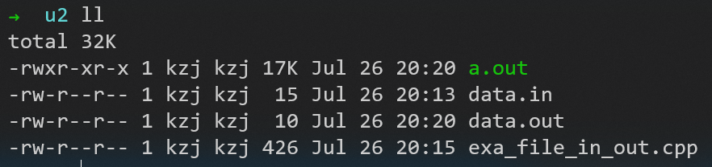

### 文件输入输出

fopen（p31）

```C
FILE *fin, *fout;
```
```C
// 从文件
fin = fopen("data.in", "rb");
fout = fopen("data.out", "wb");
```
```C
// 从命令行
fin = stdin;
fout = stdout;
// Ctrl+D终止输入
```
```C
fscanf(fin, "%d", &x);
fprintf(fout, "%d %d %.3f\n", min, max, (double)s/n);
```

目录结构


### 编译

```
gcc exa_file_in_out.cpp
```

得到 a.out 文件，运行它

```
./a.out
```

结果输出到文件中
```
cat data.out
```