# 安装 apache 

```sudo apt-get update```
```sudo apt-get install apache2```

安装完成后我们在浏览器输入```localhost```
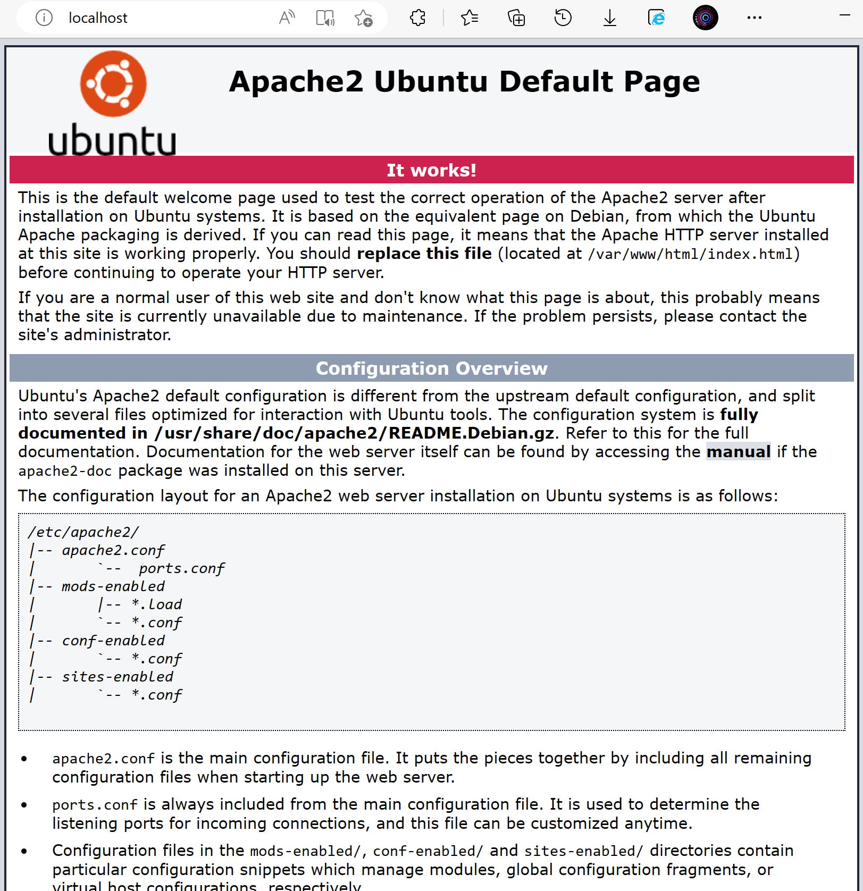
表示安装成功

注意：
apache和nginx中部署的网页文件都放在同一个目录```/var/www/html```

## 修改apache的端口（为了不和nginx冲突）

[网页链接](https://blog.csdn.net/haitunmin/article/details/74931617)

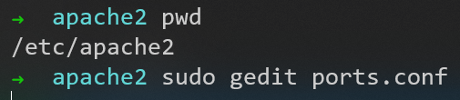

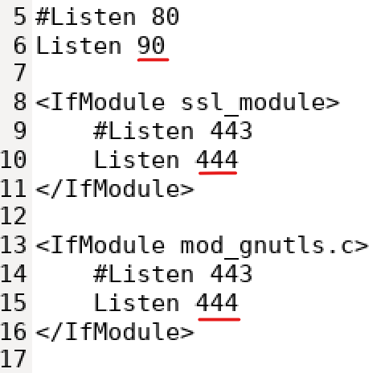

同时，还要在```/etc/apache2/sites-enabled/000-default.conf```中修改
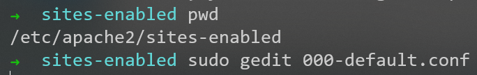

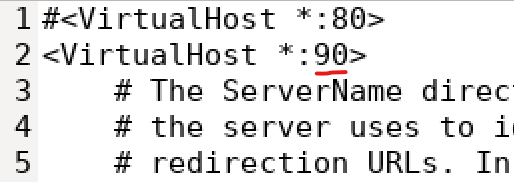

重启服务
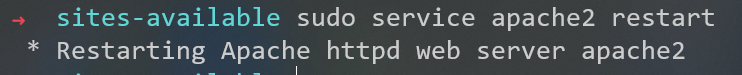

端口修改成功
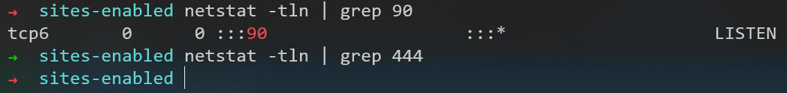

# 安装php

```sudo apt install php libapache2-mod-php```

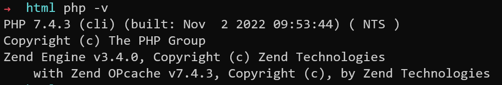

查看发现安装成功
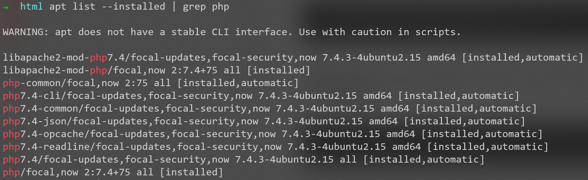

## 启动php

使用命令```sudo a2enmod php7.4```启动php
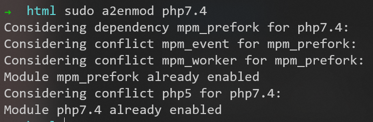


## 测试php处理

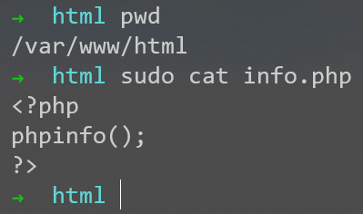

但是用浏览器访问，只返回源代码，没有解析
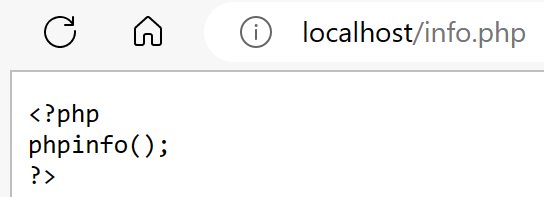

### 修改配置文件

配置文件所在目录为```/etc/apache2```
配置文件名为```apache2.conf```
在文件中添加一行内容：```AddType application/x-httpd-php .php```

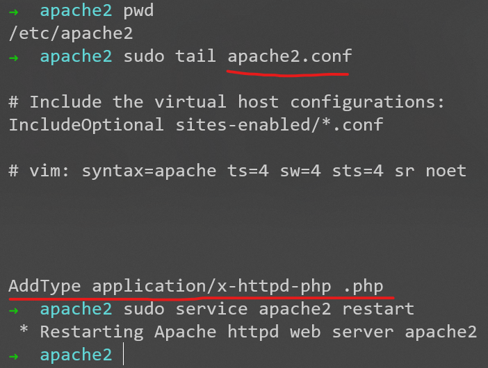
别忘了重启apache服务

用浏览器访问，成功
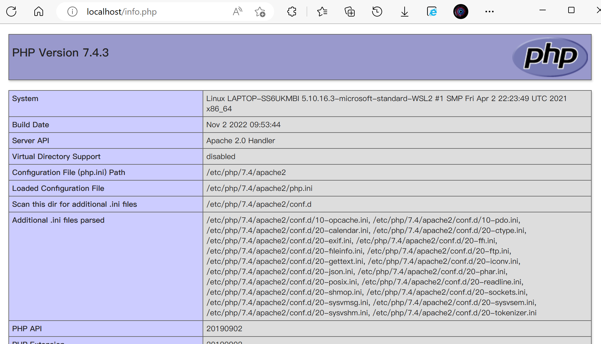

