# EcommerceStore的运行方法

## 已验证的可用依赖

### mysql

```shell
➜  k mysql -V
mysql  Ver 8.0.32-0ubuntu0.20.04.2 for Linux on x86_64 ((Ubuntu))
```

### mongodb

```shell
➜  k mongod -version
db version v5.0.14
Build Info: {
    "version": "5.0.14",
    "gitVersion": "1b3b0073a0b436a8a502b612f24fb2bd572772e5",
    "openSSLVersion": "OpenSSL 1.1.1f  31 Mar 2020",
    "modules": [],
    "allocator": "tcmalloc",
    "environment": {
        "distmod": "ubuntu2004",
        "distarch": "x86_64",
        "target_arch": "x86_64"
    }
}
```

### IPFS

```shell
➜  bin ./ipfs version
ipfs version 0.13.0-dev
```

### truffle

```shell
➜  bin truffle version
Truffle v5.4.33 (core: 5.4.33)
Ganache v7.0.1
Solidity v0.5.16 (solc-js)
Node v16.14.0
Web3.js v1.5.3
```

### npm

```shell
➜  bin npm version
{
  npm: '8.3.1',
  node: '16.14.0',
  v8: '9.4.146.24-node.20',
  uv: '1.43.0',
  zlib: '1.2.11',
  brotli: '1.0.9',
  ares: '1.18.1',
  modules: '93',
  nghttp2: '1.45.1',
  napi: '8',
  llhttp: '6.0.4',
  openssl: '1.1.1m+quic',
  cldr: '40.0',
  icu: '70.1',
  tz: '2021a3',
  unicode: '14.0',
  ngtcp2: '0.1.0-DEV',
  nghttp3: '0.1.0-DEV'
}
```

### node.js

```shell
➜  bin nodejs -v
v10.19.0
```

### MetaMask钱包


## 配置（按自己的环境配置）

### 后端的数据库配置


#### 清空本项目在mongodb中的写入数据（非首次运行项目）

#### mysql数据库建表（首次运行项目时）

运行如下*.sql文件
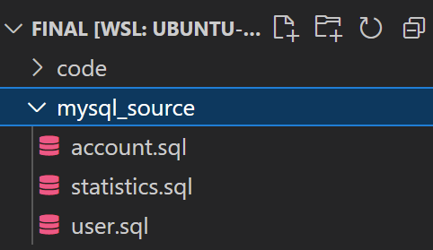

#### E-R图

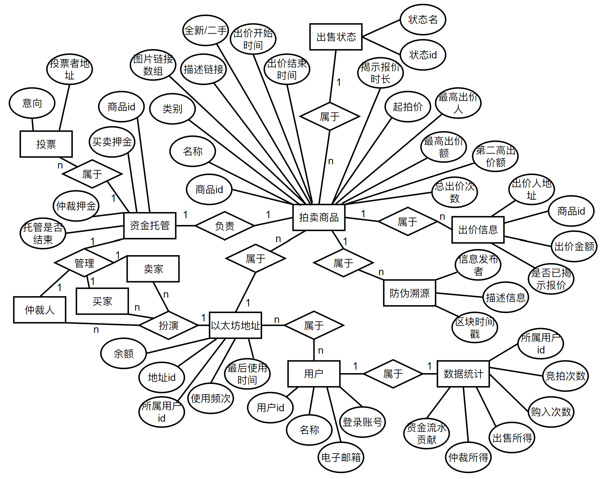

### 前端的IPFS连接配置


### 前端的区块链连接配置 和 区块链端的配置

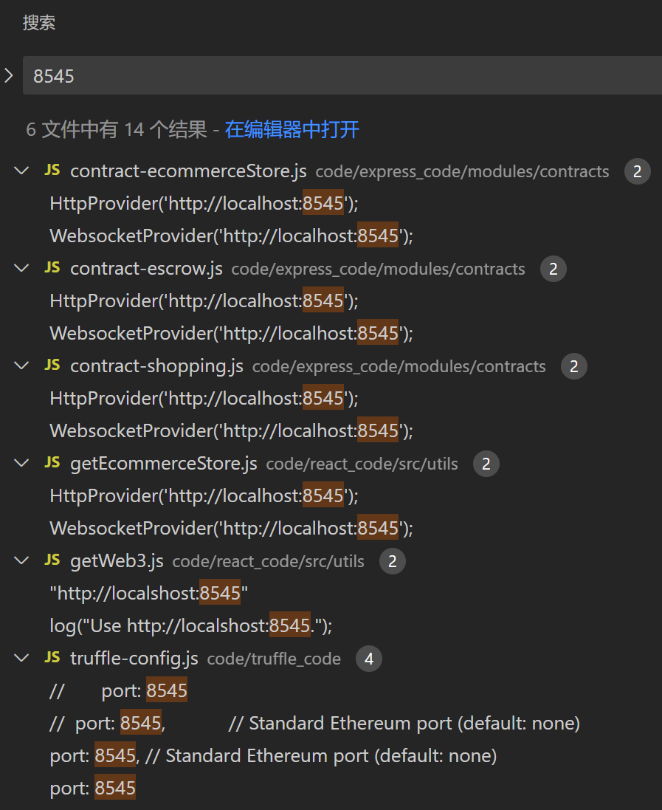

### 配置后端与前端的接口


### 最终的端口分配情况

	   前端：3000；
	   智能合约：8545；
	   后端：5000；
	   mongoDB：27017；
	   mysql：3306；
	   IPFS（update）：5001；
	   IPFS（download）：8080；


### MetaMask钱包
自己注册个账号
添加自己的以太坊本地测试网络
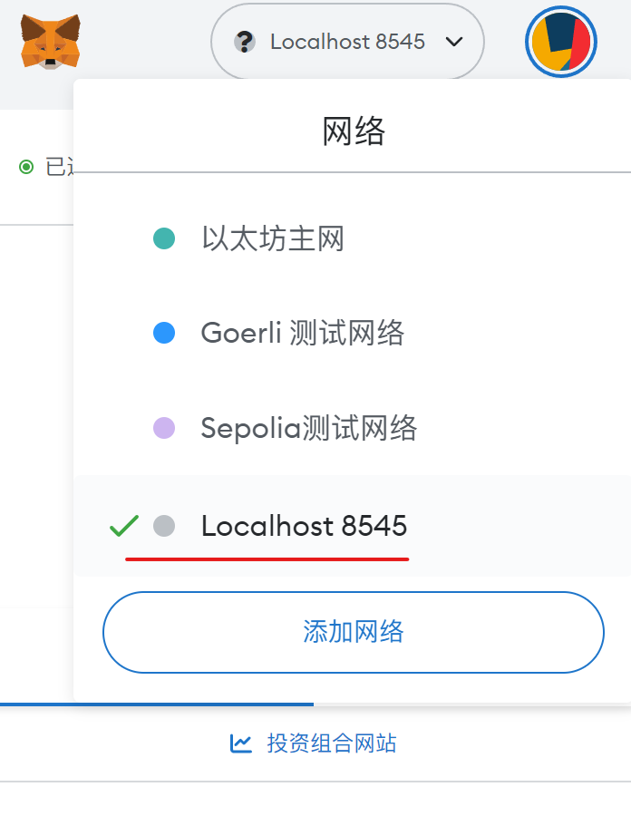

## 项目结构


## 运行

### 启动数据库

mysql和mongodb


### 启动IPFS

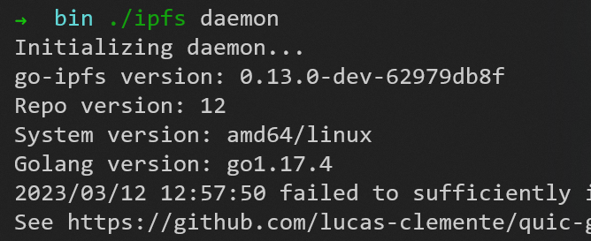

### 启动区块链端

#### 项目编译

在truffle_code目录下使用命令```truffle compile```


#### 启动私链
使用命令```truffle develop```


#### 将智能合约部署到私链
在truffle_code目录下使用命令```truffle migrate --reset```
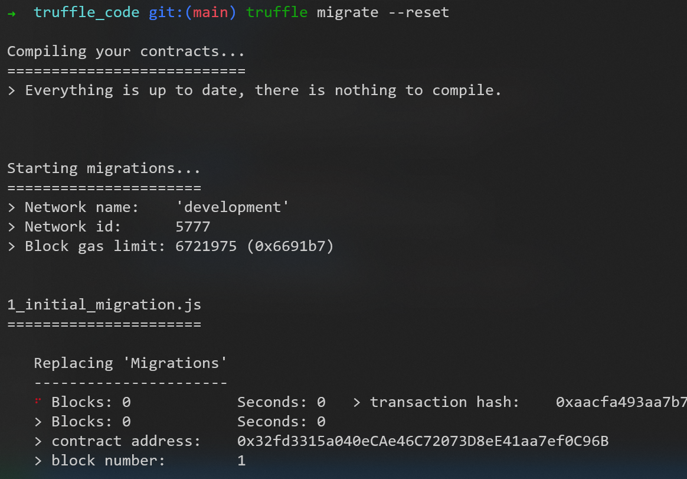

##### 合约生成的js文件的位置（不良示例）
```code/react_code/src/contracts/```


可在如下文件中配置 合约生成的js文件的位置


至于当时为什么让合约的js文件放到前端的react_code文件夹中，好像是因为当时用前端引用js文件时，不能读取到react_code文件夹之外的内容，所以临时凑合了一下

然后后端的express_code文件中的代码又跑去react_code文件夹找东西


这个要改

#### 添加数据（可选）
在truffle_code/test目录下使用命令```truffle exec seed.js```

#### 启动区块链终端（可选）
```truffle console```

### 启动后端

首次运行时，需要在express_code目录下使用命令```npm install```
之后```node routes/app.js```
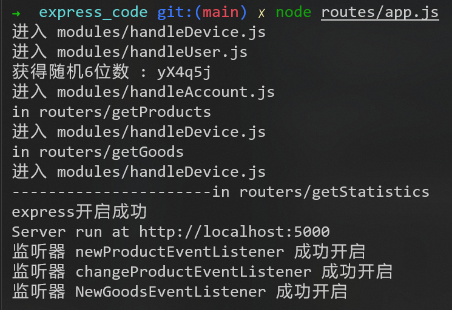

### 启动前端

首次运行时，需要在react_code目录下使用命令```npm install```
之后```npm start```

### 浏览器的钱包插件使用

确保已连接（第一次使用的话，从第二步开始）


去之前执行命令```truffle develop```的结果中，找到 Private Keys


用私钥导入账户
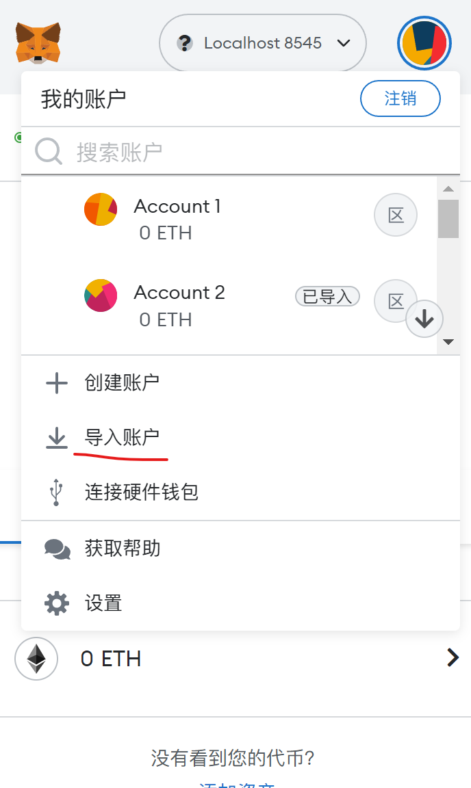
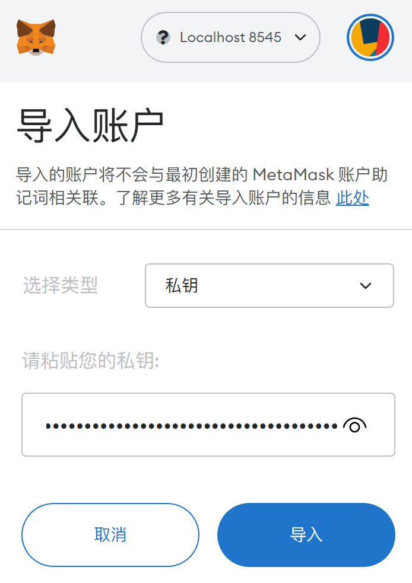

此时未连接
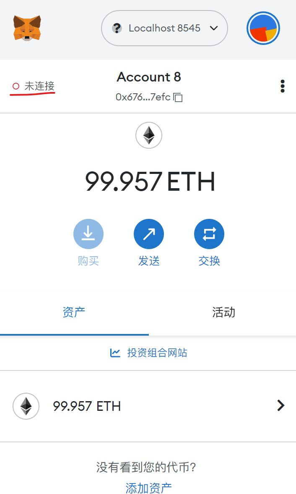

点击连接
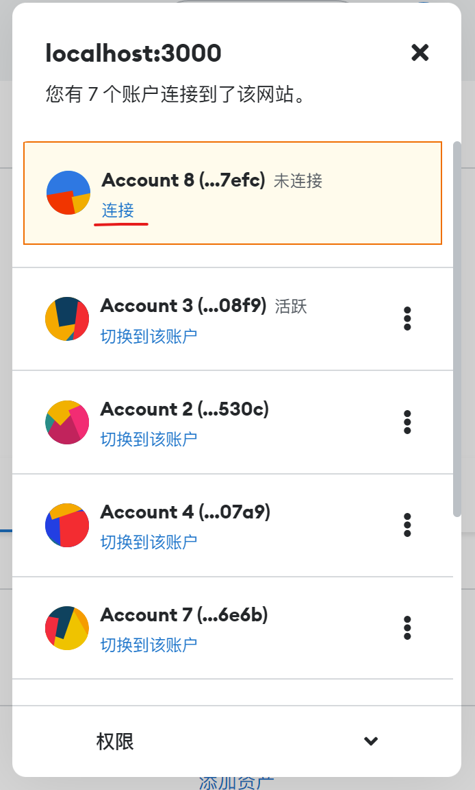

显示已连接
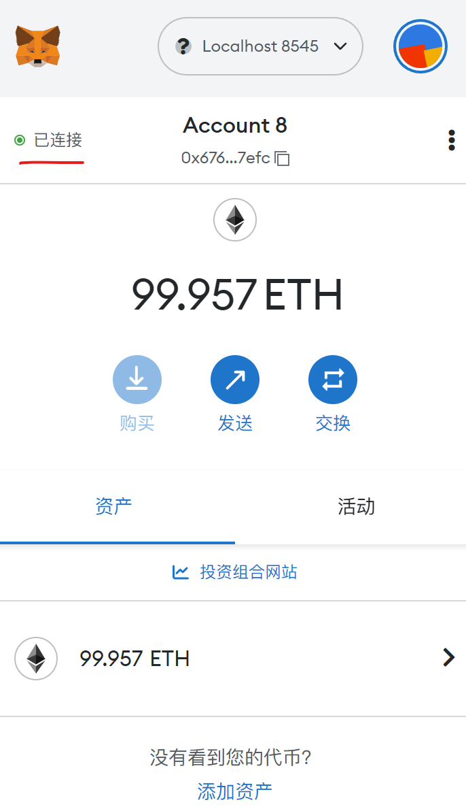

之后便可用这一账户进行链上交易