# 2022/11/9 大瀑布
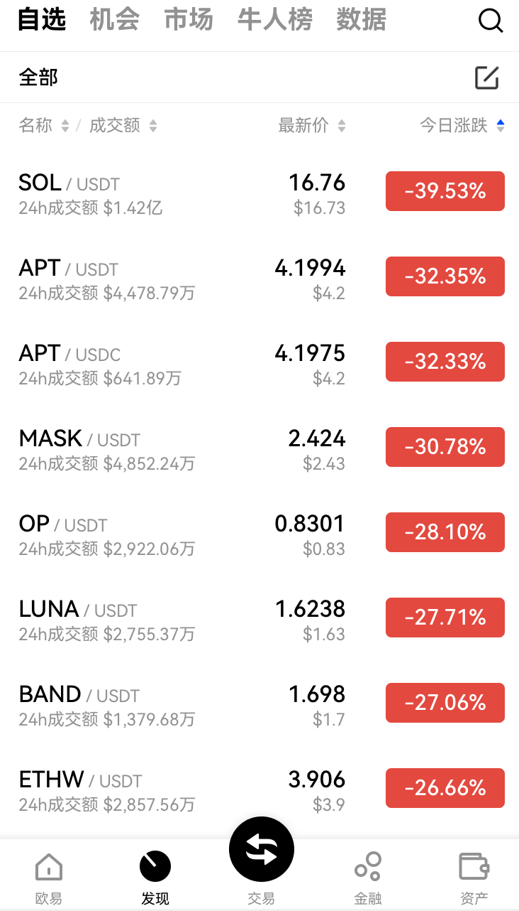

# 暴雷的消息始末
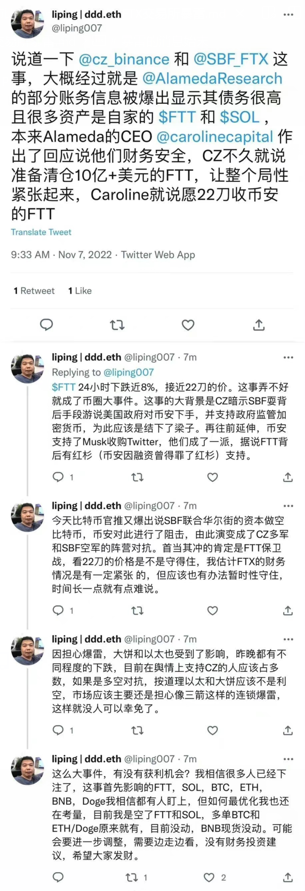
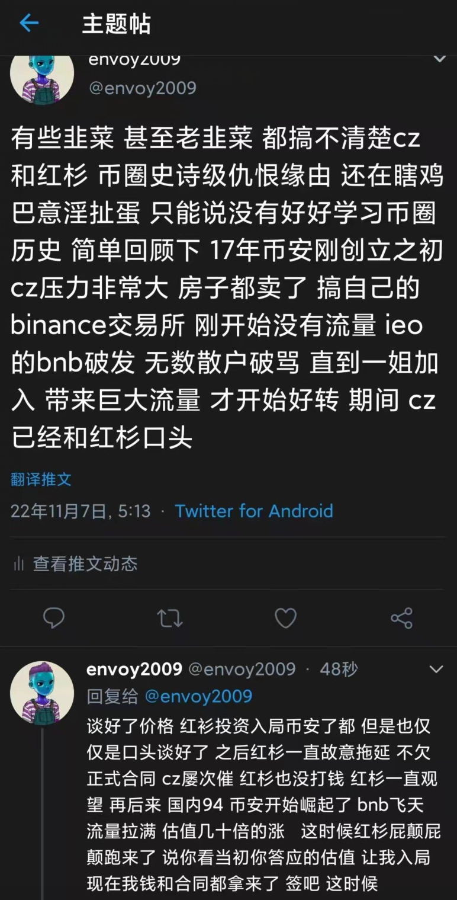
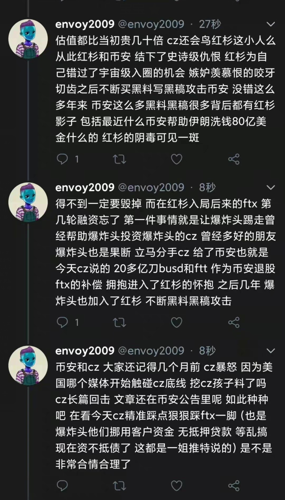
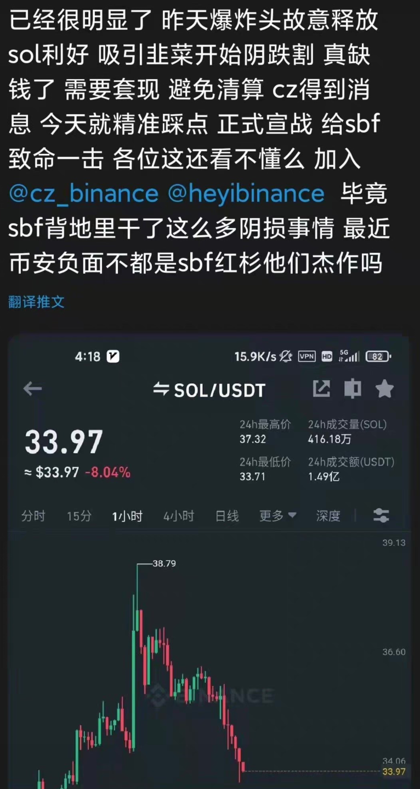
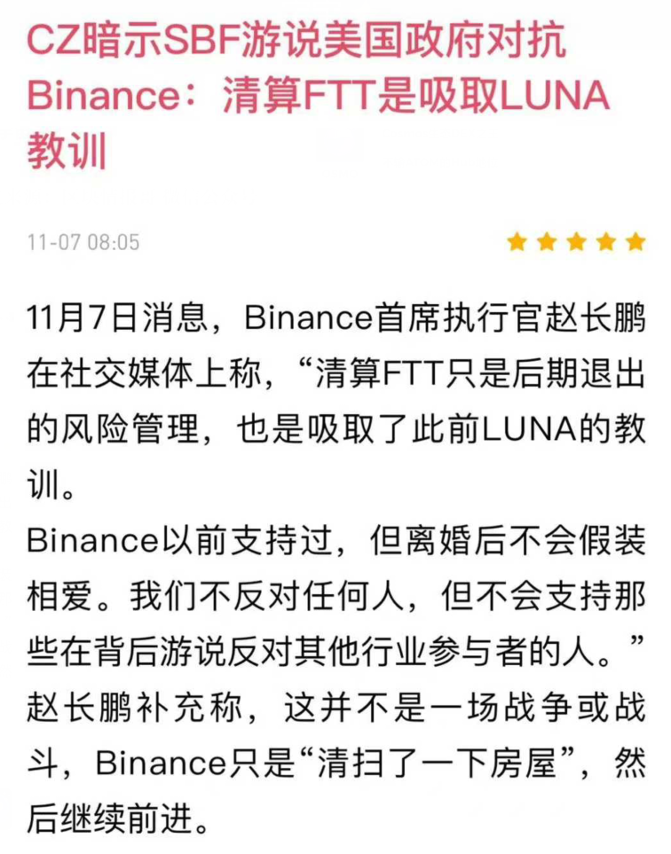

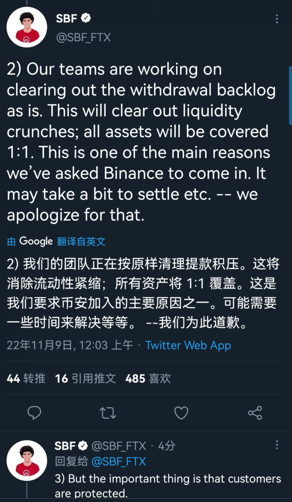

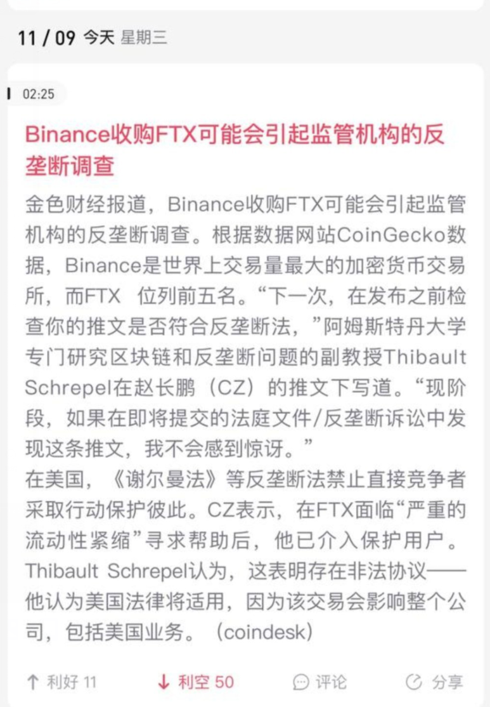
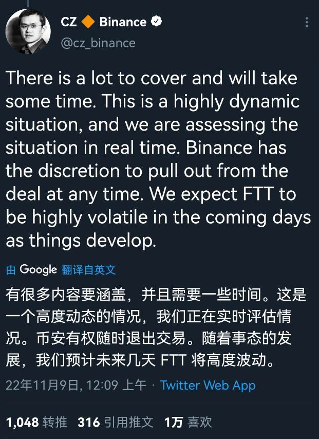
## 复盘
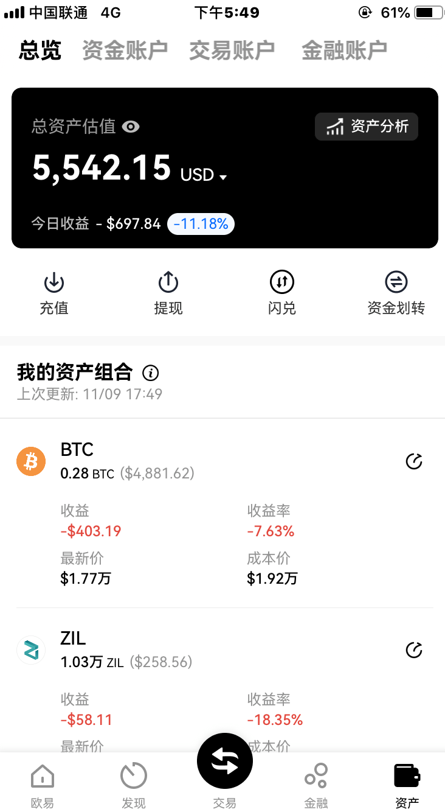
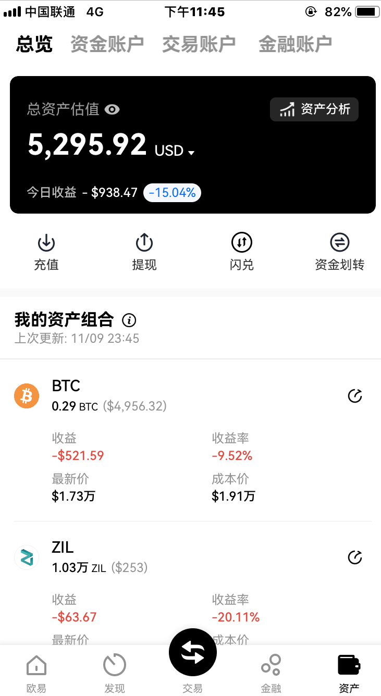
在币安收购FTX的利好拉盘时，没有卖，而是加仓和买山寨币，山寨没有设置止损就睡觉了，造成较大损失，没有考虑到收购失败带来的瀑布
之前的币圈行情与美股联动，因这次事件而开启独立下跌行情
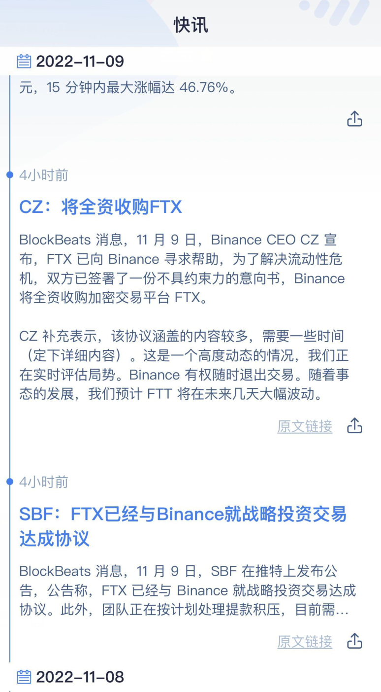
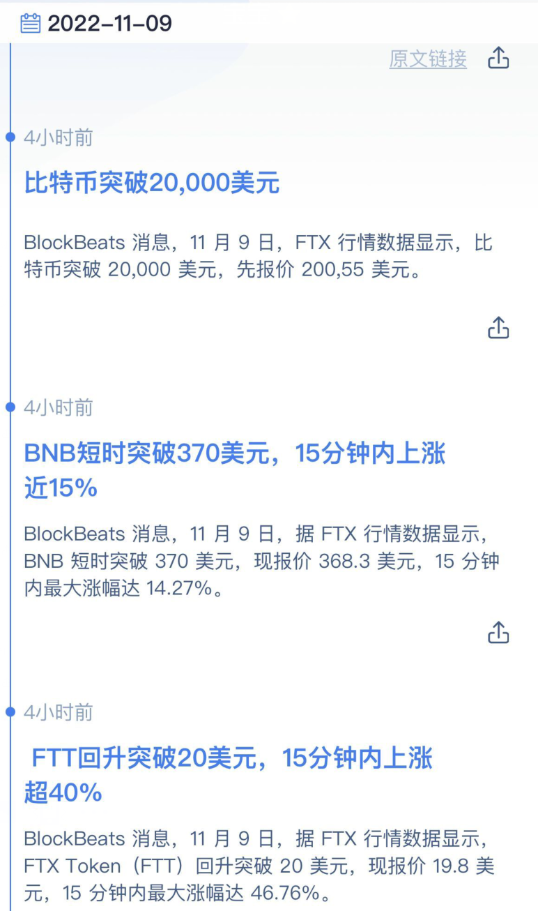
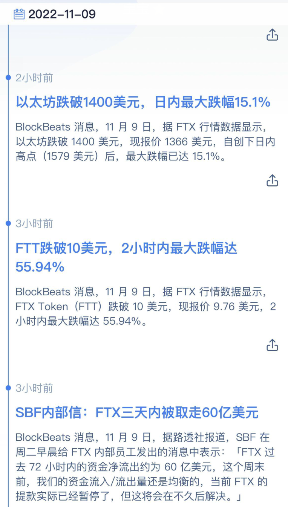
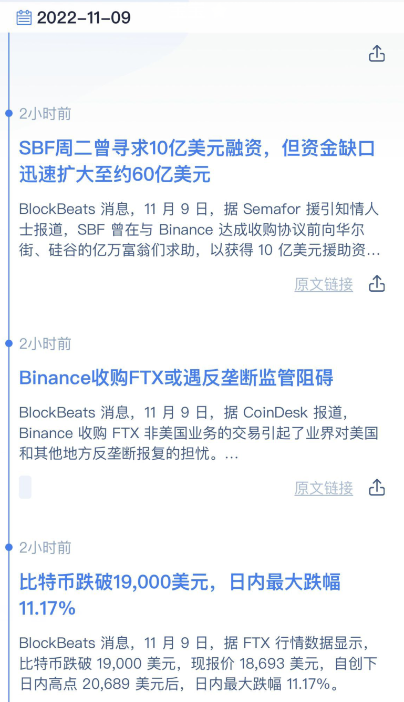
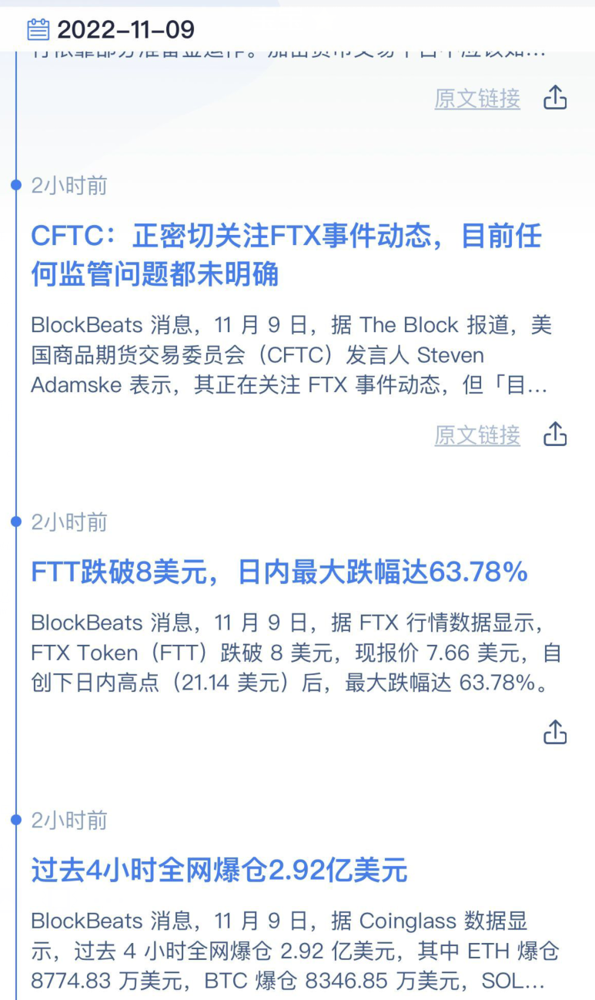

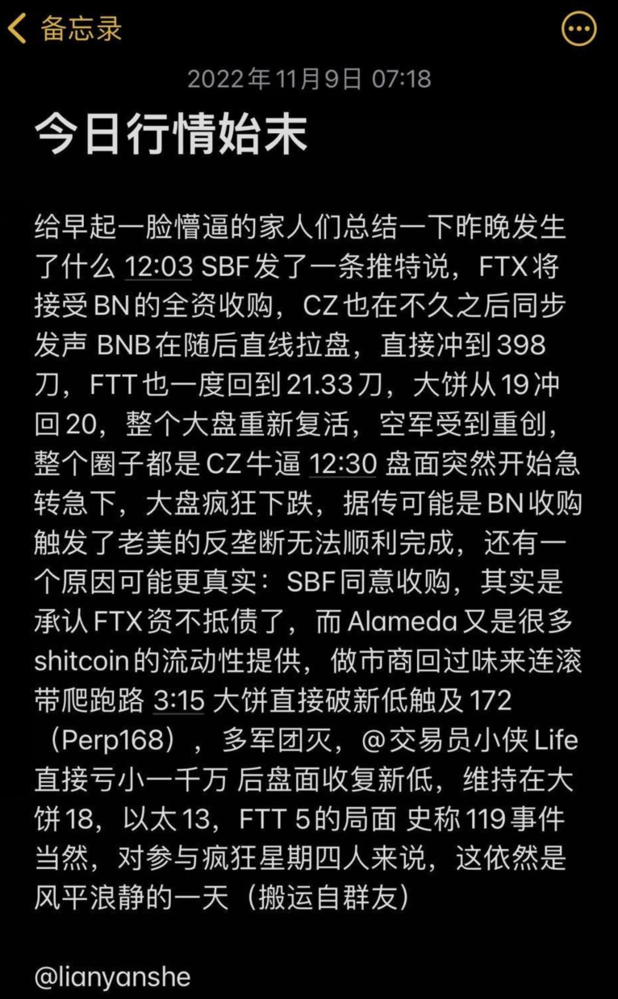

## 熊市前期的仓位过重
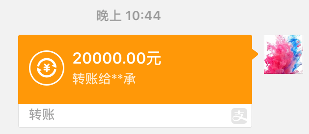
再次下跌，抄底时只能购买较贵的USDT，要保留一定的黑天鹅仓位（可以放到另一个账号中），看USDT的溢价判断抄底的人多不多，再去抄底