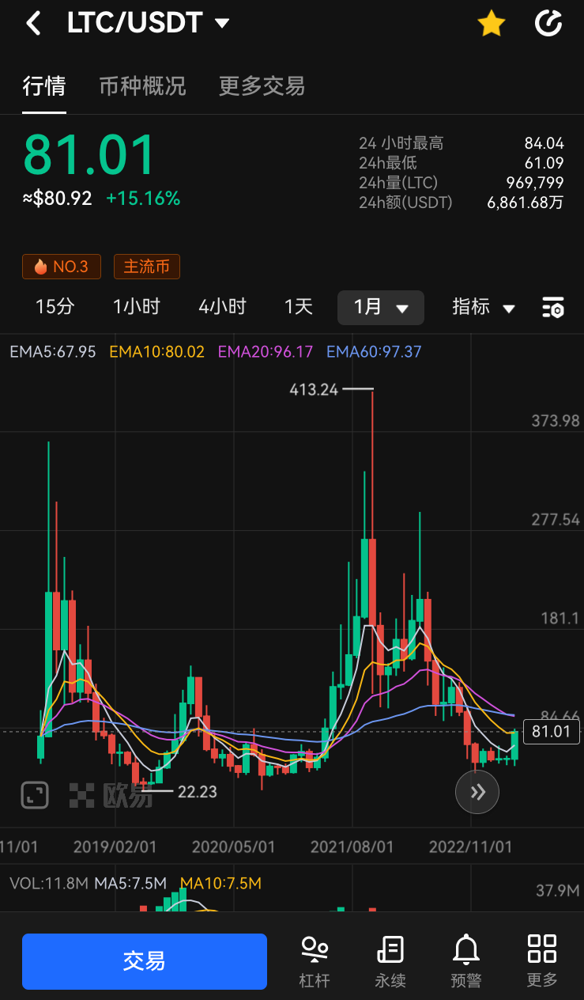
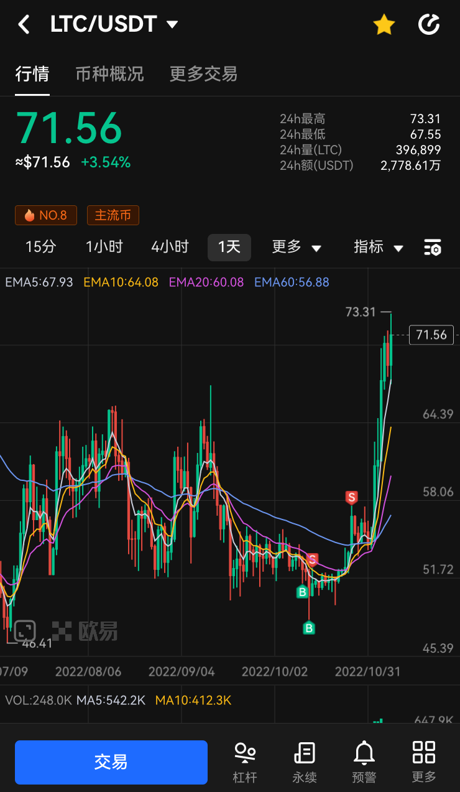

# LTC减半时间 2023/8/4
减半时间处于熊市周期，资金无聊，开始炒作

2022/11/22 上涨启动
比BTC强势很多，未破6月份前低，跟涨不跟跌，拉涨回调少
减半前一年左右，瀑布时可布局，也可用LTC/BTC交易对来抄底
做到现货翻倍左右的长线，不要一拉就买飞了
上轮减产在2019/8，在熊市里也有不错的涨幅

2026年可布局

# DASH减半时间 2023/6/20
不是4年减半，而是每383天减少7.14%
同理，但市值比LTC小，涨幅表现也不如