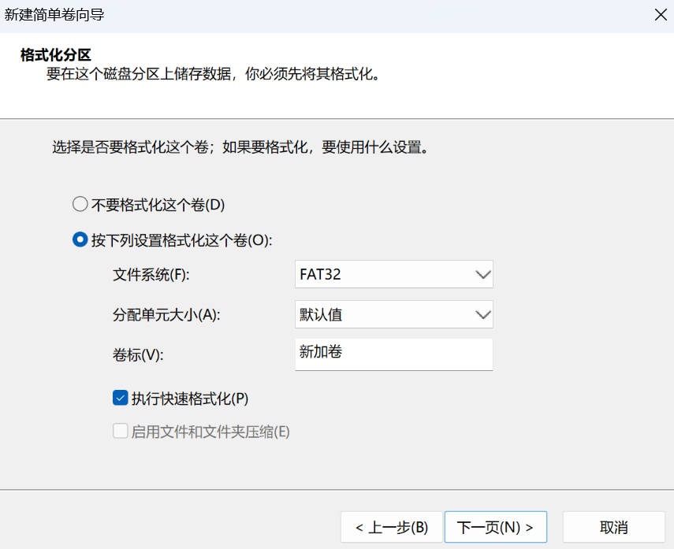

# 数据存储形态

## 二进制

高电平 =1
低电平 =0

1位十六进制数 对应 4位二进制数

## 大端存储和小端存储

- 大端模式，是指数据的高字节保存在内存的低地址中，而数据的低字节保存在内存的高地址中，存储模式类似把数据当作字符串顺序处理
- 小端模式，是指数据的高字节保存在内存的高地址中，而数据的低字节保存在内存的低地址中，存储模式将地址的高低和数据位权有效地结合起来

### 采用大端存储的文件系统

HFS
EXT3的日志文件

### 采用大端存储的文件系统

FAT32
NTFS
exFAT
ExTx
DOS分区表

# 尝试使用DiskGenius软件恢复数据

显示孤立文件，表示要恢复的文件所在的目录结构已被破坏

要恢复的文件预览的十六进制内容全是0，恢复出的文件不能正常打开，恢复失败

# 手动恢复数据

## 虚拟磁盘工具

windows系统的磁盘管理中，先选中某一块磁盘，然后右键点击磁盘管理，选择创建VHD

配置VHD

接下来要初始化磁盘

然后新建简单卷

最终效果如下

## winhex

winhex是一个十六进制磁盘编辑软件
注意，打开软件时，要以管理员身份运行

### 打开磁盘

### 磁盘克隆

### 查找十六进制

### 查找文本

### 更新快照

### 跳转扇区

### 文件比较

### 按文件类型恢复

# RAID

# NAS

