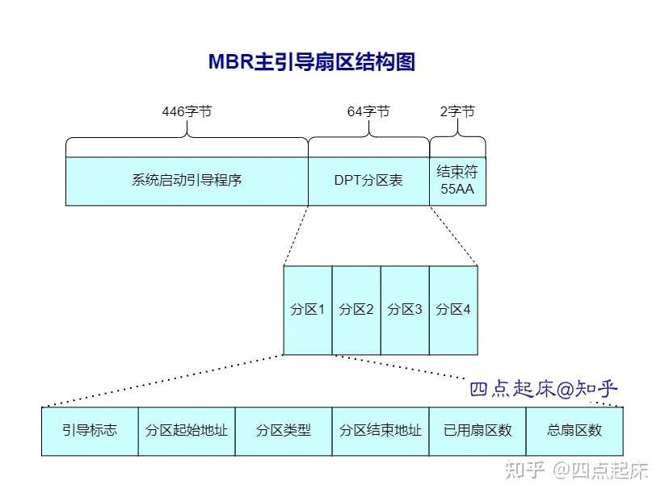
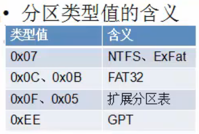

# MBR硬盘

[应知必懂的两种磁盘分区类型：MBR 和 GPT](https://zhuanlan.zhihu.com/p/541733200)

MBR 是 Master Boot Record（主分区引导记录），这种规范将硬盘引导启动程序和磁盘分区信息保存在大小512字节的0磁道主引导扇区中，所以如果0号扇区损坏，就会造成 MBR 信息丢失，从而硬盘所有分区无法正常识别，对硬盘的损坏是非常严重的。

## MBR主引导扇区的结构

MBR由三部分构成：
- 主引导程序代码，占446字节
- 硬盘分区表DPT，占64字节
- 主引导扇区结束标志"AA 55"

### 硬盘分区表DPT的结构

在DPT共64个字节中，以16个字节为分区表项单位描述一个分区的属性

#### 硬盘分区数量的限制

MBR的分区表只能保存4个分区信息，因此MBR的硬盘只能划分为4个分区，有人可能会提出疑问：我的电脑是MBR硬盘，为什么分区的数量超过四个呢？

这是因为MBR分区表中虽然只能支持4个主分区，但是可以将其中应该为主分区的位置设置为扩展分区，每个扩展分区可以划分为多个逻辑分区，这些逻辑分区的信息保存在MBR以外的扇区中，而Windows的文件管理中是不区分主分区还是逻辑分区的，因此看起来所有分区数量多于4个，实际上主分区和扩展分区的总数仍然不超过4个。

## MBR硬盘的结构

# GPT硬盘

为了破除只有512个字节的 MBR 分区表的许多限制，技术人员对硬盘分区表的标准进行了升级，提出了新的 GUID Partition Table（全局唯一标识磁盘分区表），简称 GPT 分区表，其中 GUID 是 Globally Unique Identifier（全局唯一标识符）的缩写，这是一种由算法生成的长度为128位的数字标识符。

但是由于 GPT 改变了硬盘的分区表格式，影响了电脑的初始启动过程，传统BIOS启动过程无法识别这种GPT硬盘的分区因此无法启动，采用最早由 Intel 提出的新的UEFI启动方式才能从 GPT 启动。

