# 扇区和簇（块）的区别

扇区(sector)，块(block)，簇(cluster)

[操作系统 | “扇区”、“簇”、“块”、“页”等概念](https://blog.csdn.net/weixin_47187147/article/details/126908793)

- 扇区是对硬盘而言，是物理层的
- 簇（块）是对文件系统而言，是逻辑层的
- 磁盘控制器是用来映射两层的
- 一个块大小 = 一个扇区大小*2^n

扇区是磁盘最小的物理存储单元，是磁头从磁盘中读取数据的最小单位（一般512B），即磁头每次从磁盘中读取数据，都是一个扇区一个扇区读的。但由于操作系统无法对数目众多的扇区进行寻址，所以操作系统就将相邻的扇区组合在一起形成一个簇，然后再对簇进行管理（每个簇可以包括2、4、8、16、 32或64个扇区）

 簇（块）是操作系统与磁盘（硬盘）交互的最小数据单元（在linux系统中称为块，在windows系统中称为簇）。操作系统从硬盘中拿一块数据，即完成一次磁盘IO

 簇（块）的大小在硬盘格式化时被指定，一般有1K，2K，4K（最常用）。如果块的大小设置为4K，那么磁盘要读取8个扇区之后，才将数据块传给操作系统。另外， 簇（块）也是DOS下数据存储的最小单元。例如，如果一个文件的大小为1K，而块的大小为4K，那么该文件还是会占用一个块，块中剩下的3K被空闲出来，不能用于存储其他数据。因此，设置块的大小时，需要考虑要存储文件的大小

# MBR硬盘

[应知必懂的两种磁盘分区类型：MBR 和 GPT](https://zhuanlan.zhihu.com/p/541733200)

MBR 是 Master Boot Record（主分区引导记录），这种规范将硬盘引导启动程序和磁盘分区信息保存在大小512字节的0磁道主引导扇区中，所以如果0号扇区损坏，就会造成 MBR 信息丢失，从而硬盘所有分区无法正常识别，对硬盘的损坏是非常严重的。

## MBR硬盘的结构

## MBR主引导扇区的结构

MBR由三部分构成：
- 主引导程序代码，占446字节
- 硬盘分区表DPT，占64字节
- 主引导扇区结束标志"55 AA"

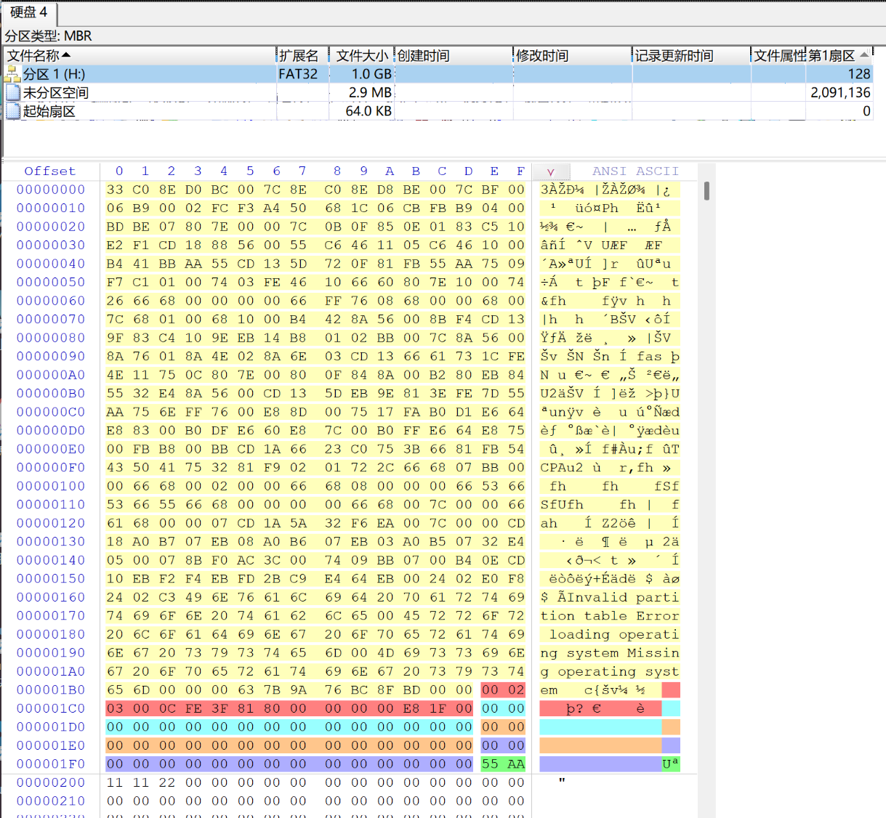

### 硬盘分区表DPT的结构

在DPT共64个字节中，以16个字节为分区表项单位描述一个分区的属性

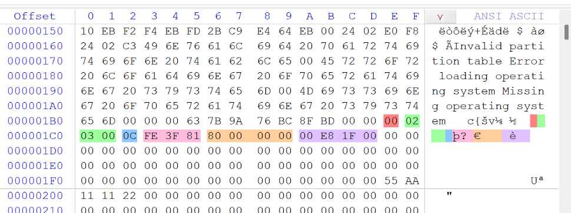

这样自己看十六进制容易眼花，可以用winhex的模板管理器功能
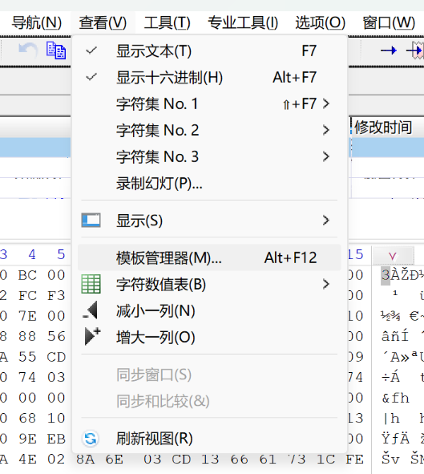
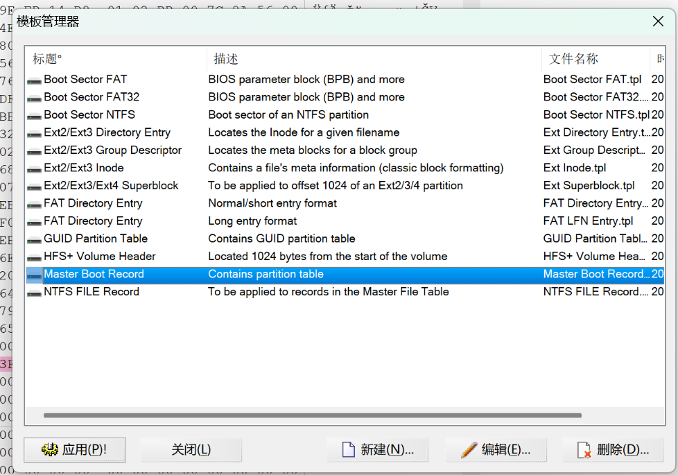
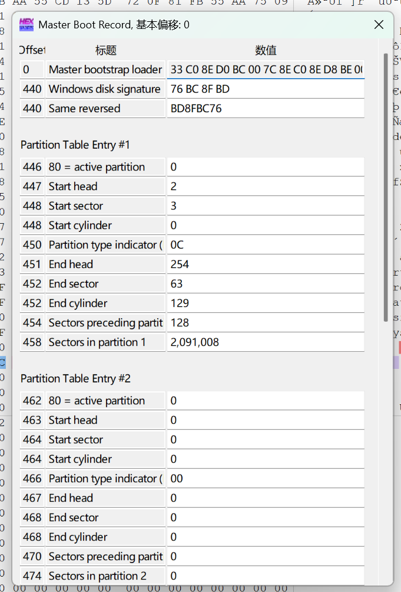

#### 硬盘分区数量的限制

MBR的分区表只能保存4个分区信息，因此MBR的硬盘只能划分为4个分区，有人可能会提出疑问：我的电脑是MBR硬盘，为什么分区的数量超过四个呢？

这是因为MBR分区表中虽然只能支持4个主分区，但是可以将其中应该为主分区的位置设置为扩展分区，每个扩展分区可以划分为多个逻辑分区，这些逻辑分区的信息保存在MBR以外的扇区中，而Windows的文件管理中是不区分主分区还是逻辑分区的，因此看起来所有分区数量多于4个，实际上主分区和扩展分区的总数仍然不超过4个。

## 扩展分区表EBR的结构

[MBR格式磁盘分区表分析：扩展分区、逻辑分区](https://www.cnblogs.com/linuxheik/articles/11375885.html)

[熟悉EBR、DBR分区表结构](https://www.jianshu.com/p/81957bb28e85)

注意**扩展分区**和**逻辑分区**的区别：
扩展分区是不能直接使用的，他是以逻辑分区的方式来使用的，所以说扩展分区可以分成若干个逻辑分区。他们的关系是包含的关系，所有的逻辑分区都是扩展分区的一部分。

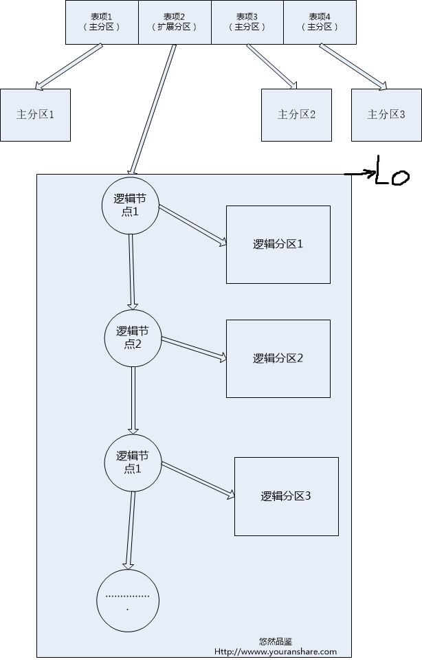

这里我创建了3个主分区，3个逻辑分区

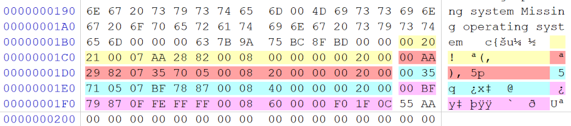
其中第4个分区表项指的是**主扩展分区表EBR**，起始扇区是 6293504

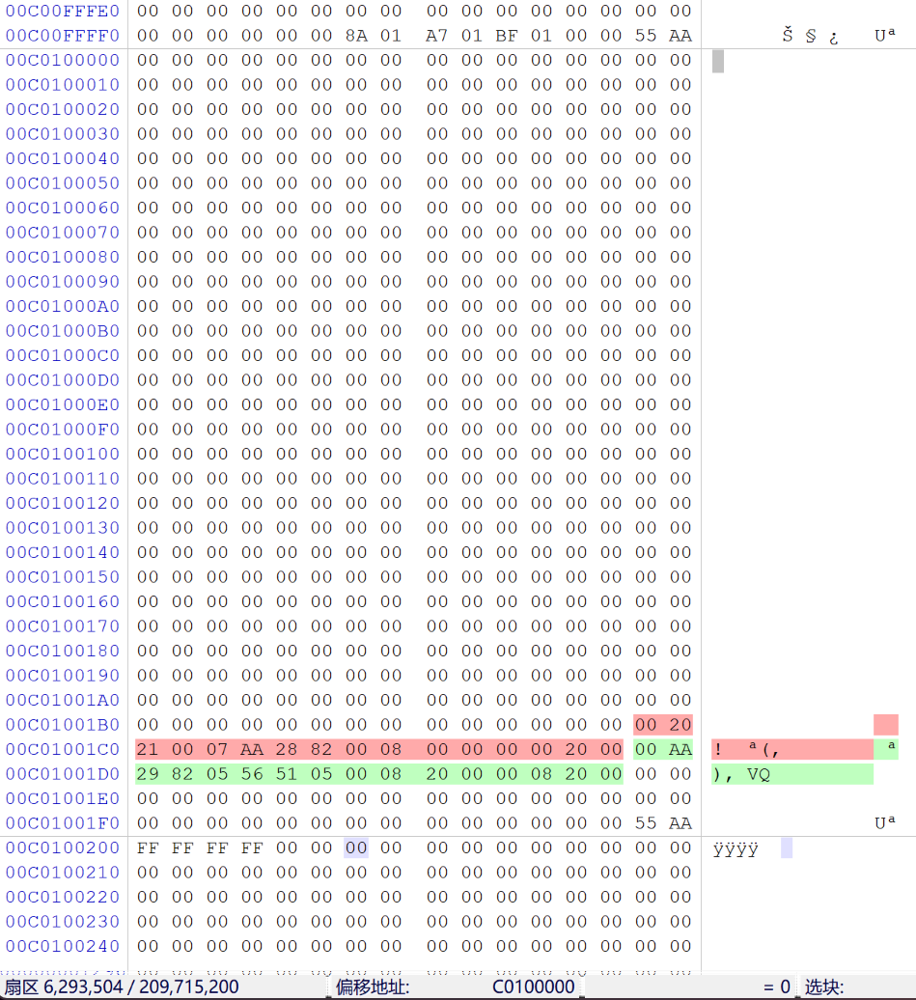

EBR的结构与MBR类似：
- 引导程序代码为空，占446字节
- 硬盘分区表DPT，占64字节，每个分区表项占16字节，这里只用到前2个分区表项，表项1指示**本逻辑分区**，表项2指示**下一个扩展分区表EBR**
- 结束标志"55 AA"

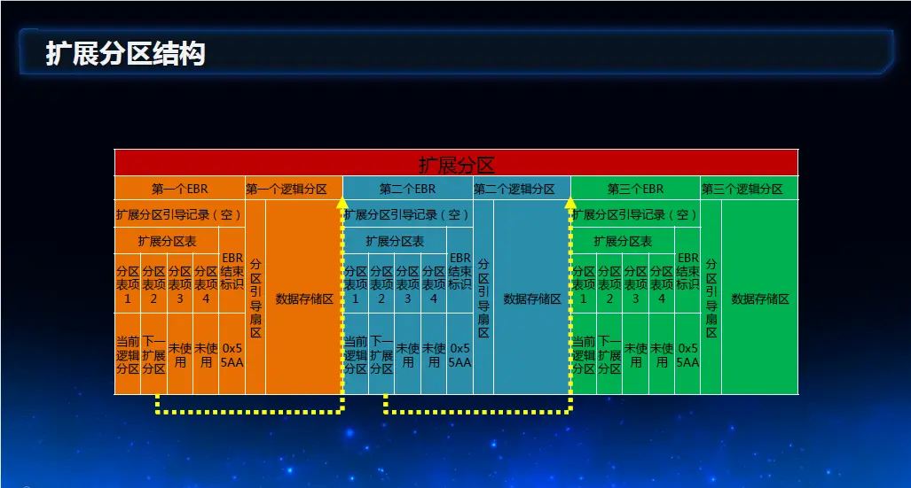

EBR中的分区表项的结构和上面MBR中的分区表项的结构相同

EBR扇区和MBR非常类似，一个EBR扇区对应一个逻辑分区，其有用部分仅有其DPT前两个表项：
- **第一个表项**表示**本逻辑分区**的起始扇区地址和扇区数量，但是该地址为**相对偏移**，实际的起始扇区为**本EBR扇区的实际地址加上相对偏移**，这个起始扇区其实是**本逻辑分区的DBR扇区**
- **第二个表项**记录了**下一个扩展分区表EBR和其逻辑分区**的起始扇区地址和扇区总数量，但是该地址为**相对偏移**，实际的起始扇区为**当前扩展分区的实际地址加上相对偏移**，这个起始扇区其实是**下一个扩展分区表EBR的扇区**
- 每个逻辑分区的DBR扇区之前都有一个EBR扇区，对于最后一个扇区，其EBR仅有第一表项，因为它没有后继EBR扇区，也就没有所谓的第二表项
- 各个逻辑分区用类似**链表**的EBR扇区链接起来，不受四个分区表项的限制，因此可以创建超过四个的逻辑磁盘分区

### 跳转到本逻辑分区

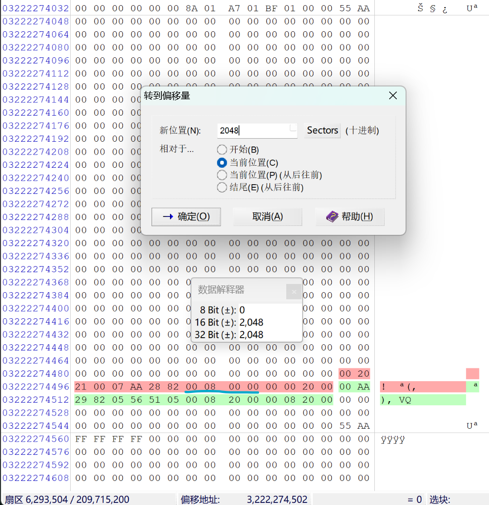
在**扩展分区表EBR**所在的扇区，向后跳转2048个扇区，到达**本逻辑分区的DBR扇区**

### 跳转到下一个扩展分区表EBR

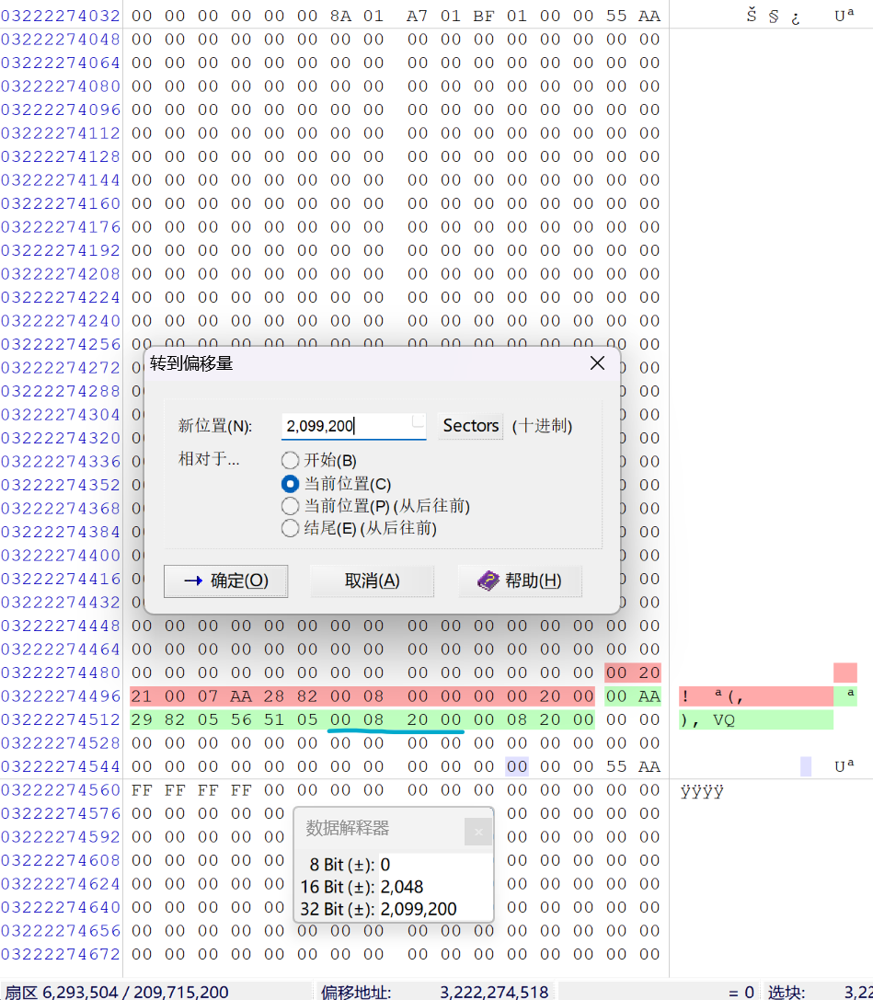
在当前**扩展分区**所在的初始扇区（注意和上面**扩展分区表EBR**所在的扇区的区别），向后跳转2099200个扇区，到达**下一个扩展分区表EBR扇区**

# 初始化MBR硬盘

会对硬盘做如下修改：
- 在0号扇区写入引导代码
- 分区表被清零
- 在0号扇区的最后两个字节写入"55 AA"标记

# 修复MBR硬盘

## 修复MBR硬盘的引导分区

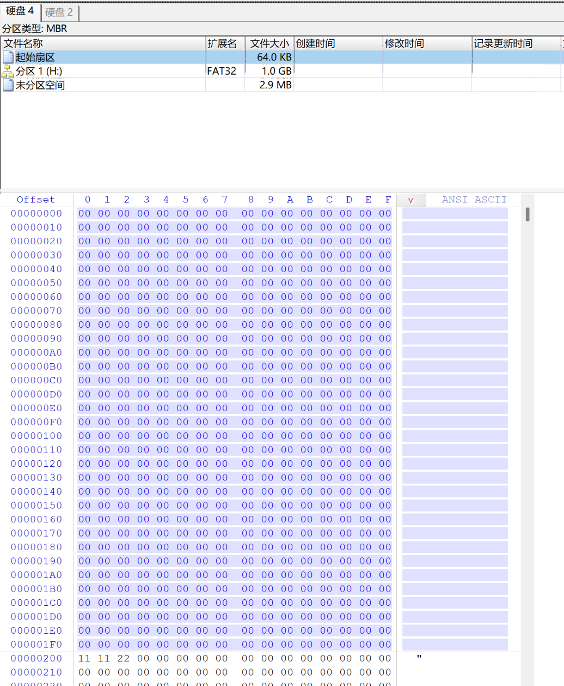
把MBR硬盘的0扇区的十六进制全置0，模拟硬盘的MBR主引导扇区被破坏

**提示需要初始化看 MBR**
**提示需要格式化看 DBR**

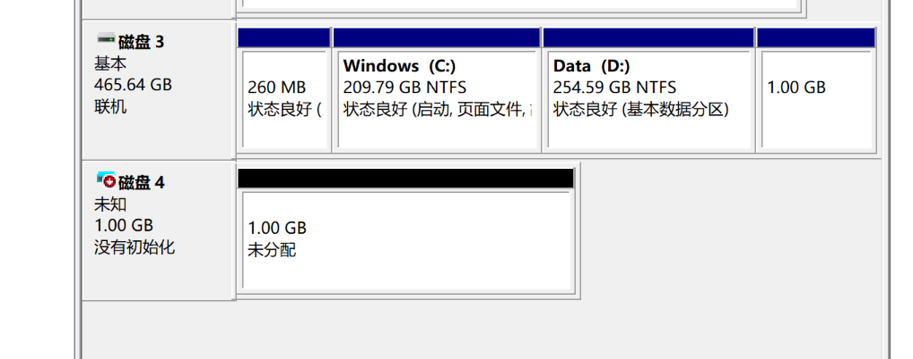
这时不能初始化磁盘，不然全部数据会清空

### 将新建磁盘的MBR扇区复制到被破坏磁盘的MBR扇区

这时新建一个同样是MBR格式的磁盘，用winhex打开，用 Ctrl + C 复制0号扇区的十六进制内容，用 Ctrl + B 粘贴到要修复的磁盘的0号扇区
然后把分区表清空

### 编写MBR扇区的分区表

找到文件系统的起始扇区号为 128，文件系统的DBR扇区的前两个字节是"EB 58"，说明是FAT32文件系统
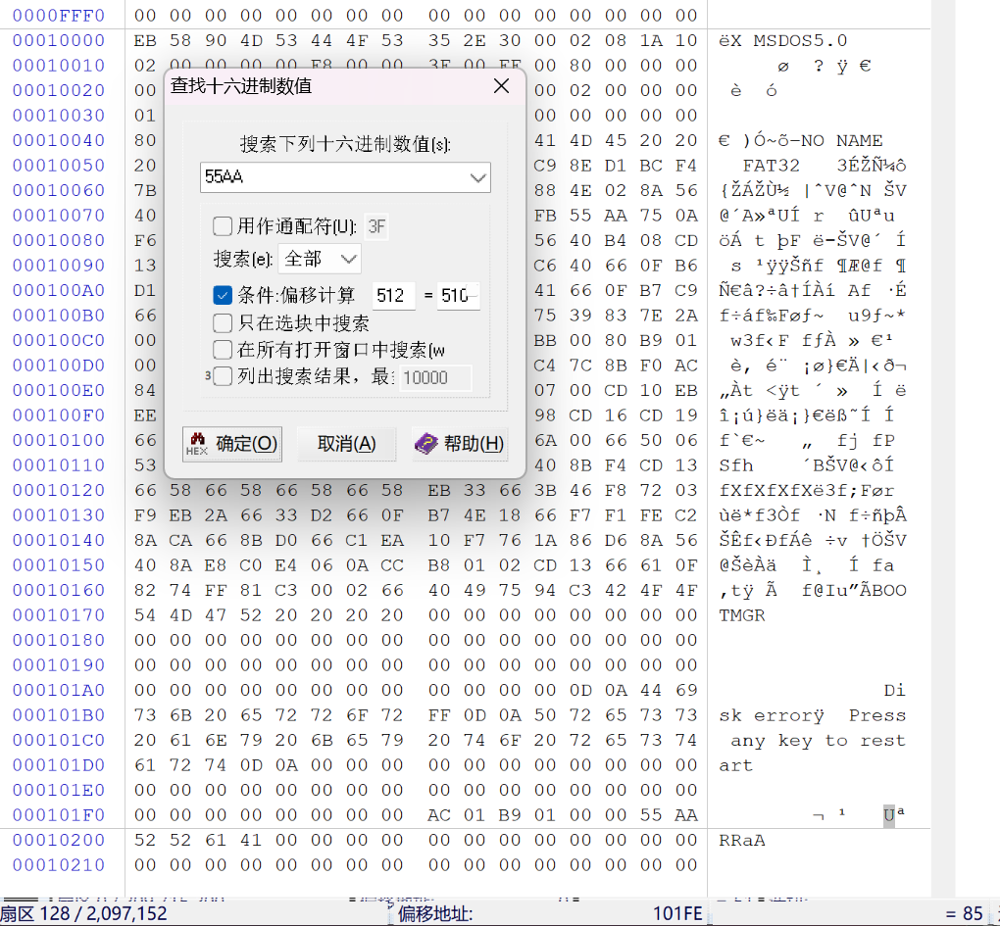

在第一个分区表项中写入分区的类型和分区的起始扇区号
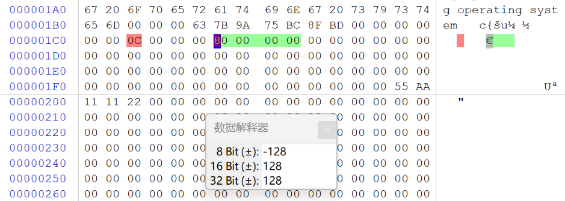
点击想要存储数据的十六进制的起始位置，在数据解释器中输入十进制数，敲回车就可自动转换成十六进制数并写入

磁盘的最大扇区号是 2097152
则这个文件系统的总扇区数为 2097152-128=2097024
在第一个分区表项中写入分区的总扇区数
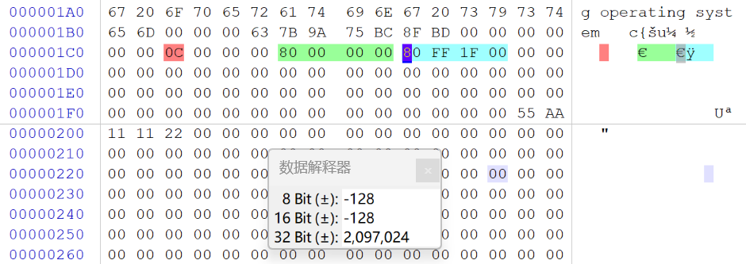

当然，这里用 模板管理器 功能进行写入更加方便
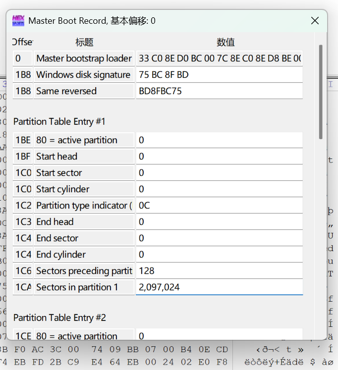

### 保存并刷新

此时，按 Ctrl + S 将修改保存进磁盘

在系统的磁盘管理中刷新这个磁盘，即可见修复成功
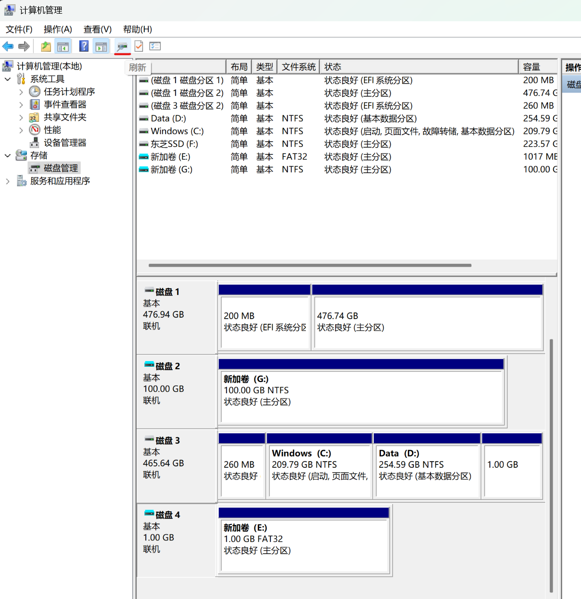

## 修复扩展分区表EBR

原先的磁盘结构为3个主分区加1个扩展分区（其中包含3个逻辑分区）

卷J、卷K、卷L 分别保存有 恢复J.txt、恢复K.txt、恢复L.txt

现在删除3个逻辑分区
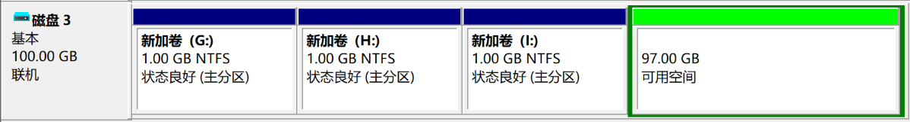

模拟扩展分区表EBR被破坏

### 搜索出逻辑分区的扇区号

已知逻辑分区的文件系统是NTFS
搜索前三个字节是"EB 52 90"的扇区（即NTFS文件系统的DBR扇区），从最后一个扇区向前搜索
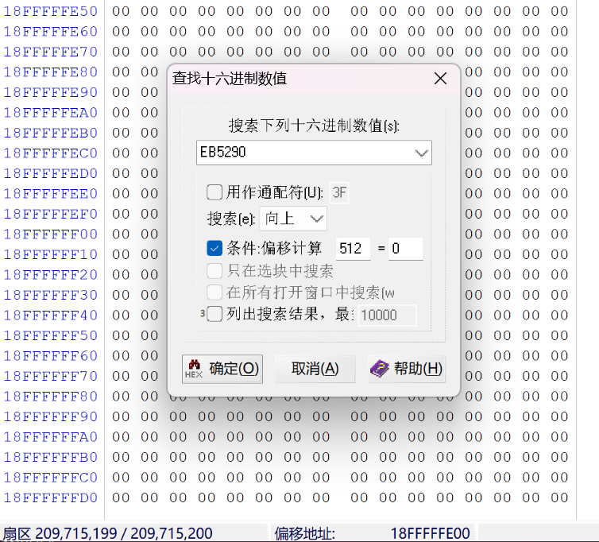

NTFS文件系统的DBR扇区中，如下图标识的十六进制，表示这个NTFS的扇区总数
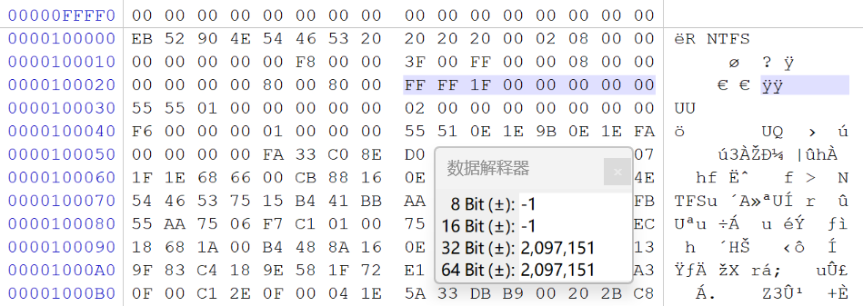

**(最后一个扇区) - (占的总扇区数 -1) = (最前一个扇区)**
这样我们可以依次推出6个NTFS文件系统如下：
1. 12591103 - (2097152 -1) = 10493952
2. 10491903 - (2097152 -1) = 8394752
3. 8392703 - (2097152 -1) = 6295552
4. 6293503 - (2097152 -1) = 4196352
5. 4196351 - (2097152 -1) = 2099200
6. 2099199 - (2097152 -1) = 2048

可分析出：
1. 4、5、6号都是主分区
2. 1、2、3号是一个扩展分区中的三个逻辑分区

### 找出扩展分区表EBR的所在扇区

搜索最后两个字节是"55 AA"的扇区，筛选出扩展分区表EBR如下：
1. 10491904
2. 8392704
3. 6293504

可分析出：
1. 扇区数最小的3号是主扩展分区表，对应上面的3号逻辑分区，并指出2号扩展分区表
2. 2号扩展分区表，对应上面的2号逻辑分区，并指出1号扩展分区表
3. 1号扩展分区表，对应上面的1号逻辑分区，因为是最后一个扩展分区表，不用指出后续的扩展分区表

### 修复EBR中的分区表项

- **第一个表项**表示**本逻辑分区**的起始扇区地址和扇区数量，但是该地址为**相对偏移**，实际的起始扇区为**本EBR扇区的实际地址加上相对偏移**，这个起始扇区其实是**本逻辑分区的DBR扇区**
- **第二个表项**记录了**下一个扩展分区表EBR和其逻辑分区**的起始扇区地址和扇区总数量，但是该地址为**相对偏移**，实际的起始扇区为**当前扩展分区的实际地址加上相对偏移**，这个起始扇区其实是**下一个扩展分区表EBR的扇区**
- 别忘了写入分区的类型
#### 6293504扇区

第一个表项：
- 起始扇区地址：6295552 - 6293504 = 2048
- 扇区数量：2097152
- 类型: 07

第二个表项:
- 起始扇区地址：8392704 - 6293504 = 2099200
- 扇区数量：10491903 - 8392704 **+1** = 2099200
- 类型: 05

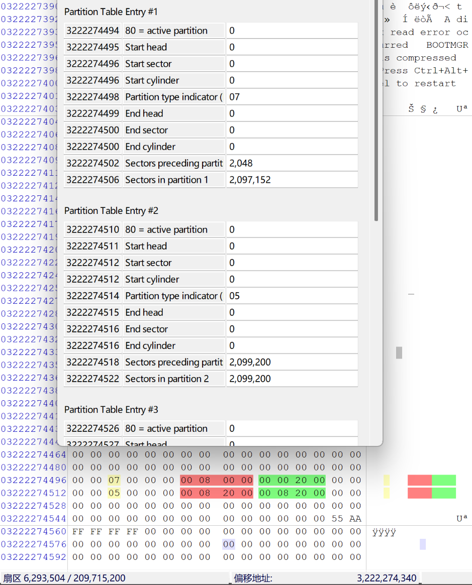

#### 8392704扇区

第一个表项：
- 起始扇区地址：8394752 - 8392704 = 2048
- 扇区数量：2097152
- 类型: 07

第二个表项:
- 起始扇区地址：10491904 - 6293504 = 4198400
- 扇区数量：12591103 - 10491904 **+1** = 2099200
- 类型: 05

#### 10491904扇区

第一个表项：
- 起始扇区地址：10493952 - 10491904 = 2048
- 扇区数量：2097152
- 类型: 07

### 保存并刷新

此时，按 Ctrl + S 将修改保存进磁盘

在系统的磁盘管理中刷新这个磁盘，即可见修复成功
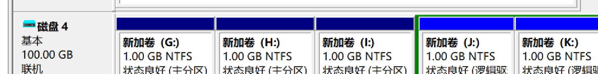

# GPT硬盘

为了破除只有512个字节的 MBR 分区表的许多限制，技术人员对硬盘分区表的标准进行了升级，提出了新的 GUID Partition Table（全局唯一标识磁盘分区表），简称 GPT 分区表，其中 GUID 是 Globally Unique Identifier（全局唯一标识符）的缩写，这是一种由算法生成的长度为128位的数字标识符。

但是由于 GPT 改变了硬盘的分区表格式，影响了电脑的初始启动过程，传统BIOS启动过程无法识别这种GPT硬盘的分区因此无法启动，采用最早由 Intel 提出的新的UEFI启动方式才能从 GPT 启动。

## GPT硬盘的结构

## 保护MBR的结构

保护MBR位于GPT磁盘的0号扇区，由磁盘签名、MBR磁盘分区表、结束标志组成，没有引导代码。而且分区表内只有一个分区表项，这个表项GPT根本不用，只是为了让系统认为这个磁盘是合法的

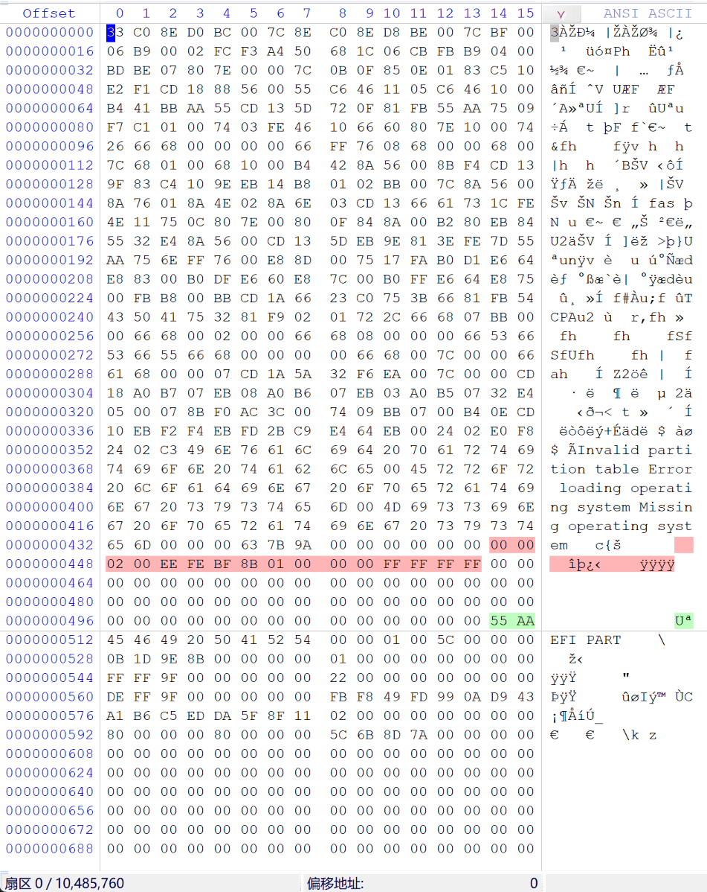

## GPT头的结构

GPT头位于GPT磁盘的1号扇区

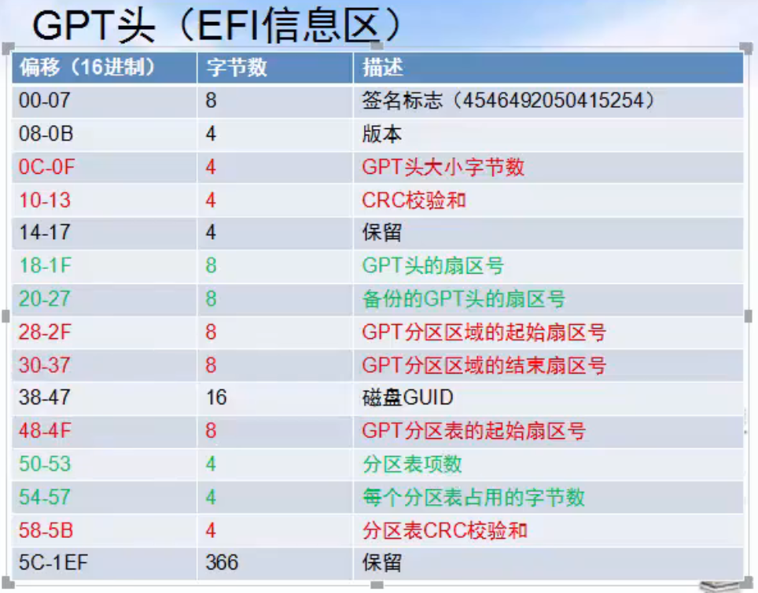

## GPT分区表的结构

GPT分区表位于GPT磁盘的2~33号扇区

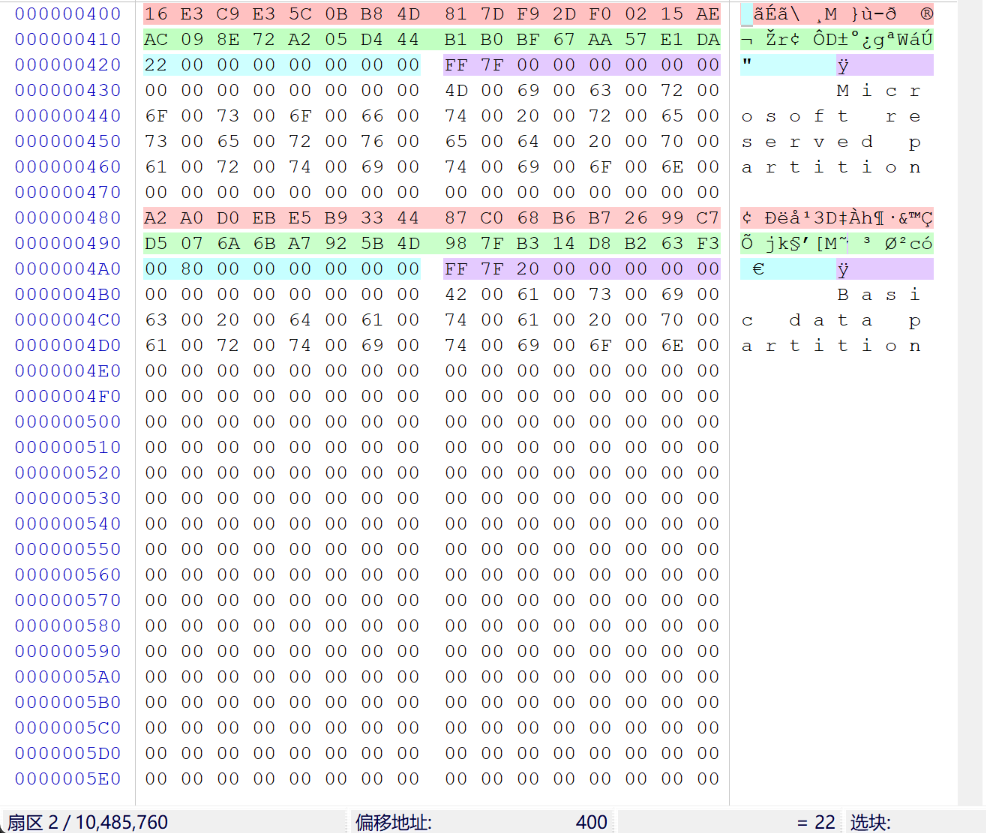

- 每个GPT分区表占128字节，分区表一共占用32个扇区（不包括备份分区表），一个扇区有512字节，所以最多可以存储 512 * 32 / 128 = 128 个分区表

- GPT分区表用8个字节表示分区的起始扇区号或结束扇区号（MBR分区表只用4个字节），所以GPT分区表可以支持更大的分区

# 初始化GPT硬盘

会对硬盘做如下修改：
- 0号扇区：写入保护MBR
- 1号扇区：写入GPT头，剩余的字节清零
- 2~33扇区：写入系统默认的分区表，剩余的字节清零
- 倒数33~1扇区：备份GPT头和备份分区表的改变也一样

# 修复GPT硬盘

## 修复GPT硬盘的保护MBR

原先的磁盘结构如下
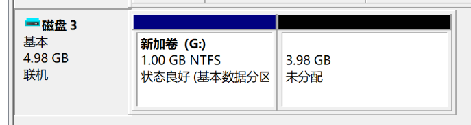

卷G 保存有 112233.txt 
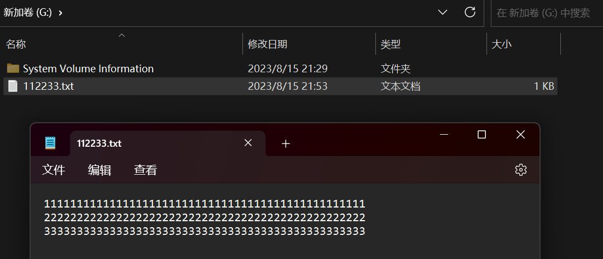

现在把0号扇区、1号扇区、2号扇区的十六进制全置0，模拟硬盘的保护MBR、GPT头、GPT分区表被破坏
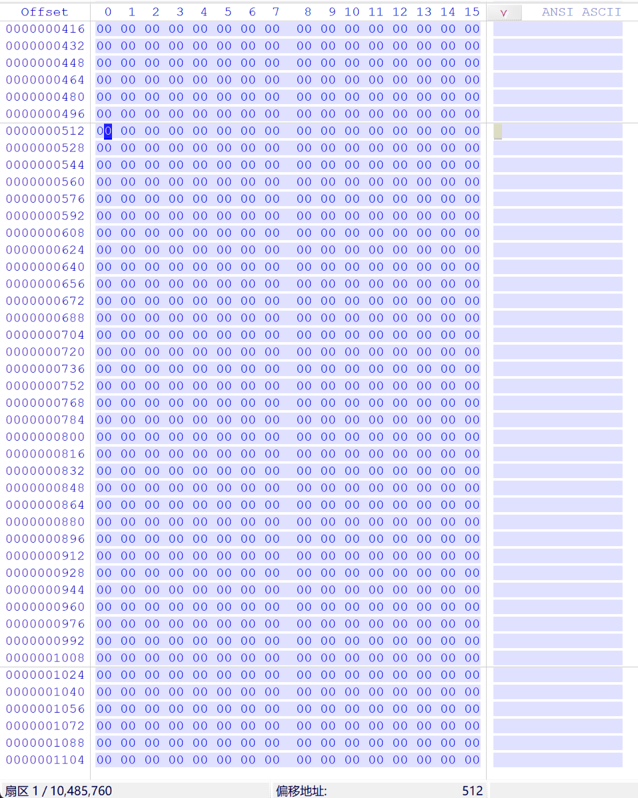

**提示需要初始化看 MBR**
**提示需要格式化看 DBR**

### 编写保护MBR的分区表和结束标志

在GPT硬盘中，这条分区表项和结束标志"55 AA"都是固定的
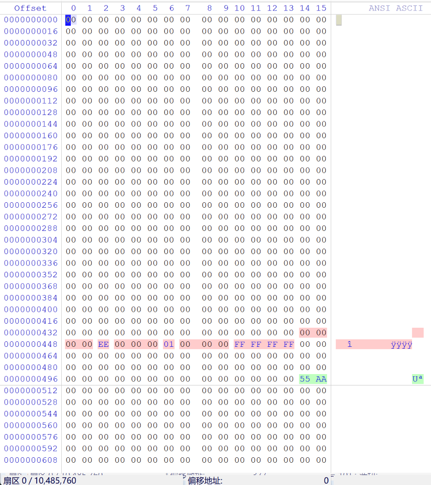

### 保存并刷新

此时，按 Ctrl + S 将修改保存进磁盘

在系统的磁盘管理中刷新这个磁盘，即可见修复成功
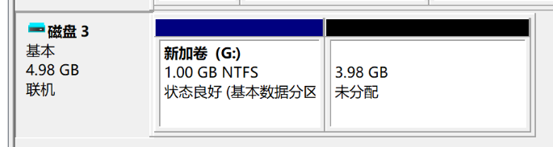

为什么只编写0号扇区的保护MBR，还未编写1号扇区的GPT头和2号扇区的GPT分区表，就可以恢复了

因为操作系统可以通过保护MBR确定是GPT硬盘，然后直接读取硬盘尾部扇区的备份信息

## 修复GPT分区表误删除的分区

---

1）在DBR前有三个字节代表文件系统跳转指令：

  FAT32文件系统跳转指令:EB 58 90
  FAT16文件系统跳转指令:EB 3C 90
  NTFS 文件系统跳转指令:EB 52 90
  exfat 文件系统跳转指令:EB 76 90

