# 扇区和簇（块）的区别

扇区(sector)，块(block)，簇(cluster)

[操作系统 | “扇区”、“簇”、“块”、“页”等概念](https://blog.csdn.net/weixin_47187147/article/details/126908793)


- 扇区是对硬盘而言，是物理层的
- 簇（块）是对文件系统而言，是逻辑层的
- 磁盘控制器是用来映射两层的
- 一个块大小 = 一个扇区大小*2^n

扇区是磁盘最小的物理存储单元，是磁头从磁盘中读取数据的最小单位（一般512B），即磁头每次从磁盘中读取数据，都是一个扇区一个扇区读的。但由于操作系统无法对数目众多的扇区进行寻址，所以操作系统就将相邻的扇区组合在一起形成一个簇，然后再对簇进行管理（每个簇可以包括2、4、8、16、 32或64个扇区）

 簇（块）是操作系统与磁盘（硬盘）交互的最小数据单元（在linux系统中称为块，在windows系统中称为簇）。操作系统从硬盘中拿一块数据，即完成一次磁盘IO

 簇（块）的大小在硬盘格式化时被指定，一般有1K，2K，4K（最常用）。如果块的大小设置为4K，那么磁盘要读取8个扇区之后，才将数据块传给操作系统。另外， 簇（块）也是DOS下数据存储的最小单元。例如，如果一个文件的大小为1K，而块的大小为4K，那么该文件还是会占用一个块，块中剩下的3K被空闲出来，不能用于存储其他数据。因此，设置块的大小时，需要考虑要存储文件的大小

# 文件系统

文件系统是对数据存储进行管理的一种机制
格式化的目的就是建立文件系统从而管理文件

NTFS、FAT32、exFAT文件系统的第一个扇区叫 DBR 系统引导扇区

在DBR前有三个字节代表文件系统跳转指令：
- FAT32文件系统跳转指令: EB 58 90
- FAT16文件系统跳转指令: EB 3C 90
- NTFS 文件系统跳转指令: EB 52 90
- exfat 文件系统跳转指令: EB 76 90

## FAT32文件系统

FAT16的加强版
FAT32文件系统由微软推出，常用于U盘，支持长文件名，但单个文件最大4GB，最大分区128GB，单个硬盘最大容量2TB

[FAT32文件系统详解](https://blog.51cto.com/dengqi/1349327)

### FAT32文件系统的组成

FAT32文件系统由DBR及其保留扇区，FAT1，FAT2，DATA四个部分组成
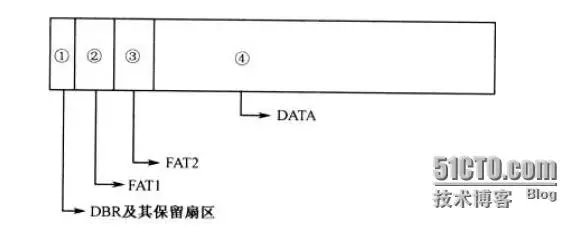


这些结构是在分区被格式化时创建出来的，含义解释如下：

- DBR及其保留扇区：DBR的含义是DOS引导记录，也称为操作系统引导记录，在DBR之后往往会有一些保留扇区
- FAT1：FAT的含义是文件分配表，FAT32一般有两份FAT，FAT1是第一份，也是主FAT
- FAT2：FAT2是FAT32的第二份文件分配表，也是FAT1的备份
- DATA：DATA也就是数据区，是FAT32文件系统的主要区域，其中包含目录区域

### FAT32文件系统的DBR

FAT32文件系统的DBR由跳转指令，OEM代号，BPB，引导程序，结束标志五个部分组成

- 跳转指令：本身占2字节它将程序执行流程跳转到引导程序处
- OEM代号：这部分占8字节，其内容由创建该文件系统的OEM厂商具体安排
- BPB：FAT32的BPB从DBR的第12个字节开始，占用79字节，记录了有关该文件系统的重要信息
- 引导程序代码：FAT32的DBR引导程序占用420字节，对于没有安装操作系统的分区来说这段程序是没有用处的
- 结束标志：DBR的结束标志与MBR，EBR的结束标志相同，为"55 AA"

#### DBR中的BPB的结构

[FAT32文件系统学习(1) —— BPB的理解](https://www.cnblogs.com/fantacity/p/3895771.html)

把从0x000B开始的79个字节的数据叫做BPB（BIOS Paramter Block），关于BPB的详细说明参见下表
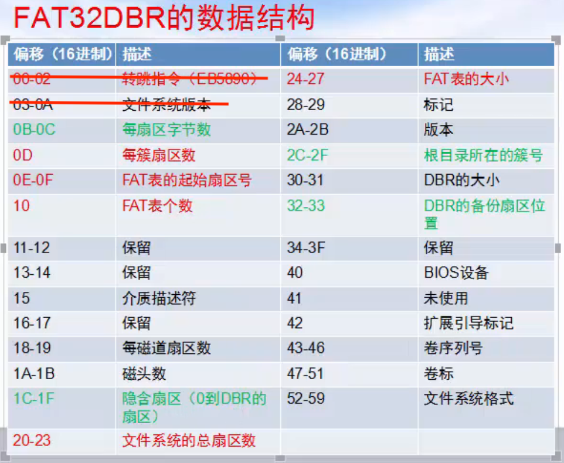
注意，上图中的**FAT表的起始扇区号**是相对于DBR扇区的

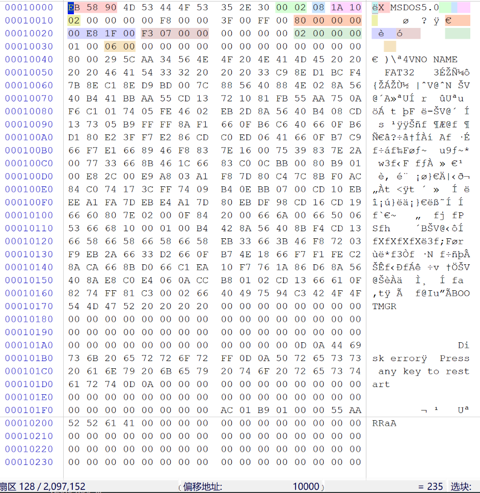

#### MBR、EBR、DBR的区别

通常情况下可以这样描述这几个概念：
- MBR：为计算机启动后从可启动介质上首先装入内存并且执行的代码，通常用来解释分区结构。以硬盘为例，通常为LBA的0扇区。MBR是主引导记录(Master Boot Record)的缩写
- EBR：EBR的意思是扩展分区引导记录，是MBR下的子概念，且有扩展分区存在的时候，才有EBR存在，如果一个硬盘没有扩展分区，那它就没有EBR。自MICROSOFT推出扩展分区的概念后，扩展分区就沿用了基本分区所采用的DPT结构，为了加以区别，人们通常把扩展分区的分区表所在的扇区称为EBR、EMBR、扩展MBR或虚拟MBR
- DBR：DBR也是MBR的子概念，只有MBR硬盘才有DBR的说法。如果Windows被装在MBR盘上，必须要有一个引导分区（C盘），而引导分区的前面就有一段DBR（代码），用于引导Windows的启动。DBR是DOS启动记录的意思，为操作系统进入文件系统以后可以访问的第一个扇区，通常用来解释文件系统。在UNIX类文件系统中，等同于SUPERBLOCK

不同点：
1. MBR是硬盘的主引导记录，它位于硬盘的第一个扇区，用于引导操作系统，而EBR和DBR则是用于管理硬盘分区的引导记录，它们位于硬盘的其他扇区
2. MBR只能支持4个主分区，而EBR和DBR可以支持更多的分区
3. MBR是由BIOS读取，而EBR和DBR是由操作系统读取

### 保留扇区中的FSINFO扇区

FSINFO扇区位于DBR扇区的下一个扇区
用于记录文件系统中空闲簇数和下一个可用的簇号


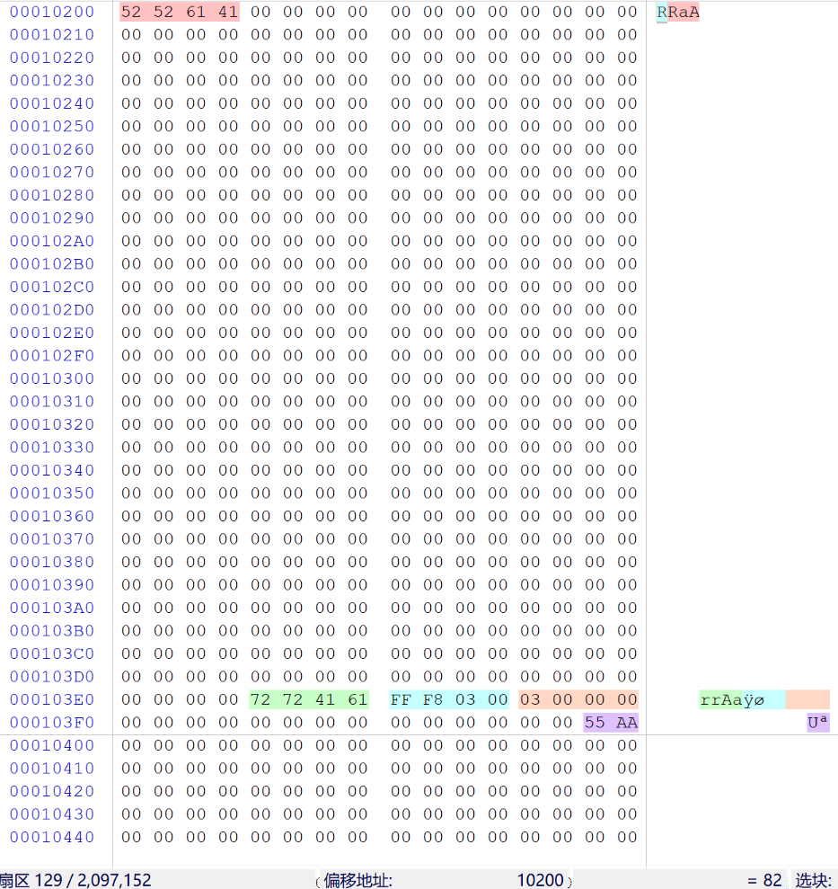

### FAT32文件系统的FAT表

[FAT32文件系统学习(2) —— FAT表](https://www.cnblogs.com/fantacity/p/3897933.html)

文件分配表FAT（File Allocation Table）用来描述文件系统内存储单元的分配状态及文件内容的前后链接关系的表格（也可以笼统的说成是记录文件所在位置的表格）。它对于FAT文件系统来讲是至关重要的一个组成部分，并且它对于硬盘的使用也非常重要，假若丢失文件分配表，那么硬盘上的数据就无法定位，也就不能使用了

FAT表一般来说有两张（分别是FAT1和FAT2），另一张用于备份
- FAT1起始扇区号：DBR中的BPB中的FAT表起始扇区号
- FAT2起始扇区号：FAT1起始扇区号 + DBR中的BPB中的FAT表大小

#### 每一个FAT表项

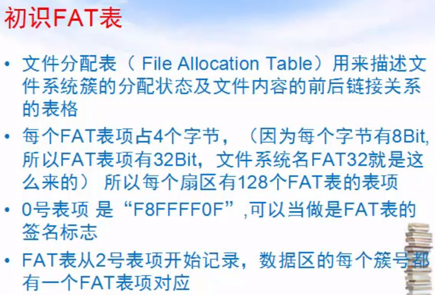
注意，上图中的十六进制数据是**小端序**

FAT32文件表是由一个个表项组成的一张表，其中每一个表项由一个32位的二进制组成，其值对应了相应簇的使用情况，如2号表项对应了2号簇的使用情况，3号表项对应了3号簇的使用情况，依此类推（但是第0和第1项例外，下面会有说明）
每个表项对应数值的含义如下

| 表项数值                | 对应含义                       |
| ----------------------- | ------------------------------ |
| 0x00000000              | 空闲簇，即表示可用             |
| 0x00000001              | 保留簇                         |
| 0x00000002 - 0x0FFFFFEF | 被占用的簇，其值指向下一个簇号 |
| 0x0FFFFFF0 - 0x0FFFFFF6 | 保留值                         |
| 0x0FFFFFF7              | 坏簇                           |
| 0x0FFFFFF8 - 0x0FFFFFFF | 文件最后一个簇                 |
 	
- 如果该簇是文件的最后一簇，填入的值为0x0FFFFFFF
- 如果该簇不是文件的最后一簇，则填入的值为该文件占用的下一簇号（所以我们可以看到在FAT32中文件是以簇链的形式保存起来的）
- 注意，上表中的十六进制数据是**大端序**

此时，这个FAT32分区中还未存入我们自己的文件


FAT表如下图所示
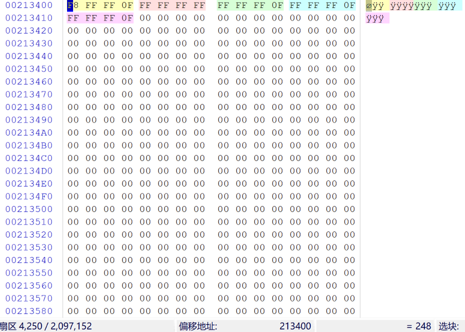

为了演示，向当前的FAT32分区中存入一张图片和一个文本文件
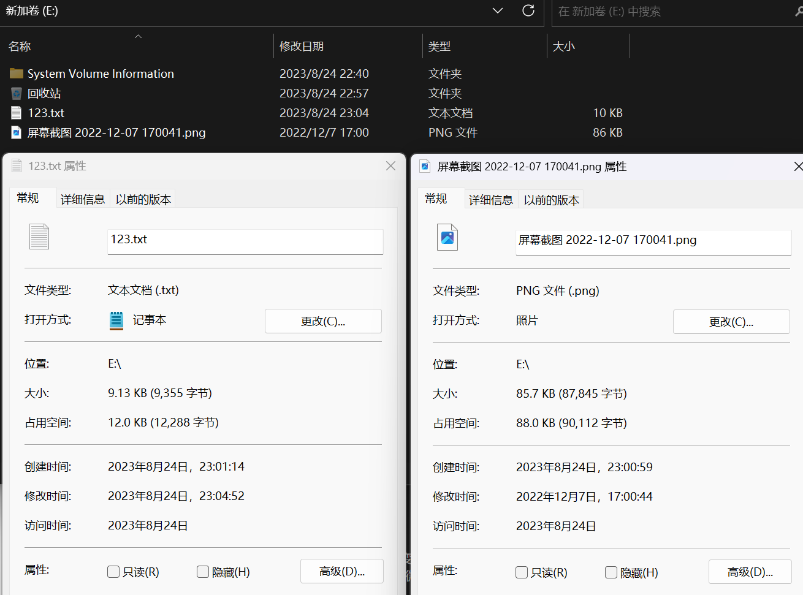

现在FAT表如下图所示
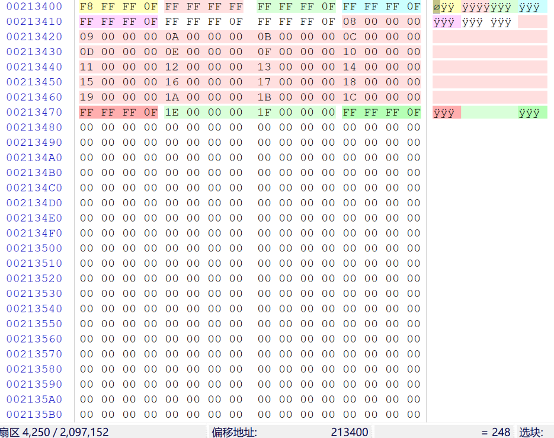
注意，上图中的十六进制数据是**小端序**

FAT表含义分析：
- 第0项：F8FFFF0F（即对应上表中的0x0FFFFFF8），是FAT表的签名标志
- 第1项：FFFFFFFF，用于记录脏标志，以说明文件系统没有被正常卸载或者磁盘表面存在错误
> 以上这两项不代表任何簇的使用情况，而是FAT表的表头，表征了介质描述，是固定值，所以0x00和0x01这两个簇号是不用的，簇号的下标从2开始
- 第2项：FFFFFF0F（即对应上表中的0x0FFFFFFF），存储的是2号簇的使用情况，通常2号簇存储的是文件系统的根目录，FFFFFF0F的含义是文件或目录的结束簇号
- 第3~6项：同上
- 第7项开始的红色部分：n号簇 指向 n+1号簇，直到值为FFFFFF0F的簇，表示文件存储结束，占用22个簇，可知这个文件占用 22*4KB 的空间
> 上面这个文件是连续存储的，但有时磁盘空间不够时，文件是分段存储的
- 之后的绿色部分：同上，占用3个簇，可知这个文件占用 3*4KB 的空间

### FAT32文件系统的DATA数据区

[FAT32文件系统学习(3) —— 数据区(DATA区)](https://www.cnblogs.com/fantacity/p/3900237.html#read_root)

数据区的内容主要由三部分组成：
1. 根目录
2. 子目录
3. 文件内容

- 分区根目录下的文件及文件夹的目录项存放在根目录区中
- 分区子目录下的文件及文件夹的目录项存放在子目录区中
- 根目录和子目录区都在DATA数据区中

#### 1. 根目录

根目录位置：记录在**DBR中的BPB中的根目录所在簇号**
绝大多数情况下，根目录存储在**2号簇**（簇号的下标从2开始）

2号簇的起始扇区号 = FAT表的起始扇区号 + ( 2* FAT表的大小 )

#### 2. 子目录

n号簇的起始扇区号 = 2号簇的起始扇区号 + [ (n-2)* 每个簇的扇区数 ] 

#### 目录项

根目录或子目录的每**32个字节**为一个目录项，每个目录项纪录着一个目录或文件（也可能是多个目录项记录一个目录或文件）

[FAT32文件系统之目录项分析（四）](https://blog.csdn.net/sikuon/article/details/77914422)

FAT32目录项分为四类：
1. 短文件名目录项
2. 长文件名目录项
3. "."目录项和".."目录项
4. 卷标目录项

##### 演示目录和文件

为了演示，构造如下的目录和文件

[windows中的文件夹被隐藏且隐藏属性为灰色怎么办](https://jingyan.baidu.com/article/90895e0f29612164ec6b0b89.html)

```shell
# 强制修改隐藏属性
attrib -s -r -h [文件名或文件夹名]
```

[CMD命令：Windows Tree命令生成目录树](https://blog.csdn.net/qq_21238607/article/details/102381486)

```shell
tree /f
```

当前FAT32分区中的目录结构如下图
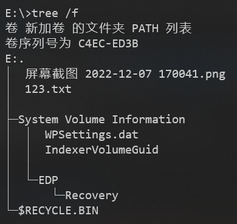

对应的FAT表如下图
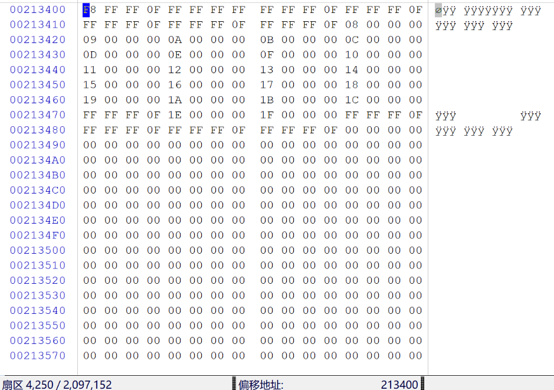

##### 1. 短文件名目录项

所谓短文件名既文件名的"8.3"格式，此格式支持主文件名不能超过8字节，扩展名不能超过3字节
短文件名目录始终存放在**一个目录项**

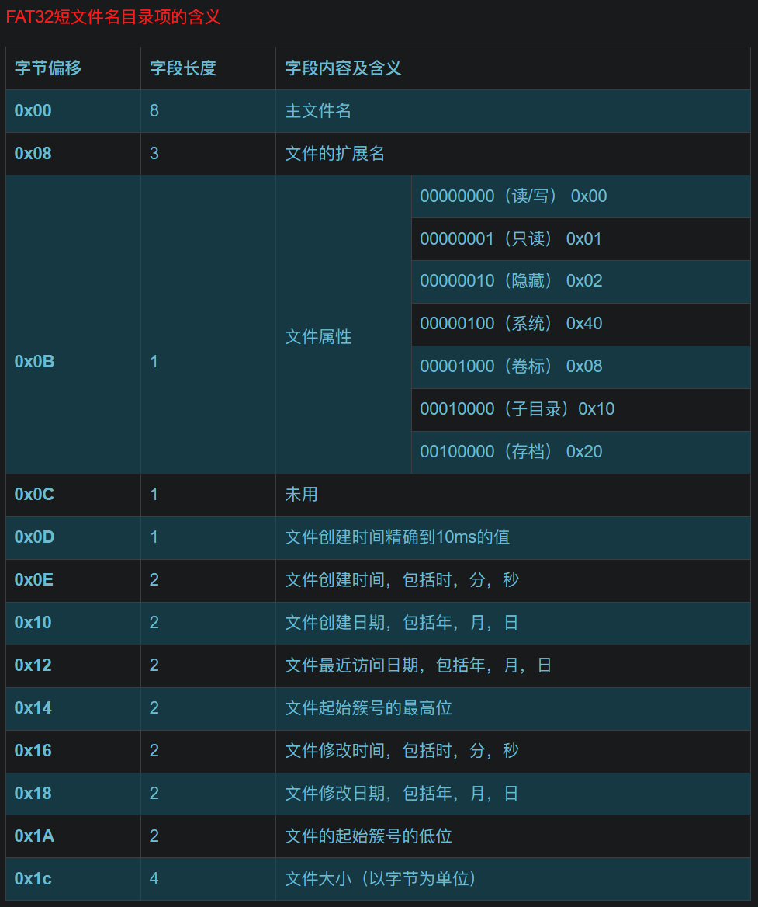

123.txt文件（符合"8.3"格式）的目录项：
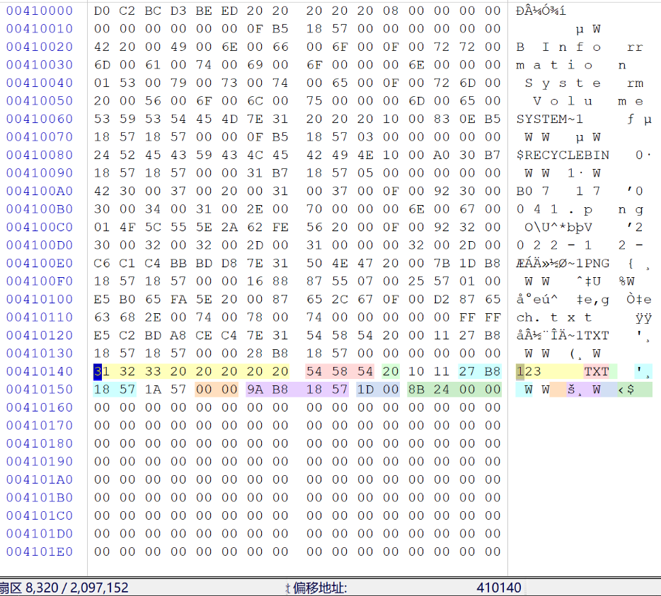

屏幕截图 2022-12-07 170041.png（不符合"8.3"格式）的目录项：
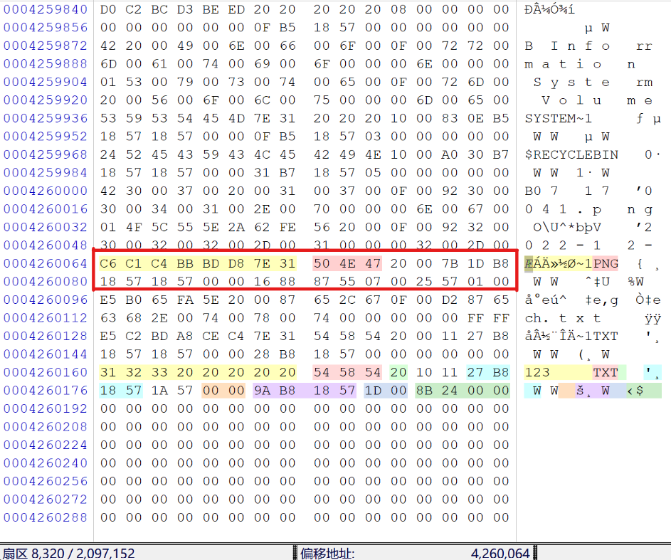

###### 参数详细分析

文件名：
- 如果文件名不满8个字符，用空格（十六进制为 0x20）填充
- 如果文件名超过8个字符，则会截断，提取前6个字符再加上"~1"（如果有同名目录项，这个数值会加1）
- 一个目录项是否被分配使用由它的第一个字节来描述。对于已经分配使用的目录项，它的第一个字节是文件名的第一个字符，而文件或目录被删除后，它所对应的目录项的第一个字节将被置为 0xE5

文件扩展名：
- 没有扩展名的用空格（十六进制为 0x20）填充

文件属性：
- 文件的各种属性，表示的方法是按二进制位定义，最高两位保留未用

文件创建时间精确到10ms的值：
- 把十六进制转换为十进制，然后 *10ms

文件创建时间：
- 0-4位，这5位记录秒的值，单位是2s，也就是把这四位的值乘以2，才是秒的值，其取值范围为0~29
- 5-10位，这6位记录分的值，其取值范围为0~59
- 11-15位，这5位记录时的值，其取值范围为0~23
- 计算出来的值再加上文件创建时间精确到10ms的值，才是文件最终的创建时间

文件创建日期：
- 0-4位，这5位记录日的值，其取值范围为0~31
- 5-8位，这4位记录月的值，其取值范围为0~12
- 9-15位，这7位记录年的值，其取值相对于1980年开始计数的，其值必须加上1980

使用数据解释器，可以直观地看日期时间
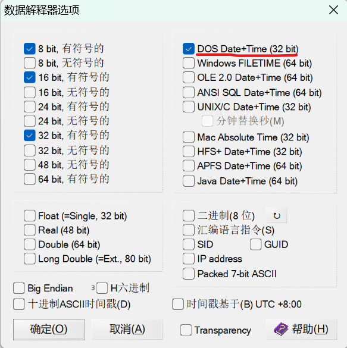
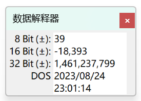

文件最近访问日期：
- 同上

文件起始簇号的高位：
- 文件的内容所在的第一个簇号的高16位

文件修改时间：略
文件修改日期：略

文件起始簇号的低位：
- 文件的内容所在的第一个簇号的低16位

文件大小：
- 以字节大小为单位，小端存储

###### 文件或目录的起始扇区号的计算

123.txt文件（符合"8.3"格式）的目录项：


起始簇号 = 低16位的十进制值 + (高16位的十进制值 *65536)
可知该文件的起始簇号为 29，则该文件的起始扇区号的计算方法为：
2号簇的起始扇区号 + (29 -2) *8 = 8320 + 216 = 8536

123.txt文件的起始扇区：
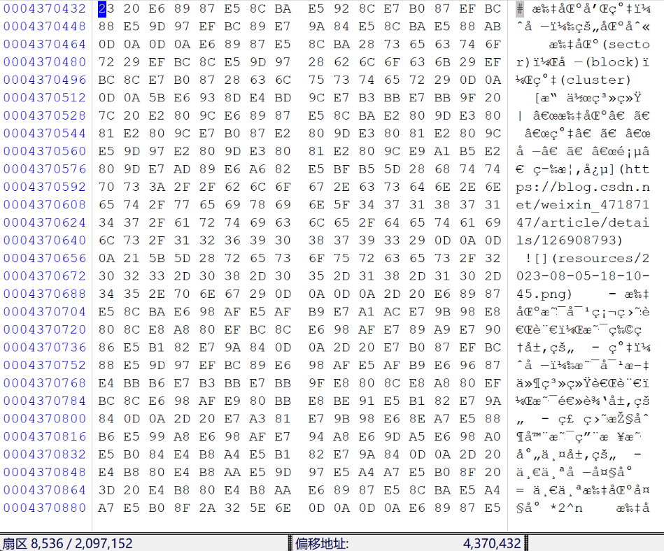

###### 利用FAT表找出目录的下一个簇

---
到P6

##### 2. 长文件名目录项

由于短文件名"8.3"的格式远远不能满足现实中的需求，所以就出现了长文件名
可能一个文件名占据**多个目录项**


##### 3. "."目录项和".."目录项

"."表示**当前目录**，".."表示当前目录的**父级目录**，这两个目录项多存在**子目录**中


##### 4. 卷标目录项

卷标就是分区的名字，可以在格式化分区时创建，也可以随意修改，长度为**11字节**


#### 3. 文件内容


---

而删除的时候并不会真正删除文件簇，只是会修改文件属性，将文件标志逻辑删除，所以我们可以很轻易的恢复它，但是这并不意味着该文件不会被永久删除，当存储空间不够用或者是其他情况的时候，文件就可能会被物理删除，这时文件就无法恢复了。

随着磁盘大小的提升（200M以上），使用链表作为结构的文件系统系统会急速下降，特别是面对大文件时，就显得力不从心。

你可能也已经注意到了，FAT32的写入操作是没有任何保护机制的，也就是说，如果FAT32在向一个文件里面写数据的时候，如果写入已经开始但是还没有完成的时候断电了，那么此时的数据就处于一个非常尴尬的状态，一半是新数据，一半是旧数据，此时文件可能就被毁坏了，如果凑巧这个文件是系统文件，那会导致灾难性的后果。

Ext4和NTFS都会使用日志，来确保写入的原子性，保证数据要么是更新前的状态，或者是更新完成后的状态，而不会处于中间状态。


---


## NTFS文件系统

NTFS 意思是Windows NT的文件系统，它的优点是安全性和稳定性好，能自动记录与文件的变动操作，系统不易崩溃，具有文件修复能力，出现错误能迅速修复，是目前Win系统主要采用的文件系统，缺点是微软的Win系统独家支持，其他系统如果要访问 NTFS 格式设备中的文件数据，需要采取一些特别的技术手段


### NTFS文件系统的组成


### NTFS文件系统的DBR

与FAT32的DBR类似，NTFS文件系统的DBR记录了每个扇区的字节数，每个簇的扇区数，MFT的起始位置等

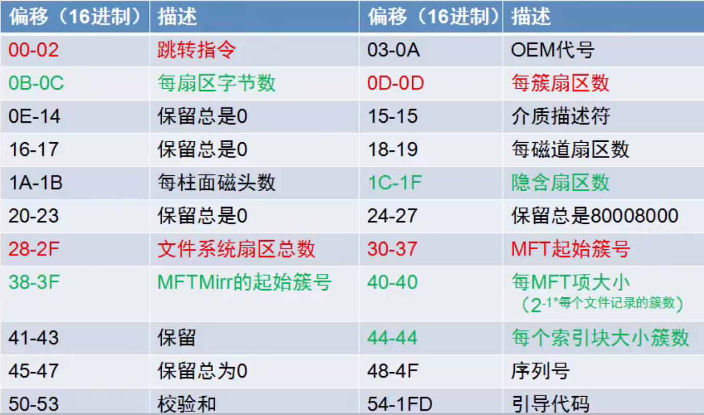


## NTFS文件系统的元文件


## exFAT文件系统

extFAT 意思是指扩展文件分配表 (Extended File Allocation Table)，是微软在2006年发表的存储格式，是微软为闪存开发的文件系统。作为FAT32的进化版，它还有一个名字叫 FAT64。与前辈 FAT32 相比，它可以存储4GB以上的大文件；与另一位前辈 NTFS 相比，它对闪存更友好，支持的系统更多。目前该格式主要用于优盘等外接存储设备，不能用于内部硬盘


