# FAT32文件系统

FAT16的加强版
FAT32文件系统由微软推出，常用于U盘，支持长文件名，但单个文件最大4GB，最大分区128GB，单个硬盘最大容量2TB

[FAT32文件系统详解](https://blog.51cto.com/dengqi/1349327)

## FAT32文件系统的组成

FAT32文件系统由DBR及其保留扇区，FAT1，FAT2，DATA四个部分组成


这些结构是在分区被格式化时创建出来的，含义解释如下：

- DBR及其保留扇区：DBR的含义是DOS引导记录，也称为操作系统引导记录，在DBR之后往往会有一些保留扇区
- FAT1：FAT的含义是文件分配表，FAT32一般有两份FAT，FAT1是第一份，也是主FAT
- FAT2：FAT2是FAT32的第二份文件分配表，也是FAT1的备份
- DATA：DATA也就是数据区，是FAT32文件系统的主要区域，其中包含目录区域

## FAT32文件系统的DBR

FAT32文件系统的DBR由跳转指令，OEM代号，BPB，引导程序，结束标志五个部分组成

- 跳转指令：本身占2字节它将程序执行流程跳转到引导程序处
- OEM代号：这部分占8字节，其内容由创建该文件系统的OEM厂商具体安排
- BPB：FAT32的BPB从DBR的第12个字节开始，占用79字节，记录了有关该文件系统的重要信息
- 引导程序代码：FAT32的DBR引导程序占用420字节，对于没有安装操作系统的分区来说这段程序是没有用处的
- 结束标志：DBR的结束标志与MBR，EBR的结束标志相同，为"55 AA"

### DBR中的BPB的结构

[FAT32文件系统学习(1) —— BPB的理解](https://www.cnblogs.com/fantacity/p/3895771.html)

把从0x000B开始的79个字节的数据叫做BPB（BIOS Paramter Block），关于BPB的详细说明参见下表

注意，上图中的**FAT表的起始扇区号**是相对于DBR扇区的


### MBR、EBR、DBR的区别

通常情况下可以这样描述这几个概念：
- MBR：为计算机启动后从可启动介质上首先装入内存并且执行的代码，通常用来解释分区结构。以硬盘为例，通常为LBA的0扇区。MBR是主引导记录(Master Boot Record)的缩写
- EBR：EBR的意思是扩展分区引导记录，是MBR下的子概念，且有扩展分区存在的时候，才有EBR存在，如果一个硬盘没有扩展分区，那它就没有EBR。自MICROSOFT推出扩展分区的概念后，扩展分区就沿用了基本分区所采用的DPT结构，为了加以区别，人们通常把扩展分区的分区表所在的扇区称为EBR、EMBR、扩展MBR或虚拟MBR
- DBR：DBR也是MBR的子概念，只有MBR硬盘才有DBR的说法。如果Windows被装在MBR盘上，必须要有一个引导分区（C盘），而引导分区的前面就有一段DBR（代码），用于引导Windows的启动。DBR是DOS启动记录的意思，为操作系统进入文件系统以后可以访问的第一个扇区，通常用来解释文件系统。在UNIX类文件系统中，等同于SUPERBLOCK

不同点：
1. MBR是硬盘的主引导记录，它位于硬盘的第一个扇区，用于引导操作系统，而EBR和DBR则是用于管理硬盘分区的引导记录，它们位于硬盘的其他扇区
2. MBR只能支持4个主分区，而EBR和DBR可以支持更多的分区
3. MBR是由BIOS读取，而EBR和DBR是由操作系统读取

## 保留扇区中的FSINFO扇区

FSINFO扇区位于DBR扇区的下一个扇区
用于记录文件系统中空闲簇数和下一个可用的簇号


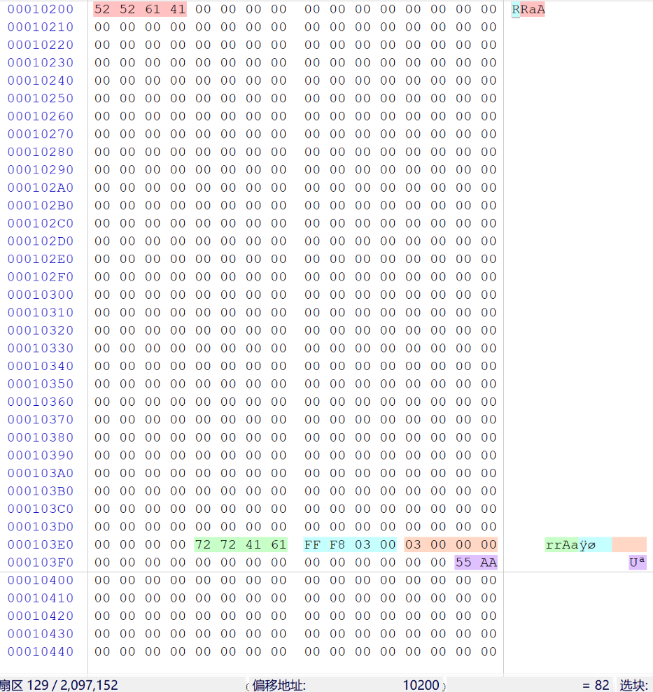

## FAT32文件系统的FAT表

[FAT32文件系统学习(2) —— FAT表](https://www.cnblogs.com/fantacity/p/3897933.html)

文件分配表FAT（File Allocation Table）用来描述文件系统内存储单元的分配状态及文件内容的前后链接关系的表格（也可以笼统的说成是记录文件所在位置的表格）。它对于FAT文件系统来讲是至关重要的一个组成部分，并且它对于硬盘的使用也非常重要，假若丢失文件分配表，那么硬盘上的数据就无法定位，也就不能使用了

FAT表一般来说有两张（分别是FAT1和FAT2），另一张用于备份
- FAT1起始扇区号：DBR中的BPB中的FAT表起始扇区号
- FAT2起始扇区号：FAT1起始扇区号 + DBR中的BPB中的FAT表大小

### 每一个FAT表项

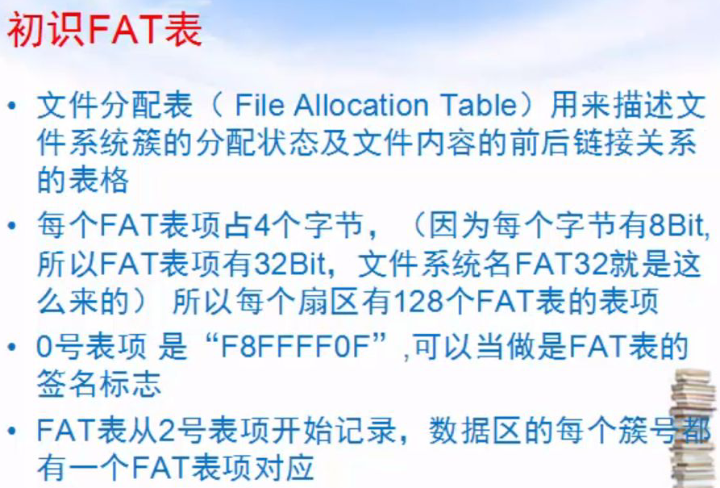
注意，上图中的十六进制数据是**小端序**

FAT32文件表是由一个个表项组成的一张表，其中每一个表项由一个32位的二进制组成，其值对应了相应簇的使用情况，如2号表项对应了2号簇的使用情况，3号表项对应了3号簇的使用情况，依此类推（但是第0和第1项例外，下面会有说明）
每个表项对应数值的含义如下

| 表项数值                | 对应含义                       |
| ----------------------- | ------------------------------ |
| 0x00000000              | 空闲簇，即表示可用             |
| 0x00000001              | 保留簇                         |
| 0x00000002 - 0x0FFFFFEF | 被占用的簇，其值指向下一个簇号 |
| 0x0FFFFFF0 - 0x0FFFFFF6 | 保留值                         |
| 0x0FFFFFF7              | 坏簇                           |
| 0x0FFFFFF8 - 0x0FFFFFFF | 文件最后一个簇                 |
 	
- 如果该簇是文件的最后一簇，填入的值为0x0FFFFFFF
- 如果该簇不是文件的最后一簇，则填入的值为该文件占用的下一簇号（所以我们可以看到在FAT32中文件是以簇链的形式保存起来的）
- 注意，上表中的十六进制数据是**大端序**

此时，这个FAT32分区中还未存入我们自己的文件


FAT表如下图所示
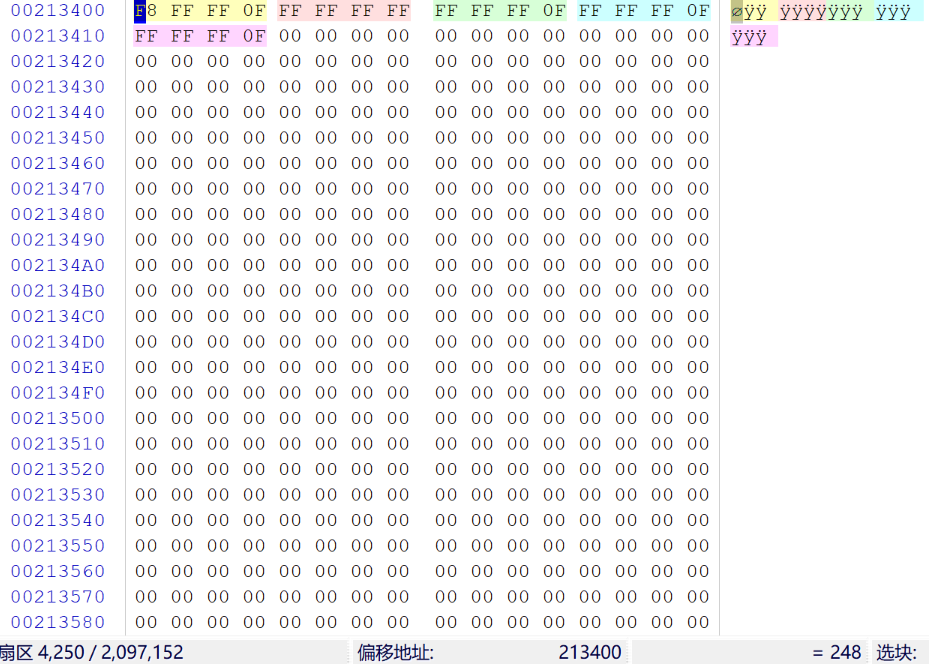

为了演示，向当前的FAT32分区中存入一张图片和一个文本文件
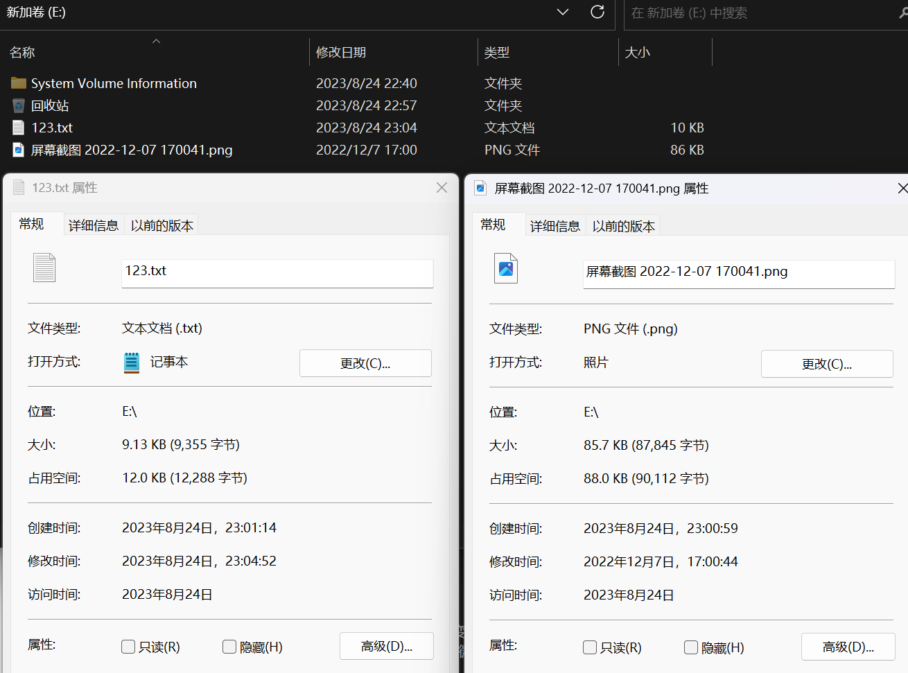

现在FAT表如下图所示
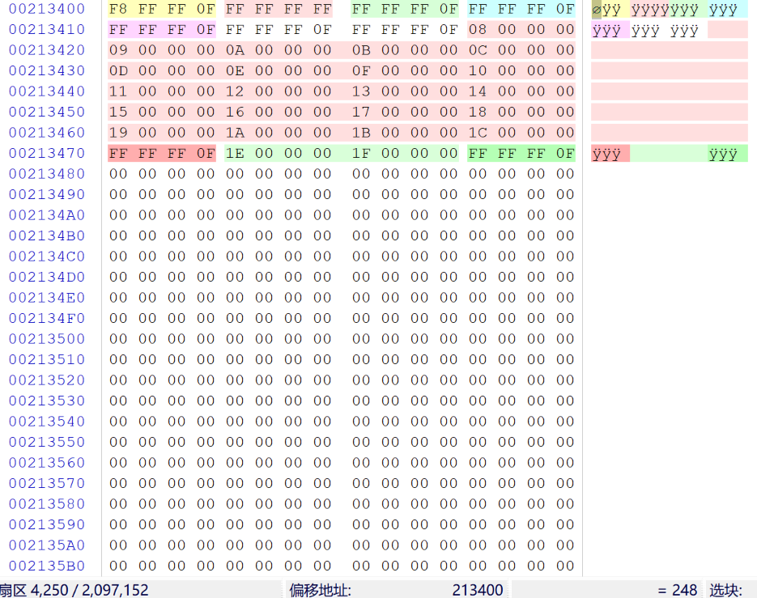
注意，上图中的十六进制数据是**小端序**

FAT表含义分析：
- 第0项：F8FFFF0F（即对应上表中的0x0FFFFFF8），是FAT表的签名标志
- 第1项：FFFFFFFF，用于记录脏标志，以说明文件系统没有被正常卸载或者磁盘表面存在错误
> 以上这两项不代表任何簇的使用情况，而是FAT表的表头，表征了介质描述，是固定值，所以0x00和0x01这两个簇号是不用的，簇号的下标从2开始
- 第2项：FFFFFF0F（即对应上表中的0x0FFFFFFF），存储的是2号簇的使用情况，通常2号簇存储的是文件系统的根目录，FFFFFF0F的含义是文件或目录的结束簇号
- 第3~6项：同上
- 第7项开始的红色部分：n号簇 指向 n+1号簇，直到值为FFFFFF0F的簇，表示文件存储结束，占用22个簇，可知这个文件占用 22*4KB 的空间
> 上面这个文件是连续存储的，但有时磁盘空间不够时，文件是分段存储的
- 之后的绿色部分：同上，占用3个簇，可知这个文件占用 3*4KB 的空间

## FAT32文件系统的DATA数据区

[FAT32文件系统学习(3) —— 数据区(DATA区)](https://www.cnblogs.com/fantacity/p/3900237.html#read_root)

数据区的内容主要由三部分组成：
1. 根目录
2. 子目录
3. 文件内容

- 分区根目录下的文件及文件夹的目录项存放在根目录区中
- 分区子目录下的文件及文件夹的目录项存放在子目录区中
- 根目录和子目录区都在DATA数据区中

### 1. 根目录

根目录位置：记录在**DBR中的BPB中的根目录所在簇号**
绝大多数情况下，根目录存储在**2号簇**（簇号的下标从2开始）

2号簇的起始扇区号 = FAT表的起始扇区号 + ( 2* FAT表的大小 )

### 2. 子目录

n号簇的起始扇区号 = 2号簇的起始扇区号 + [ (n-2)* 每个簇的扇区数 ] 

### 目录项

根目录或子目录的每**32个字节**为一个目录项，每个目录项纪录着一个目录或文件（也可能是多个目录项记录一个目录或文件）

[FAT32文件系统之目录项分析（四）](https://blog.csdn.net/sikuon/article/details/77914422)

FAT32目录项分为四类：
1. 短文件名目录项
2. 长文件名目录项
3. "."目录项和".."目录项
4. 卷标目录项

#### 演示用的目录和文件

为了演示，构造如下的目录和文件

[windows中的文件夹被隐藏且隐藏属性为灰色怎么办](https://jingyan.baidu.com/article/90895e0f29612164ec6b0b89.html)

```shell
# 强制修改隐藏属性
attrib -s -r -h [文件名或文件夹名]
```

[CMD命令：Windows Tree命令生成目录树](https://blog.csdn.net/qq_21238607/article/details/102381486)

```shell
tree /f
```

当前FAT32分区中的目录结构如下图
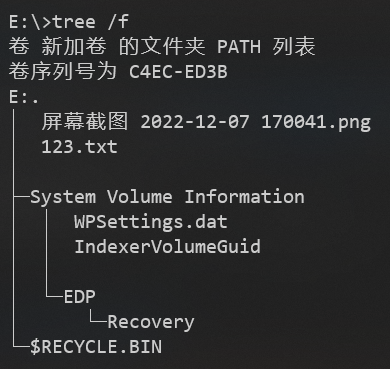

对应的FAT表如下图
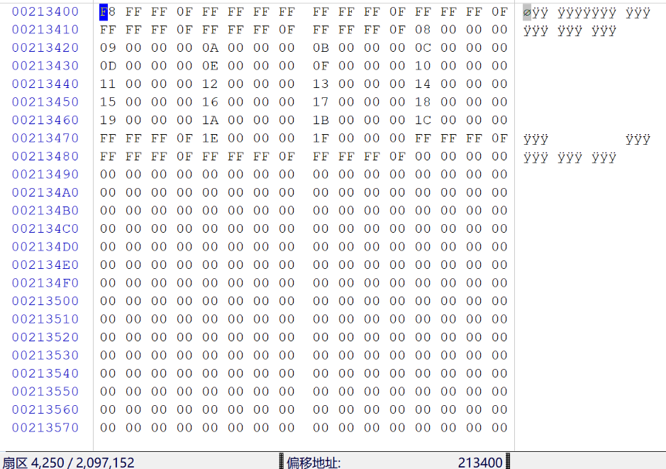

#### 1. 短文件名目录项

所谓短文件名既文件名的"8.3"格式，此格式支持主文件名不能超过8字节，扩展名不能超过3字节
短文件名目录始终存放在**一个目录项**

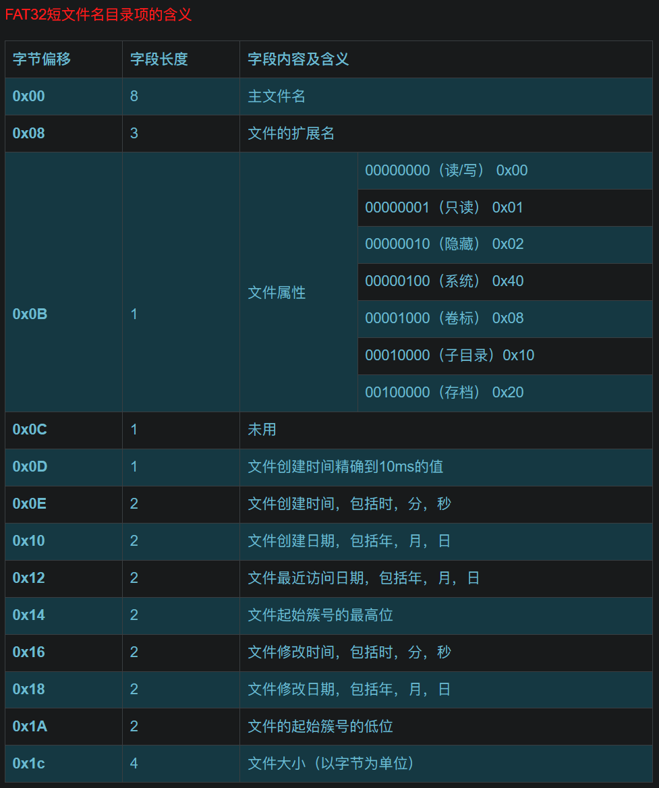
这里字段长度的单位是 **字节**

123.txt文件（符合"8.3"格式）的目录项：
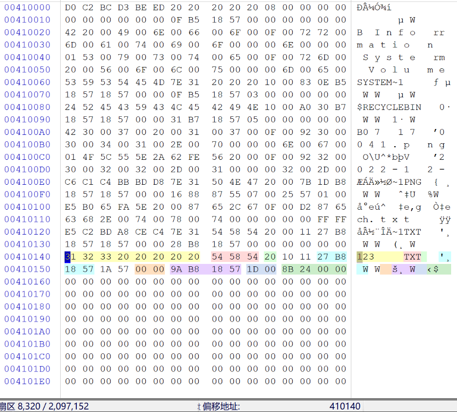

屏幕截图 2022-12-07 170041.png（不符合"8.3"格式）的短文件目录项：
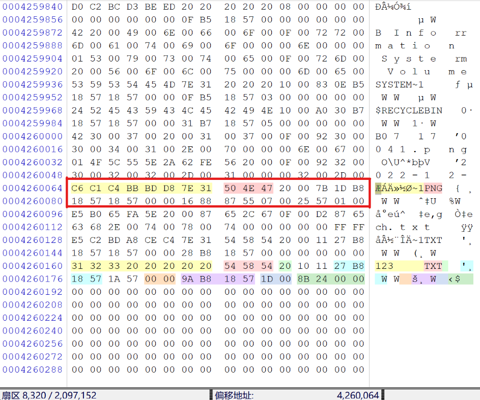

##### 参数详细分析

文件名：
- 如果文件名不满8个字符，用空格（十六进制为 **0x20**）填充
- 如果有"DOS"与"Winddows 3.x"等非法字符，以"­_"替代
- 如果文件名超过8个字符，则会截断，提取前6个字符再加上"**~1**"（如果有同名目录项，这个数值会加1）
> 如果是中文文件名，好像不是直接截取前面几个字符，这在搜索短文件名目录项要特别注意。直接搜索中文的前几个字符，搜不到短文件目录项，但是可以搜索到长文件目录项，因为短文件目录项紧挨在序列号最小的长文件目录项之后，所以也能找到短文件目录项
- 一个目录项是否被分配使用由它的第一个字节来描述。对于已经分配使用的目录项，它的第一个字节是文件名的第一个字符，而文件或目录被删除后，它所对应的目录项的第一个字节将被置为 **0xE5**

文件扩展名：
- 转换成**全大写**进行存储
- 没有扩展名的用空格（十六进制为 0x20）填充

文件属性：
- 文件的各种属性，表示的方法是按**二进制位定义**，最高两位保留未用

文件创建时间精确到10ms的值：
- 把十六进制转换为十进制，然后乘 10ms

文件创建时间：
- 0-4位，这5位记录秒的值，单位是2s，也就是把这四位的值乘以2，才是秒的值，其取值范围为0~29
- 5-10位，这6位记录分的值，其取值范围为0~59
- 11-15位，这5位记录时的值，其取值范围为0~23
- 计算出来的值再加上文件创建时间精确到10ms的值，才是文件最终的创建时间

文件创建日期：
- 0-4位，这5位记录日的值，其取值范围为0~31
- 5-8位，这4位记录月的值，其取值范围为0~12
- 9-15位，这7位记录年的值，其取值相对于1980年开始计数的，其值必须加上1980

使用数据解释器，可以直观地看日期时间
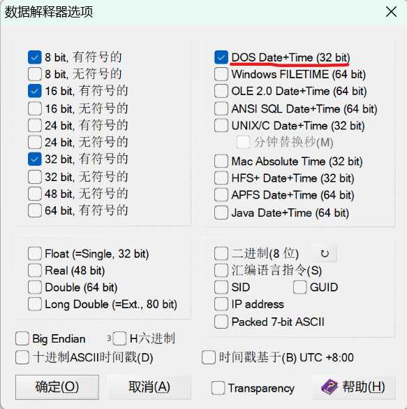
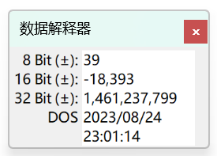

文件最近访问日期：
- 同上

文件起始簇号的高位：
- 文件的内容所在的第一个簇号的高16位

文件修改时间：略
文件修改日期：略

文件起始簇号的低位：
- 文件的内容所在的第一个簇号的低16位

文件大小：
- 以**字节**为单位，小端存储

##### 搜索短文件名目录项的方法

[字符串在线转换十六进制UTF-8编码](http://tool.haooyou.com/code?group=convert&type=strToHex&charset=UTF-8)


注意，这里转换时，**不要加文件扩展名**，因为短文件名目录项中，文件名和文件扩展名不是紧挨着存储的

短文件名的第1~8个字符（1个**UTF-8**字符占**1字节**），在短文件名目录项中是连续存放的
即在**每32个字节的offset为0的位置**（对应图中的偏移计算）搜索 313233，若搜索出的结果过多，可以在后面补最多（8-3）个"20"，即搜索 3132332020202020


注意：
对于中文文件名，这个方法无效，因为暂时不知中文文件名怎样压缩成短文件名
但是已知中文文件名怎样存放在长文件名目录项中，可先定位长文件名目录项，再向后找紧挨着的短文件名目录项

##### 文件或目录的起始扇区号的计算

123.txt文件（符合"8.3"格式）的目录项：


起始簇号 = 低16位的十进制值 + (高16位的十进制值 *65536)
可知该文件的起始簇号为 29，则该文件的起始扇区号的计算方法为：
2号簇的起始扇区号 + (29 -2) *8 = 8320 + 216 = 8536

123.txt文件的起始扇区：
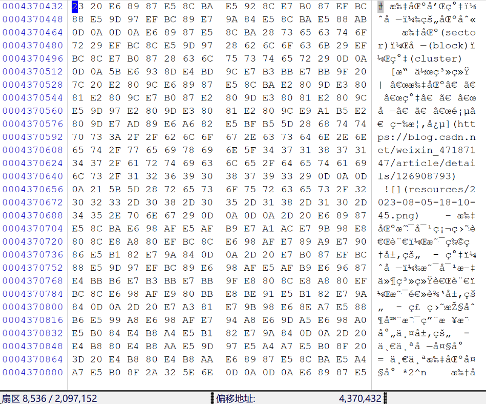

#### 2. 长文件名目录项

由于短文件名"8.3"的格式远远不能满足现实中的需求，所以就出现了长文件名
长文件名也是记录在目录项当中的，区别与短目录项的是，前者可能会占据**多个目录项**
系统在读入一个目录项的时候首先查看它的第0x0B个字节，发现是**0x0F**，所以认为这是一个长文件名目录项

为了兼容低版本的OS或程序能正确读取长文件名文件，系统**自动为所有长文件名文件创建了一个对应的短文件名**，使对应数据既可以用长文件名寻址，也可以用短文件名寻址。不支持长文件名的OS或程序会忽略它认为不合法的长文件名字短，而支持长文件名的OS或程序则会以长文件名为显式项来记录和编辑，并隐藏起短文件名

系统将长文件名以**13个字符**为单位进行切割，每一组占据一个目录项。所以可能一个文件需要多个目录项，这时长文件名的**各个目录项按倒序排列在目录表中**，以防与其他文件名混淆

系统在存储长文件名时，**总是先按倒序填充长文件名目录项，然后紧跟其对应的短文件名目录项**。长文件名中并不存储对应文件的文件开始簇、文件大小、各种时间和日期属性。文件的这些属性还是存放在短文件名目录项中，一个长文件名总是和其相应的短文件名目录项一一对应，只有短文件名没有长文件名还可以读，但如果只有长文件名没有对应的短文件名，不管什么系统都将忽略其存在。所以短文件名是至关重要的


这里字段长度的单位是 **字节**

屏幕截图 2022-12-07 170041.png（不符合"8.3"格式）的长文件目录项和短文件目录项：


##### 参数详细分析

序列号：
- 长文件名目录项的序列号，一个文件的第一个目录项序列号为 1，然后依次递增
- 如果是该文件的最后一个长文件名目录项，则将该目录项的序号与 **0x40** 进行 **或（OR）运算** 的结果写入该位置
- 文件或目录被删除后，它所对应的目录项的第一个字节将被置为 0xE5

文件名字符：
- 用**Unicode编码**存储
- 不仅包含文件名，还包含 "**.**" 和 **文件扩展名**
- 一个长文件名目录项有3个Unicode区，加起来正好是**26字节**即13个Unicode码，所以这就是为什么上面讲的以**13个字符**为单位切割
- 未使用的字节用 **0xFF** 填充

文件属性：
- 0x0B位置一定是 **0x0F**

短文件名检验和：
- 如果一个文件的长文件名需要几个长文件名目录项进行存储，则这些长文件名目录项具有**相同的校验和**
- 用于长文件名和短文件名的**配对**
- 校验和的计算方法是依次将短文件名的11个字符对应的二进制相加，在每一步相加之前先将二进制的值依次向右移动一位，最右边的位循环移动到最左边，然后再加上下一个字符所对应的二进制值，直到把最后一个字符加完
- 系统根据相应的算法来确定相应的长文件名目录项和短文件名目录项是否匹配
- 代码实现为
```c
int i, j = 0, chksum=0;
for (i = 11; i > 0; i--)
    chksum = ((chksum & 1) ? 0x80 : 0) + (chksum >> 1) + shortname[j++];
```

##### 搜索长文件名目录项的方法

[字符串在线转换十六进制unicode编码](http://tool.haooyou.com/code?group=convert&type=strToHex&charset=Unicode)


长文件名的第1~5个字符（1个**Unicode**字符占**2字节**），在长文件名目录项中是连续存放的
即在**每32个字节的offset为1的位置**（对应图中的偏移计算）搜索 4F5C555E2A62FE562000


##### 搜索完整的长文件名的方法

如果若干个长文件名的第1~5个字符相同，则上面的方法不好用

屏幕截图 2022-12-07 170041.png 的长文件名记录在下图中的绿色处：


- 每个长文件名目录项**内部**，有3处存储长文件名的位置，分别能存储 5、6、2 个总共 13 个字符，这3个位置是**正序**存储的
- 多个长文件名目录项**之间**，长文件名是**倒序**存储的
- winhex的查找六十进制数值的功能中，可用 0x3F 作为通配符

[字符串在线转换十六进制unicode编码](http://tool.haooyou.com/code?group=convert&type=strToHex&charset=Unicode)

依然使用上面的例子


经统计，转换成十六进制的Unicode编码后，一共有104个字符，即52字节
已知一个长文件名目录项可以存储26字节的长文件名，则正好需要2个长文件名目录项

现在在winhex的空白扇区编辑一块大小为 32 *2 字节的空间，填充 0x3F


将上面转换成十六进制的Unicode编码分为 20、24、8、20、24、8 位总共 6组


按约定的顺序填入黄色处：


然后把这 64 字节复制到 winhex的查找六十进制数值的功能，注意开启 0x3F 作为通配符的选项，即可查找到完整的长文件名对应的多个长文件名目录项


之后别忘了把刚才编辑的扇区还原为空白

#### 3. "."目录项和".."目录项

"."表示**当前目录**，".."表示当前目录的**上级目录**，这两个目录项存在于**子目录**中

结构同 **短文件名目录项**


"."目录项位于子目录起始簇的**第一个目录项位置**，它用以表明该簇是一个子目录的起始簇。另外，该目录项实际上是对目录自身的描述，它记录了该子目录时间信息、起始簇号等。需要注意的是，它所记录的起始簇号也就是该子目录目前所处的位置

".."目录项位于子目录起始簇的**第二个目录项位置**，用于描述该子目录的上级目录的相关信息，**如果上级目录为根目录，则起始簇号被设置为0**
> 注意，由于创建文件系统的同时也会创建根目录，也就是为根目录分配了一个簇空间，通常为**2号簇**，但是这里".."目录项有特殊规定：**如果上级目录为根目录，则起始簇号被设置为0**，其实代指**2号簇**

这两个目录的大小都被设置为0，同其他的文件夹目录项一样

系统利用"."目录项和".."目录项实现目录之间的双向联系，从而把整个文件系统联系在一起
> 注意：
> **短文件名目录项** 记录当前目录的**下级文件和目录的位置**
> **长文件名目录项** 补充记录当前目录的**下级文件和目录的长名称**
> **"."目录项和".."目录项** 记录当前目录的**上级目录的位置**

##### 根据两个子目录项计算簇大小


需要查找 两个"."目录项
结果分别为


3号簇的子目录项在8328号扇区


5号簇的子目录项在8344号扇区

簇大小 = (8344 - 8328) / (5 - 3) = 8 个扇区

##### 找出指定目录的所有子目录

比如想找出 System Volume Information 目录下的所有子目录


已知 System Volume Information 目录所在的簇号为 3


现在在winhex的空白扇区编辑一块大小为 32 字节的空间，填充 0x3F


修改如下，其中红色和黄色部分表示上级目录所在的簇号为 3，其他颜色的部分的数值是固定不变的


然后把这 32 字节复制到 winhex的查找六十进制数值的功能，注意开启 0x3F 作为通配符的选项，即可查找到上级目录所在的簇号为 3 的所有子目录

注意**偏移计算**的设置

列表中显示找到的所有符合要求的 ".."目录项


之后别忘了把刚才编辑的扇区还原为空白

#### 4. 卷标目录项

卷标就是分区的名字，可以在格式化分区时创建，也可以随意修改，最大长度为**11字节**，不足 11 个字节，则用 0x20 填充（由于每个汉字占用 2 个字节空间，而卷标最多允许 11 个字节，所以用汉字命名卷标时，卷标的长度不能超过 5 个汉字）


- 卷标目录项结构与普通短文件名目录项结构完全相同，但没有创建时间和访问时间，只有一个最后修改时间
- 卷标目录项也没有起始簇号和大小值，这些字节位置全部这只为 0
- 0x0B 字节处的属性值为 0x08
- 如果创建文件系统时指定了卷标，则会在根目录下第一个目录项的位置建立一个卷标目录项
- 卷标名最多允许占用长度为 11 个字节，也就是为短文件名分配的 11 个文件名区域

### 3. 文件内容

和寻找子目录所在扇区的方法相同：
n号簇的起始扇区号 = 2号簇的起始扇区号 + [ (n-2)* 每个簇的扇区数 ] 


文件 123.txt 所在簇号的十六进制为 0x0000001D，十进制为 29，可计算扇区号为 8356
文件大小为 9355 字节，已知每个扇区 512 字节，可计算文件内容在 8356 +(19-1) 号扇区截止


将完整的文件二进制内容复制到新文件


将文件的扩展名改为txt，就可打开此文件，经验证，文件内容完整

# FAT32文件系统的使用

## 创建新文件

注意这里是**从其他分区复制文件到此FAT32分区**，而不是在此FAT32分区直接新建txt文件，后者会先创建名为 **新建 文本文档.txt** 的文件，然后我们再修改它的名字，对应着DATA数据区的根目录中的目录项会有更多变化


硬盘发生的变化：
1. 保留扇区中的FSINFO扇区中的**空闲簇数**和**下一个可用扇区**被修改，**空闲簇数减少**

2. FAT1表中**新增1个**FAT表项

3. 同理FAT2表（用于备份FAT1表）中新增1个FAT表项
4. DATA数据区的根目录中新增该文件的目录项（因为文件名符合"8.3"格式，所以仅有一个短文件名目录项）

5. DATA数据区中新增该文件的内容


## 删除文件

### 把文件放到回收站

把文件 newfile.txt 放到回收站


硬盘发生的变化：
1. 保留扇区中的FSINFO扇区中的**空闲簇数**和**下一个可用扇区**被修改，**空闲簇数减少**

2. FAT1表中**新增1个**FAT表项。实际上，是先**删除1个**FAT表项（被删除的文件占用1个簇），然后再**增加2个**FAT表项（新增的2个文件各占用1个簇）

3. 同理FAT2表（用于备份FAT1表）中新增1个FAT表项
4. DATA数据区的根目录中被删除文件的目录项的第1个字节被改为 **0xE5**
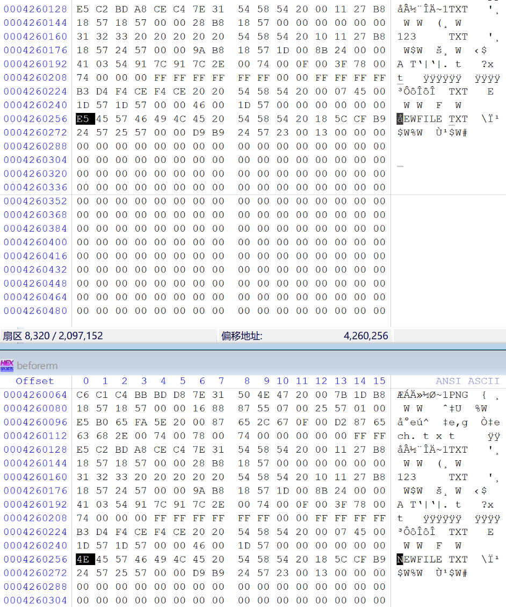
5. DATA数据区中的隐藏文件夹 **$RECYCLEBIN**（回收站） 对应的子目录中，新增**2个文件**的目录项（0x24号簇即起始扇区为8592的文件，记录了被删除文件的原位置；0x23号簇即起始扇区为8584的文件，记录了被删除文件的内容，其实，该文件的目录项中的文件起始簇号记录，同被删除文件的目录项中的文件起始簇号记录，文件的内容还在原地，没有被移动，也没有被修改）

6. DATA数据区中新增配置文件的内容，记录了**被删除文件的原位置**


注意：DATA数据区中被删除文件的内容**没有**被删除


### 清空回收站

在回收站中删除文件 newfile.txt


硬盘发生的变化：
1. 保留扇区中的FSINFO扇区中的**空闲簇数**和**下一个可用扇区**被修改，**空闲簇数增加**

2. FAT1表中**减少2个**FAT表项

3. 同理FAT2表（用于备份FAT1表）中减少2个FAT表项
4. 隐藏文件夹 **$RECYCLEBIN**（回收站） 对应的子目录中，相应2个文件各自的目录项的第1个字节被改为 **0xE5**


### 按Shift彻底删除文件

选中文件 shiftdel.txt，同时按 Shift 和 Del 键，彻底删除该文件


硬盘发生的变化：
1. 保留扇区中的FSINFO扇区中的**空闲簇数**和**下一个可用扇区**被修改，**空闲簇数增加**

2. FAT1表中**减少1个**FAT表项

3. 同理FAT2表（用于备份FAT1表）中减少1个FAT表项
4. DATA数据区的根目录中被删除文件的目录项的第1个字节被改为 **0xE5**


注意：DATA数据区中被删除文件的内容**没有**被删除


### 恢复删除的文件

想要恢复刚才彻底删除的文件 shiftdel.txt，该文件名符合"8.3"格式，所以仅有一个短文件名目录项
已知文件名和扩展名都是全大写存储的，即对应字符的十六进制为


[字符串在线转换十六进制UTF-8编码](http://tool.haooyou.com/code?group=convert&type=strToHex&charset=UTF-8)

又知道文件名的第1个字节已被覆盖成 0xE5，即要寻找的短文件目录项的前11个字节的十六进制为 E54849465444454C545854

用winhex搜索


之后提取文件内容的步骤同上面的 **3. 文件内容**

#### 补充说明

1. 如果文件在数据区中存放的位置比较靠后，文件起始簇号就会很大，那么文件目录项中记录文件起始簇号的高位两个字节就会有数据，当文件删除时，这两个字节会被清零，该文件的起始簇号值也就丢失了，这种删除的文件比较难恢复
2. 文件删除后，其FAT表中的簇链也会清零，如果文件有碎片，也就是不连续存放，这种删除的文件也比较难恢复
3. 文件删除后，虽然文件的内容并不会被清除，但其所占用的簇会释放，这些簇就很容易被其他文件进一步占用，这样就覆盖了被删除文件的数据，这种情况下的数据将无法恢复

### 按Shift彻底删除有高位簇的文件

[FAT32文件系统删除文件后目录项起始簇号高位清零的分析](https://www.dgxue.com/huifu/147.html)

之前删除的文件都没有高位簇

新增的文件的短文件名目录项中的高位簇是0的解决方法：
在这个分区里不断粘贴文件，把排在前面的簇占用完，直到文件对应的短文件名目录项中的高位簇不再是0

选中文件 精简版写在房价暴涨前-kkndme.pdf，同时按 Shift 和 Del 键，彻底删除该文件


硬盘发生的变化：
**1. 2. 3.** 和上面的 **按Shift彻底删除文件** 完全相同
**4.** 与上面的不同之处是 **目录项的高位簇信息被清空**


### 手工计算被清空的高位簇

如果按照上面的 **恢复删除的文件** 直接恢复，默认高位簇是0，并没有正确定位到文件内容信息，恢复出来的文件是损坏的

#### 穷举法

用穷举法，编一个程序，对起始簇号的高位依次穷举，然后验证

#### 寻找临近文件法

文件删除后，文件的创建时间、修改时间并不改变，所以可以寻找**与被删除的文件创建时间十分相近的文件**，参考它们的起始簇号高位的两个字节

确定高位簇后，之后提取文件内容的步骤同上

## 剪切文件

### 剪切文件到其他卷

硬盘发生的变化同 **按Shift彻底删除文件** 

### 剪切文件到当前卷的其他目录

从根目录剪切文件 newnew.txt 到 newnewishere 目录


硬盘发生的变化：
1. DATA数据区的根目录中被剪切文件的目录项的第1个字节被改为 **0xE5**

2. 文件夹 **newnewishere** 对应的子目录中，新增该文件的目录项（因为文件名符合"8.3"格式，所以仅有一个短文件名目录项）


注意：DATA数据区中被剪切文件的内容**没有**变化，新增的短文件名目录项的**文件起始簇号**，与被剪切文件对应的短文件名目录项（第1个字节为0xE5）的文件起始簇号**相同**

## 格式化分区

在计算机管理中格式化这个分区


硬盘发生的变化：
1. DBR中的**卷序列号**被修改

2. 保留扇区中的FSINFO扇区中的**空闲簇数**和**下一个可用扇区**被修改，**空闲簇数增加**

3. 同理，备份DBR中的卷序列号被修改
4. FAT1表被清空，恢复初始状态

5. 同理FAT2表（用于备份FAT1表）被清空，恢复初始状态
6. DATA数据区的**根目录**中的目录项被清空，恢复初始状态


注意：DATA数据区的**子目录**中的目录项还在，且文件的内容都在

# FAT32文件系统的修复

## 误格式化的修复

误格式化导致的变化见上面的 **格式化分区**

### 修复子目录

#### 寻找根目录下的子目录

已知 "."目录项 和 ".."目录项 两个目录项存在于子目录中
则可以通过寻找 "."目录项 或 ".."目录项 来确定子目录所在的簇号

但是用 "."目录项 找到的子目录**并不一定是根目录的直接子目录**
所以这里用 ".."目录项 找**根目录的直接子目录**，只需要将 ".."目录项 的起始簇号设置为0，因为 ".."目录项 有规定：**如果上级目录为根目录，则起始簇号被设置为0**

现在在winhex的空白扇区编辑一块大小为 32 字节的空间，填充 0x3F
然后修改如下，其中红色和蓝色部分表示上级目录所在的簇号为 3，其他颜色的部分的数值是固定不变的


然后把这 32 字节复制到 winhex的查找六十进制数值的功能，注意开启 0x3F 作为通配符的选项，即可查找到上级目录所在的簇号为 3 的所有子目录

注意**偏移计算**的设置

列表中显示找到的所有符合要求的 ".."目录项


之后别忘了把刚才编辑的扇区还原为空白

#### 检验子目录的簇号与扇区是否对应


簇号为 2 *65536 + 3 = 131075
计算对应扇区号为 (131075 -2) *8 + 8320 = 1056904

簇号与扇区对应，说明格式化**没有改变 簇大小、FAT表大小、保留区大小 等关键参数**

#### 在根目录中手动添加目录项

一个目录项模板如下

在其中的红色和绿色位置分别填入子目录真实的起始簇号的高位和低位，并添加到根目录中


windows的文件管理器中，分区的根目录中出现了我们添加的目录，但是无法打开，因为目录对应的FAT表的表项并没有添加


想要导出子目录，可以不添加目录对应的FAT表的表项，借助于winhex的恢复功能即可

#### 导出子目录

开启 **目录浏览器**


这里需要注意，如果选择打开**物理驱动器**，则在目录浏览器中看不到文件结构


要选择打开**逻辑驱动器**，可在目录浏览器中看到**文件结构**


在winhex的目录浏览器中，选中要恢复的目录，右键恢复


选择输出目录


可见恢复成功


### 手工提取根目录下的文件

每种文件都有特定的文件头，txt文档除外

#### 提取*.png图片文件

先在磁盘管理中，创建一个新的虚拟磁盘，接着初始化，然后新建一个FAT32分区，复制进去一些*.png图片文件，寻找*.png图片文件保存在数据区时，开头和结尾的标志

开头的标志为


结尾的标志为
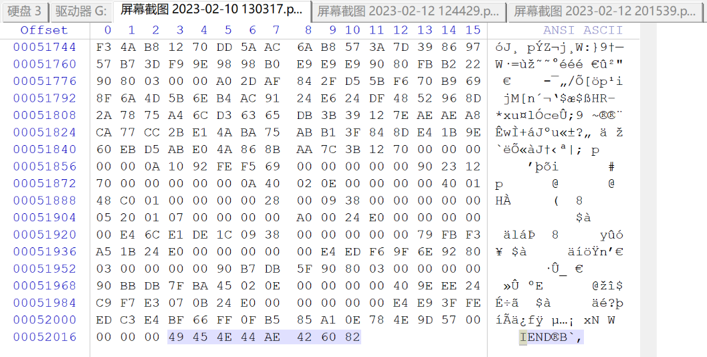

然后在要提取*.png图片文件的分区中，搜索*.png图片文件的头


没有找到


那就搜索*.png图片文件的尾


找到，那就继续向上寻找空白区，看这个*.png图片文件的头是什么样的


因为**4K对齐**，文件的起始扇区必定是 8320 + (8 * n)，即 8360 号扇区是这个*.png图片文件的**起始扇区**
发现这个这个*.png图片文件的前部数据已被覆盖，无法恢复


#### 提取*.txt文本文件

*.txt文本文件是没有文件头的，需要回忆出文本的部分内容，比如 resources

[字符串在线转换十六进制UTF-8编码](http://tool.haooyou.com/code?group=convert&type=strToHex&charset=UTF-8)


对应的ASCII码为 7265736F7572636573，搜索它


找到文件的起始扇区


找到文件的结束扇区


选中文件的全部十六进制数据，保存至新文件，注意文件的扩展名设置为txt，即*.txt文本文件提取成功


## DBR被破坏的恢复

清空DBR扇区，模拟DBR被破坏


分离VHD，然后再附加VHD（等同于刷新）

打不开这个FAT32分区，提示需要格式化

这里不要点 格式化硬盘，不然会破坏更多的内容

**提示需要初始化看 MBR**
**提示需要格式化看 DBR**

### 使用备份的DBR

因为FAT32分区的DBR有一个备份，在分区的6号扇区，只要把这个DBR找到并复制过来就可以，就不用手工修复了

备份DBR在 (128 +6) 号扇区


复制到DBR所在的 128 号扇区，并保存


经测试，成功修复

### 手工计算DBR参数

如果不能使用备份的DBR，就要手动创建DBR

DBR扇区的结构分为以下几个部分：跳转指令、OEM代号、BPB参数、引导代码和结束标志。同一文件系统类型的DBR扇区，除了BPB参数有部分不一样以外，其他各部分都是一样的，所以恢复DBR的方法是从同一文件系统类型的分区中复制一个DBR，然后再对BPB参数进行修改，就可以了

先在磁盘管理中，创建一个新的虚拟磁盘，接着初始化，然后新建一个FAT32分区，把它的DBR复制到要修复分区的DBR扇区（注意，只有确定了BPB的**隐含扇区数**参数，才能知道DBR扇区的扇区号）


BPB中只有需要修改以下几个参数：
1. 每簇扇区数（**红色**）
2. FAT表的起始扇区号（相对于DBR扇区的）（**绿色**）
3. 隐含扇区数（0到DBR扇区）（**蓝色**）
4. 文件系统的总扇区数（**橙色**）
5. FAT表的大小（**紫色**）

#### 隐含扇区数

已知当前分区在MBR硬盘中，查看0号扇区（即MBR主引导扇区）中的硬盘分区表DPT中的**分区的起始扇区号**


可得 隐含扇区数 为 **128**

#### 文件系统的总扇区数

已知当前分区在MBR硬盘中，查看0号扇区（即MBR主引导扇区）中的硬盘分区表DPT中的**分区的总扇区数**


可得 文件系统的总扇区数 为 **2091008**

#### FAT表的起始扇区号

搜索 **F8FFFF0F**（小端序）（FAT表的签名标志）


得到2个结果，分别是FAT1表和FAT2表的起始扇区，FAT表的起始扇区即是**FAT1表的起始扇区**


FAT表的**相对于硬盘的0号扇区**的起始扇区号为 4250
可得 FAT表的起始扇区号（相对于DBR扇区的） 为 (4250 **-128**) = **4122**

#### FAT表的大小


上面已知**FAT1表的起始扇区号**和**FAT2表的起始扇区号**，二者**相减**即可
可得 FAT表的大小 为 6285 - 4250 = **2035**

#### 每簇扇区数

##### 通过两个子目录计算

通过搜索 **"."目录项**，在数据区内，找到两个子目录
即搜索 **2E2020202020**


找到两个相近的


簇号为 3 的子目录的起始扇区号为 8328
簇号为 6 的子目录的起始扇区号为 8352
可得 每簇扇区数 为 **(8352 - 8328) / (6 - 3)** = **8**

##### 通过FAT表计算

如果**找不到两个子目录**，就只能用这个方法

> FAT表中**一个FAT表项**（除了第0项和第1项）对应数据区的**一个簇号**
> 计算FAT表有多少个表项（除了第0项和第1项），即对应数据区有多少个簇，然后用 **数据区的扇区数 除以 数据区的簇数**，即得 **每簇扇区数**

1. 之前计算得 **FAT表的大小** 为 6285 - 4250 = 2035（扇区数）（不包括备份的FAT表项）
2. 每个扇区占512字节，每个FAT表项占4字节，可计算得 **每个扇区的FAT表项数** 为 512 / 4 = 128
3. 可计算得 **全部FAT表项数** 为 (2035 * 128) **-2** = 260478（不包括备份的FAT表项）
4. **数据区的起始扇区号** 为 6285 + 2035 = 8320
5. 从DBR中可得 **隐含扇区数** 为 128，**文件系统的总扇区数** 为 2091008，可计算得 **数据区的结束扇区号** 为 128 + 2091008 -1 = 2091135
6. 可计算得 **数据区的总扇区数** 为 2091135 - 8320 +1 = 2082816
7. 可计算得 **每簇扇区数** 为 2082816 / 260478 = 7.99613 ≈ **8**（每簇扇区数只能是2的n次幂：1、2、4、8、16、32、64、128）

BPB参数修改后，DBR扇区如下


经测试，成功修复

## FAT表被破坏的修复

之前在误格式化的修复中的 **修复子目录** 中，在 **在根目录中手动添加目录项** 后，就直接借助于winhex的恢复功能 **导出子目录**，没有修复被破坏的FAT表，所以windows的文件管理器中，分区的根目录中出现了我们添加的目录，但是无法打开


这里我们修复被破坏的FAT表，使这个子目录可在windows的文件管理器中打开


---
到P29


---

而删除的时候并不会真正删除文件簇，只是会修改文件属性，将文件标志逻辑删除，所以我们可以很轻易的恢复它，但是这并不意味着该文件不会被永久删除，当存储空间不够用或者是其他情况的时候，文件就可能会被物理删除，这时文件就无法恢复了。

随着磁盘大小的提升（200M以上），使用链表作为结构的文件系统系统会急速下降，特别是面对大文件时，就显得力不从心。

你可能也已经注意到了，FAT32的写入操作是没有任何保护机制的，也就是说，如果FAT32在向一个文件里面写数据的时候，如果写入已经开始但是还没有完成的时候断电了，那么此时的数据就处于一个非常尴尬的状态，一半是新数据，一半是旧数据，此时文件可能就被毁坏了，如果凑巧这个文件是系统文件，那会导致灾难性的后果。

Ext4和NTFS都会使用日志，来确保写入的原子性，保证数据要么是更新前的状态，或者是更新完成后的状态，而不会处于中间状态。


