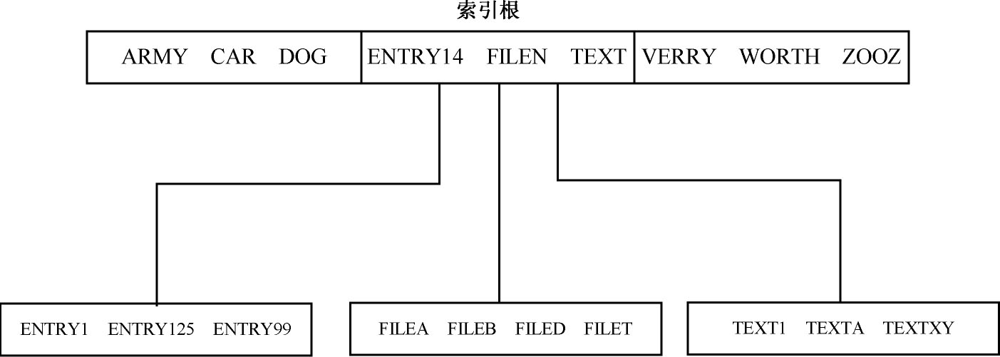
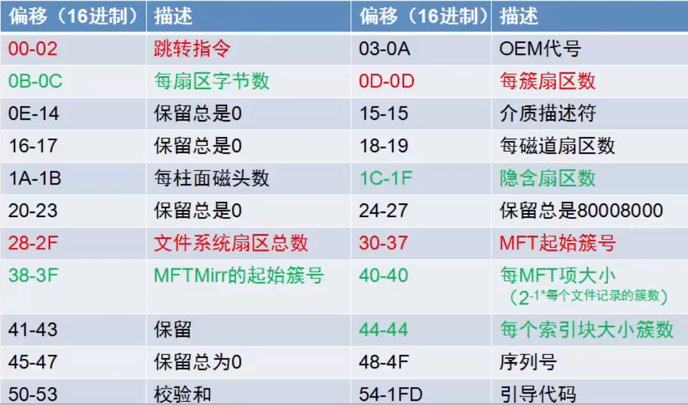
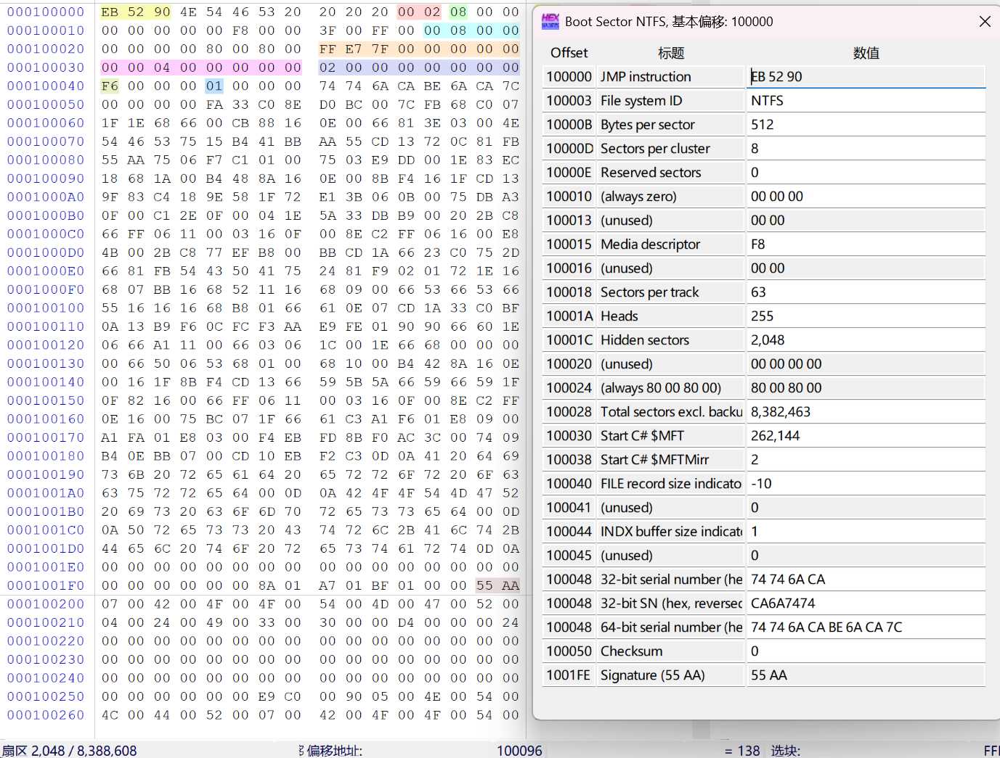
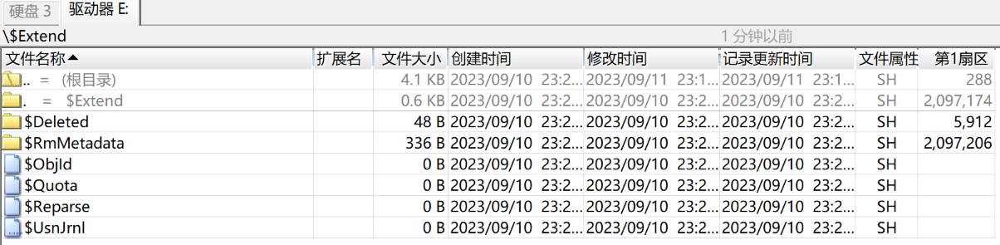
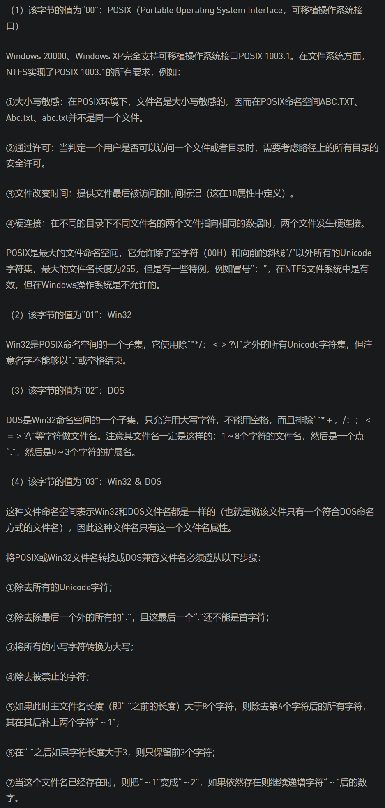
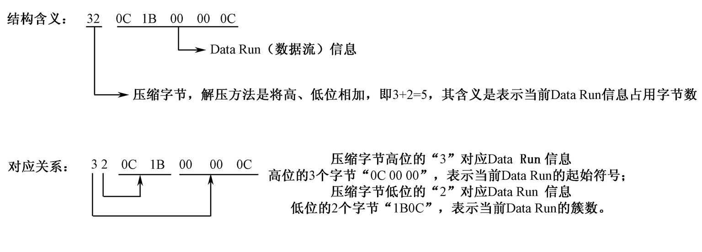

# NTFS文件系统

[NTFS文件系统基本介绍](https://www.dgxue.com/huifu/155.html)

NTFS 意思是Windows NT的文件系统，它的优点是安全性和稳定性好，能自动记录与文件的变动操作，系统不易崩溃，具有文件修复能力，出现错误能迅速修复，是目前Win系统主要采用的文件系统，缺点是微软的Win系统独家支持，其他系统如果要访问 NTFS 格式设备中的文件数据，需要采取一些特别的技术手段

NTFS利用**B+树**文件管理方法来跟踪文件在磁盘上的位置。这种技术比在FAT文件系统中使用的链链表技术具备更多的优越性。在NTFS中文件名顺序存放，因而查找速度更快。如果卷比较大，B+树会在宽度上增长，而不会在深度上增长，因此，当目录增大时，NTFS并没有显示出明显的性能下降

B+树的数据结构使查找一个条目所需的磁盘访问次数最少，如下图所示

在主文件表中，目录的索引根属性包含一些文件名，它们是到达B+树的第二层的索引。在这个索引根属性中的每一个文件名都包含了一个指向索引缓冲区的指针。这个索引缓冲区中包含有一些文件名，它们位于索引根属性中的文件的名字之前。通过这种位置关系，可使它们排在索引缓冲区中的那个文件之前。例如，filen是B+树中第一层中的一个条目，索引缓冲区中可包含这样一些条目：filea、fileb、filec等。利用这些索引缓冲区，NTFS可以进行折半查找，从而获得更快的文件查找速度

[B+树看这一篇就够了（B+树查找、插入、删除全上）](https://zhuanlan.zhihu.com/p/149287061)

## NTFS文件系统的组成

NTFS文件系统使用了**逻辑簇号**（Logical Cluster Number，**LCN**）和**虚拟簇号**（Virtual Cluster Number，**VCN**）对卷进行管理

**逻辑簇号**（LCN）是**对卷的第一个簇到最后一个簇进行编号**，只要知道LCN号和簇的大小以及NTFS卷在物理磁盘中的起始扇区（绝对扇区）就可以对簇进行定位，而这些信息在NTFS卷的引导扇区中可以找到（BPB参数），在系统底层也是用这种方法对文件的簇进行定位的。找到簇在磁盘中的物理位置的计算公式是：
**每簇扇区数 * 逻辑簇号 + 卷的隐含扇区数（卷之前的扇区总数）= 簇的起始绝对扇区号**

**虚拟簇号**（VCN）则是**将特定文件的簇从头到尾进行编号**，这样做的原因是方便系统对文件中的数据进行引用，VCN并不要求在物理上是连续的，要确定VCN的磁盘上的定位需先将其**转换**为LCN

和FAT文件系统一样，NTFS的**第一个扇区**为引导扇区，即**DBR扇区**。其中有NTFS分区的引导程序和一些BPB参数，系统根据这些BPB参数来得到分区的重要信息。如果没有这些信息，分区将不能正常使用

在分区的第一个扇区（引导扇区DBR）后是15个扇区的NTLDR区域，这16个扇区共同构成\$Boot文件。在NTLDR后（但不一定是物理上相连的）是主文件表（Master File Table，**MFT**）区域，**主文件表**由文件记录构成，每个文件记录占2个扇区，**文件记录**简称为**FR**（File Record）。在FAT文件系统中是通过FAT表和文件目录项存储文件数据和记录文件的文件名、扩展名、建立时间、访问时间、修改时间、文件属性、文件大小、文件在磁盘中所占用的簇等信息进行管理的，而在NTFS文件系统中这些信息被称为**属性**，包括**文件的内容在NTFS中也称为属性**，各种属性被放入文件记录中进行管理。当一个属性太大，文件记录中存放不下时，就会分配多个文件记录进行存放；而当一个文件非常小时，可能这个文件的所有属性都包含在一个文件记录中了，甚至包括这个文件的数据，也会作为属性存放在其文件记录中，这样做的好处是节约了磁盘空间并且提高了文件访问效率

NTFS文件系统的主文件表（MFT）中还记录了一些非常重要的系统数据，这些数据被称为元数据（metadata）文件，简称为"**元文件**"，其中包括了用于文件定位和恢复的数据结构、引导程序数据及整个卷的分配位图等信息。NTFS文件系统将这些数据都当作文件进行管理，这些文件用户是不能访问的，它们的文件名的第一个字符都是"\$"，表示该文件是隐藏的。在NTFS文件系统中，这样的文件主要有**16个**：
1. MFT本身（\$MFT）
2. MFT镜像（\$MFTMirr）
3. 日志文件（\$LogFile）
4. 卷文件（\$Volume）
5. 属性定义表（\$AttrDef）
6. 根目录（\$Root）
7. 位图文件（\$Bitmap）
8. 引导文件（\$Boot）
9. 坏簇文件（\$BadClus）
10. 安全文件（\$Secure）
11. 大写文件（\$UpCase）
12. 扩展元数据目录（\$Extend）
13. 重解析点文件（\$Extend \ \$Reparse）
14. 变更日志文件（\$Extend \ \$UsnJrnl）
15. 配额管理文件（\$Extend \ \$Quota）
16. 对象ID文件（\$Extend \ \$ObjId）
    
这16个元数据文件总是占据着MFT的前16项记录，在这16项以后就是用户建立的文件和文件夹的记录了

每个文件记录在主文件表中占据的磁盘空间一般为1KB，也就是两个扇区，NTFS文件系统分配给主文件表的区域大约占据了磁盘空间的12.5％，剩余的磁盘空间用来存放其他元文件和用户的文件

注意：
1. **元文件**在图中只体现了一部分，没有画完整，并且除了 \$Boot 文件以外，其他元文件的**位置不是固定的**，例如 \$MFT 文件也可以在 \$MFTMirr 文件之后
2. 在NTFS文件系统所在分区的**最后一个扇区**是DBR的备份，但该扇区并**不属于**NTFS文件系统

## NTFS文件系统的DBR

[NTFS文件系统引导扇区分析](https://www.dgxue.com/huifu/157.html)

NTFS文件系统的引导扇区是\$Boot的第一个扇区，它的结构与FAT文件系统的DBR类似，所以习惯上也称该扇区为DBR扇区。DBR扇区在操作系统的引导过程起着非常重要的作用，如果这个扇区遭到破坏，系统将不能正常启动

NTFS文件系统的DBR扇区与FAT文件系统的DBR扇区结构一样，也包括跳转指令、OEM代号、BPB参数、引导程序和结束标志

注意：
1. **隐含扇区**又称**隐藏扇区**，上图中的**隐藏扇区数**是指本分区之前使用的扇区数，该值与分区表中所描述的该分区的起始扇区号一致。对于主磁盘分区来讲，是**MBR**到该分区DBR之间的扇区数；对于扩展分区中的逻辑驱动器来讲，是其**EBR**到该分区DBR之间的扇区数
2. **扇区总数**是指分区的总扇区数。NTFS的BPB中记录的分区大小比分区表中记录的**少一个扇区**，因为分区最后一个扇区留给DBR备份使用了
3. **MFT起始簇号**指的是**逻辑簇号**（LCN），转换为绝对扇区号的算法是：**(每簇扇区数 * 逻辑簇号) + 卷的隐藏扇区数 = 簇的起始绝对扇区号**
4. **每MFT项大小**用**每个文件记录的簇数**计算出。注意该参数为**带符号数**，当其是**正数**时，该参数表示其本意；当其是**负数**时，说明**每个文件记录的大小要小于每簇扇区数**，在这种情况下，**文件记录的大小用字节数表示**。例如，下图的DBR中该参数值为"0xF6"，换算为十进制等于"-10"，所以每个文件记录的大小是2 ^(-1 x -10) = 2 ^10 = 1024**字节**
5. **每索引块大小**的计算方法同**每MFT项大小**的计算方法

## NTFS文件系统的全部元文件介绍

将一个分区格式化为NTFS后，格式化程序会往该分区中写入很多重要的系统信息，这些系统信息在NTFS文件系统中称为元文件。这些元文件用户是不能访问的，它们的文件名的第一个字符都是"\$"，表示该文件是隐藏的，用户无法访问和修改

用winhex打开这个NTFS分区（不是打开这个硬盘），目录浏览器中就能看到NTFS文件系统的元文件

| 元文件                  | 功能                                                                                                                                 |
| ----------------------- | ------------------------------------------------------------------------------------------------------------------------------------ |
| \$MFT                   | 主文件表，每个文件的信息都记录其中                                                                                                   |
| \$MFTMirr               | 主文件表的部分镜像                                                                                                                   |
| \$LogFile               | 事务型日志文件                                                                                                                       |
| \$Volume                | 卷文件，记录卷标等信息                                                                                                               |
| \$AttrDef               | 属性定义列表文件                                                                                                                     |
| \$Root                  | 根目录文件，管理根目录                                                                                                               |
| \$Bitmap                | 位图文件，记录了分区中簇的使用情况                                                                                                   |
| \$Boot                  | 引导文件，记录了用于系统引导的数据情况                                                                                               |
| \$BadClus               | 坏簇列表文件                                                                                                                         |
| \$Secure                | 安全文件，用来控制文件或目录的访问权限                                                                                               |
| \$UpCase                | 大小写字符转换表文件                                                                                                                 |
| \$Extend                | 扩展元数据目录                                                                                                                       |
| \$Extend \ \$Reparse    | 重解析点文件                                                                                                                         |
| \$Extend \ \$UsnJrnl    | 加密日志文件                                                                                                                         |
| \$Extend \ \$Quota      | 配额管理文件                                                                                                                         |
| \$Extend \ \$ObjId      | 对象ID文件                                                                                                                           |
| \$Extend \ \$RmMetadata | 事务元数据，以Transaction的形式记录最近一段时间文件系统的修改，如果系统突然重启，可以按照这些Transaction进行恢复（win7以上系统才有） |

## 元文件 \$MFT

$MFT文件在文件系统中的存放地址，可以通过DBR的BPB中的"\$MFT起始簇号"参数获得

已知**每簇扇区数**为 8，**隐藏扇区数**为 2048，**MFT起始簇号**为 262144
则可计算**MFT的绝对起始扇区号** = (8 * 262144) + 2048 = 2099200
而**MFT相对于DBR的起始扇区号** = 8 * 262144 = 2097152

元文件 \$MFT 中有若干文件记录 FR

从此**硬盘**的视角：

从此**分区**的视角：

上图中，红色线框内是一个文件记录的**文件记录头**，绿色线框内是一个文件记录的**属性列表**

\$MFT的特点：
- 以明文"FILE"开头
- 每个MFT项都占用1024字节，即**2个扇区**
- NTFS文件系统中的**所有文件**，都有一个MFT项记录相应的数据
- 每个MFT项占用的2个扇区，最后两个字节是一个**修正值**，这个修正值和MFT项中的**更新序列号**相同，如果系统发现不同，就会认为这个MFT项错误，会把开头标志明文"FILE"改成"BAAD"

### 文件记录 FR

[NTFS文件系统文件记录分析](https://www.dgxue.com/huifu/159.html)

文件记录由两部分构成，一部分是**文件记录头**，另一部分是**属性列表**，最后结尾是**4个"FF"**

在同一系统中，文件记录头的长度和具体偏移位置的数据含义是不变的，而属性列表是可变的，其不同的属性有着不同的含义

上图中是一条文件记录

#### 文件记录头

文件记录头的结构为：

通过模板管理器查看：

##### 参数详细分析

更新序列号的偏移：
- 表示**更新序列号**相对于当前扇区的位置
- 单位是**字节**
- 本例中的更新序列号为绿线标出的位置 

更新序列号的个数：
- 表示在当前的文件记录中，有几个地方记录了更新序列号
- 本例中更新序列号的个数为 3，即**当前的文件记录所占用的2个扇区各自的末尾2个字节**和更新序列号的偏移指示的**第1个扇区的第48~49字节**记录了更新序列号，如图绿线标出的位置 

日志序列号：
- 每次记录被修改都将导致日志文件序列号 \$LogFile Sequence Number（LSN）发生变化（序列号加1）

序列号：
- 序列号即 Sequence Number（SN），用于记录主文件表记录被重复使用的次数

硬连接数：
- 硬连接数（Hard Link Count），即有多少目录指向该文件

第一个属性的偏移地址：
- 表示**第一个属性的开头**相对于当前扇区的位置
- 单位是**字节**
- 本例中的第一个属性的开头为绿线标出的位置 

MFT项的逻辑长度：
- 文件记录的实际大小
- 单位是**字节**
- 值是 8的整数倍

MFT项的物理长度：
- 文件记录的分配大小
- 单位是**字节**

基本文件记录中的文件索引号：
- 基本文件记录在此的值总为0。如果不为0，则是一个主文件表的文件索引号，指向所属的基本文件记录中的文件记录号。在基本文件记录中包含有扩展文件记录的信息，存储在"属性列表ATTRIBUTE_LIST"属性中

下一个属性ID：
- 当增加新的属性时，将该值分配给新属性，然后该值增加，如果MFT记录重新使用，则将它置0，第一个实例总是0

MFT项的索引号：
- 从0开始编号

更新数组1、更新数组2：
- **更新数组1** 对应当前文件记录**第1个扇区**的末尾2个字节，**更新数组2** 对应当前文件记录**第2个扇区**的末尾2个字节
- 文件记录所在**扇区的末尾2个字节**一定存放着**更新序列号**，但如果文件记录足够长，需要用到这个位置时，不能将更新序列号覆盖，而是把原先要写到这个位置的数据，存放到更新数组中 

#### 文件属性

在NTFS文件系统中所有与文件相关的数据结构均被认为是属性，包括文件的内容。文件记录是一个与文件相对应的文件属性数据库，它记录了文件的所有属性。每个文件记录中都有多个属性，他们相对独立，有各自的类型和名称。每个属性都由**两部分**组成，既**属性头**和**属性体**。属性头的前4个字节为**属性类型**，属性的顺序是按照属性类型**从小到大**依次排列的

另外，属性有**常驻**与**非常驻**之分：
1. 当一个文件很小时，其所有属性体都可以存放在文件记录中，该属性就称为**常驻属性**
2. 如果某个文件很大，1KB的文件记录无法记录所有属性时，则文件系统会在\$MFT元文件之外的区域（也称**簇流**）存放该文件的其他文件记录属性，这些存放在非\$MFT元文件内的文件记录属性就称为**非常驻属性**

##### 属性类型（属性头的前4个字节）

| 属性类型（Little-Endian） | 属性类型名              | 属性描述                                                                                                                                                                                     |
| ------------------------- | ----------------------- | -------------------------------------------------------------------------------------------------------------------------------------------------------------------------------------------- |
| 10 00 00 00               | \$STANDARD_INFORMATION  | 标准信息：包括一些基本文件属性，如只读、系统、存档；时间属性，如文件的创建时间和最后修改时间；有多少目录指向该文件（即其硬连接数（hard link count））                                        |
| 20 00 00 00               | \$ATTRIBUTE_LIST        | 属性列表：当一个文件需要多个文件记录时，用来描述文件的属性列表                                                                                                                               |
| 30 00 00 00               | \$FILE_NAME             | 文件名：用Unicode字符表示的文件名，由于MS-DOS不能识别长文件名，所以NTFS系统会自动生成一个8.3文件名                                                                                           |
| 40 00 00 00               | \$OBJECT_ID             | 对象ID：一个具有64字节的标识符，其中最低的16字节对卷来说是唯一的（链接跟踪服务为外壳快捷方式，即OLE链接源文件赋予对象ID；NTFS提供的API是直接通过这些对象的ID而不是文件名来打开文件的）       |
| 50 00 00 00               | \$SECURITY_DESCRIPTOR   | 安全描述符：这是为向后兼容而保留的，主要用于保护文件以防止没有授权的访问，但Windows 2000/XP中已将安全描述符存放在\$Secure元数据中，以便于共享（早期的NTFS将其与文件目录一起存放，不便于共享） |
| 60 00 00 00               | \$VOLUME_NAME           | 卷名（卷标识）：该属性仅存在于\$Volume元文件中                                                                                                                                                |
| 70 00 00 00               | \$VOLUME_INFORMATION    | 卷信息：该属性仅存在于\$Volume元文件中                                                                                                                                                        |
| 80 00 00 00               | \$DATA                  | 文件数据：该属性为文件的数据内容                                                                                                                                                             |
| 90 00 00 00               | \$INDEX_ROOT            | 索引根                                                                                                                                                                                       |
| A0 00 00 00               | \$INDEX_ALLOCATION      | 索引分配树节点                                                                                                                                                                                    |
| B0 00 00 00               | \$BITMAP                | \$MFT文件和索引的位图                                                                                                                                                                                         |
| C0 00 00 00               | \$REPARSE_POINT         | 重解析点点                                                                                                                                                                                     |
| D0 00 00 00               | \$EA_INFORMATION        | 扩充属性信息                                                                                                                                                                                 |
| E0 00 00 00               | \$EA                    | 扩充属性                                                                                                                                                                                     |
| F0 00 00 00               | \$PROPERTY_SET          | 早期的NTFS v1.2中才有的属性                                                                                                                                                                        |
| 00 10 00 00               | \$LOGGED_UTILITY_STREAM | EFS加密属性：该属性主要用于存储实现EFS加密的有关加密信息，如合法用户列表、解码密钥等                                                                                                         |
　
##### 属性头

###### 常驻属性的属性头

图中底色浅一些的（红色下划线）是**属性头**，底色深一些的（绿色下划线）是**属性体**

属性头（没有属性名）的结构：

红色下划线的是属性头

参数详细分析：

属性名的长度：
- 此处为0，表示该属性没有属性名
- 若此处非0，表示属性名的**字符数**（属性名为**Unicode编码**，1个字符占**2字节**）

属性名的偏移：
- 对于没有属性名的属性，该值无意义
- 若有属性名，可通过属性名的字节数和偏移定位属性名，属性名存放在**属性体前面**

压缩、加密、稀疏标志：
- "0000H"表示不是压缩、加密属性，只有非常驻的80H属性（数据属性）此处才可能非"0000H"

没有属性名和有属性名的对比：

###### 非常驻属性的属性头

图中底色浅一些的（红色下划线）是**属性头**，底色深一些的（绿色下划线）是**属性体**

属性头（没有属性名）的结构：

红色下划线的是属性头

参数详细分析：

属性体的起始虚拟簇号（VCN）：

属性体的结束虚拟簇号（VCN）：

簇流运行的偏移地址：

---
待完成

没有属性名和有属性名的对比：

##### 属性体

###### 10H（\$STANDARD_INFORMATION）属性体

10H类型属性，即\$STANDARD_INFORMATION属性，它总是**常驻**属性。它包含文件的一些**基本信息**，如文件的传统属性、文件的创建时间和最后修改时间、有多少目录指向该文件（即其硬连接数）等

10H属性体的结构：

绿色下划线的是属性体

通过模板管理器查看：

参数详细分析：

文件时间：
- 用长达64位来表示文件的某种时间（含日期）
- 时间的格式为 Windows FILETIME 

传统文件属性：
- 属性是可以组合的，即转化成二进制，看对应的二进制位
- 具体的含义如下图 

###### 20H（\$ATTRIBUTE_LIST）属性体

20H属性体的结构：

---
略

###### 30H（\$FILE_NAME）属性体（重要）

30H类型属性，即\$FILE_NAME属性，该属性用于存储**文件名**，它总是**常驻**属性。它最少68字节，最大578字节，可容纳最大255个Unicode字符的文件名长度

30H属性体的结构：

绿色下划线的是属性体

通过模板管理器查看：

参数详细分析：

父目录的文件参考号：
- 前6个字节是父目录的文件记录号，本例中为 5，当前文件记录的索引为 0，要找到索引为 5 的文件记录，只需相对于当前位置向后跳转 10 个扇区

文件时间：
- 和10H属性体中的文件时间是一样的

文件大小：
- 单位是**字节**

标志：
- 和10H属性体中的传统文件属性是一样的
- 具体的含义如下图 

文件名长度（字符数L）：
- 最大取值 0xFF，即**最大255个Unicode字符**的文件名长度

文件命名空间：
- 指出这个文件的文件名属于哪一种名字空间。为了兼容旧的文件系统，NTFS系统给文件名分配了一个**短的DOS兼容文件名**给每个具有非DOS兼容文件名的文件
- 具体的含义如下图 

文件名：
- **Unicode编码**，一个字符占**2字节**

###### 40H（\$OBJECT_ID）属性体

40H属性体的结构：

---
略

###### 50H（\$SECURITY_DESCRIPTOR）属性体

###### 60H（\$VOLUME_NAME）属性体

###### 70H（\$VOLUME_INFORMATION）属性体

###### 80H（\$DATA）属性体（重要）

80H类型属性，即\$DATA属性，该属性容纳着**文件内容**
该属性没有最大最小限制，最小情况是该属性为常驻属性，可以不占用除MFT以外的空间
若文件内容超过常驻属性可容纳的大小，则变成非常驻属性
1. **常驻**80H属性的属性体是 **文件内容**
2. **非常驻**80H属性的属性体是 **簇流运行**列表

- **常驻**80H属性的属性体（文件内容）的结构：

绿色下划线的是属性体（文件内容）

- **非常驻**80H属性的属性体（簇流运行列表）的结构：

图中的 数据流（Data Run）（Run List） 也叫 簇流

簇流：存放数据的区域
簇流运行：记录簇流具体在文件系统哪个位置的代码

单个**簇流运行**的结构：

这里我们找到的一个簇流运行为 31 40 00 00 04

通过 簇流运行 寻找 存放在MFT以外的文件内容

其中：
- 簇流的**簇数**为 0x40，对应十进制为 64
- 簇流的**起始簇号**为 0x040000，对应十进制为 262144

在打开的**逻辑驱动器**（不是**物理驱动器**）中，可以跳转到对应簇

注意：
- 如果后面是**0x00**，那么这个簇流运行**结束**，否则表示还有簇流运行
- 存在**多个簇流运行**时，下一个簇流的**起始簇号**是**相对**于这个簇流的起始簇号
- 如果下个簇流的**起始簇号**是**负数** ，那么表示下个簇流在这个簇流的**前面**

###### 90H（$INDEX_ROOT）属性体（重要）

90H类型属性，即\$INDEX_ROOT，是**索引根属性**（**文件夹属性**），该属性是实现NTFS的B+树索引的根节点，它总是**常驻**属性。该属性没有最大最小长度限制

90H属性体的结构：

1. 红色框中是 有属性名的**属性头**（不属于属性体）
2. 绿色框中是 **索引根**
3. 蓝色框中是 **索引头**
4. 黄色框中是 若干**索引项**

- **索引根**的结构：

红色下划线的是属性体中的**索引根**

参数详细分析：

---
待完成

- **索引头**的结构：

红色下划线的是属性体中的**索引头**

参数详细分析：

第一个索引项的偏移：
- 相对于当前的索引头的偏移
- 单位是**字节**

索引项的总大小：
- 注意这里应该是**索引头加索引项**的总大小
- 单位是**字节**

- **索引项**的结构：

P13 10min

###### A0H（NDEX_ALLOCATION）属性体（重要）

###### B0H（$BITMAP）属性体

###### C0H（$REPARSE_POINT）属性体

###### D0H（$EA_INFORMATION）属性体

###### E0H（$EA）属性体

###### 100H（$LOGGED_UTILITY_STREAM）属性体

###### 

---
---

---

在NTFS文件系统中，磁盘上的所有数据都是以文件的形式出现的，即使是文件系统的管理信息也是以一组文件的形式存储的，即元文件。16个元文件中主文件表（\$MFT）是一个非常重要的元文件，它由文件记录（FR）构成，**每个文件记录**占用**2个扇区**

每个文件都有一个文件记录，包括元文件本身，而主文件表（\$MFT）就是专门用来存储文件记录的一个元文件，在\$MFT中**前16个文件记录**总是元文件的纪录

系统通过$MFT来确定文件在磁盘上的位置以及文件的所有属性，所以$MFT是非常重要的。系统为了防止$MFT出现过多的碎片，在它周围保留了一个缓冲区。当其他的磁盘空间满的时候缓冲区里才会产生新的文件。这个缓冲区的大小是可调的，可以是磁盘空间的12.5％、25％、37.5％ 或50％，每当其余磁盘空间变满时，缓冲区大小减半。

由于$MFT文件本身的重要性，为了确保文件系统结构的可靠性，系统专门为它准备了一个镜像文件（$MFTMirr），也就是$MFT中的第2个记录。不过这并不是$MFT的完整镜像，而是一个小部分镜像，一般只镜像$MFT中的前四个文件记录。

$MFT中前16个文件记录总是元文件的记录，并且这16个文件记录的顺序是固定的，下面对这16个记录简单做一个介绍：

第1个记录就是$MFT自身的记录，也就是说$MFT首先对自己进行管理。

第2个记录是$MFTMirr的记录，也就是$MFT前4个文件记录的镜像。

第3个记录是日志文件（$LogFile）的记录，该文件是NTFS为实现可恢复性和安全性而设计的。当系统运行时，NTFS就会在日志文件中记录所有影响NTFS卷结构的操作，包括文件的创建和改变目录结构的命令，从而可在系统失败时能够恢复NTFS卷。

第4个记录是卷文件（$Volume）的记录，它包含卷名、NTFS的版本和一个标明该磁盘是否损坏的标志位，NTFS文件系统以此决定是否需要调用Chkdsk程序来进行修复。

第5个记录是属性定义表（$AttrDef，attribute definition table）的记录，其中存放着卷所支持的所有文件属性，并指出它们是否可以被索引和恢复等。

第6个记录是根目录（$ROOT）的记录，其中保存着该卷根目录下的所有文件和目录的索引。在访问一个文件后，NTFS就保留该文件的MFT引用，第二次就能够直接访问该文件。

第7个记录是位图文件（$Bitmap）的记录，NTFS卷的簇使用情况都保存在这个位图文件中，其中每一位（bit）代表卷中的一簇，标识该簇是空闲还是已分配。由于该文件可以很容易被扩大，所以，NTFS的卷可以很方便地动态扩大，而FAT格式的文件系统由于涉及FAT表的变化，所以不能随意对分区大小进行调整。

第8个记录是引导文件（$Boot）的记录，该文件中存放着操作系统的引导程序代码。该文件必须位于特定的磁盘位置才能够正确地引导系统，一般都是位于卷的最前面。

第9个记录是坏簇文件（$BadClus）的记录，它记录着该卷中所有损坏的簇号，防止系统对其进行分配使用。

第10个记录是安全文件（$Secure）的记录，它存储着整个卷的安全描述符数据库。NTFS文件和目录都有各自的安全描述符，为节省空间，NTFS将文件和目录的相同描述符存放在此公共文件中。

第11个记录为大写文件（$UpCase，upper case file）的记录，该文件包含一个大小写字符转换表。

第12个记录是扩展元数据目录（$Extended metadata directory）的记录。

第13个记录是重解析点文件（$Extend\$Reparse）的记录。

第14个记录是变更日志文件（$Extend\$UsnJrnl）的记录。

第15个记录是配额管理文件（$Extend\$Quota）的记录。

第16个记录是对象ID文件（$Extend\$ObjId）的记录。

第17～23记录是系统保留的记录，暂时不用，用于将来扩展。

从第24个记录开始存放用户文件的记录。

---

$MFT的文件记录在物理上是连续的，并且从0开始编号。$MFT的前16个文件记录总是元文件的，并且顺序是固定不变的。

## 元文件 \$MFTMirr

## 元文件 \$LogFile

## 元文件 \$Volume

## 元文件 \$AttrDef

## 元文件 \$Root

## 元文件 \$Bitmap

## 元文件 \$Boot

## 元文件 \$BadClus

## 元文件 \$Secure

## 元文件 \$UpCase

## 元文件 \$Extend

## 元文件 \$ObjId

## 元文件 \$Quota

## 元文件 \$Reparse

## 元文件 \$UsnJrnl

--- 
到P13

---
待完成
P7 9min 解析簇流运行，手工提取文件
P8 手工提取多簇流
P9 

# NTFS文件系统的使用

[NTFS 手工文件恢复](https://www.jianshu.com/p/bf54a28a0dbb)

## 创建新文件

## 删除文件

## 剪切文件

## 格式化分区

# NTFS文件系统的修复

P11
用文件名查找，要转换成Unicode编码

P12 5min 
提取文件内容

