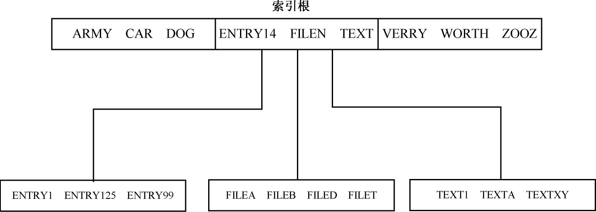
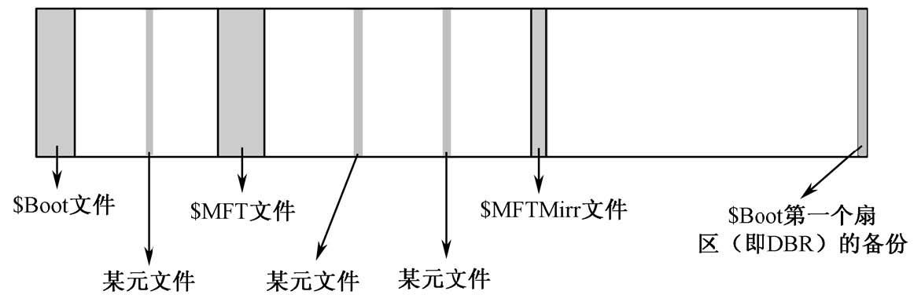
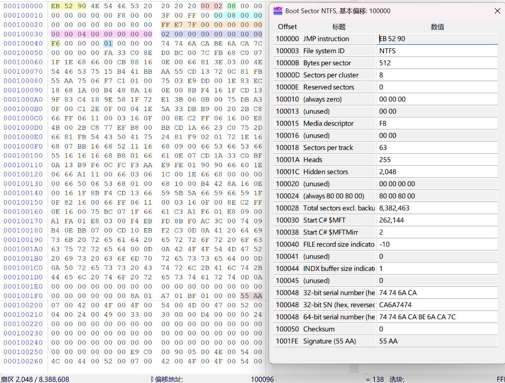
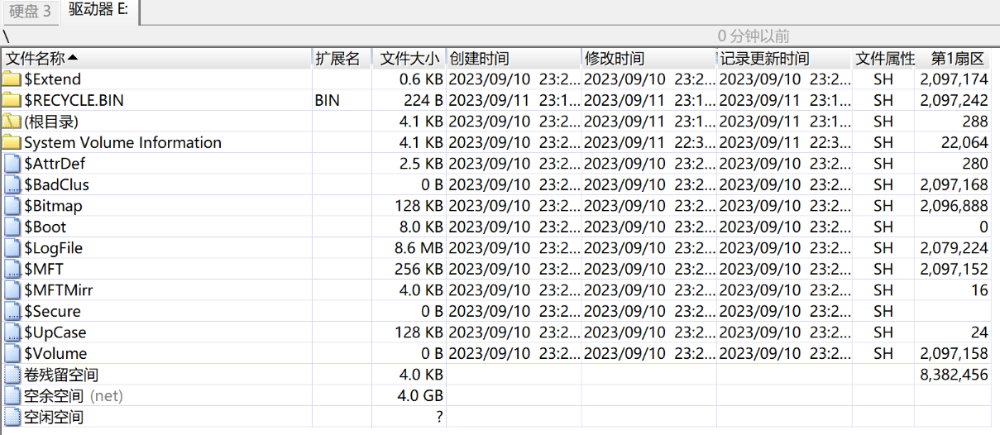
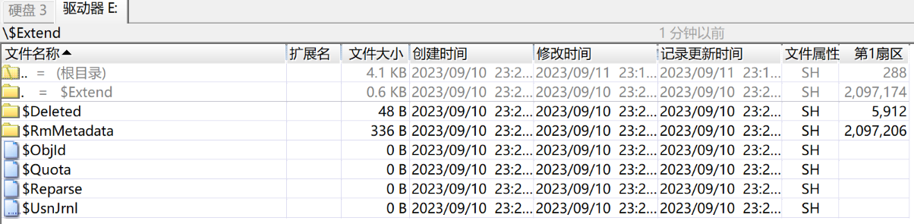

# NTFS文件系统

[NTFS文件系统基本介绍](https://www.dgxue.com/huifu/155.html)

NTFS 意思是Windows NT的文件系统，它的优点是安全性和稳定性好，能自动记录与文件的变动操作，系统不易崩溃，具有文件修复能力，出现错误能迅速修复，是目前Win系统主要采用的文件系统，缺点是微软的Win系统独家支持，其他系统如果要访问 NTFS 格式设备中的文件数据，需要采取一些特别的技术手段

NTFS利用**B+树**文件管理方法来跟踪文件在磁盘上的位置。这种技术比在FAT文件系统中使用的链链表技术具备更多的优越性。在NTFS中文件名顺序存放，因而查找速度更快。如果卷比较大，B+树会在宽度上增长，而不会在深度上增长，因此，当目录增大时，NTFS并没有显示出明显的性能下降

B+树的数据结构使查找一个条目所需的磁盘访问次数最少，如下图所示

在主文件表中，目录的索引根属性包含一些文件名，它们是到达B+树的第二层的索引。在这个索引根属性中的每一个文件名都包含了一个指向索引缓冲区的指针。这个索引缓冲区中包含有一些文件名，它们位于索引根属性中的文件的名字之前。通过这种位置关系，可使它们排在索引缓冲区中的那个文件之前。例如，filen是B+树中第一层中的一个条目，索引缓冲区中可包含这样一些条目：filea、fileb、filec等。利用这些索引缓冲区，NTFS可以进行折半查找，从而获得更快的文件查找速度

[B+树看这一篇就够了（B+树查找、插入、删除全上）](https://zhuanlan.zhihu.com/p/149287061)

## NTFS文件系统的组成

NTFS文件系统使用了**逻辑簇号**（Logical Cluster Number，**LCN**）和**虚拟簇号**（Virtual Cluster Number，**VCN**）对卷进行管理

其中逻辑簇号（LCN）是**对卷的第一个簇到最后一个簇进行编号**，只要知道LCN号和簇的大小以及NTFS卷在物理磁盘中的起始扇区（绝对扇区）就可以对簇进行定位，而这些信息在NTFS卷的引导扇区中可以找到（BPB参数），在系统底层也是用这种方法对文件的簇进行定位的。找到簇在磁盘中的物理位置的计算公式是：
**每簇扇区数 * 逻辑簇号 + 卷的隐含扇区数（卷之前的扇区总数）= 簇的起始绝对扇区号**

而虚拟簇号（VCN）则是**将特定文件的簇从头到尾进行编号**，这样做的原因是方便系统对文件中的数据进行引用，VCN并不要求在物理上是连续的，要确定VCN的磁盘上的定位需先将其转换为LCN

和FAT文件系统一样，NTFS的第一个扇区为引导扇区，即DBR扇区。其中有NTFS分区的引导程序和一些BPB参数，系统根据这些BPB参数来得到分区的重要信息。如果没有这些信息，分区将不能正常使用

在分区的第一个扇区（引导扇区DBR）后是15个扇区的NTLDR区域，这16个扇区共同构成\$Boot文件。在NTLDR后（但不一定是物理上相连的）是主文件表（Master File Table，MFT）区域，主文件表由文件记录构成，每个文件记录占2个扇区，文件记录简称为FR（File Record）。在FAT文件系统中是通过FAT表和文件目录项存储文件数据和记录文件的文件名、扩展名、建立时间、访问时间、修改时间、文件属性、文件大小、文件在磁盘中所占用的簇等信息进行管理的，而在NTFS文件系统中这些信息被称为属性，包括文件的内容在NTFS中也称为属性，各种属性被放入文件记录中进行管理。当一个属性太大，文件记录中存放不下时，就会分配多个文件记录进行存放；而当一个文件非常小时，可能这个文件的所有属性都包含在一个文件记录中了，甚至包括这个文件的数据，也会作为属性存放在其文件记录中，这样做的好处是节约了磁盘空间并且提高了文件访问效率

NTFS文件系统的主文件表（MFT）中还记录了一些非常重要的系统数据，这些数据被称为元数据（metadata）文件，简称为"元文件"，其中包括了用于文件定位和恢复的数据结构、引导程序数据及整个卷的分配位图等信息。NTFS文件系统将这些数据都当作文件进行管理，这些文件用户是不能访问的，它们的文件名的第一个字符都是"\$"，表示该文件是隐藏的。在NTFS文件系统中，这样的文件主要有16个，包括MFT本身（\$MFT）、MFT镜像（\$MFTMirr）、日志文件（\$LogFile）、卷文件（\$Volume）、属性定义表（\$AttrDef）、根目录（\$Root）、位图文件（\$Bitmap）、引导文件（\$Boot）、坏簇文件（\$BadClus）、安全文件（\$Secure）、大写文件（\$UpCase）、扩展元数据目录（\$Extend）、重解析点文件（\$Extend \ \$Reparse）、变更日志文件（\$Extend \ \$UsnJrnl）、配额管理文件（\$Extend \ \$Quota）、对象ID文件（\$Extend \ \$ObjId）等。这16个元数据文件总是占据着MFT的前16项记录，在这16项以后就是用户建立的文件和文件夹的记录了

每个文件记录在主文件表中占据的磁盘空间一般为1KB，也就是两个扇区，NTFS文件系统分配给主文件表的区域大约占据了磁盘空间的12.5％，剩余的磁盘空间用来存放其他元文件和用户的文件

注意：
1. **元文件**在图中只体现了一部分，没有画完整，并且除了 \$Boot 文件以外，其他元文件的**位置不是固定的**，例如 \$MFT 文件也可以在 \$MFTMirr 文件之后
2. 在NTFS文件系统所在分区的**最后一个扇区**是DBR的备份，但该扇区并**不属于**NTFS文件系统

## NTFS文件系统的DBR

[NTFS文件系统引导扇区分析](https://www.dgxue.com/huifu/157.html)

NTFS文件系统的引导扇区是\$Boot的第一个扇区，它的结构与FAT文件系统的DBR类似，所以习惯上也称该扇区为DBR扇区。DBR扇区在操作系统的引导过程起着非常重要的作用，如果这个扇区遭到破坏，系统将不能正常启动

NTFS文件系统的DBR扇区与FAT文件系统的DBR扇区结构一样，也包括跳转指令、OEM代号、BPB参数、引导程序和结束标志

注意：
1. **隐含扇区**又称**隐藏扇区**，上图中的**隐藏扇区数**是指本分区之前使用的扇区数，该值与分区表中所描述的该分区的起始扇区号一致。对于主磁盘分区来讲，是MBR到该分区DBR之间的扇区数；对于扩展分区中的逻辑驱动器来讲，是其EBR到该分区DBR之间的扇区数
2. 扇区总数是指分区的总扇区数。NTFS的BPB中记录的分区大小比分区表中记录的**少一个扇区**，因为分区最后一个扇区留给DBR备份使用了
3. **每MFT项大小**描述**每个文件记录的簇数**。注意该参数为带符号数，当其是负数时，说明每个文件记录的大小要小于每簇扇区数，在这种情况下，文件记录的大小用字节数表示，例如，下图的DBR中该参数值为"F6H"，换算为十进制等于"-10"，所以每个文件记录的大小是2^(-1×-10) = 2^10 = 1024字节
4. 

## NTFS文件系统的元文件汇总

将一个分区格式化为NTFS后，格式化程序会往该分区中写入很多重要的系统信息，这些系统信息在NTFS文件系统中称为元文件。这些元文件用户是不能访问的，它们的文件名的第一个字符都是"\$"，表示该文件是隐藏的，用户无法访问和修改

用winhex打开这个NTFS分区（不是打开这个硬盘），目录浏览器中就能看到NTFS文件系统的元文件

| 元文件               | 功能                                   |
| -------------------- | -------------------------------------- |
| \$MFT                | 主文件表，每个文件的信息都记录其中     |
| \$MFTMirr            | 主文件表的部分镜像                     |
| \$LogFile            | 事务型日志文件                         |
| \$Volume             | 卷文件，记录卷标等信息                 |
| \$AttrDef            | 属性定义列表文件                       |
| \$Root               | 根目录文件，管理根目录                 |
| \$Bitmap             | 位图文件，记录了分区中簇的使用情况     |
| \$Boot               | 引导文件，记录了用于系统引导的数据情况 |
| \$BadClus            | 坏簇列表文件                           |
| \$Secure             | 安全文件，用来控制文件或目录的访问权限 |
| \$UpCase             | 大小写字符转换表文件                   |
| \$Extend             | 扩展元数据目录                         |
| \$Extend \ \$Reparse | 重解析点文件                           |
| \$Extend \ \$UsnJrnl | 加密日志文件                           |
| \$Extend \ \$Quota   | 配额管理文件                           |
| \$Extend \ \$ObjId   | 对象ID文件                             |

## MFT

--- 
到P4

# NTFS文件系统的使用

# NTFS文件系统的修复

