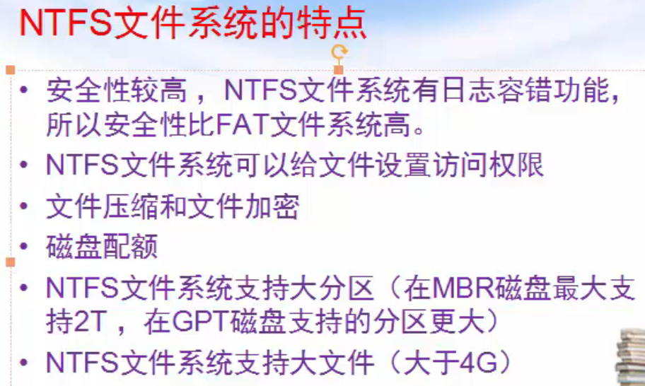

# NTFS文件系统

NTFS 意思是Windows NT的文件系统，它的优点是安全性和稳定性好，能自动记录与文件的变动操作，系统不易崩溃，具有文件修复能力，出现错误能迅速修复，是目前Win系统主要采用的文件系统，缺点是微软的Win系统独家支持，其他系统如果要访问 NTFS 格式设备中的文件数据，需要采取一些特别的技术手段

## NTFS文件系统的组成

## NTFS文件系统的DBR

与FAT32的DBR类似，NTFS文件系统的DBR记录了每个扇区的字节数，每个簇的扇区数，MFT的起始位置等

## NTFS文件系统的元文件

