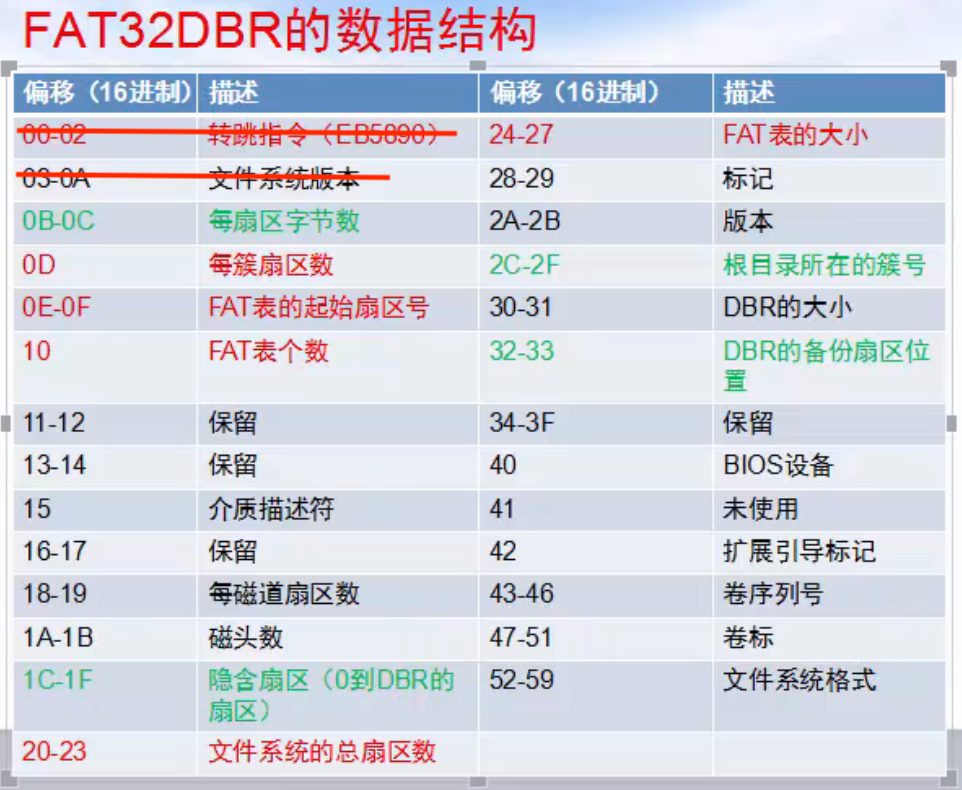

# 文件系统

文件系统是对数据存储进行管理的一种机制
格式化的目的就是建立文件系统从而管理文件

NTFS、FAT32、exFAT文件系统的第一个扇区叫 DBR 系统引导扇区

## FAT32文件系统

FAT32文件系统由微软推出，常用于U盘，支持长文件名，但单个文件最大4GB，最大分区128GB，单个硬盘最大容量2TB

[FAT32文件系统详解](https://blog.51cto.com/dengqi/1349327)

### FAT32文件系统的组成

FAT32文件系统由DBR及其保留扇区，FAT1，FAT2，DATA四个部分组成

这些结构是在分区被格式化时创建出来的，含义解释如下：

- DBR及其保留扇区：DBR的含义是DOS引导记录，也称为操作系统引导记录，在DBR之后往往会有一些保留扇区
- FAT1：FAT的含义是文件分配表，FAT32一般有两份FAT，FAT1是第一份，也是主FAT
- FAT2：FAT2是FAT32的第二份文件分配表，也是FAT1的备份
- DATA：DATA也就是数据区，是FAT32文件系统的主要区域，其中包含目录区域

### FAT32文件系统的DBR

FAT32文件系统的DBR由跳转指令，OEM代号，BPB，引导程序，结束标志五个部分组成

- 跳转指令：本身占2字节它将程序执行流程跳转到引导程序处
- OEM代号：这部分占8字节，其内容由创建该文件系统的OEM厂商具体安排
- BPB：FAT32的BPB从DBR的第12个字节开始，占用79字节，记录了有关该文件系统的重要信息
- 引导程序代码：FAT32的DBR引导程序占用420字节，对于没有安装操作系统的分区来说这段程序是没有用处的
- 结束标志：DBR的结束标志与MBR，EBR的结束标志相同，为"55 AA"

#### DBR中的BPB的结构

#### MBR、EBR、DBR的区别

通常情况下可以这样描述这几个概念：
- MBR：为计算机启动后从可启动介质上首先装入内存并且执行的代码，通常用来解释分区结构。以硬盘为例，通常为LBA的0扇区。MBR是主引导记录(Master Boot Record)的缩写
- EBR：EBR的意思是扩展分区引导记录，是MBR下的子概念，且有扩展分区存在的时候，才有EBR存在，如果一个硬盘没有扩展分区，那它就没有EBR。自MICROSOFT推出扩展分区的概念后，扩展分区就沿用了基本分区所采用的DPT结构，为了加以区别，人们通常把扩展分区的分区表所在的扇区称为EBR、EMBR、扩展MBR或虚拟MBR
- DBR：DBR也是MBR的子概念，只有MBR硬盘才有DBR的说法。如果Windows被装在MBR盘上，必须要有一个引导分区（C盘），而引导分区的前面就有一段DBR（代码），用于引导Windows的启动。DBR是DOS启动记录的意思，为操作系统进入文件系统以后可以访问的第一个扇区，通常用来解释文件系统。在UNIX类文件系统中，等同于SUPERBLOCK

不同点：
1. MBR是硬盘的主引导记录，它位于硬盘的第一个扇区，用于引导操作系统，而EBR和DBR则是用于管理硬盘分区的引导记录，它们位于硬盘的其他扇区
2. MBR只能支持4个主分区，而EBR和DBR可以支持更多的分区
3. MBR是由BIOS读取，而EBR和DBR是由操作系统读取

### 保留扇区中的FSINFO扇区

用于记录文件系统中空闲簇数和下一个可用的簇号

### FAT32文件系统的FAT表

文件分配表FAT（File Allocation Table）用来描述文件系统内存储单元的分配状态及文件内容的前后链接关系的表格（也可以笼统的说成是记录文件所在位置的表格）。它对于FAT文件系统来讲是至关重要的一个组成部分，并且它对于硬盘的使用也非常重要，假若丢失文件分配表，那么硬盘上的数据就无法定位，也就不能使用了

## NTFS文件系统

NTFS 意思是Windows NT的文件系统，它的优点是安全性和稳定性好，能自动记录与文件的变动操作，系统不易崩溃，具有文件修复能力，出现错误能迅速修复，是目前Win系统主要采用的文件系统，缺点是微软的Win系统独家支持，其他系统如果要访问 NTFS 格式设备中的文件数据，需要采取一些特别的技术手段

## exFAT文件系统

extFAT 意思是指扩展文件分配表 (Extended File Allocation Table)，是微软在2006年发表的存储格式，是微软为闪存开发的文件系统。作为FAT32的进化版，它还有一个名字叫 FAT64。与前辈 FAT32 相比，它可以存储4GB以上的大文件；与另一位前辈 NTFS 相比，它对闪存更友好，支持的系统更多。目前该格式主要用于优盘等外接存储设备，不能用于内部硬盘

