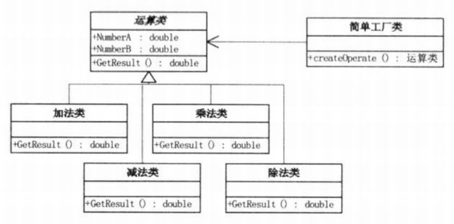
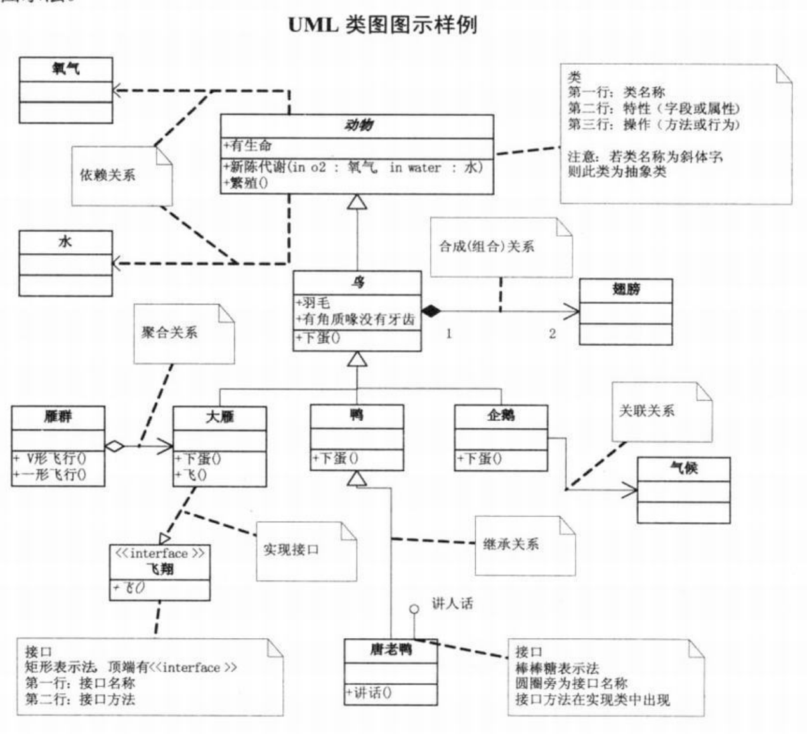
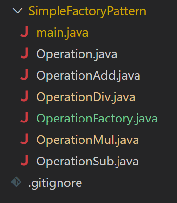

# 简单工厂模式

例子：计算器

1. 界面逻辑和业务逻辑分离
2. 一个抽象的运算类
3. 多个具体运算类（加减乘除）实现抽象运算类中的运算方法
4. 工厂类根据传入的操作符不同，返回不同的运算类的实例化对象

## UML类图

类与类、类与接口的关系：
1. 继承（空心三角形+实线）
2. 实现（空心三角形+虚线）
3. 关联（一个类知道另一个类）（实线箭头）
4. 聚合（弱的拥有，集体和个人）（空心菱形+实线箭头）
5. 组合（强的拥有，整体和部分）（实心菱形+实线箭头）
6. 依赖（非常弱，临时性的关系）（虚线箭头）

对于继承、实现这两种关系比较简单，他们体现的是一种类与类、或者类与接口间的纵向关系；其他的四者关系则体现的是类与类、或者类与接口间的引用、横向关系。总的来说，这几种关系所表现的强弱程度依次为：组合>聚合>关联>依赖

## java实现

具体见GitHub

