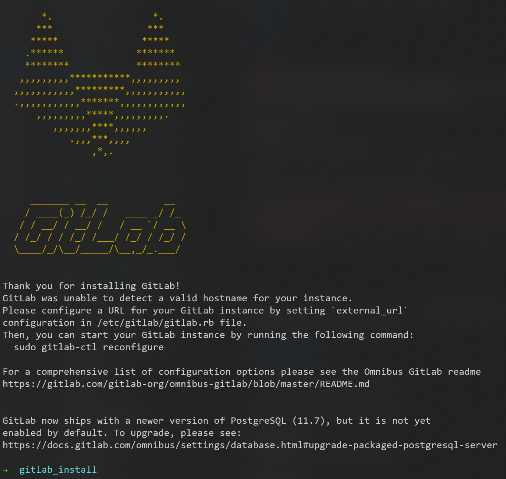
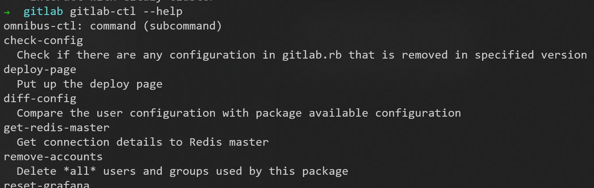
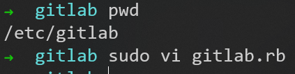
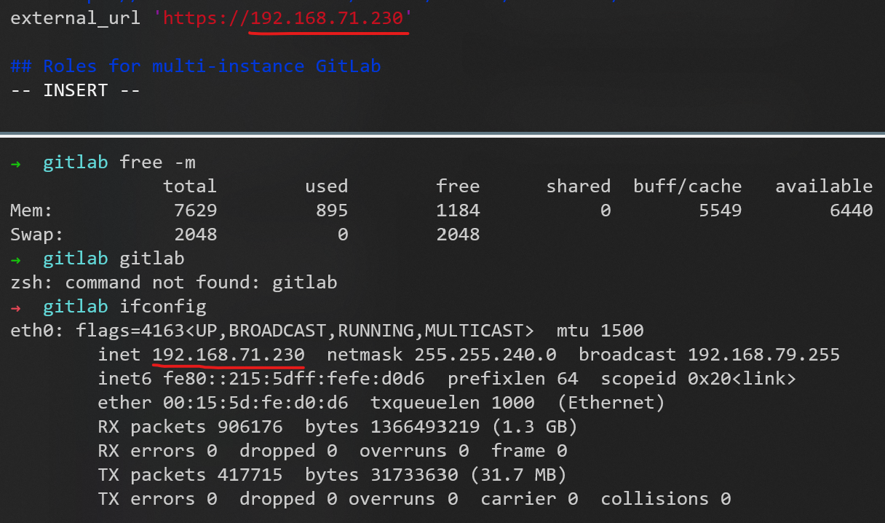
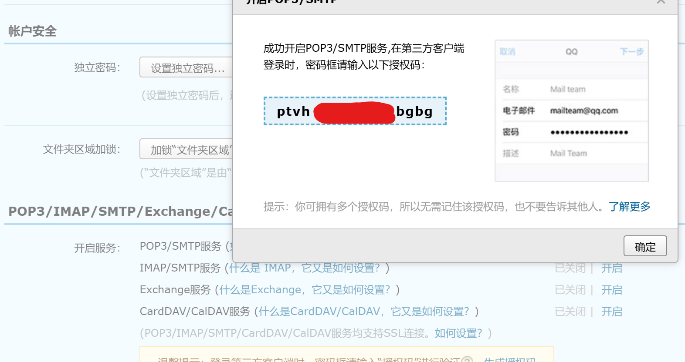
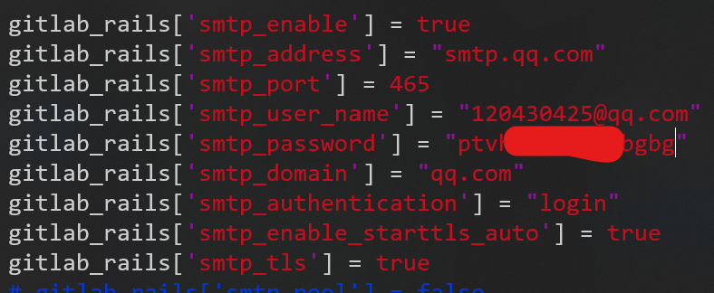
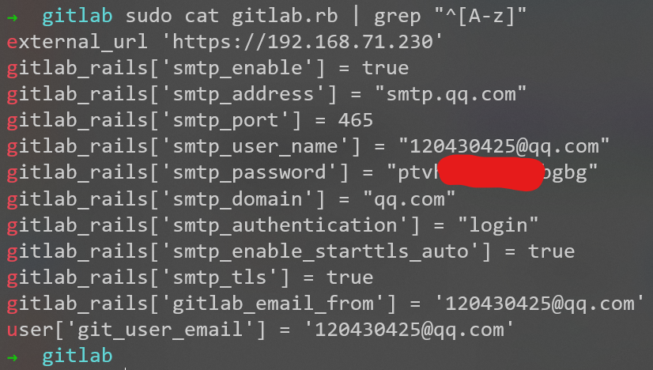
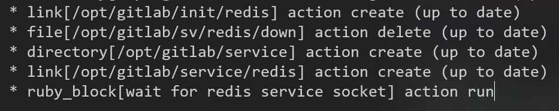
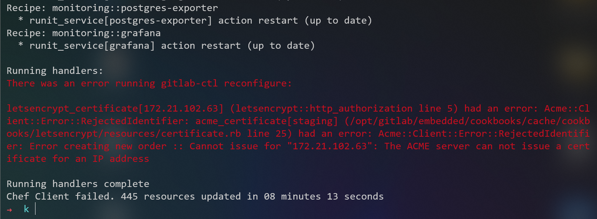
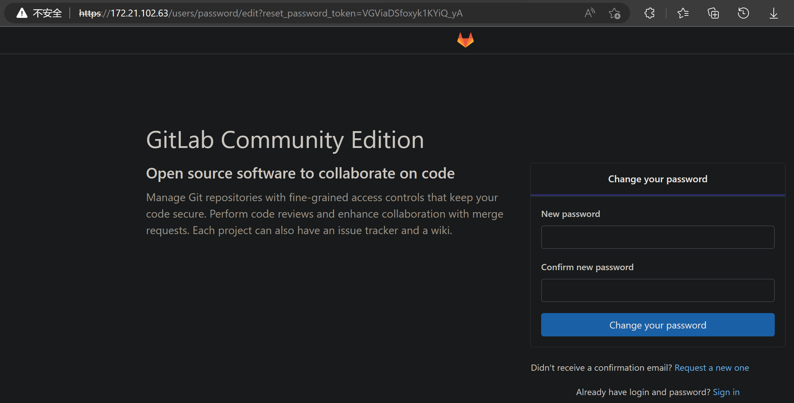

# Gitlab 

## 安装

[主页](https://gitlab.com/)
[清华源](https://mirrors.tuna.tsinghua.edu.cn/gitlab-ce/ubuntu/pool/bionic/main/g/gitlab-ce/)

依次使用以下命令
```sudo apt-get update```
```sudo apt-get install -y curl openssh-server ca-certificates tzdata perl```
```sudo apt-get install -y postfix```
```wget https://mirrors.tuna.tsinghua.edu.cn/gitlab-ce/ubuntu/pool/bionic/main/g/gitlab-ce/gitlab-ce_12.9.9-ce.0_amd64.deb```
```sudo dpkg -i gitlab-ce_12.9.9-ce.0_amd64.deb```



使用命令```gitlab-ctl --help```，测试是否安装成功


### 修改配置文件




改为本机地址


修改邮件配置






配置结果如下


### 使用```sudo gitlab-ctl reconfigure```重新配置gitlab


但是卡在这里，半天没有反应



最后报错


但是可以访问```172.21.102.63```

注意：这里地址与上面的配置不同，是因为我的WSL子系统每次重启，inet addr会改变，所以要重复上面的操作

## 登录gitlab的Web界面

访问```172.21.102.63```
这里我设置的密码为```12345678```
用默认的用户名```root```和我设置的密码```12345678```登录


登录之后

用法和Github差不多
