# Jenkins

[官网](https://www.jenkins.io/)

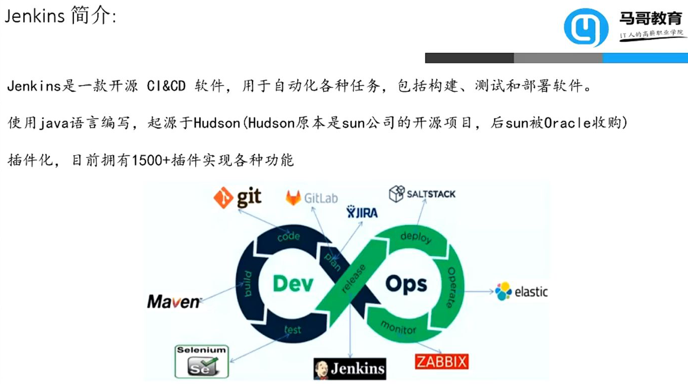

## 结构

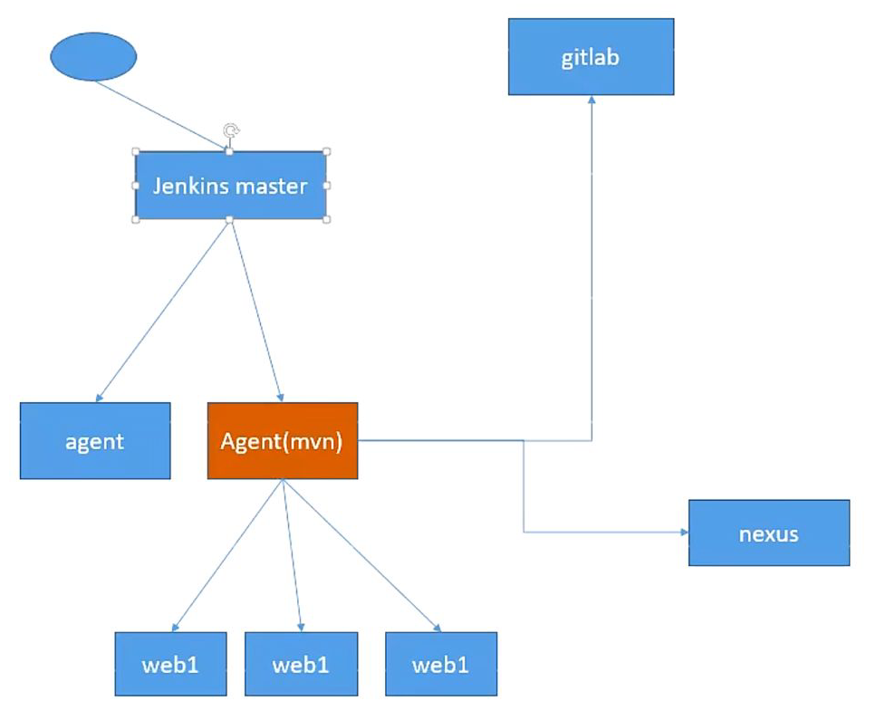

## 安装

先确保安装了OpenJDK，用命令```java -version```来检验

在 Ubuntu 上安装 Jenkins 相对比较直接。我们将会启用 Jenkins APT 软件源，导入源 GPGkey，并且安装 Jenkins 软件包。

使用命令```wget -q -O - https://pkg.jenkins.io/debian/jenkins.io.key | sudo apt-key add -```，导入 Jenkins 软件源的 GPG keys

使用命令```sudo sh -c 'echo deb http://pkg.jenkins.io/debian-stable binary/ > /etc/apt/sources.list.d/jenkins.list'```，添加软件源到系统中

一旦 Jenkins 软件源被启用，升级apt软件包列表，并且安装最新版本的 Jenkins

```sudo apt update```
```sudo apt install jenkins```

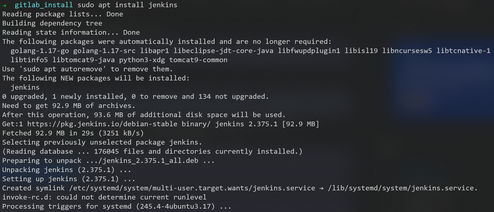
安装完成

### 修改配置文件

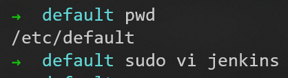

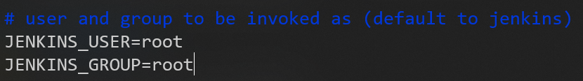

之后重启jenkins服务
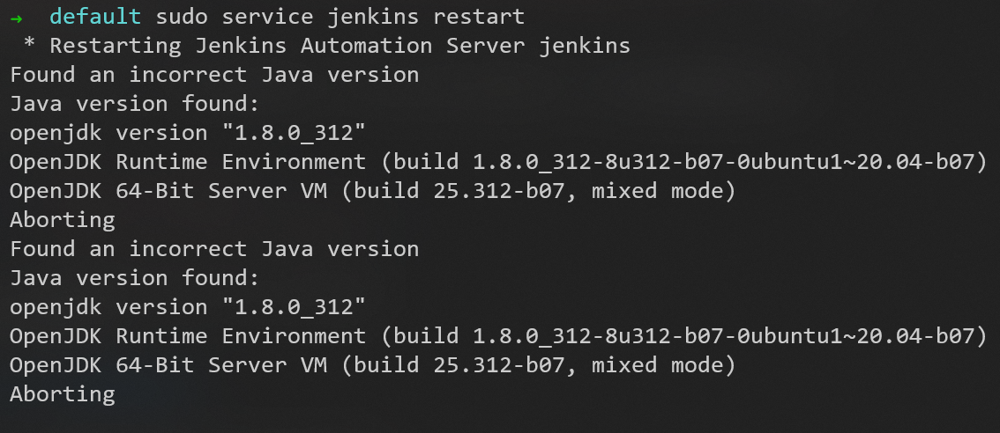
这里报错了

可见，是本机的java版本过低

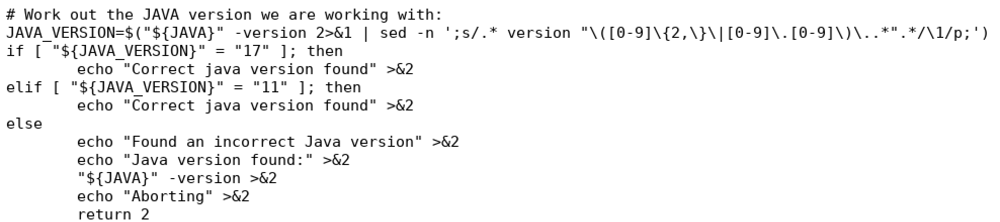

#### 安装新版本openjdk

当前的版本为openjdk-8-jdk
使用命令```apt search openjdk```查看可用的 OpenJDK 版本

使用命令```sudo apt install openjdk-17-jdk```安装openjdk-17-jdk

使用命令```java -version```可以查看当前版本
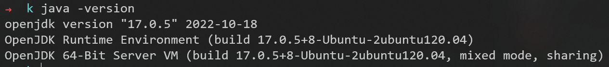

##### 切换可用的JDK版本

```sudo update-alternatives --config java```
```sudo update-alternatives --config javac```

解决好问题之后：
此时，重启jenkins服务，成功
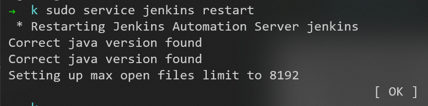

查看日志，显示成功
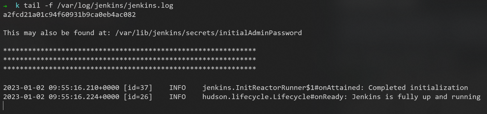

可见，可以访问8080端口
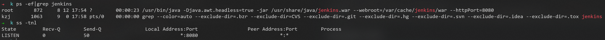

## 登录jenkins的Web界面

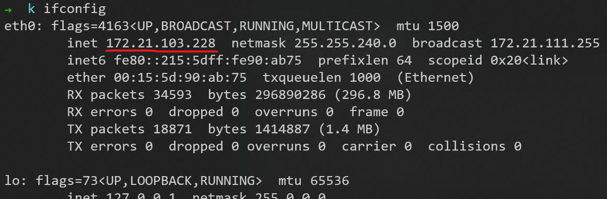

访问```172.21.103.228:8080```
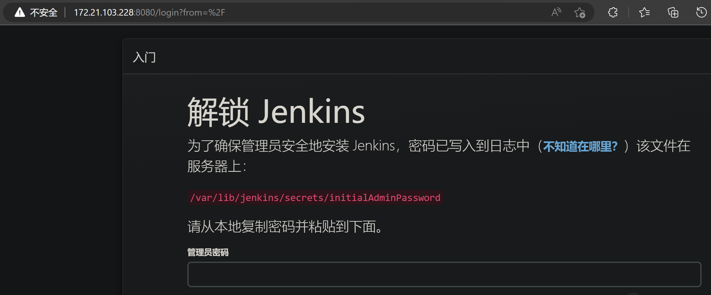

输入密码后，到下一步
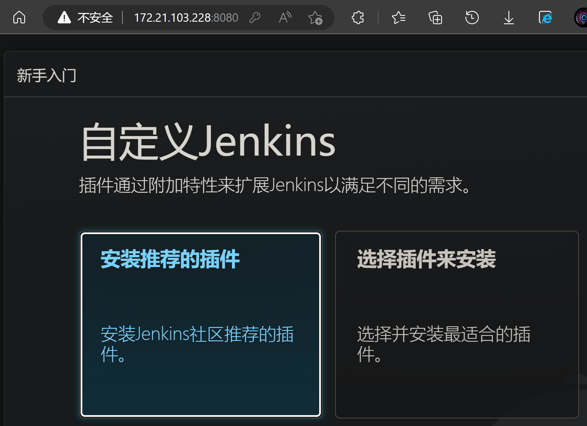

选择安装推荐的插件
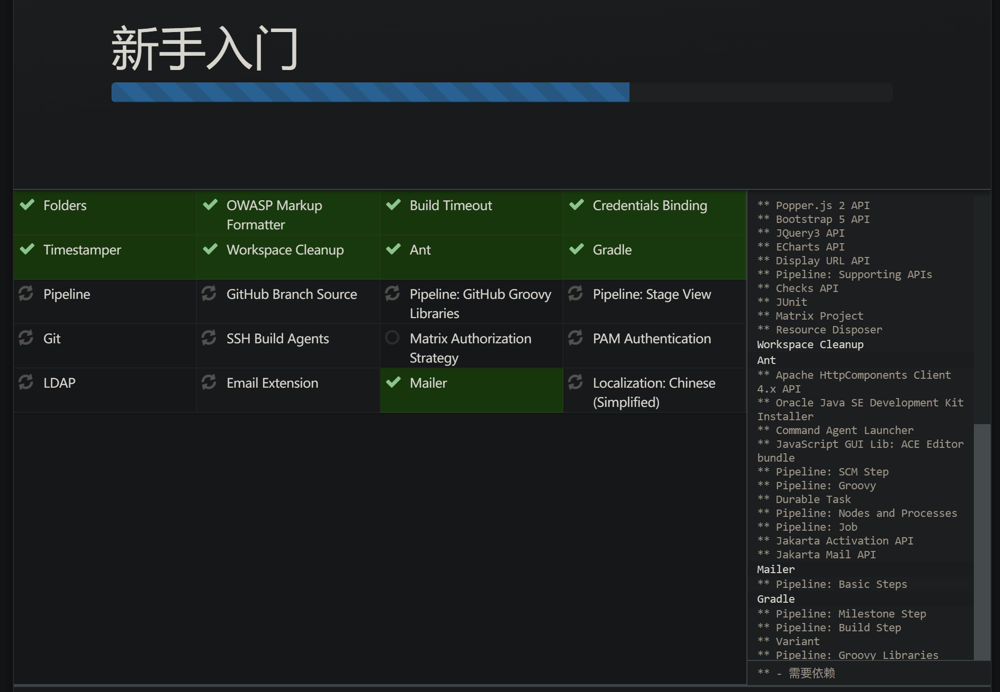

这里设置密码是```1```
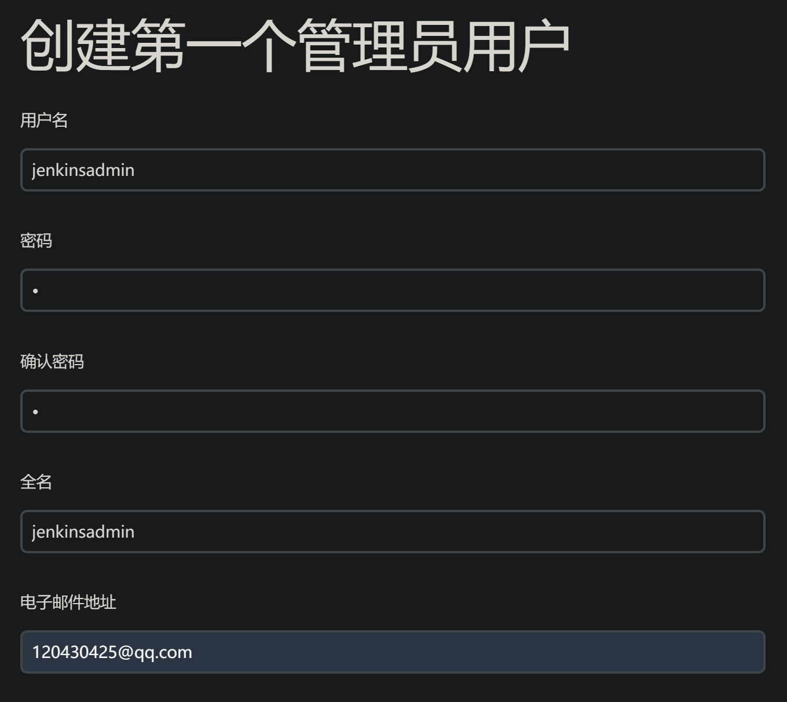

之后登录账户，就可以使用了
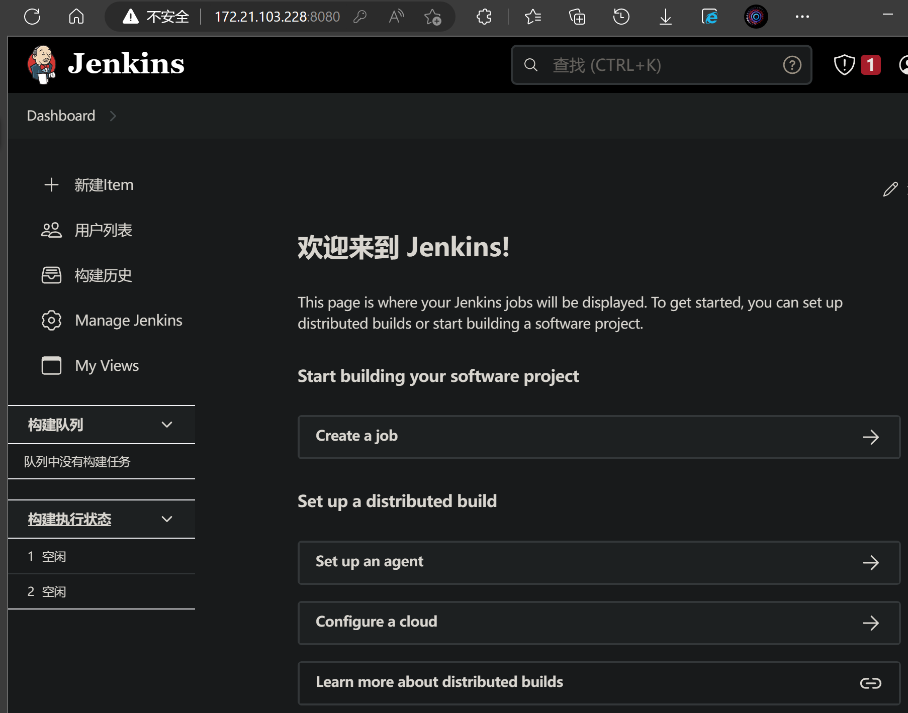

### 修改设置

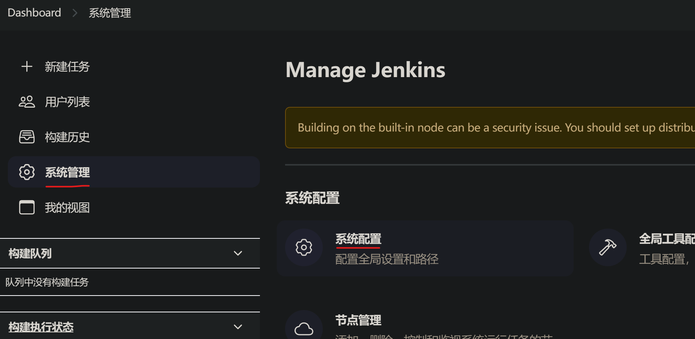

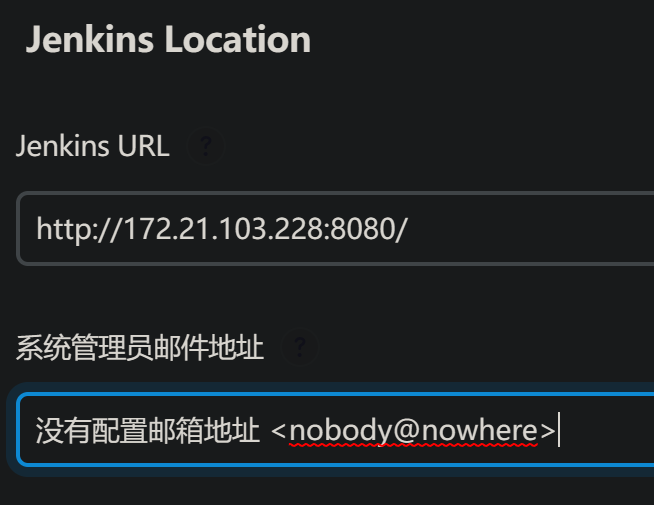

邮箱通知配置
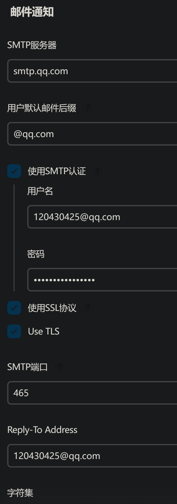


