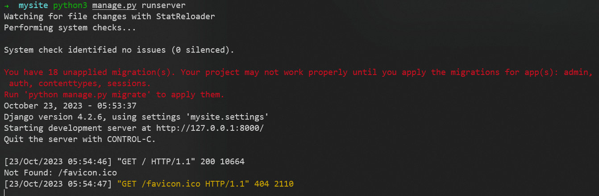
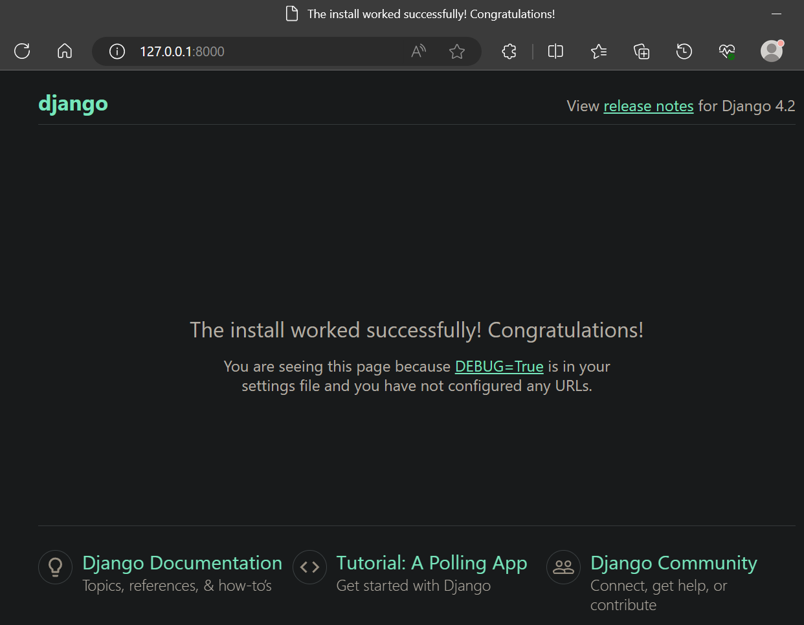

# Django 官方文档和教程

[官方新手引导](https://docs.djangoproject.com/zh-hans/4.2/intro/)

[官方详细文档](https://docs.djangoproject.com/zh-hans/4.2/topics/)

[菜鸟教程](https://www.runoob.com/django/django-tutorial.html)

# 安装

```sh
pip install Django
```

查看版本
```sh
python3 -m django --version
```

# 第一个 Django 应用

[教程链接](https://docs.djangoproject.com/zh-hans/4.2/intro/tutorial01/)

将带着你创建一个基本的投票应用程序，它将由两部分组成：
1. 一个让人们查看和投票的**公共站点**
2. 一个让你能添加、修改和删除投票的**管理站点**

## 创建项目（startproject）

如果这是你第一次使用 Django 的话，你需要一些初始化设置。也就是说，你需要用一些自动生成的代码配置一个 Django project，即一个 Django 项目实例需要的设置项集合，包括：
1. 数据库配置
2. Django 配置
3. 应用程序配置

```sh
python3 -m django startproject mysite
```

让我们看看 startproject 创建了些什么：
```sh
mysite/
    manage.py
    mysite/
        __init__.py
        settings.py
        urls.py
        asgi.py
        wsgi.py
```

这些目录和文件的用处是：
- **最外层的 mysite/ 根目录**只是你项目的容器，根目录名称对 Django 没有影响，你可以将它重命名为任何你喜欢的名称
- **manage.py**：一个让你用各种方式管理 Django 项目的命令行工具
- **里面一层的 mysite/ 目录**包含你的项目，它是一个纯 Python 包。它的名字就是当你引用它内部任何东西时需要用到的 Python 包名（比如 mysite.urls）
- **mysite/__init__.py**：一个空文件，告诉 Python 这个目录应该被认为是一个 Python 包
- **mysite/settings.py**：Django 项目的配置文件
- **mysite/urls.py**：Django 项目的 URL 声明，就像你网站目录
- **mysite/asgi.py**：作为你的项目的运行在 ASGI 兼容的 Web 服务器上的入口
- **mysite/wsgi.py**：作为你的项目的运行在 WSGI 兼容的Web服务器上的入口

## 用于开发的简易服务器（runserver）

确认一下你的 Django 项目是否真的创建成功了。切换到外层的 mysite 目录，然后运行下面的命令
```sh
python3 manage.py runserver
```
你应该会看到如下输出


此时已经启动了 Django 开发服务器，这是一个用纯 Python 编写的轻量级网络服务器。我们在 Django 中包含了这个服务器，所以你可以快速开发，而不需要处理配置生产服务器的问题，直到你准备好用于生产

服务器现在正在运行，通过浏览器访问 http://127.0.0.1:8000/ 


### 更换端口

默认情况下，runserver 命令会将服务器设置为监听本机内部 IP 的 8000 端口

```sh
# 使服务器监听 8080 端口
python3 manage.py runserver 8080
# 如果你想要修改服务器监听的IP，在端口之前输入新的。比如，为了监听所有服务器的公开IP（这你运行 Vagrant 或想要向网络上的其它电脑展示你的成果时很有用）
python3 manage.py runserver 0.0.0.0:8000
```

### 会自动重新加载的服务器

用于开发的服务器在需要的情况下会对每一次的访问请求重新载入一遍 Python 代码。所以你不需要为了让修改的代码生效而频繁的重新启动服务器。然而，一些动作，比如添加新文件，将不会触发自动重新加载，这时你得自己手动重启服务器

## 创建投票应用（startapp）

现在你的开发环境，即这个**项目**已经配置好了，你可以开始干活了
在 Django 中，每一个**应用**都是一个 Python 包，并且遵循着相同的约定。Django 自带一个工具，可以帮你**生成应用的基础目录结构**，这样你就能专心写代码，而不是创建目录了

项目 VS 应用：
> **应用**是一个专门做某件事的网络应用程序，比如博客系统，或者公共记录的数据库，或者小型的投票程序。**项目**则是一个网站使用的配置和应用的集合。项目可以包含很多个应用。应用可以被很多个项目使用。

我们将在 manage.py 同级目录下创建投票应用。这样它就可以作为顶级模块导入，而不是 mysite 的子模块
```sh
python3 manage.py startapp polls
```

让我们看看 startapp 创建了些什么：
```sh
polls/
    __init__.py
    admin.py
    apps.py
    models.py
    tests.py
    views.py
    migrations/
        __init__.py
```

## 编写第一个视图，并将一个 URL 映射到它（urlpatterns）

polls/views.py文件内容修改为
```py
from django.http import HttpResponse

def index(request):
    return HttpResponse("Hello, world. You're at the polls index.")
```

这是 Django 中最简单的视图。如果想看见效果，我们需要将一个 URL 映射到它，这就是我们需要 URLconf 的原因了

新增polls/urls.py文件，内容为
```py
from django.urls import path
from . import views

urlpatterns = [
    path("", views.index, name="index"),
]
```

然后要在根 URLconf 文件中指定我们创建的 polls.urls 模块
在mysite/mysite/urls.py文件中的 urlpatterns 列表里插入一个 include()，文件内容修改为
```py
from django.contrib import admin
from django.urls import include, path

urlpatterns = [
    path("polls/", include("polls.urls")),
    path("admin/", admin.site.urls),
]
```
函数 include() 允许引用其它 URLconfs。每当 Django 遇到 include() 时，它会截断与此项匹配的 URL 的部分，并将剩余的字符串发送到 URLconf 以供进一步处理

用浏览器访问 http://localhost:8000/polls/ 应该能够看见 "Hello, world. You're at the polls index."，这是在 index 视图中定义的


### 何时使用 include()

当包括其它 URL 模式时你应该总是使用 include()，admin.site.urls 是唯一例外

### 函数 path()

path(route, view, kwargs=None, name=None)

函数 path() 具有四个参数，两个必须参数：route 和 view，两个可选参数：kwargs 和 name

#### 参数 route

route 是一个匹配 URL 的准则（类似正则表达式）
当 Django 响应一个请求时，它会从 urlpatterns 的第一项开始，按顺序依次匹配列表中的项，直到找到匹配的项

这些准则不会匹配 GET 和 POST 参数或域名
例如，URLconf 在处理请求 
1. https://www.example.com/myapp/ 时，它会尝试匹配 myapp/
2. https://www.example.com/myapp/?page=3 时，也只会尝试匹配 myapp/

#### 参数 view

当 Django 找到了一个匹配的准则，就会调用这个特定的视图函数，并传入一个 HttpRequest 对象作为第一个参数，被"捕获"的参数以关键字参数的形式传入

#### 参数 kwargs

任意个关键字参数可以作为一个字典传递给目标视图函数

#### 参数 name

为你的 URL 取名能使你在 Django 的任意地方唯一地引用它，尤其是在模板中。这个有用的特性允许你只改一个文件就能全局地修改某个 URL 模式

至此，我们打通了**请求和响应流程**

