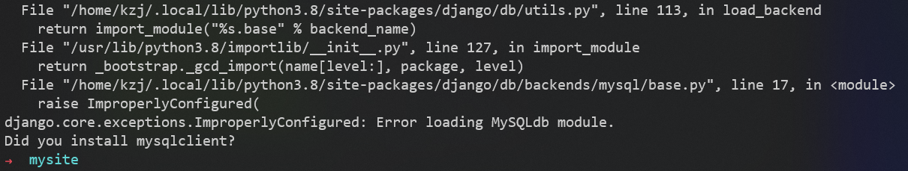

# Django 模型

接着之前的第一个 Django 应用
我们将设置数据库，创建第一个模型，并快速介绍 Django 自动生成的后台界面

## 数据库配置

mysite/mysite/settings.py文件，是个包含了 Django 项目设置的 Python 模块

> 通常，这个配置文件使用 SQLite 作为默认数据库

如果你想使用其他数据库，你需要安装合适的 database bindings ，然后改变设置文件中 DATABASES 'default' 项目中的一些键值：
- **ENGINE** ：可选值有 'django.db.backends.sqlite3'，'django.db.backends.postgresql'，'django.db.backends.mysql'，'django.db.backends.oracle' 等
- **NAME** ：数据库的名称（如果你使用 SQLite，数据库将是你电脑上的一个文件，在这种情况下，NAME 应该是此文件完整的绝对路径，包括文件名。默认值 BASE_DIR / 'db.sqlite3' 将把数据库文件储存在项目的根目录）
- **USER、PASSWORD、HOST、PORT** ：如果你不使用 SQLite，则必须添加一些额外设置

这里使用MySQL
创建名为djangodb的数据库
```sql
create database djangodb default charset=utf8;   
```

在settings.py文件中找到 DATABASES 配置项，将其修改为：
```py
DATABASES = {
    'default': {
        'ENGINE': 'django.db.backends.mysql',
        'NAME': 'djangodb',
        'HOST': '127.0.0.1',
        'PORT': 3306,
        'USER': 'root',
        'PASSWORD': '1',
    }
}
```

### 时区设置 TIME_ZONE、USE_TZ

在settings.py文件中启用时区设置
```py
# TIME_ZONE = 'UTC'
TIME_ZONE = 'Asia/Shanghai'
USE_TZ = True
```

Django如果开启了Time Zone功能，则所有的存储和内部处理，甚至包括直接print显示全都是UTC的。只有通过模板进行表单输入/渲染输出的时候，才会执行UTC与本地时间的转换

所以建议后台处理时间的时候，最好完全使用UTC，不要考虑本地时间的存在。而显示时间的时候，也避免手动转换，尽量使用Django模板系统代劳

除非应用支持用户设置自己所在的时区，通常我们不需要关心模板的时区问题。模板在展示时间的时候，会使用 settings.TIME_ZONE 中的设置自动把 UTC 时间转成 settings.TIME_ZONE 所在时区的时间渲染

启用 USE_TZ = True 后，处理时间方面，有两条"黄金法则"：
1. 保证存储到数据库中的是 UTC 时间
2. 在函数之间传递时间参数时，确保时间已经转换成 UTC 时间


---
待完成

比如，通常获取当前时间用的是：

import datetime
now = datetime.datetime.now()

启用 USE_TZ = True 后，需要写成：

import datetime 
from django.utils.timezone import utc
utcnow = datetime.datetime.utcnow().replace(tzinfo=utc)


### settings.py文件头部的 INSTALLED_APPS 设置项

文件头部的 INSTALLED_APPS 设置项，包括了会在你项目中启用的所有 Django 应用

```py
INSTALLED_APPS = [
    'django.contrib.admin',  # 管理员站点
    'django.contrib.auth',  # 认证授权系统
    'django.contrib.contenttypes',  # 内容类型框架
    'django.contrib.sessions',  # 会话框架
    'django.contrib.messages',  # 消息框架
    'django.contrib.staticfiles',  # 管理静态文件的框架
]
```
这些应用被默认启用是为了给常规项目提供方便

默认开启的某些应用需要至少一个数据表，所以，在使用他们之前需要在数据库中创建一些表。请执行以下命令
```sh
python3 manage.py migrate
```
这个 migrate 命令查看 INSTALLED_APPS 配置，并根据 mysite/settings.py 文件中的数据库配置和随应用提供的数据库迁移文件（我们将在后面介绍这些），创建任何必要的数据库表

执行命令的效果如下：


Django 创建的表如下：


#### Error loading MySQLdb module 报错

执行以下命令时报错
```sh
python3 manage.py migrate
```


解决方案：
1. 安装pymysql
```sh
pip install pymysql
```
2. 在__init__.py文件（与settings.py同一个目录）中引入模块和进行配置
```py
import pymysql
pymysql.install_as_MySQLdb()
```

## 创建模型

在 Django 里写一个数据库驱动的 Web 应用的第一步是定义模型，也就是数据库结构设计和附加的其它元数据

在这个投票应用中，需要创建两个模型，即问题 Question 和选项 Choice：
- Question 模型包括问题描述和发布时间
- Choice 模型有两个字段，选项描述和当前得票数，每个选项属于一个问题


---
待完成


## 激活模型

上面的用于创建模型的代码给了 Django 很多信息，通过这些信息，Django 可以：
- 为这个应用创建数据库 schema（生成 CREATE TABLE 语句）
- 创建可以与 Question 和 Choice 对象进行交互的 Python 数据库 API

但是首先得把 polls 应用安装到我们的项目里


