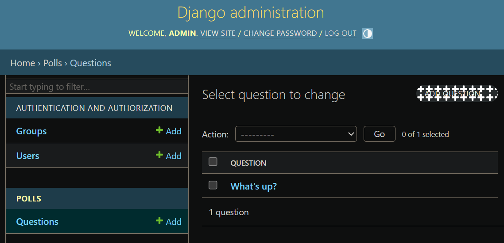

# Django 数据库和模型

接着之前的第一个 Django 应用
我们将设置数据库，创建第一个模型，并快速介绍 Django 自动生成的后台界面

## 数据库配置（databases）

mysite/mysite/settings.py文件，是个包含了 Django 项目设置的 Python 模块

> 通常，这个配置文件使用 SQLite 作为默认数据库

如果你想使用其他数据库，你需要安装合适的 database bindings ，然后改变设置文件中 DATABASES 'default' 项目中的一些键值：
- **ENGINE** ：可选值有 'django.db.backends.sqlite3'，'django.db.backends.postgresql'，'django.db.backends.mysql'，'django.db.backends.oracle' 等
- **NAME** ：数据库的名称（如果你使用 SQLite，数据库将是你电脑上的一个文件，在这种情况下，NAME 应该是此文件完整的绝对路径，包括文件名。默认值 BASE_DIR / 'db.sqlite3' 将把数据库文件储存在项目的根目录）
- **USER、PASSWORD、HOST、PORT** ：如果你不使用 SQLite，则必须添加一些额外设置

这里使用MySQL
创建名为djangodb的数据库
```sql
create database djangodb default charset=utf8;   
```

在settings.py文件中找到 DATABASES 配置项，将其修改为：
```py
DATABASES = {
    'default': {
        'ENGINE': 'django.db.backends.mysql',
        'NAME': 'djangodb',
        'HOST': '127.0.0.1',
        'PORT': 3306,
        'USER': 'root',
        'PASSWORD': '1',
    }
}
```

### 时区设置 TIME_ZONE、USE_TZ

在settings.py文件中启用时区设置
```py
# TIME_ZONE = 'UTC'
TIME_ZONE = 'Asia/Shanghai'
USE_TZ = True
```

Django如果开启了Time Zone功能，则所有的存储和内部处理，甚至包括直接print显示全都是UTC的。只有通过模板进行表单输入/渲染输出的时候，才会执行UTC与本地时间的转换

所以建议后台处理时间的时候，最好完全使用UTC，不要考虑本地时间的存在。而显示时间的时候，也避免手动转换，尽量使用Django模板系统代劳

除非应用支持用户设置自己所在的时区，通常我们不需要关心模板的时区问题。模板在展示时间的时候，会使用 settings.TIME_ZONE 中的设置自动把 UTC 时间转成 settings.TIME_ZONE 所在时区的时间渲染

启用 USE_TZ = True 后，处理时间方面，有两条"黄金法则"：
1. 保证存储到数据库中的是 UTC 时间
2. 在函数之间传递时间参数时，确保时间已经转换成 UTC 时间


比如，通常获取当前时间用的是：
```py
import datetime
now = datetime.datetime.now()
```

启用 USE_TZ = True 后，需要写成：
```py
import datetime 
from django.utils.timezone import utc
utcnow = datetime.datetime.utcnow().replace(tzinfo=utc)
```

### settings.py文件头部的 INSTALLED_APPS 设置项

文件头部的 INSTALLED_APPS 设置项，包括了会在你项目中启用的所有 Django 应用
```py
INSTALLED_APPS = [
    'django.contrib.admin',  # 管理员站点
    'django.contrib.auth',  # 认证授权系统
    'django.contrib.contenttypes',  # 内容类型框架
    'django.contrib.sessions',  # 会话框架
    'django.contrib.messages',  # 消息框架
    'django.contrib.staticfiles',  # 管理静态文件的框架
]
```
这些应用被默认启用是为了给常规项目提供方便

默认开启的某些应用需要至少一个数据表，所以，在使用他们之前需要在数据库中创建一些表。请执行以下命令
```sh
python3 manage.py migrate
```
这个 migrate 命令查看 INSTALLED_APPS 配置，并根据 mysite/settings.py 文件中的数据库配置和随应用提供的数据库迁移文件（我们将在后面介绍这些），创建任何必要的数据库表

执行命令的效果如下：


Django 创建的表如下：


#### Error loading MySQLdb module 报错

执行以下命令时报错
```sh
python3 manage.py migrate
```


解决方案：
1. 安装pymysql
```sh
pip install pymysql
```
2. 在__init__.py文件（与settings.py同一个目录）中引入模块和进行配置
```py
import pymysql
pymysql.install_as_MySQLdb()
```

## 创建模型

在 Django 里写一个数据库驱动的 Web 应用的第一步是定义模型，也就是数据库结构设计和附加的其它元数据

> Django 的迁移代码是由你的模型文件自动生成的，它本质上是个历史记录，Django 可以用它来进行数据库的滚动更新，通过这种方式使其能够和当前的模型匹配

在这个投票应用中，需要创建两个模型，即问题 Question 和选项 Choice：
- Question 模型有两个字段，问题描述和发布时间
- Choice 模型有两个字段，选项描述和当前得票数，每个 Choice 属于一个 Question

修改polls/models.py文件的内容为：
```py
from django.db import models

# 每个模型被表示为 django.db.models.Model 类的子类。每个模型有许多类变量，它们都表示模型里的一个数据库字段
class Question(models.Model):
    # 每个字段都是 Field 类的实例，这将告诉 Django 每个字段要处理的数据类型
    # 每个 Field 类实例变量的名字（例如 question_text 或 pub_date ）是字段名，所以最好使用对机器友好的格式。数据库会将它们作为列名
    question_text = models.CharField(max_length=200)
    # 为 Question.pub_date 定义了对人类友好的名字
    pub_date = models.DateTimeField("date published")

class Choice(models.Model):
    # 使用 ForeignKey 定义了一个关系。这将告诉 Django，每个 Choice 对象都关联到一个 Question 对象。Django 支持所有常用的数据库关系：多对一、多对多和一对一
    question = models.ForeignKey(Question, on_delete=models.CASCADE)
    # 定义某些 Field 类实例需要参数。例如 CharField 需要一个 max_length 参数。这个参数的用处不止于用来定义数据库结构，也用于验证数据
    choice_text = models.CharField(max_length=200)
    votes = models.IntegerField(default=0)
```

## 激活模型（makemigrations、sqlmigrate、migrate）

上面的用于创建模型的代码给了 Django 很多信息，通过这些信息，Django 可以：
- 为这个应用创建数据库 schema（生成 CREATE TABLE 语句）
- 创建可以与 Question 和 Choice 对象进行交互的 Python 数据库 API

但是首先得把 polls 应用安装到我们的项目里

为了在我们的工程中包含这个应用，我们需要在配置类 INSTALLED_APPS 中添加设置。因为 PollsConfig 类默认写在文件 polls/apps.py 中：
```py
from django.apps import AppConfig

class PollsConfig(AppConfig):
    default_auto_field = 'django.db.models.BigAutoField'
    name = 'polls'
```

所以它的点式路径是 'polls.apps.PollsConfig'
在文件 mysite/settings.py 中 INSTALLED_APPS 子项添加点式路径后，它看起来像这样：
```py
INSTALLED_APPS = [
    "polls.apps.PollsConfig",  # 新增
    'django.contrib.admin',
    'django.contrib.auth',
    'django.contrib.contenttypes',
    'django.contrib.sessions',
    'django.contrib.messages',
    'django.contrib.staticfiles',
]
```

现在你的 Django 项目会包含 polls 应用。接着运行下面的命令
```sh
python3 manage.py makemigrations polls
```

执行命令的效果如下：


[Django makemigrations 和 migrate 作用详解](https://blog.csdn.net/sinat_23133783/article/details/108692194)

> 执行完makemigrations只是生成了对应的sql语句，还并没真正将改动迁移到数据库中。需要执行migrate才能将改动迁移到数据库，完成建表、修改字段等操作。即，makemigrations生成ddl（数据库模式定义语言），migrate真正地去执行ddl

通过运行 makemigrations 命令，Django 会检测你对模型文件的修改，并且把修改的部分储存为一次迁移

迁移是 Django 对于模型定义（也就是你的数据库结构）的变化的储存形式 - 它们其实也只是一些你磁盘上的文件。如果你想的话，你可以阅读一下你模型的迁移数据，它被储存在 polls/migrations/0001_initial.py 里


Django 有一个自动执行数据库迁移并同步管理你的数据库结构的命令，这个命令是 migrate。但是首先，让我们看看迁移命令会执行哪些 SQL 语句。sqlmigrate 命令接收一个迁移的名称，然后返回对应的 SQL
运行下面的命令
```sh
python3 manage.py sqlmigrate polls 0001
```

执行命令的效果如下：


注意：
1. 输出的内容和你使用的数据库有关，上面的输出示例使用的是 MySQL
2. 数据库的表名是由应用名（polls）和模型名的小写形式（question 或 choice）连接而来
3. 主键会被自动创建
4. 默认的，Django 会在外键字段名后追加字符串 "_id"
5. 外键关系由 FOREIGN KEY 生成
6. 它是为你正在使用的数据库定制的，因此特定于数据库的字段类型，例如"auto_increment"（MySQL）、"bigint PRIMARY KEY GENERATED BY DEFAULT AS IDENTITY"（PostgreSQL）或"integer primary key autoincrement"（SQLite）会自动为您处理。字段名称的引用也是如此，例如，使用双引号或单引号
7. 这个 sqlmigrate 命令并没有真正在你的数据库中的执行迁移。相反，它只是把命令输出到屏幕上，让你看看 Django 认为需要执行哪些 SQL 语句

此时运行 migrate 命令，在数据库里创建新定义的模型的数据表
```sh
python3 manage.py migrate
```

执行命令的效果如下：


和执行 migrate 命令之前相比，数据库中多了两个表


这个 migrate 命令选中所有还没有执行过的迁移（Django 通过在数据库中创建一个特殊的表 django_migrations 来跟踪执行过哪些迁移）并应用在数据库上，也就是将你对模型的更改同步到数据库结构上

### 总结

迁移是非常强大的功能，它能让你在开发过程中持续的改变数据库结构而不需要重新删除和创建表，它专注于使数据库平滑升级而不会丢失数据。现在，你只需要记住这三步：

1. 编辑 **models.py** 文件，改变模型
2. 运行 **python3 manage.py makemigrations** 为模型的改变生成迁移文件
3. 运行 **python3 manage.py migrate** 来应用数据库迁移

## 初试 API（shell）

通过以下命令打开 Python 命令行：
```sh
python3 manage.py shell
```

> 我们使用这个命令而不是简单的使用"python3"是因为 manage.py 会设置 DJANGO_SETTINGS_MODULE 环境变量，这个变量会让 Django 根据 mysite/settings.py 文件来设置 Python 包的导入路径

在shell中可进行如下操作：


上图中的
```sh
<Question: Question object (1)>
``` 
对于我们了解这个对象的细节没什么帮助。让我们通过编辑 Question 模型的代码（位于 polls/models.py 中）来修复这个问题
即给 Question 和 Choice 增加 \_\_str\_\_() 方法：
```py
import datetime
from django.db import models
from django.utils import timezone

class Question(models.Model):
    question_text = models.CharField(max_length=200)
    pub_date = models.DateTimeField("date published")
    # __str__() 方法
    def __str__(self):
        return self.question_text
    # 添加一个自定义方法
    def was_published_recently(self):
        return self.pub_date >= timezone.now() - datetime.timedelta(days=1)

class Choice(models.Model):
    question = models.ForeignKey(Question, on_delete=models.CASCADE)
    choice_text = models.CharField(max_length=200)
    votes = models.IntegerField(default=0)
    # __str__() 方法
    def __str__(self):
        return self.choice_text
```

给模型增加 \_\_str\_\_() 方法是很重要的，这不仅仅能给你在命令行里使用带来方便，Django 自动生成的 admin 里也使用这个方法来表示对象

重新运行如下命令：
```sh
python3 manage.py shell
```

在shell中可进行如下操作：


## Django 管理页面

Django 可以全自动地根据模型创建后台界面
管理界面不是为了网站的访问者，而是为管理者准备的

### 创建一个管理员账号（createsuperuser）

```sh
python3 manage.py createsuperuser
```


这里密码设置为 123456

### 启动开发服务器（runserver）

Django 的管理界面默认就是启用的。让我们启动开发服务器，看看它到底是什么样的

```sh
python3 manage.py runserver
```

进入 http://127.0.0.1:8000/admin/


### 进入管理站点页面

登陆后，你将会看到 Django 管理页面的索引页：


你将会看到几种可编辑的内容：组和用户。它们是由 django.contrib.auth 提供的，这是 Django 开发的认证框架

### 向管理页面中加入投票应用

但是我们的投票应用在哪呢？它没在索引页面里显示

只需要再做一件事：我们得告诉管理，问题 Question 对象需要一个后台接口
修改polls/admin.py文件的内容为：
```py
from django.contrib import admin
from .models import Question

admin.site.register(Question)
```

### 体验便捷的管理功能

现在我们向管理页面注册了问题 Question 类。Django 知道它应该被显示在索引页里：


点击 Questions


选择一条 Question 做修改


可以查看修改的历史记录


