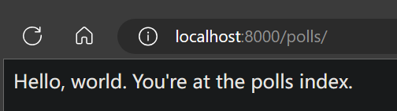

# 请求和响应流程

继续之前的第一个 Django 应用，开发一个基本的投票应用程序

## 编写第一个视图

polls/views.py文件内容修改为
```py
from django.http import HttpResponse

def index(request):
    return HttpResponse("Hello, world. You're at the polls index.")
```

这是 Django 中最简单的视图。如果想看见效果，我们需要将一个 URL 映射到它，这就是我们需要 URLconf 的原因了

新增polls/urls.py文件，内容为
```py
from django.urls import path
from . import views

urlpatterns = [
    path("", views.index, name="index"),
]
```

然后要在根 URLconf 文件中指定我们创建的 polls.urls 模块
在mysite/mysite/urls.py文件中的 urlpatterns 列表里插入一个 include()，文件内容修改为
```py
from django.contrib import admin
from django.urls import include, path

urlpatterns = [
    path("polls/", include("polls.urls")),
    path("admin/", admin.site.urls),
]
```
函数 include() 允许引用其它 URLconfs。每当 Django 遇到 include() 时，它会截断与此项匹配的 URL 的部分，并将剩余的字符串发送到 URLconf 以供进一步处理

用浏览器访问 http://localhost:8000/polls/，应该能够看见 "Hello, world. You're at the polls index."，这是在 index 视图中定义的



### 何时使用 include()

当包括其它 URL 模式时你应该总是使用 include()，admin.site.urls 是唯一例外

### 函数 path()

函数 path() 具有四个参数，两个必须参数：route 和 view，两个可选参数：kwargs 和 name

#### 参数 route

route 是一个匹配 URL 的准则（类似正则表达式）
当 Django 响应一个请求时，它会从 urlpatterns 的第一项开始，按顺序依次匹配列表中的项，直到找到匹配的项

这些准则不会匹配 GET 和 POST 参数或域名
例如，URLconf 在处理请求 
1. https://www.example.com/myapp/ 时，它会尝试匹配 myapp/
2. https://www.example.com/myapp/?page=3 时，也只会尝试匹配 myapp/

#### 参数 view

当 Django 找到了一个匹配的准则，就会调用这个特定的视图函数，并传入一个 HttpRequest 对象作为第一个参数，被"捕获"的参数以关键字参数的形式传入

#### 参数 kwargs

任意个关键字参数可以作为一个字典传递给目标视图函数

#### 参数 name

为你的 URL 取名能使你在 Django 的任意地方唯一地引用它，尤其是在模板中。这个有用的特性允许你只改一个文件就能全局地修改某个 URL 模式

