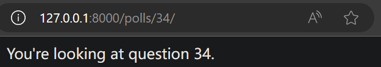
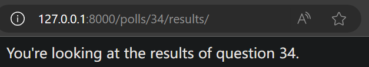
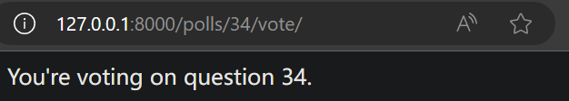
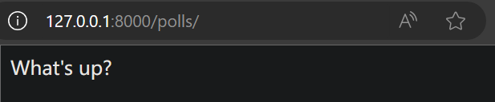
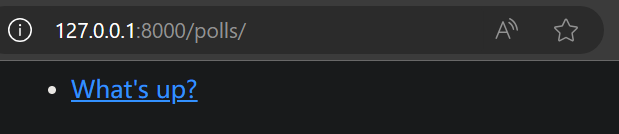

# Django 视图和模板

接着之前的第一个 Django 应用
我们将继续开发网络投票应用程序，并将着重于创建公共接口，即"视图"

## 视图介绍

Django 中的视图的概念：一类具有相同功能和模板的网页的集合

在我们的投票应用中，我们需要下列几个视图：
1. 问题索引页：展示最近的几个投票问题
2. 问题详情页：展示某个投票的问题和不带结果的选项列表
3. 问题结果页：展示某个投票的结果
4. 投票处理器：用于响应用户为某个问题的特定选项投票的操作

在 Django 中，网页和其他内容都是从视图派生而来。每一个视图表现为一个 Python 函数（方法）。Django 将会根据用户请求的 URL 来选择使用哪个视图（更准确的说，是根据 URL 中域名之后的部分）

为了将 URL 和视图关联起来，Django 使用了 URLconfs 来配置
**URLconf 将 URL 映射到视图**

[Django框架 URLconf模块介绍](https://blog.csdn.net/Richardlcx/article/details/106578515)

## 编写更多视图

现在让我们向 polls/views.py 里添加更多视图，这些视图有一些不同，因为他们接收参数
polls/views.py文件内容修改为
```py
from django.http import HttpResponse

def index(request):
    return HttpResponse("Hello, world. You're at the polls index.")

# new
def detail(request, question_id):
    return HttpResponse("You're looking at question %s." % question_id)

# new
def results(request, question_id):
    response = "You're looking at the results of question %s."
    return HttpResponse(response % question_id)

# new
def vote(request, question_id):
    return HttpResponse("You're voting on question %s." % question_id)
```

把这些新视图添加进 polls.urls 模块里，只要添加几个 url() 函数调用就行
polls/urls.py文件内容修改为
```py
from django.urls import path
from . import views

urlpatterns = [
    # ex: /polls/
    path("", views.index, name="index"),
    # ex: /polls/5/
    path("<int:question_id>/", views.detail, name="detail"),
    # ex: /polls/5/results/
    path("<int:question_id>/results/", views.results, name="results"),
    # ex: /polls/5/vote/
    path("<int:question_id>/vote/", views.vote, name="vote"),
]
```

然后看看你的浏览器，如果你转到 "/polls/34/"，Django 将会运行 detail() 方法并且展示你在 URL 里提供的问题 ID。再试试 "/polls/34/results/" 和 "/polls/34/vote/" ，你将会看到暂时用于占位的结果和投票页





当我们访问 "**/polls/34/**" 时，Django 会先加载 **mysite.urls**（根URLconf），并在其中查找名为 urlpatterns 的变量，在 "**polls/**" 找到匹配项后，它会去除已经匹配的 "polls/"，并将剩余的 "**34/**" 送到 **polls.urls**（URLconf）进行进一步处理。在 polls.urls 中，它与 **\<int:question_id\>/** 匹配，从而产生对 detail() 视图的调用，如下所示：
```py
detail(request=<HttpRequest object>, question_id=34)
```
其中的 **question_id=34** 来自 **\<int:question_id\>**。使用**尖括号**捕获网址部分后发送给视图函数作为一个关键字参数。字符串的 question_id 部分定义了要使用的名字，用来识别相匹配的模式，而 int 部分是一种转换形式，用来确定应该匹配网址路径的什么模式。**冒号**用来分隔转换形式和模式名

## 写一个真正有用的视图

每个**视图**必须要做的只有两件事：**返回一个包含被请求页面内容的 HttpResponse 对象，或者抛出一个异常**，比如 Http404 。至于你还想干些什么，随便你
你的视图可以从数据库里读取记录，可以使用一个模板引擎（比如 Django 自带的，或者其他第三方的），可以生成一个 PDF 文件，可以输出一个 XML，创建一个 ZIP 文件，你可以做任何你想做的事，使用任何你想用的 Python 库

Django 只要求返回的是一个 HttpResponse ，或者抛出一个异常

因为 Django 自带的数据库 API 很方便，我们试试在视图里使用它。我们在 index() 函数里插入了一些新内容，让它能展示数据库里以发布日期排序的最近 5 个投票问题，以空格分割

polls/views.py文件内容修改为
```py
from django.http import HttpResponse
from .models import Question

# 修改 index() 函数
def index(request):
    latest_question_list = Question.objects.order_by("-pub_date")[:5]
    output = ", ".join([q.question_text for q in latest_question_list])
    return HttpResponse(output)

# Leave the rest of the views (detail, results, vote) unchanged
```

访问 "**/polls/**" 时的效果如下


## 使用模板

这里有个问题：页面的设计写死在视图函数的代码里的。如果你想改变页面的样子，你需要编辑 Python 代码。所以让我们使用 Django 的模板系统，只要创建一个视图，就可以将页面的设计从代码中分离出来

首先，在你的 polls 目录里创建一个 **templates 目录**，Django 将会在这个目录里查找模板文件

mysite/settings.py 文件中的 TEMPLATES 配置项描述了 Django 如何载入和渲染模板。默认将 BACKEND 设置为 DjangoTemplates，并将 APP_DIRS 设置为 True，这样设置将会让 DjangoTemplates **在每个 INSTALLED_APPS 文件夹中寻找 "templates" 子目录**

在你刚刚创建的 templates 目录里，再创建一个子目录 polls，然后在其中新建一个文件 index.html 。即你的模板文件的路径应该是 **polls/templates/polls/index.html**。因为app_directories 模板加载器是通过上述描述的方法运行的，所以 Django 可以引用到 polls/index.html 这一模板了

> **模板命名空间**：虽然我们现在可以将模板文件直接放在 polls/templates 文件夹中（而不是再建立一个 polls 子文件夹），但是这样做不太好。Django 将会选择第一个匹配的模板文件，如果你有一个模板文件正好和另一个应用中的某个模板文件重名，Django 没有办法 区分 它们。我们需要帮助 Django 选择正确的模板，最好的方法就是把他们放入各自的 命名空间 中，也就是把这些模板放入一个和 自身 应用重名的子文件夹里
> **Django 模板查找机制**：Django 查找模板的过程是在每个 app 的 templates 文件夹中找（而不只是当前 app 中的代码只在当前的 app 的 templates 文件夹中找）。各个 app 的 templates 形成一个文件夹列表，Django 遍历这个列表，一个个文件夹进行查找，当在某一个文件夹找到的时候就停止，所有的都遍历完了还找不到指定的模板的时候就是 Template Not Found （过程类似于Python找包）。这样设计有利当然也有弊，有利是的地方是一个app可以用另一个app的模板文件，弊是有可能会找错了。所以我们使用的时候在 templates 中建立一个 app 同名的文件夹，这样就好了
> 这就需要把每个app中的 templates 文件夹中再建一个 app 的名称，仅和该app相关的模板放在 **app/templates/app/** 目录下面

polls/templates/polls/index.html文件的内容为
```html

    <ul>
    
        <li><a href="/polls/{{ question.id }}/">{{ question.question_text }}</a></li>
    
    </ul>

    <p>No polls are available.</p>

```

然后，让我们更新一下 polls/views.py 里的 index() 视图来使用模板
polls/views.py文件内容修改为
```py
from django.http import HttpResponse
from django.template import loader
from .models import Question

# 更新 index()
def index(request):
    latest_question_list = Question.objects.order_by("-pub_date")[:5]
    template = loader.get_template("polls/index.html")
    context = {"latest_question_list": latest_question_list}
    return HttpResponse(template.render(context, request))

# Leave the rest of the views (detail, results, vote) unchanged
```

上述代码的作用是，载入 polls/index.html 模板文件，并且向它传递一个上下文（context）。这个上下文是一个字典，它将模板内的变量映射为 Python 对象

用你的浏览器访问 "/polls/" ，你将会看见一个无序列表，列出了我们在之前添加的 "What's up" 投票问题，链接指向这个投票的详情页


### 一个快捷函数：render()

**载入模板，填充上下文，再返回由它生成的 HttpResponse 对象**，是一个非常常用的操作流程。于是 Django 提供了一个快捷函数 render()，我们用它来重写 index() 视图

polls/views.py文件内容修改为
```py
from django.http import HttpResponse
from django.shortcuts import render
from .models import Question

# 重写 index() 视图
def index(request):
    latest_question_list = Question.objects.order_by("-pub_date")[:5]
    context = {"latest_question_list": latest_question_list}
    return render(request, "polls/index.html", context)

# Leave the rest of the views (detail, results, vote) unchanged
```

注意到，我们不再需要导入 loader 和 HttpResponse 。不过如果你还有其他函数（比如说 detail、results、vote ）需要用到它的话，就需要保持 HttpResponse 的导入


render() 函数将 **request对象** 作为其第一个参数，将 **模板名称** 作为其第二个参数，将 **context上下文字典** 作为其可选的第三个参数。它返回 **HttpResponse对象**

## 抛出 404 错误

现在，我们来处理投票详情视图，它会显示指定投票的问题标题
polls/views.py文件内容修改为
```py
from django.http import HttpResponse
from django.http import Http404
from django.shortcuts import render
from .models import Question

# 如果指定问题 ID 所对应的问题不存在，这个视图就会抛出一个 Http404 异常
def detail(request, question_id):
    try:
        question = Question.objects.get(pk=question_id)
    except Question.DoesNotExist:
        raise Http404("Question does not exist")
    return render(request, "polls/detail.html", {"question": question})

# Leave the rest of the views (index, results, vote) unchanged
```

polls/templates/polls/detail.html文件的内容为
```html
<h1>{{ question.question_text }}</h1>
<ul>

    <li>{{ choice.choice_text }}</li>

</ul>
```

---
待完成
图片

### 快捷函数： get_object_or_404()

尝试用 get() 函数获取一个对象，如果不存在就抛出 Http404 错误也是一个普遍的流程。Django 也提供了一个快捷函数，下面是修改后的详情 detail() 视图代码

polls/views.py文件内容修改为
```py
from django.shortcuts import render, get_object_or_404
from .models import Question

# 重写 detail() 视图
def detail(request, question_id):
    question = get_object_or_404(Question, pk=question_id)
    return render(request, "polls/detail.html", {"question": question})
```


The get_object_or_404() function takes a Django model as its first argument and an arbitrary number of keyword arguments, which it passes to the get() function of the model's manager. It raises Http404 if the object doesn't exist.


#### 好处

为什么我们使用辅助函数 get_object_or_404() 而不是自己捕获 ObjectDoesNotExist 异常呢？还有，为什么模型 API 不直接抛出 ObjectDoesNotExist 而是抛出 Http404 呢？

因为这样做会增加模型层和视图层的耦合性。指导 Django 设计的最重要的思想之一就是要保证松散耦合。一些受控的耦合将会被包含在 django.shortcuts 模块中

#### get_list_or_404() 函数

也有 get_list_or_404() 函数，工作原理和 get_object_or_404() 一样，除了 get() 函数被换成了 filter() 函数。如果列表为空的话会抛出 Http404 异常

## 使用模板系统


## 为 URL 名称添加命名空间

