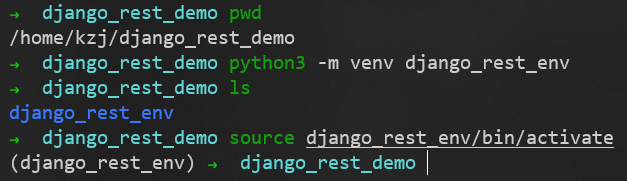
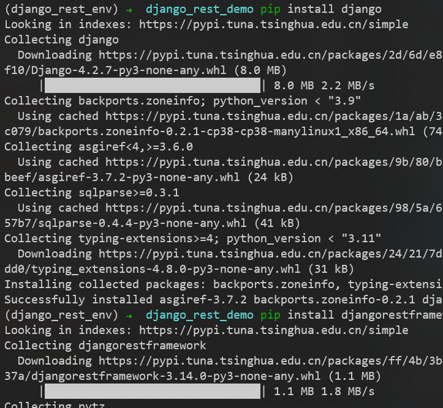
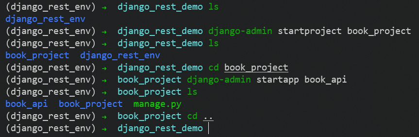
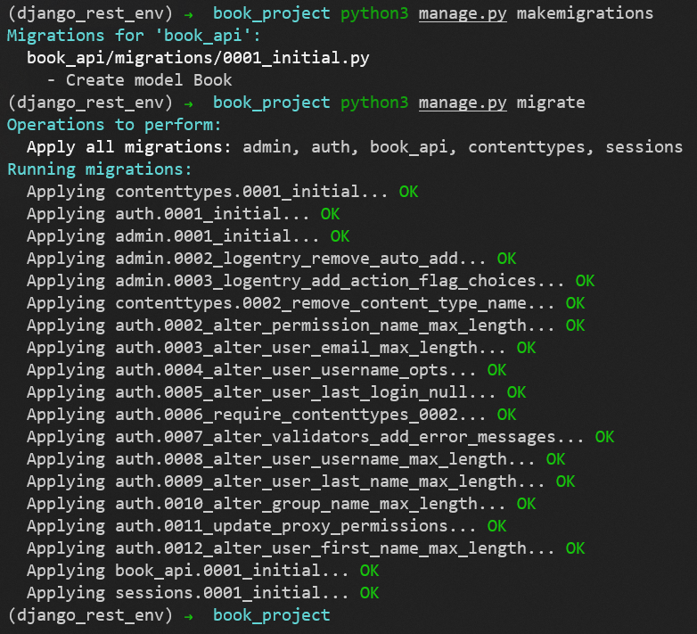
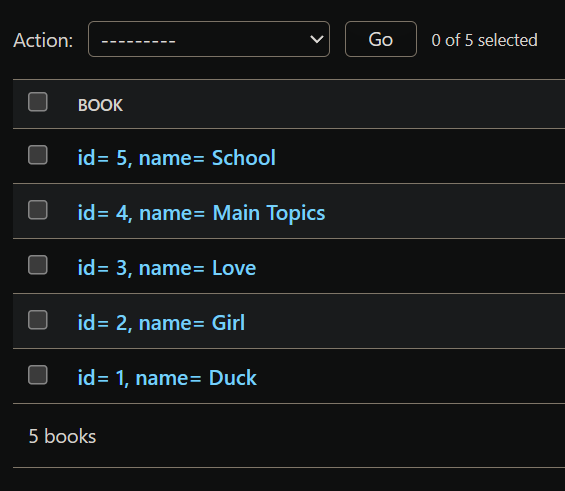

# Django REST 框架入门

基于Python构建一个以Django Rest框架为特征的博客应用程序API服务，并且该API服务支持CRUD（Create-Read-Update-Delete）功能

## 项目配置

在新创建的目录 /home/kzj/django_rest_demo 中
用如下命令创建一个名为 django_rest_env 的python虚拟环境
```sh
python3 -m venv django_rest_env
```
并用如下命令激活这个虚拟环境
```sh
source django_rest_env/bin/activate
```



在激活的虚拟环境中，用如下命令安装 django 和 djangorestframework
```sh
pip install django
pip install djangorestframework
```



用如下命令创建 book_project 项目和 book_api 应用
```sh
django-admin startproject book_project
django-admin startapp book_api
```



因为添加了一个新的app，我们需要告诉Django。因此，请确保将 book_api 添加到 setting.py 文件中的 INSTALLED_APPS 列表
```py
INSTALLED_APPS = [
    'django.contrib.admin',
    'django.contrib.auth',
    'django.contrib.contenttypes',
    'django.contrib.sessions',
    'django.contrib.messages',
    'django.contrib.staticfiles',
    'book_api',
]
```

### 如何停止使用虚拟环境

如果当前虚拟环境已经处于激活状态，可以使用如下命令退出虚拟环境
```sh
deactivate
```

### 如何删除虚拟环境

删除虚拟环境，只需要**将这个虚拟环境目录删除**即可

## 定义数据模型（Model）

在 models.py 文件的 Book 类中，我们创建2个字段: id、name
book_project/book_api/models.py 文件的内容修改为
```py
from django.db import models

class Book(models.Model):
    id = models.AutoField(primary_key=True)
    name = models.CharField(max_length=200)
    
    def __str__(self):
        return 'id= ' + str(self.id) + ', name= ' + str(self.name)
```

## 执行数据同步

创建新的迁移文件并更新同步到数据库
```sh
python3 manage.py makemigrations
python3 manage.py migrate
```



## 配置管理后台 admin

我们希望在Django的后台中管理我们的数据，因此，我们在 admin.py 文件中注册 Book 类
book_project/book_api/admin.py 文件的内容修改为
```py
from django.contrib import admin
from . models import Book

admin.site.register(Book)
```

然后创建一个超级管理员帐户（用户名：admin，密码：123456）
```sh
python3 manage.py createsuperuser
```

启动 django web 服务
```sh
python3 manage.py runserver
```

进入 http://127.0.0.1:8000/admin/
手动添加一些 Book，如下图


到此，我们已经完成了Django部分，由于本示例是为了创建一个API服务，所以我们不需要创建模板和视图。相反，我们还需要继续添加 **Django Rest** 库来处理将模型数据转换为 **Rest API**

## Django Rest Framework 配置

### Django Rest Framework 简介

Django Rest Framework，简称为DRF，它是负责将数据库模型转换为 RESTful API。这个过程有两个主要步骤：
1. 首先通过序列化器将数据转换成JSON，这样就可以通过internet发送数据
2. 然后使用view来定义发送的数据

### INSTALLED_APPS中加入'rest_framework'

settings.py 文件中的 INSTALLED_APPS 部分修改如下
```py
INSTALLED_APPS = [
    'django.contrib.admin',
    'django.contrib.auth',
    'django.contrib.contenttypes',
    'django.contrib.sessions',
    'django.contrib.messages',
    'django.contrib.staticfiles',
    'book_api',
    'rest_framework',
]
```

### 创建序列化器（ModelSerializer）

序列化器用于将我们的数据转换成JSON格式
新建 book_project/book_api/serializers.py 文件，其内容如下
```py
from rest_framework import serializers
from . import models

# 用于序列化与反序列化
# 在视图中被调用
class BookSerializer(serializers.ModelSerializer):

  class Meta:
    # 关联数据表（前面不是变量名）
    model = models.Book
    # 确定需要序列化的字段（返回给用户的具体表中的字段）（前面不是变量名）
    fields = ['id', 'name']
    # 表示全部字段
    # fields = '__all__'
```

### 定义视图（ModelViewSet）

views.py 文件中创建 BookModelViewSet 类，这是一个视图集合
book_project/book_api/views.py 文件的内容修改为
```py
from rest_framework.viewsets import ModelViewSet
from . import models
from . import serializers
    
# 增删改查Book信息
class BookModelViewSet(ModelViewSet):
	# queryset 指明该视图集在查询数据时使用的查询集
    queryset = models.Book.objects.all()
	# serializer_class 指明该视图在进行序列化或反序列化时，使用的序列化器
    serializer_class = serializers.BookSerializer
```

[ModelViewSet基础讲解(纯干货)](https://blog.csdn.net/God_Hearing/article/details/108874433)

> ModelViewSet 是封装度最高的 DRF 的视图类，包含了增删改查中的所有接口操作

### 修改路由规则

#### 项目的路由配置

把 book_api 子应用中的路由文件加载到总路由文件中
book_project/book_project/urls.py 文件的内容修改为
```py
from django.contrib import admin
from django.urls import path, include

urlpatterns = [
    path('admin/', admin.site.urls),
    path('book_api/', include('book_api.urls')),
]
```
我们为 book_api 创建了一个名为 book_api/ 的路径

#### book_api 应用的路由配置（DefaultRouter）

接下来创建 book_api 应用的 urls.py 文件
新建 book_project/book_api/urls.py 文件，其内容如下
```py
from . import views
from rest_framework.routers import DefaultRouter

urlpatterns = []

# 可以处理视图的路由器
router = DefaultRouter()
# 向路由中注册视图集合
router.register('book', viewset=views.BookModelViewSet, basename='book')
# 将路由器中的路由信息追加到django的路由列表中
urlpatterns += router.urls
```

### 效果

首先启动服务器
```sh
python3 manage.py runserver
```

#### 使用浏览器测试

浏览器打开 http://127.0.0.1:8000/book_api/ ，这个界面是 DefaultRouter 帮我们生成的


打开 http://127.0.0.1:8000/book_api/book/ ，页面中以json格式显示所有的Book


页面底部可以添加Book


添加Book成功如下


打开 http://127.0.0.1:8000/book_api/book/1/ ，可以访问获取指定Book的数据（id为1的Book）


页面底部可以修改指定Book的数据，修改结果如下


可以删除指定Book


删除结果如下


#### 使用Postman测试


---
Postman
Swagger
Mock
Jmeter


---
[Django 运行流程解析](https://zhuanlan.zhihu.com/p/413091931)

[Django DRF 运行流程解析](https://zhuanlan.zhihu.com/p/415255012)