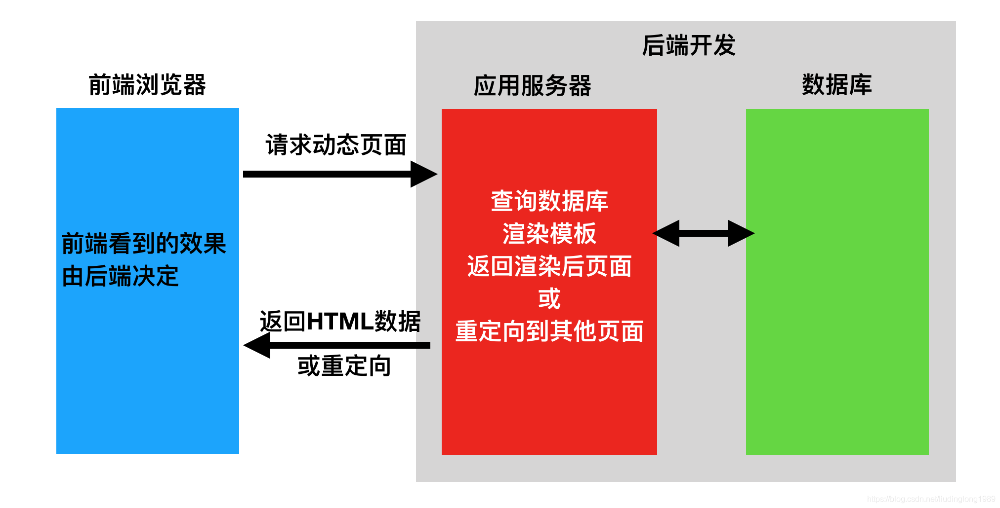
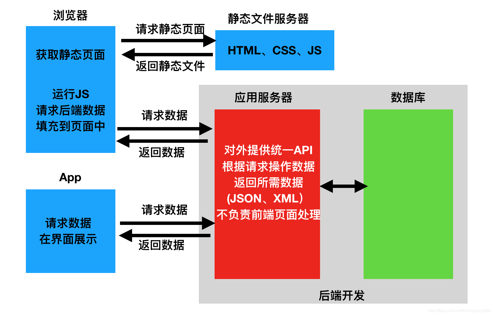

# 前后端分离与不分离

## 前后端不分离

在前后端不分离的应用模式中，前端页面看到的效果都是由后端控制，由后端渲染页面或重定向，也就是后端需要控制前端的展示，前端与后端的耦合度很高
这种应用模式比较适合纯网页应用，但是当后端对接App时，App可能并不需要后端返回一个HTML网页，而仅仅是数据本身，所以后端原本返回网页的接口不再适用于前端App应用，为了对接App后端还需再开发一套接口

请求的数据交互如下：


简单来说：前后端分不离的系统，没有前端，浏览器所看到的页面，是后端提供的，并且服务只有后台，没有前端服务

## 前后端分离

在前后端分离的应用模式中，后端仅返回前端所需的数据，不再渲染HTML页面，不再控制前端的效果。至于前端用户看到什么效果，从后端请求的数据如何加载到前端中，都由前端自己决定，网页有网页的处理方式，App有App的处理方式，但无论哪种前端，所需的数据基本相同，后端仅需开发一套逻辑对外提供数据即可
在前后端分离的应用模式中 ，前端与后端的耦合度相对较低。在前后端分离的应用模式中，我们通常将后端开发的每个视图都称为一个接口，或者API，前端通过访问接口来对数据进行增删改查

请求的数据交互如下：


简单来说：前后端分离的系统，有前端，浏览器所看到的页面，是前端服务提供，后台开发web接口提供数据给前端，前端需要处理之后再展示到浏览器上

#  Rest Api

[RESTful 架构详解](https://www.runoob.com/w3cnote/restful-architecture.html)

## API 简介

API 即 应用程序接口（英文：Application Programming Interface，简称API）。那么它是一个怎样的接口呢，现在我们常将它看成一个HTTP接口即 HTTP API。也就是说这个接口得通过HTTP的方式来调用，做过前后端开发的小伙伴可能知道，后端开发又叫做面向接口开发，我们往往会提供一个接口供前端调用，或者供其他服务调用。举个例子，我们程序中往往会涉及到调用第三方接口，比如调用支付宝或者微信的支付接口来实现我们程序中的支付功能、调用带三方的短信接口来向用户发送验证码短信等等

### HTTP API

比如说我们有一个可以允许我们查看（view），创建（create），编辑（edit），删除（delete）图书的应用程序。我们可以创建一个可以让我们执行这些功能的 HTTP API：
- http://demo.com/view_books
- http://demo.com/create_new_book?name=shuxue
- http://demo.com/update_book?id=1&name=shuxue
- http://demo.com/delete_book?id=1

这是4个 HTTP API，分别实现了图书的查看、新增、编辑、删除的操作，当我们把接口发布出去的时候，别人就可以通过这四个接口来调用相关的服务了。但是这样做有什么不方便的地方呢？你可能发现了，这种API的写法有一个缺点 ，那就是没有一个统一的风格，比如说第一个接口表示查询全部图书的信息，我们也可以写成这样：
- http://demo.com/books/list

那这样就会造成使用我们接口的其他人必须得参考API才能知道它是怎么运作的
不用担心，REST会帮我们解决这个问题

## Rest 简介

REST 即 表述性状态传递（英文：Representational State Transfer，简称REST），是一种软件架构风格。它是一种针对网络应用的设计和开发方式，可以降低开发的复杂性，提高系统的可伸缩性

### REST API

REST的作用是将我们上面提到的查看（view），创建（create），编辑（edit），删除（delete）直接映射到 HTTP 中已实现的 GET，POST，PUT，DELETE 方法

这四种方法是比较常用的，HTTP总共包含八种方法：
- GET
- POST
- PUT
- DELETE
- OPTIONS
- HEAD
- TRACE
- CONNECT

介绍到这里，我们重新将上面的四个接口改写成REST风格

查看所有图书：
- GET http://demo.com/books

新增一本书：
- POST http://demo.com/books
- Data: name=shuxue

修改一本书：
- PUT http://demo.com/books
- Data: id=1,name=shuxue

删除一本书：
- DELETE http://demo.com/books
- Data: id=1

这样改动之后API变得统一了，我们只需要改变请求方式就可以完成相关的操作，这样大大简化了我们接口的理解难度，变得易于调用，这就是REST风格的意义

### HTTP状态码

REST的另一重要部分就是为既定好请求的类型来响应正确的状态码。当你请求HTTP时，服务器会响应一个状态码来显示你的请求是否成功，然后客户端应如何继续。以下是四种不同层次的状态码：
- 2xx = Success（成功）
- 3xx = Redirect（重定向）
- 4xx = User error（客户端错误）
- 5xx = Server error（服务器端错误）

我们常见的是 200（请求成功）、404（未找到）、401（未授权）、500（服务器错误）

### API格式响应

上面介绍了REST API的写法，响应状态码，剩下就是请求的数据格式以及响应的数据格式。说的通俗点就是，我们用什么格式的参数去请求接口并且我们能得到什么格式的响应结果

我这里只介绍一种用的最多的格式：JSON格式
目前json已经发展成了一种最常用的数据格式，由于其轻量、易读的优点

所以我们经常会看到一个请求的header信息中有这样的参数：
```json
Accept:application/json
```
这个参数的意思就是接收来自后端的json格式的信息

#### json响应例子

```json
{
	"code": 200,
	"books": [{
		"id": 1,
		"name": "yuwen"
	}, {
		"id": 2,
		"name": "shuxue"
	}]
}
```

# Django REST 框架入门

基于Python构建一个以Django Rest框架为特征的博客应用程序API服务，并且该API服务支持CRUD（Create-Read-Update-Delete）功能

## 项目配置

在新创建的目录 /home/kzj/django_rest_demo 中
用如下命令创建一个名为 django_rest_env 的python虚拟环境
```sh
python3 -m venv django_rest_env
```
并用如下命令激活这个虚拟环境
```sh
source django_rest_env/bin/activate
```


在激活的虚拟环境中，用如下命令安装 django 和 djangorestframework
```sh
pip install django
pip install djangorestframework
```


用如下命令创建 book_project 项目和 book_api 应用
```sh
django-admin startproject book_project
django-admin startapp book_api
```


因为添加了一个新的app，我们需要告诉Django。因此，请确保将 book_api 添加到 setting.py 文件中的 INSTALLED_APPS 列表
```py
INSTALLED_APPS = [
    'django.contrib.admin',
    'django.contrib.auth',
    'django.contrib.contenttypes',
    'django.contrib.sessions',
    'django.contrib.messages',
    'django.contrib.staticfiles',
    'book_api',
]
```

### 如何停止使用虚拟环境

如果当前虚拟环境已经处于激活状态，可以使用如下命令退出虚拟环境
```sh
deactivate
```

### 如何删除虚拟环境

删除虚拟环境，只需要**将这个虚拟环境目录删除**即可

## 定义数据模型（Model）

在 models.py 文件的 Book 类中，我们创建2个字段: id、name
book_project/book_api/models.py 文件的内容修改为
```py
from django.db import models

class Book(models.Model):
    id = models.AutoField(primary_key=True)
    name = models.CharField(max_length=200)
    
    def __str__(self):
        return 'id= ' + str(self.id) + ', name= ' + str(self.name)
```

## 执行数据同步

创建新的迁移文件并更新同步到数据库
```sh
python3 manage.py makemigrations
python3 manage.py migrate
```


## 配置管理后台 admin

我们希望在Django的后台中管理我们的数据，因此，我们在 admin.py 文件中注册 Book 类
book_project/book_api/admin.py 文件的内容修改为
```py
from django.contrib import admin
from . models import Book

admin.site.register(Book)
```

然后创建一个超级管理员帐户（用户名：admin，密码：123456）
```sh
python3 manage.py createsuperuser
```

启动 django web 服务
```sh
python3 manage.py runserver
```

进入 http://127.0.0.1:8000/admin/
手动添加一些 Book，如下图


到此，我们已经完成了Django部分，由于本示例是为了创建一个API服务，所以我们不需要创建模板和视图。相反，我们还需要继续添加 **Django Rest** 库来处理将模型数据转换为 **Rest API**

## Django Rest Framework 配置

### Django Rest Framework 简介

Django Rest Framework，简称为DRF，它是负责将数据库模型转换为 RESTful API。这个过程有两个主要步骤：
1. 首先通过序列化器将数据转换成JSON，这样就可以通过internet发送数据
2. 然后使用view来定义发送的数据

### INSTALLED_APPS中加入'rest_framework'

settings.py 文件中的 INSTALLED_APPS 部分修改如下
```py
INSTALLED_APPS = [
    'django.contrib.admin',
    'django.contrib.auth',
    'django.contrib.contenttypes',
    'django.contrib.sessions',
    'django.contrib.messages',
    'django.contrib.staticfiles',
    'book_api',
    'rest_framework',
]
```

### 创建序列化器（ModelSerializer）

序列化器用于将我们的数据转换成JSON格式
新建 book_project/book_api/serializers.py 文件，其内容如下
```py
from rest_framework import serializers
from . import models

# 用于序列化与反序列化
# 在视图中被调用
class BookSerializer(serializers.ModelSerializer):

  class Meta:
    # 关联数据表（前面不是变量名）
    model = models.Book
    # 确定需要序列化的字段（返回给用户的具体表中的字段）（前面不是变量名）
    fields = ['id', 'name']
    # 表示全部字段
    # fields = '__all__'
```

### 定义视图（ModelViewSet）

views.py 文件中创建 BookModelViewSet 类，这是一个视图集合
book_project/book_api/views.py 文件的内容修改为
```py
from rest_framework.viewsets import ModelViewSet
from . import models
from . import serializers
    
# 增删改查Book信息
class BookModelViewSet(ModelViewSet):
	# queryset 指明该视图集在查询数据时使用的查询集
    queryset = models.Book.objects.all()
	# serializer_class 指明该视图在进行序列化或反序列化时，使用的序列化器
    serializer_class = serializers.BookSerializer
```

[ModelViewSet基础讲解(纯干货)](https://blog.csdn.net/God_Hearing/article/details/108874433)

> ModelViewSet 是封装度最高的 DRF 的视图类，包含了增删改查中的所有接口操作

### 修改路由规则

#### 项目的路由配置

把 book_api 子应用中的路由文件加载到总路由文件中
book_project/book_project/urls.py 文件的内容修改为
```py
from django.contrib import admin
from django.urls import path, include

urlpatterns = [
    path('admin/', admin.site.urls),
    path('book_api/', include('book_api.urls')),
]
```
我们为 book_api 创建了一个名为 book_api/ 的路径

#### book_api 应用的路由配置（DefaultRouter）

接下来创建 book_api 应用的 urls.py 文件
新建 book_project/book_api/urls.py 文件，其内容如下
```py
from . import views
from rest_framework.routers import DefaultRouter

urlpatterns = []

# 可以处理视图的路由器
router = DefaultRouter()
# 向路由中注册视图集合
router.register('book', viewset=views.BookModelViewSet, basename='book')
# 将路由器中的路由信息追加到django的路由列表中
urlpatterns += router.urls
```

### 效果

首先启动服务器
```sh
python3 manage.py runserver
```

#### 使用浏览器测试

浏览器打开 http://127.0.0.1:8000/book_api/ ，这个界面是 DefaultRouter 帮我们生成的


打开 http://127.0.0.1:8000/book_api/book/ ，页面中以json格式显示所有的Book


页面底部可以添加Book


添加Book成功如下


打开 http://127.0.0.1:8000/book_api/book/1/ ，可以访问获取指定Book的数据（id为1的Book）


页面底部可以修改指定Book的数据，修改结果如下


可以删除指定Book


删除结果如下


#### 使用Postman测试


---
Postman
Swagger
Mock
Jmeter


---
[Django 运行流程解析](https://zhuanlan.zhihu.com/p/413091931)

[Django DRF 运行流程解析](https://zhuanlan.zhihu.com/p/415255012)