Django Rest Framework，简称为DRF，它是负责将数据库模型转换为 RESTful API。这个过程有两个主要步骤：
1. 首先通过序列化器将数据转换成JSON，这样就可以通过internet发送数据
2. 然后使用view来定义发送的数据


### 创建序列化器（ModelSerializer）

序列化器用于将我们的数据转换成JSON格式
新建 book_project/book_api/serializers.py 文件，其内容如下
```py
from rest_framework import serializers
from . import models

# 用于序列化与反序列化
# 在视图中被调用
class BookSerializer(serializers.ModelSerializer):

  class Meta:
    # 关联数据表（前面不是变量名）
    model = models.Book
    # 确定需要序列化的字段（返回给用户的具体表中的字段）（前面不是变量名）
    fields = ['id', 'name']
    # 表示全部字段
    # fields = '__all__'
```

### 定义视图（ModelViewSet）

views.py 文件中创建 BookModelViewSet 类，这是一个视图集合
book_project/book_api/views.py 文件的内容修改为
```py
from rest_framework.viewsets import ModelViewSet
from . import models
from . import serializers
    
# 增删改查Book信息
class BookModelViewSet(ModelViewSet):
	# queryset 指明该视图集在查询数据时使用的查询集
    queryset = models.Book.objects.all()
	# serializer_class 指明该视图在进行序列化或反序列化时，使用的序列化器
    serializer_class = serializers.BookSerializer
```

[ModelViewSet基础讲解(纯干货)](https://blog.csdn.net/God_Hearing/article/details/108874433)

> ModelViewSet 是封装度最高的 DRF 的视图类，包含了增删改查中的所有接口操作

### 修改路由规则

#### 项目的路由配置

把 book_api 子应用中的路由文件加载到总路由文件中
book_project/book_project/urls.py 文件的内容修改为
```py
from django.contrib import admin
from django.urls import path, include

urlpatterns = [
    path('admin/', admin.site.urls),
    path('book_api/', include('book_api.urls')),
]
```
我们为 book_api 创建了一个名为 book_api/ 的路径

#### book_api 应用的路由配置（DefaultRouter）

接下来创建 book_api 应用的 urls.py 文件
新建 book_project/book_api/urls.py 文件，其内容如下
```py
from . import views
from rest_framework.routers import DefaultRouter

urlpatterns = []

# 可以处理视图的路由器
router = DefaultRouter()
# 向路由中注册视图集合
router.register('book', viewset=views.BookModelViewSet, basename='book')
# 将路由器中的路由信息追加到django的路由列表中
urlpatterns += router.urls
```

### 效果

首先启动服务器
```sh
python3 manage.py runserver
```

#### 使用浏览器测试

浏览器打开 http://127.0.0.1:8000/book_api/ ，这个界面是 DefaultRouter 帮我们生成的
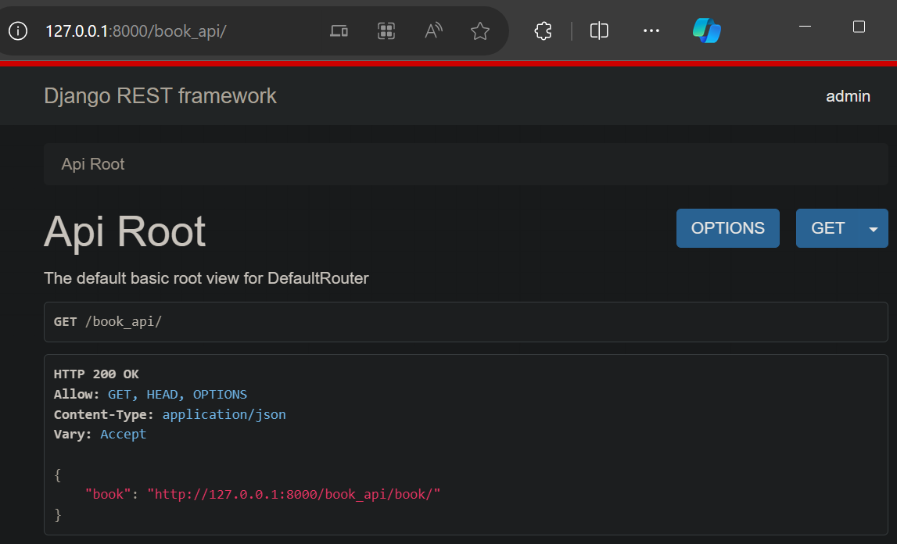

打开 http://127.0.0.1:8000/book_api/book/ ，页面中以json格式显示所有的Book
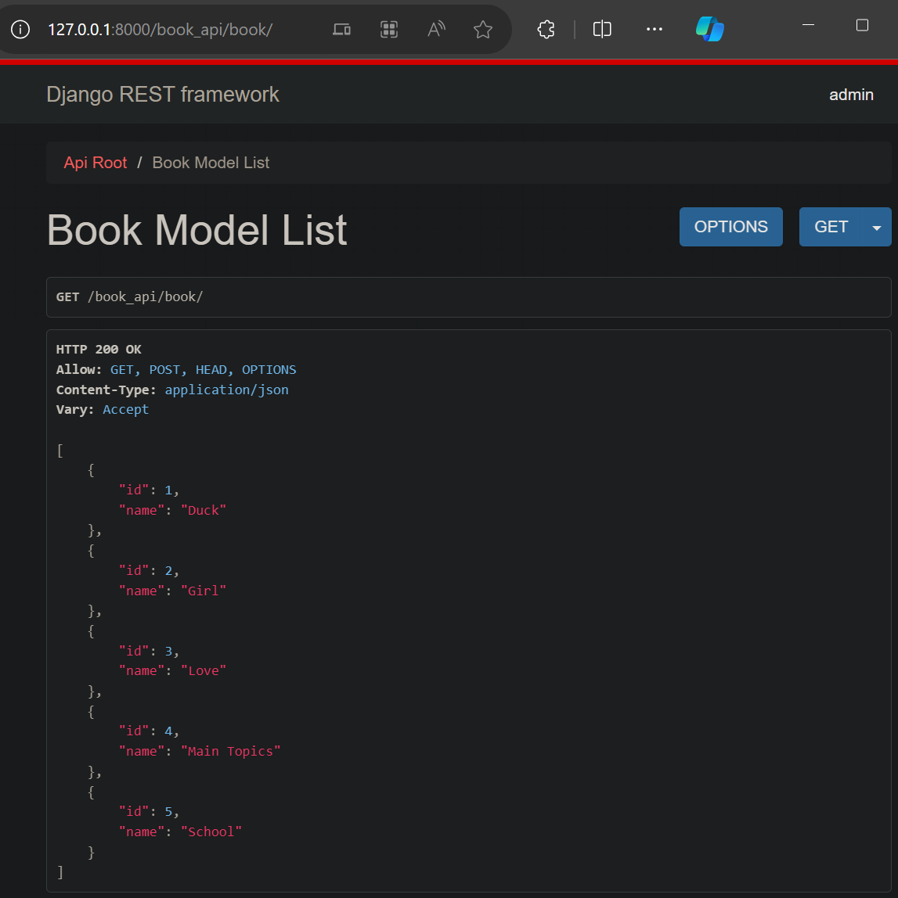

页面底部可以添加Book
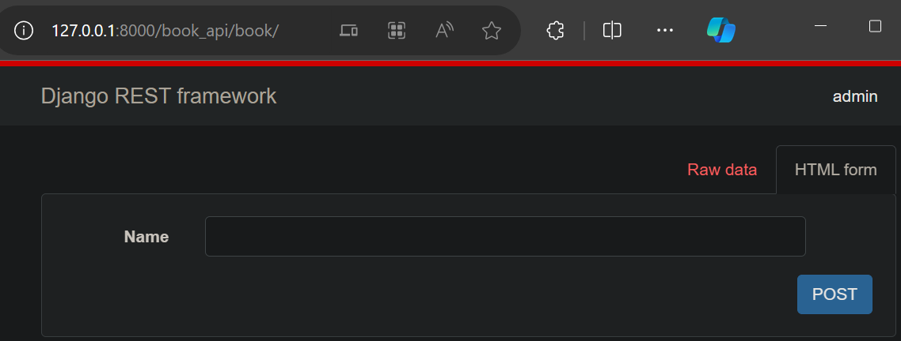

添加Book成功如下
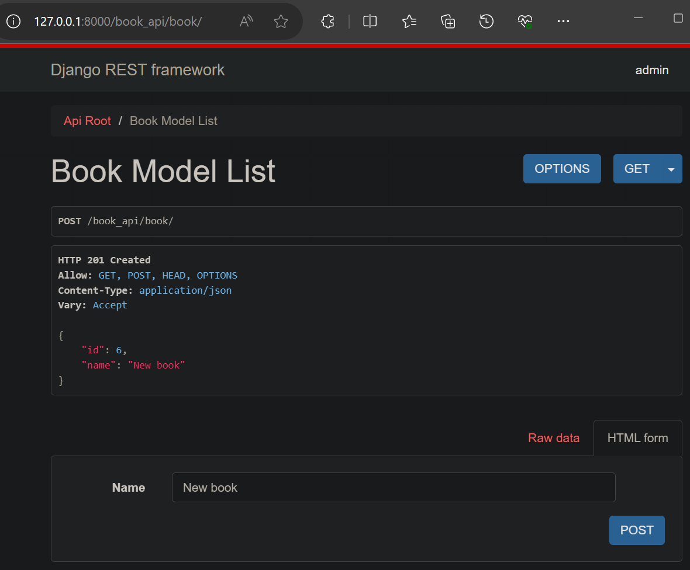

打开 http://127.0.0.1:8000/book_api/book/1/ ，可以访问获取指定Book的数据（id为1的Book）
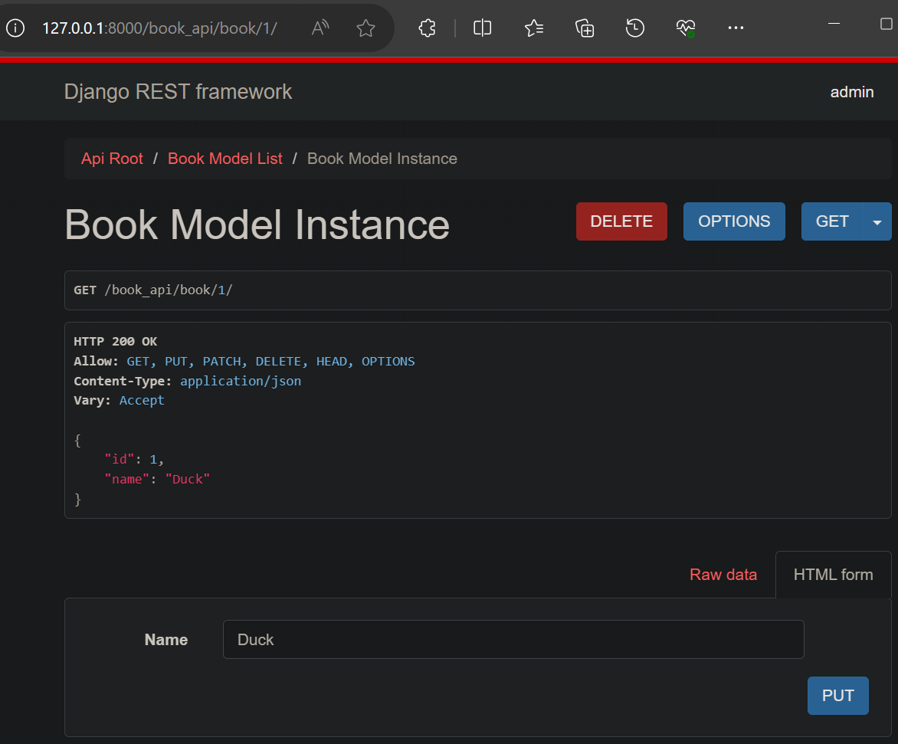

页面底部可以修改指定Book的数据，修改结果如下
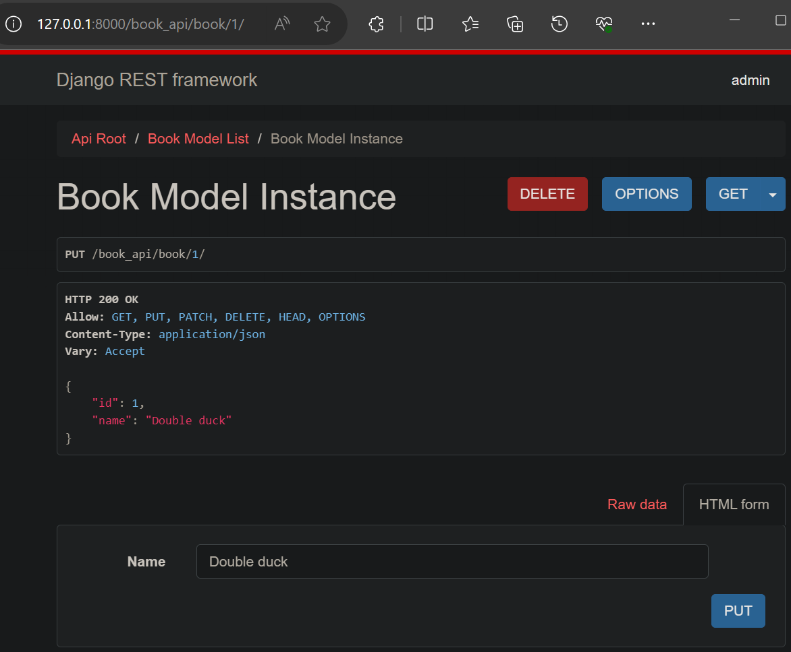

可以删除指定Book
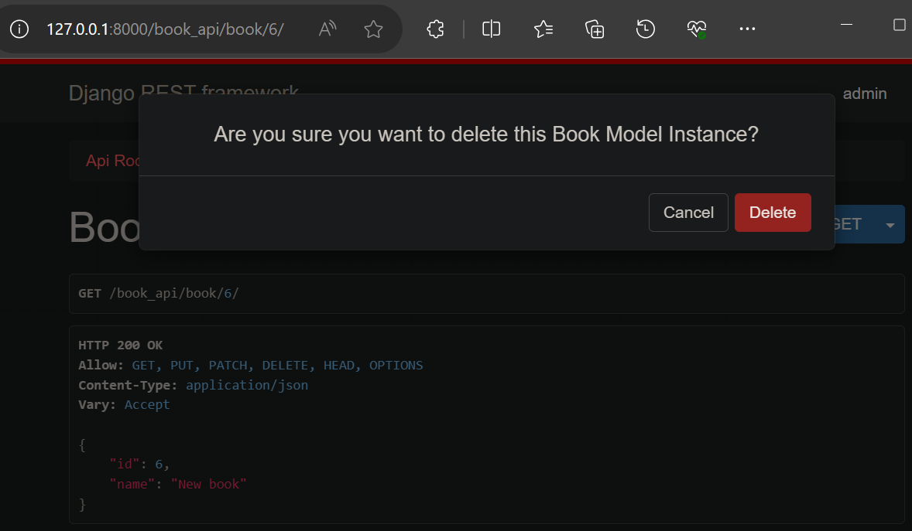

删除结果如下
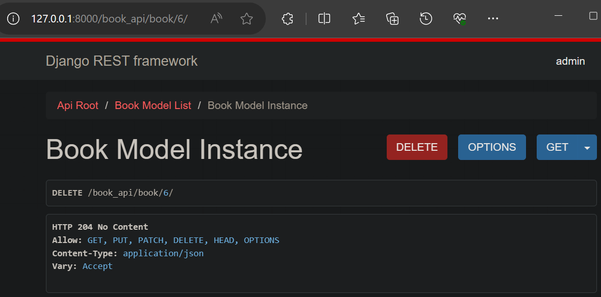

#### 使用Postman测试

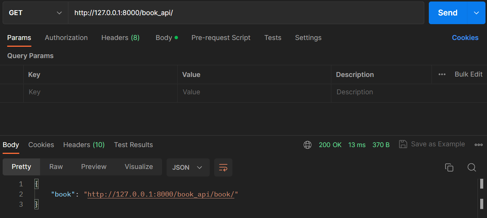

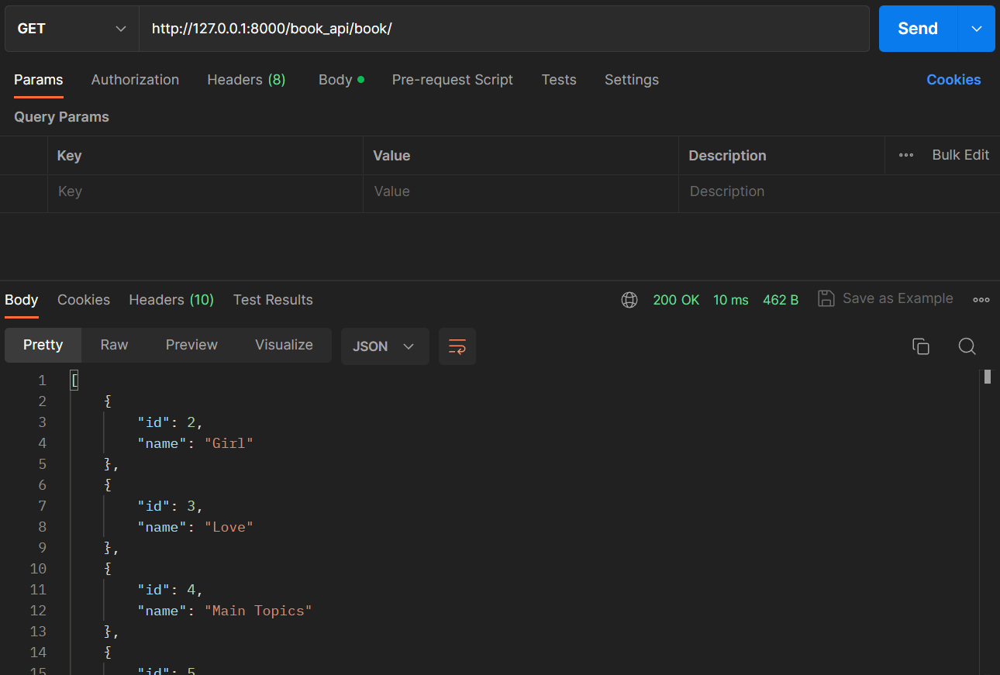

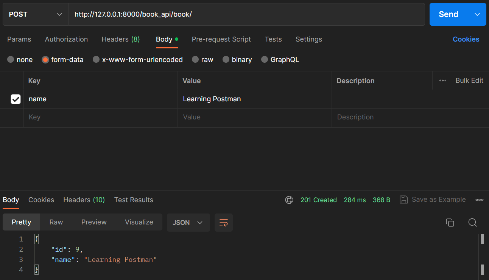

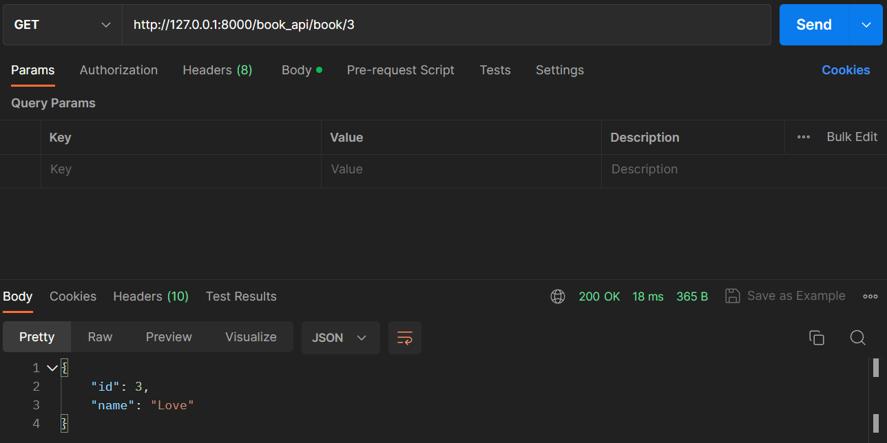

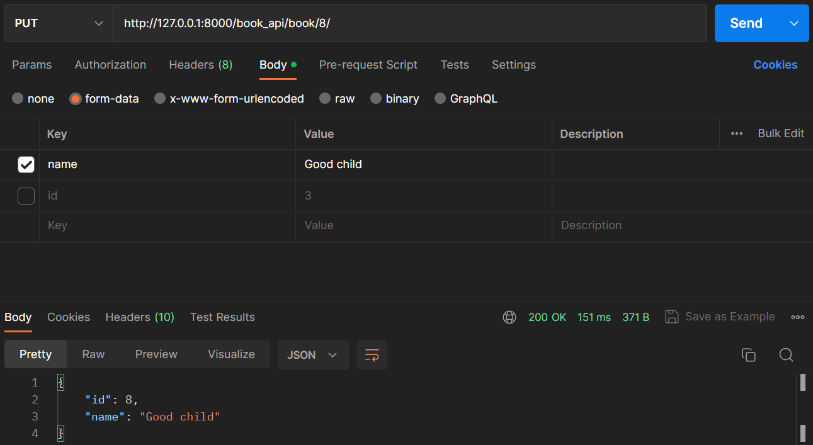

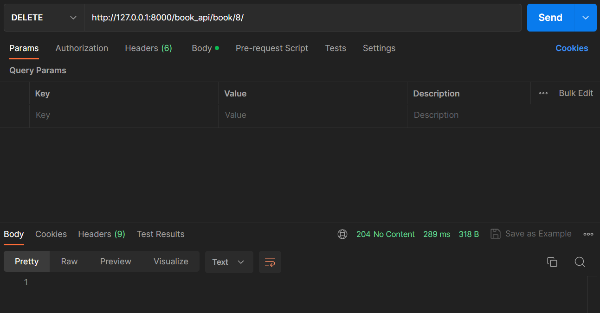


---
Postman
Swagger
Mock
Jmeter


---
[Django 运行流程解析](https://zhuanlan.zhihu.com/p/413091931)

[Django DRF 运行流程解析](https://zhuanlan.zhihu.com/p/415255012)