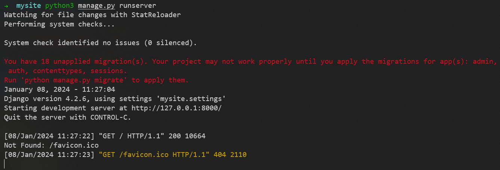
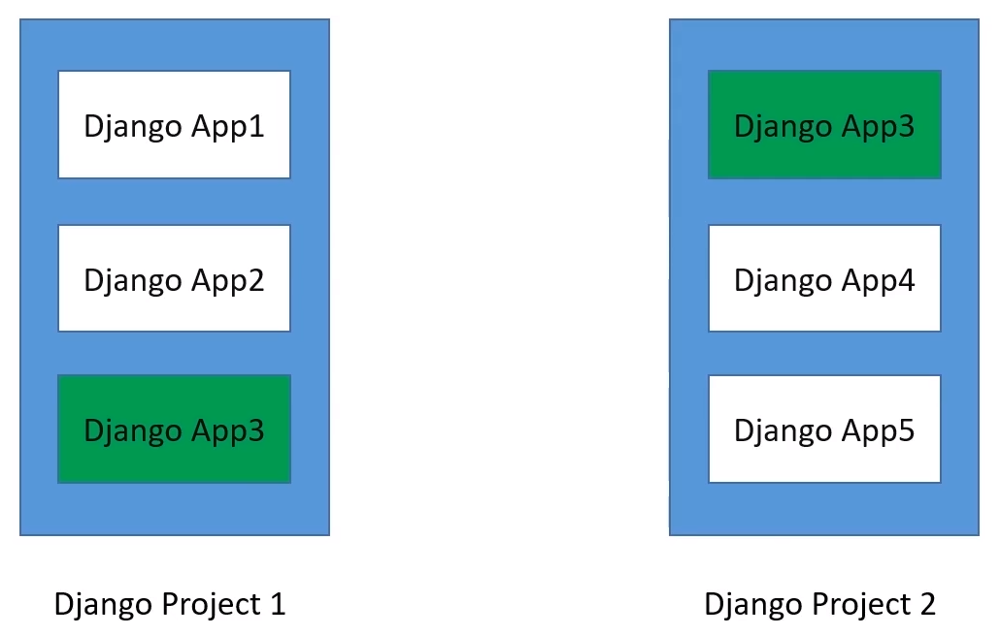

# Django

## 简介

- 开放源代码的著名 Python Web 框架
- MVC 模式（Model：模型，View：视图，Controller：控制器）

## 安装

```sh
pip install Django
```

查看版本
```sh
python3 -m django --version
```

## Django 项目（Project）

### 创建项目（startproject）

创建一个名为 mysite 的项目
```sh
python3 -m django startproject mysite
```

### 项目目录结构

让我们看看 startproject 创建了些什么：
```sh
mysite/
    manage.py
    mysite/
        __init__.py
        settings.py
        urls.py
        asgi.py
        wsgi.py
```

这些目录和文件的用处是：
- **最外层的 mysite/ 根目录**：只是项目的容器，根目录名称对 Django 没有影响，你可以将它重命名为任何你喜欢的名称
- **manage.py**：一个让你用各种方式管理 Django 项目的命令行工具
- **里面一层的 mysite/ 目录**：包含你的项目，它是一个纯 Python 包。它的名字就是当你引用它内部任何东西时需要用到的 Python 包名（比如 mysite.urls）
- **mysite/__init__.py**：一个空文件，告诉 Python 这个目录应该被认为是一个 Python 包
- **mysite/settings.py**：Django 项目的配置文件（包括数据库配置，时区，安装的APP，中间件，日志配置，以及一些基本的目录配置等，其本质上相当于一个基本的web工程的全局配置）
- **mysite/urls.py**：Django 项目的 URL 路由配置文件
- **mysite/asgi.py**：作为你的项目的运行在 ASGI 兼容的 Web 服务器上的入口
- **mysite/wsgi.py**：作为你的项目的运行在 WSGI 兼容的Web服务器上的入口

### 使用内置的简易服务器运行项目（runserver）

确认一下你的 Django 项目是否真的创建成功了。切换到外层的 mysite 目录，然后运行下面的命令
```sh
python3 manage.py runserver
```
你应该会看到如下输出


此时已经启动了 Django 开发服务器，这是一个用纯 Python 编写的轻量级网络服务器

服务器现在正在运行，通过浏览器访问 http://127.0.0.1:8000/ 


## Django 应用（App）

### Django应用 和 Django项目 的区别

1. 能否直接运行
   1. 一个 Django**项目**（是一个Web应用，可以直接运行）可以包含多个 Django应用
   2. 一个 Django**应用**（不可以直接运行）是一个包含业务逻辑的Python包，提供一定的功能
2. 包含的文件
   1. Django**项目** 包含 **模板、路由、静态文件**等
   2. Django**应用** 包含 **模型、视图、模板、路由、静态文件**等
3. Django应用 和 Django项目 之间的对应关系
   1. 
   2. 一个 Django项目 可以包含多个 Django应用
   3. 一个 Django应用 可以被包含到多个 Django项目 中，因为 Django应用 是**可重用**的Python包


### 创建应用（startapp）

创建一个名为 blog 的应用
```sh
python3 manage.py startapp blog
```

### 应用目录结构

让我们看看 startapp 创建了些什么：
```sh
blog/
    __init__.py
    admin.py
    apps.py
    models.py
    tests.py
    views.py
    urls.py（自行创建）
    migrations/
        __init__.py
```

这些目录和文件的用处是：
- **最外层的 blog/ 根目录**是应用的容器
- **__init__.py**：一个空文件，告诉 Python 这个目录应该被认为是一个 Python 包
- **admin.py**：定义Admin模块管理对象的文件
- **apps.py**：声明应用的文件
- **models.py**：定义应用**模型**的文件
- **tests.py**：编写应用测试用例的文件
- **views.py**：**视图**处理的文件
- **urls.py**：管理应用**路由**的文件
- **migrations/ 目录**：也称**迁移文件夹**，包含数据库模型的迁移脚本，这些文件用于更新数据库结构


