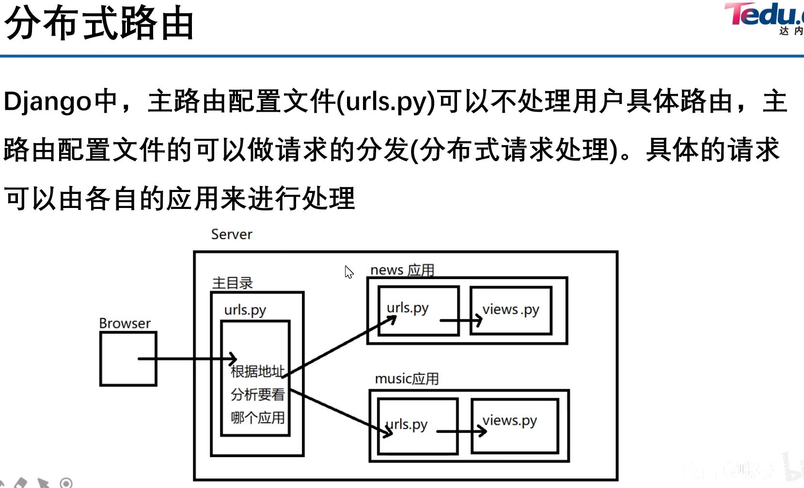
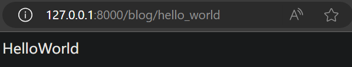
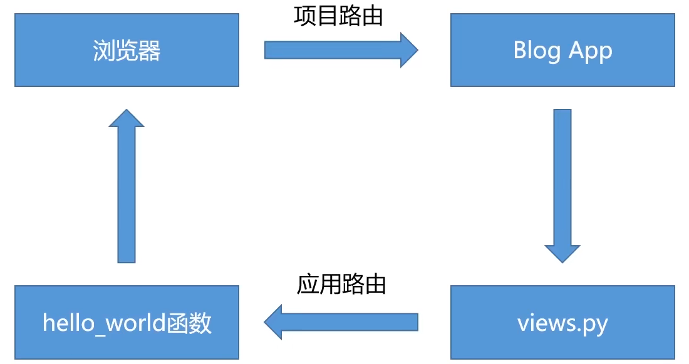

# HelloWorld

在之前创建的名为 blog 的应用中，编写 HelloWorld 代码

## Django 视图（View）

### 简介

在 Django 中，视图（View）是用于 **处理用户请求并返回响应** 的函数或类

**views.py文件**中包含对各个请求的处理逻辑

### 创建 Django 视图

当用户发来一个请求request时，我们把字符串 HelloWorld 封装成 HttpResponse 并返回

**blog/views.py** 文件内容修改为
```py
from django.http import HttpResponse

def hello_world(request):
    return HttpResponse("HelloWorld")
```

Django的 视图（View）通常和 URL路由 一起工作的。服务器在收到用户通过浏览器发来的请求后，会根据urls.py里的关系条目，去 视图（View）里查找到与请求对应的处理方法，从而返回给客户端http页面数据

## Django 路由（URLconf）



### 简介

**urls.py文件**中包含一个 **urlpatterns** 变量，其实它就是一个URL Dispacher（URL分派器），用于在 **URL** 和该URL要调用的 **视图** 之间建立一个**映射**，就是告诉Django对客户端发过来的某个URL应该调用执行哪一段逻辑代码

### 配置应用层次路由

新建 **blog/urls.py** 文件，内容为
```py
from django.urls import path
import blog.views as views

urlpatterns = [
    path("hello_world", views.hello_world),
]
```

### 配置项目层次路由

**mysite/mysite/urls.py** 文件内容修改为
```py
from django.contrib import admin
from django.urls import path, include

urlpatterns = [
    path('admin/', admin.site.urls),
    path("blog/", include("blog.urls")),
]
```

现在，运行开发服务器，访问 http://127.0.0.1:8000/blog/hello_world 就可以看到 "HelloWorld"


至此，我们打通了**请求和响应流程**



---


在4.md里面：

Path转换器
query_string查询字符串