# Django 模型（Model）

继续在之前创建的名为 blog 的应用中，设置数据库，创建第一个模型，使用 Django Shell 和 Django Admin 进行交互

## 简介

**模型层（Model）** 位于 Django **视图层（View）** 和 **数据库（DB）** 之间
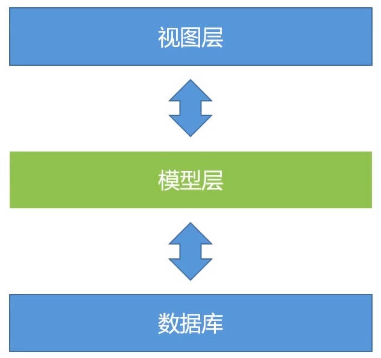

Django 模型（Model）使用自带的 ORM
**对象关系映射**（Object Relational Mapping，简称 **ORM** ）用于实现面向对象编程语言里不同类型系统的数据之间的转换（屏蔽不同数据库之间的差异）
ORM 在 **业务逻辑层** 和 **数据库层** 之间充当了桥梁的作用
ORM 是通过使用描述对象和数据库之间的映射的元数据，将程序中的对象自动**持久化**到数据库中（**Python对象** 和 **数据库表** 之前的转换）


**models.py文件**中包含一系列的**模型类**，每个模型类对应数据库中的一个表

## 数据库配置（databases）

**mysite/mysite/settings.py文件**，是个包含了 Django 项目设置的 Python 模块

> 通常，这个配置文件使用 SQLite 作为默认数据库

如果你想使用其他数据库，你需要安装合适的 database bindings ，然后改变设置文件中 DATABASES 'default' 项目中的一些键值：
- **ENGINE** ：可选值有 `'django.db.backends.sqlite3'`，`'django.db.backends.postgresql'`，`'django.db.backends.mysql'`，`'django.db.backends.oracle'` 等
- **NAME** ：数据库的名称（如果你使用 SQLite，数据库将是你电脑上的一个文件，在这种情况下，NAME 应该是此文件完整的绝对路径，包括文件名。默认值 `BASE_DIR / 'db.sqlite3'` 将把数据库文件储存在项目的根目录）
- **USER、PASSWORD、HOST、PORT** ：如果你不使用 SQLite，则必须添加一些额外设置

这里使用MySQL
创建名为djangodb的数据库
```sql
create database djangodb default charset=utf8;   
```

在settings.py文件中找到 DATABASES 配置项，将其修改为：
```py
DATABASES = {
    'default': {
        'ENGINE': 'django.db.backends.mysql',
        'NAME': 'djangodb',
        'HOST': '127.0.0.1',
        'PORT': 3306,
        'USER': 'root',
        'PASSWORD': '1',
    }
}
```

### 时区设置 TIME_ZONE、USE_TZ

在settings.py文件中启用时区设置
```py
# TIME_ZONE = 'UTC'
TIME_ZONE = 'Asia/Shanghai'
USE_TZ = True
```

Django如果开启了Time Zone功能，则所有的存储和内部处理，甚至包括直接print显示全都是UTC的。只有通过模板进行 表单输入 或 渲染输出 的时候，才会执行UTC与本地时间的转换

所以建议后台处理时间的时候，最好完全使用UTC，不要考虑本地时间的存在。而显示时间的时候，也避免手动转换，尽量使用Django模板系统代劳

除非应用支持用户设置自己所在的时区，通常我们不需要关心模板的时区问题。模板在展示时间的时候，会使用 settings.TIME_ZONE 中的设置自动把 UTC 时间转成 settings.TIME_ZONE 所在时区的时间渲染

启用 USE_TZ = True 后，处理时间方面，有两条"黄金法则"：
1. 保证存储到数据库中的是 UTC 时间
2. 在函数之间传递时间参数时，确保时间已经转换成 UTC 时间

比如，通常获取当前时间用的是：
```py
import datetime
now = datetime.datetime.now()
```

启用 USE_TZ = True 后，需要写成：
```py
import datetime 
from django.utils.timezone import utc
utcnow = datetime.datetime.utcnow().replace(tzinfo=utc)
```

### Error loading MySQLdb module 报错


解决方案：
第一步：安装pymysql
```sh
pip install pymysql
```
第二步：在 **\_\_init\_\_.py** 文件（与settings.py同一个目录）中引入模块和进行配置
```py
import pymysql
pymysql.install_as_MySQLdb()
```

## 创建博客文章模型（Model）


模型类 继承 `django.db.models.Model`

在这个博客应用中，需要创建两个模型，即 文章Article 和 作者Author：
- Article 模型有7个字段，文章id、标题、文章摘要、文章内容、发布时间、点赞数、作者，每个 Article 属于一个 Author，一个 Author 可对应 多个 Article（**一对多**的关系）
- Author 模型有2个字段，作者id、作者名

修改 **blog/models.py** 文件的内容为：
```py
from django.db import models

# 每个模型被表示为 django.db.models.Model 类的子类。每个模型有许多类变量，它们都表示模型里的一个数据库字段
class Author(models.Model):
    author_id = models.AutoField(primary_key=True)
    # 定义某些 Field 类实例需要参数。例如 CharField 需要一个 max_length 参数。这个参数的用处不止于用来定义数据库结构，也用于验证数据
    name = models.CharField(max_length=100)

class Article(models.Model):
    # 每个字段都是 Field 类的实例，这将告诉 Django 每个字段要处理的数据类型
    # 每个 Field 类实例变量的名字（例如 article_id 或 title）是字段名，所以最好使用对机器友好的格式，数据库会将它们作为列名
    # AutoField 是一个 IntegerField，它根据可用的ID自动递增
    article_id = models.AutoField(primary_key=True)
    title = models.TextField()
    # 为 Article.brief_content 定义了对人类友好的名字
    brief_content = models.TextField("文章摘要")
    content = models.TextField()
    # 使用参数 auto_now=True 后，无法使用ORM手动修改该字段，哪怕填充了字段的值也会被覆盖
    publish_time = models.DateTimeField(auto_now=True)
    support = models.IntegerField(default=0)
    # 使用 ForeignKey 定义了一个关系。这将告诉 Django，每个 Article 对象都关联到一个 Author 对象。Django 支持所有常用的数据库关系：一对多、多对多、一对一
    author = models.ForeignKey(Author, on_delete=models.CASCADE)
```

### 字段类型

#### 数值型

- `IntegerField()`：整数，对应数据库中 `int`
- `AutoField()`：自动增长的 `IntegerField()`，对应数据库中 `int`
- `BooleanField()`：布尔类型字段，对应数据库中 `tinyint(1)`
- `DecimalField()`：对应数据库中 `decimal(max_digits,decimal_places)`，开发对数据精准要求较高的业务时考虑使用
- `PositiveIntegerField()`：只可是正数的 `IntegerField()`
- `SmallIntegerField()`：只支持从 -32768 到 32767 的值的 `IntegerField()`

#### 字符型

- `CharField()`：需要 max_length 参数，对应数据库中 `varchar(max_length)`
- `URLField()`：继承自 `CharField()`，但是实现了对URL特特殊处理。用来存储URL数据，非URL数据可以在业务层就拒绝掉，不会存入数据库中
- `EmailField()`：继承自 `CharField()`，多了对email的特殊处理（用正则表达式检查）
- `FileField()`：继承自 `CharField()`，多了对文件的特殊处理
- `ImageField()`：继承自 `FileField()`，用来保存图片的路径（注意并不是图片本身）
- `UUIDField()`：用于保存UUID格式的数据，对应数据库中 `varchar(32)`
- `TextField()`：用于存放大量文本内容，对应数据库中 `longtext`

#### 日期型

- `DateField()`：对应数据库中 `date`
- `DateTimeField()`：对应数据库中 `datetime(6)`
- `TimeField()`：对应数据库中 `time`

#### 关系型
- `ForeignKey()`：一对多关系，外键字段
- `OneToOneField()`：一对一关系，外键字段
- `ManyToManyField()`：多对多关系，第三张表

注意：这里 对应的数据库，特指 MySQL数据库

### 字段选项（字段参数）

- primary_key：若为 True，则该字段会成为模型的**主键**字段，默认值是 False，一般作为 AutoField 的选项使用
- blank：如果为 True，则该字段允许为空白（在**Django Admin后台管理**中），默认值是 False，和 MySQL 中控制该列值是否可以为 NULL 是两回事
- null：如果为 True，表示允许为空，默认值是 False，对应 **MySQL 中控制该列值是否可以为 NULL**（建议 null 设置为 False，配合 default 选项使用）
- default：设置所在列的**默认值**
- db_index：若值为 True, 则在表中会为此字段创建**索引**（相当于目录），默认值是 False
- unique：如果为 True, 这个字段在表中是**唯一索引**，默认值是 False
- db_column：指定**列的名称**（一般情况下用不到），如果不指定，则使用字段名
- verbose_name：设置该字段在 Admin 界面上的显示名称，默认值为字段名

### 模型类的 Meta内部类

使用内部 Meat类 来给模型赋予属性，Meta类下有很多内建的类属性，可对模型类做一些控制

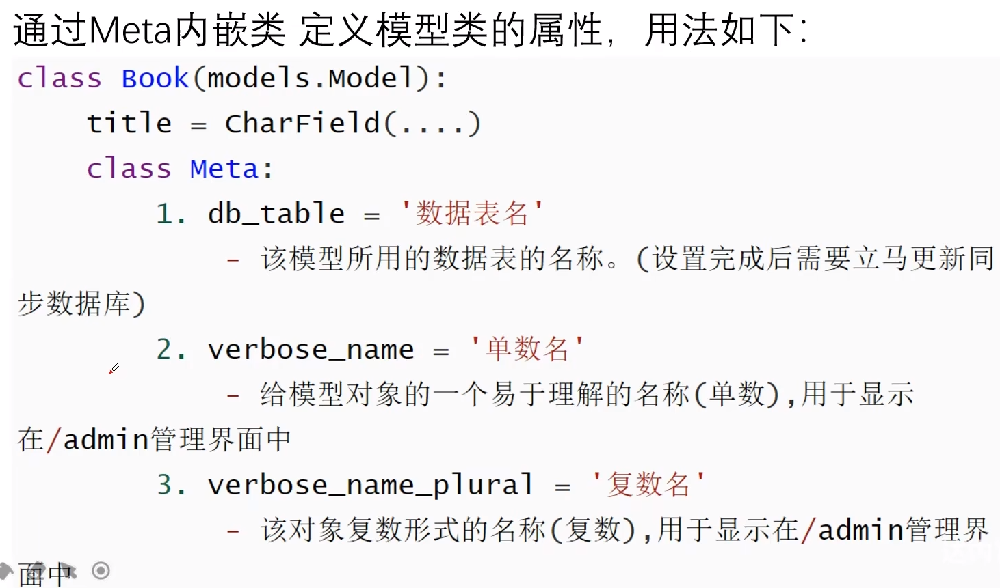

## 为模型的改变生成迁移文件（makemigrations）

[Django的 makemigrations 和 migrate 作用详解](https://blog.csdn.net/sinat_23133783/article/details/108692194)

> 执行完makemigrations只是生成了对应的sql语句，还并没真正将改动迁移到数据库中。需要执行migrate才能将改动迁移到数据库，完成建表、修改字段等操作。即，**makemigrations**生成ddl（数据库模式定义语言），**migrate**真正地去执行ddl

执行命令
```sh
python3 manage.py makemigrations blog
```

执行命令的效果如下


通过运行 makemigrations 命令，Django 会检测你对模型文件的修改，并且把修改的部分储存为一次迁移

迁移是 Django 对于模型定义（数据库结构）的变化的储存形式，它们其实也只是一些你磁盘上的文件，被储存在 **blog/migrations/0001_initial.py** 文件中
```py
# Generated by Django 4.2.6 on 2024-01-10 14:21
from django.db import migrations, models
import django.db.models.deletion

class Migration(migrations.Migration):
    initial = True

    dependencies = [
    ]

    operations = [
        migrations.CreateModel(
            name='Author',
            fields=[
                ('author_id', models.AutoField(primary_key=True, serialize=False)),
                ('name', models.CharField(max_length=100)),
            ],
        ),
        migrations.CreateModel(
            name='Article',
            fields=[
                ('article_id', models.AutoField(primary_key=True, serialize=False)),
                ('title', models.TextField()),
                ('brief_content', models.TextField(verbose_name='文章摘要')),
                ('content', models.TextField()),
                ('publish_time', models.DateTimeField(auto_now=True)),
                ('support', models.IntegerField(default=0)),
                ('author', models.ForeignKey(on_delete=django.db.models.deletion.CASCADE, to='blog.author')),
            ],
        ),
    ]
```

## 查看要执行的SQL（sqlmigrate）（可省略）

sqlmigrate 命令接收一个迁移的名称，然后返回对应的 SQL

执行命令
```sh
python3 manage.py sqlmigrate blog 0001
```

执行命令的效果如下


注意：
1. 输出的内容和你使用的数据库有关，上面的输出示例使用的是 MySQL
2. 数据库的表名是由应用名（blog）和模型名的小写形式（author 或 article）连接而来
3. 如果不手动创建主键，主键会被自动创建
4. 默认的，Django 会在外键字段名后追加字符串 `_id`
5. 外键关系由 FOREIGN KEY 生成
6. 它是为你正在使用的数据库定制的，因此特定于数据库的字段类型，例如"auto_increment"（MySQL）、"bigint PRIMARY KEY GENERATED BY DEFAULT AS IDENTITY"（PostgreSQL）或"integer primary key autoincrement"（SQLite）会自动为您处理
7. 这个 sqlmigrate 命令并没有真正在你的数据库中的执行迁移。相反，它只是把命令输出到屏幕上，让你看看 Django 认为需要执行哪些 SQL 语句

## 同步迁移文件到数据库（migrate）

此时执行 migrate 命令，在数据库里创建新定义的模型的数据表
```sh
python3 manage.py migrate
```

执行命令的效果如下
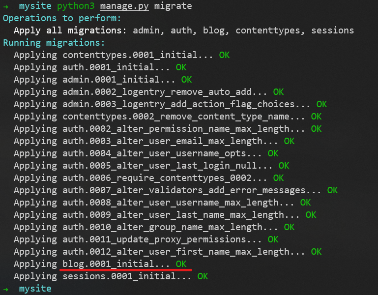

因为这是在本项目中第一次执行 migrate 命令，除了 blog 应用，默认开启的某些应用也需要至少一个数据表，所以能看到除了 blog.0001_initial.py 迁移文件（划红线），还有很多应用的迁移文件也需要同步到数据库

数据库中的表如下
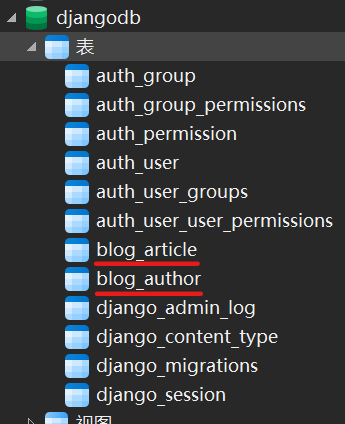
blog.0001_initial.py 迁移文件生成的数据表为 blog_article 和 blog_author（划红线）

migrate 命令选中所有还没有执行过的迁移（Django 通过在数据库中创建一个特殊的表 django_migrations 来跟踪执行过哪些迁移）并应用在数据库上，也就是将你对模型的更改同步到数据库结构上

## 总结

迁移是非常强大的功能，它能让你在开发过程中持续的改变数据库结构而不需要重新删除和创建表，它专注于使数据库平滑升级而不会丢失数据。现在，只需要记住这三步：

1. 编辑 `models.py` 文件，改变模型
2. 运行 `python3 manage.py makemigrations` 为模型的改变生成迁移文件
3. 运行 `python3 manage.py migrate` 来应用数据库迁移

# Django Shell

## 简介

Django的manager提供了shell工具，可以让我们在命令行中测试python代码，这样就极大的方便了调试Django代码

利用 Django Shell 可以**替代编写 View视图 的代码**来进行直接操作

## 使用Django Shell

通过以下命令打开 Python 命令行
```sh
python3 manage.py shell
```

> 我们使用这个命令而不是简单的使用 `python3` 是因为 manage.py 会设置 DJANGO_SETTINGS_MODULE 环境变量，这个变量会让 Django 根据 mysite/settings.py 文件来设置 Python 包的导入路径

在shell中可进行如下操作：
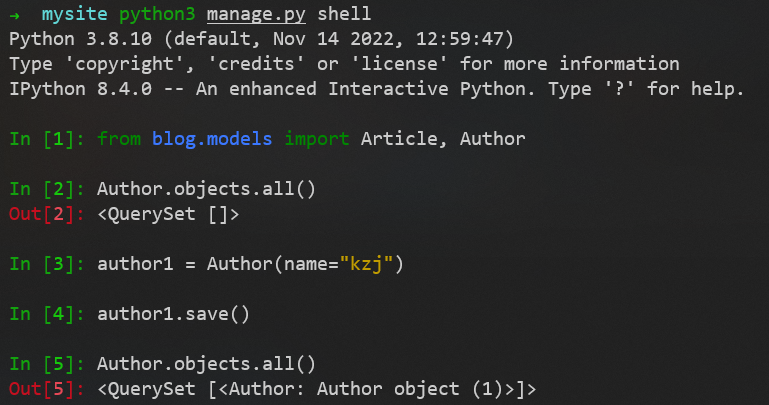

上图中的 `<QuerySet [<Author: Author object (1)>]>` 对于我们了解这个对象的细节没什么帮助，现在来修复这个问题
在 **blog/models.py** 文件中，给 Author类 和 Article类 增加 `__str__()` 方法
```py
from django.utils import timezone
import datetime
from django.db import models

# 每个模型被表示为 django.db.models.Model 类的子类。每个模型有许多类变量，它们都表示模型里的一个数据库字段
class Author(models.Model):
    author_id = models.AutoField(primary_key=True)
    # 定义某些 Field 类实例需要参数。例如 CharField 需要一个 max_length 参数。这个参数的用处不止于用来定义数据库结构，也用于验证数据
    name = models.CharField(max_length=100)
    # __str__() 方法
    def __str__(self):
        return str(self.author_id) + "," + self.name

class Article(models.Model):
    # 每个字段都是 Field 类的实例，这将告诉 Django 每个字段要处理的数据类型
    # 每个 Field 类实例变量的名字（例如 article_id 或 title）是字段名，所以最好使用对机器友好的格式，数据库会将它们作为列名
    # AutoField 是一个 IntegerField，它根据可用的ID自动递增
    article_id = models.AutoField(primary_key=True)
    title = models.TextField()
    # 为 Article.brief_content 定义了对人类友好的名字
    brief_content = models.TextField("文章摘要")
    content = models.TextField()
    # 使用参数 auto_now=True 后，无法使用ORM手动修改该字段，哪怕填充了字段的值也会被覆盖
    publish_time = models.DateTimeField(auto_now=True)
    support = models.IntegerField(default=0)
    # 使用 ForeignKey 定义了一个关系。这将告诉 Django，每个 Article 对象都关联到一个 Author 对象。Django 支持所有常用的数据库关系：一对多、多对多、一对一
    author = models.ForeignKey(Author, on_delete=models.CASCADE)
    # 添加一个自定义方法
    def was_published_recently(self):
        return self.publish_time >= timezone.now() - datetime.timedelta(days=1)
    # __str__() 方法
    def __str__(self):
        return str(self.article_id) + "," + self.title
```

给模型类增加 `__str__()` 方法是很重要的，这不仅能在 **shell命令行** 里使用带来方便，**Django Admin模块** 里也使用这个方法来表示对象

继续在shell中进行如下操作：
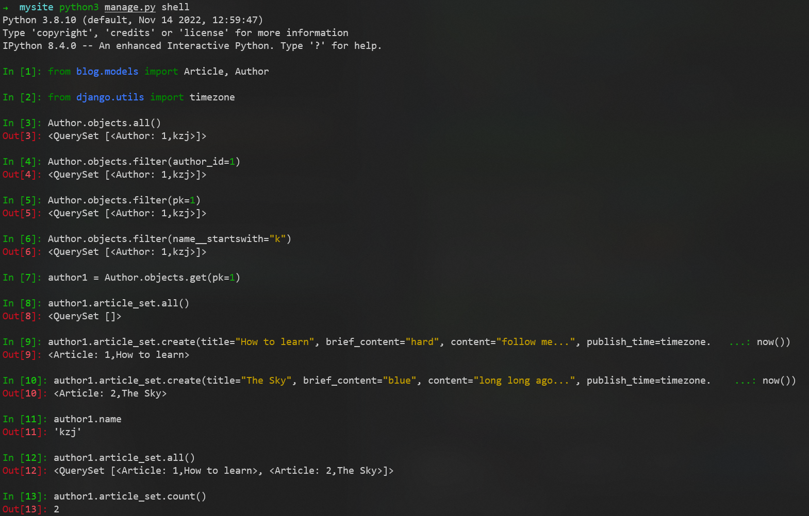

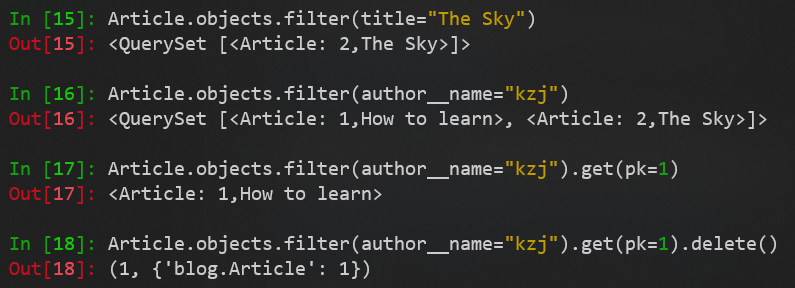

操作后，数据库表中的数据为：


# Django Admin

## 简介

Django Admin模块 是自带的一个基于Web的后台管理工具，它能够提供对Django模型（Model）及其数据的CRUD（Create、Read、Update、Delete）操作

之前使用的 Django Shell 使用起来比较复杂，Django Admin模块 使用更方便

## 使用Django Admin

### 创建管理员账号（createsuperuser）

```sh
python3 manage.py createsuperuser
```

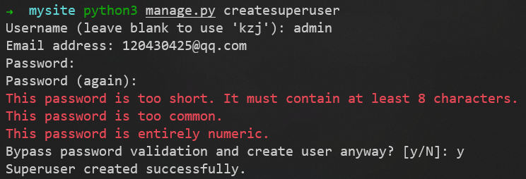
这里用户名设置为 admin，密码设置为 123456

### 登录页面进行管理

Django Admin模块 默认就是启用的

启动开发服务器，看看它是什么样的
```sh
python3 manage.py runserver
```

进入 http://127.0.0.1:8000/admin/ 输入用户名和密码登录，看到 Django Admin管理页面的索引页：
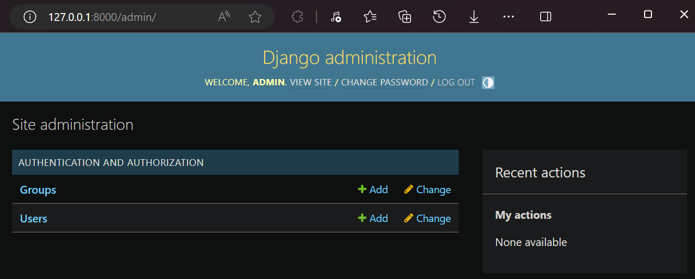

看到几种可编辑的内容：组和用户。它们是由 `django.contrib.auth` 提供的，这是 Django 开发的认证框架
但是没有看到我们创建的 **文章Article** 和 **作者Author** 模型，这是因为没有把它们注册到 Admin 里面

### 注册模型到 Admin（register）

通过 `admin.site.register()` 方法来注册模型到 Admin 里面

修改 **blog/admin.py** 文件的内容为：
```py
from django.contrib import admin
from .models import Article, Author

admin.site.register(Article)
admin.site.register(Author)
```

刷新 http://127.0.0.1:8000/admin/ 页面，看到 **文章Article** 和 **作者Author** 模型已经注册到 Admin 里面：
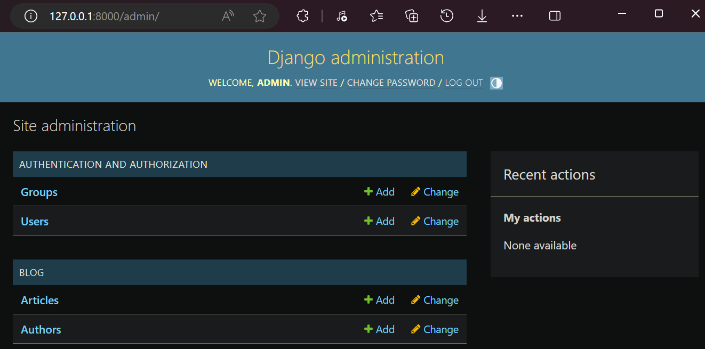

### 体验便捷的管理功能

点击 Articles


新增一条 Article
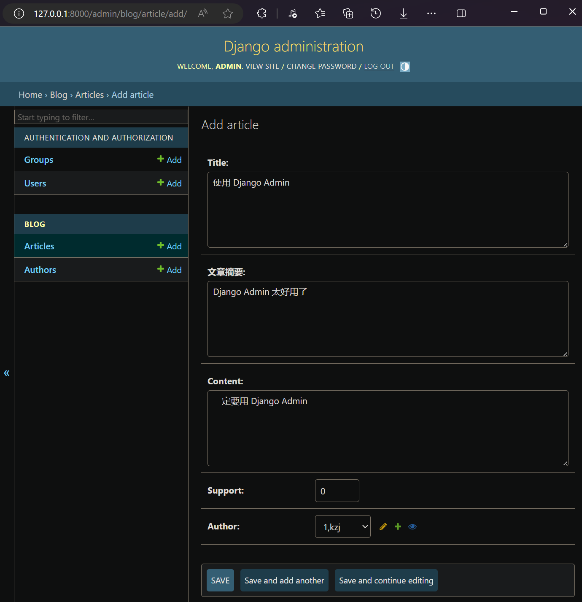

修改刚才新增的 Article，可以查看修改的历史记录


删除刚才修改的 Article
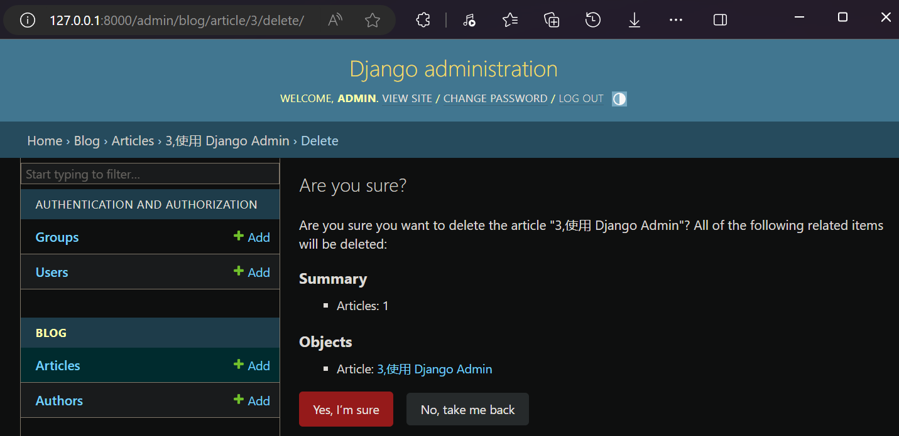

新增一些 Article 和 Author 数据，方便之后演示 渲染数据


### 完善列表中的数据显示样式（ModelAdmin）（完善 注册模型到 Admin）

发现 Django 自带的 **用户User** 模型，能显示好几个列，很直观
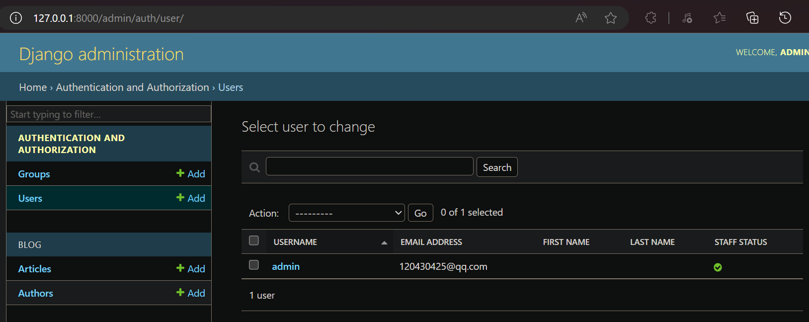

但是我们自己写的 **文章Article** 和 **作者Author** 模型，只能显示一列，不直观，怎么设置？


答：使用 **模型管理器类**（必须继承 `django.contrib.admin.ModelAdmin`）

修改 **blog/admin.py** 文件的内容为：
```py
from django.contrib import admin
from .models import Article, Author

# 模型管理器类
class ArticleAdmin(admin.ModelAdmin):
    # 列表页显示哪些字段的列
    list_display = ['article_id', 'title', 'brief_content', 'publish_time', 'support', 'author']
    # 控制 list_display 中的哪些字段，可以链接跳转到详情页
    list_display_links = ['title']
    # 过滤器，用来分类查询
    list_filter = ['author']
    # 添加搜索框，对指定的字段进行模糊查询
    search_fields = ['title', 'brief_content']
    # 添加可在列表页编辑的字段
    list_editable = ['support', 'author']

class AuthorAdmin(admin.ModelAdmin):
    list_display = ['author_id', 'name']

admin.site.register(Article, ArticleAdmin)
admin.site.register(Author, AuthorAdmin)

# admin.site.register(Article)
# admin.site.register(Author)
```
新定义的 **模型管理器类**，作为**第二个参数**传给 `admin.site.register()` 函数，这样就实现了自定义显示样式

访问 http://127.0.0.1:8000/admin/blog/article/ 页面和 http://127.0.0.1:8000/admin/blog/author/ 页面，效果如下


#### 简写（使用 装饰器）

修改 **blog/admin.py** 文件的内容为：
```py
from django.contrib import admin
from .models import Article, Author

@admin.register(Article)
class ArticleAdmin(admin.ModelAdmin):
    list_display = ['article_id', 'title', 'brief_content', 'publish_time', 'support', 'author']
    list_display_links = ['title']
    list_filter = ['author']
    search_fields = ['title', 'brief_content']
    list_editable = ['support', 'author']

@admin.register(Author)
class AuthorAdmin(admin.ModelAdmin):
    list_display = ['author_id', 'name']
```
在新定义的 **模型管理器类** 前面加上 `@admin.register()`

效果不变

# 实现博客数据返回页面

现在，数据库中已经有了数据，接下来实现通过网页来访问这些数据

## Django 视图（View）

**blog/views.py** 文件内容修改为
```py
from django.http import HttpResponse
from .models import Article

def hello_world(request):
    return HttpResponse("HelloWorld")

def first_article(request):
    article = Article.objects.all()[0]
    article_id = article.article_id
    title = article.title
    brief_content = article.brief_content
    content = article.content
    publish_time = article.publish_time
    support = article.support
    author = article.author
    return_str = "Article ID: %s\nTitle: %s\nBrief Content: %s\nContent: %s\nPublish Time: %s\nSupport: %s\nAuthor: %s" % (article_id, title, brief_content, content, publish_time, support, author)
    return HttpResponse(return_str)
```

## Django 路由（URLconf）

### 配置应用层次路由

**blog/urls.py** 文件内容修改为
```py
from django.urls import path
import blog.views as views

urlpatterns = [
    path("hello_world", views.hello_world),
    path("first_article", views.first_article),
]
```

### 配置项目层次路由

之前在 **mysite/mysite/urls.py** 文件中配置过了，无需再配置

现在，运行开发服务器，访问 http://127.0.0.1:8000/blog/first_article 就可以看到如下


