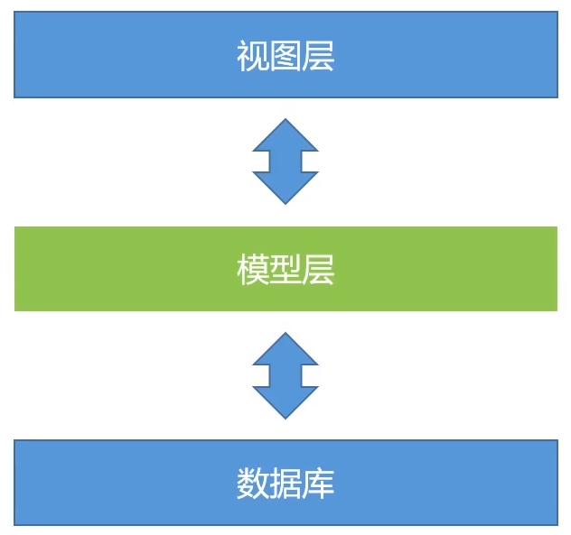
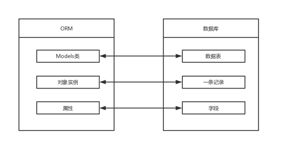

# Django 模型（Model）

## 简介

模型层 位于 Django **视图层（View）** 和 **数据库（DB）** 之间


Django 模型（Model）使用自带的 ORM
**对象关系映射**（Object Relational Mapping，简称 **ORM** ）用于实现面向对象编程语言里不同类型系统的数据之间的转换（屏蔽不同数据库之间的差异）
ORM 在 **业务逻辑层** 和 **数据库层** 之间充当了桥梁的作用
ORM 是通过使用描述对象和数据库之间的映射的元数据，将程序中的对象自动**持久化**到数据库中（**Python对象** 和 **数据库表** 之前的转换）


**models.py文件**中包含一系列的模型类，每个模型类对应数据库中的一个表

## 数据库配置（databases）

mysite/mysite/settings.py文件，是个包含了 Django 项目设置的 Python 模块

> 通常，这个配置文件使用 SQLite 作为默认数据库

如果你想使用其他数据库，你需要安装合适的 database bindings ，然后改变设置文件中 DATABASES 'default' 项目中的一些键值：
- **ENGINE** ：可选值有 'django.db.backends.sqlite3'，'django.db.backends.postgresql'，'django.db.backends.mysql'，'django.db.backends.oracle' 等
- **NAME** ：数据库的名称（如果你使用 SQLite，数据库将是你电脑上的一个文件，在这种情况下，NAME 应该是此文件完整的绝对路径，包括文件名。默认值 BASE_DIR / 'db.sqlite3' 将把数据库文件储存在项目的根目录）
- **USER、PASSWORD、HOST、PORT** ：如果你不使用 SQLite，则必须添加一些额外设置

这里使用MySQL
创建名为djangodb的数据库
```sql
create database djangodb default charset=utf8;   
```

在settings.py文件中找到 DATABASES 配置项，将其修改为：
```py
DATABASES = {
    'default': {
        'ENGINE': 'django.db.backends.mysql',
        'NAME': 'djangodb',
        'HOST': '127.0.0.1',
        'PORT': 3306,
        'USER': 'root',
        'PASSWORD': '1',
    }
}
```

### 时区设置 TIME_ZONE、USE_TZ

在settings.py文件中启用时区设置
```py
# TIME_ZONE = 'UTC'
TIME_ZONE = 'Asia/Shanghai'
USE_TZ = True
```

Django如果开启了Time Zone功能，则所有的存储和内部处理，甚至包括直接print显示全都是UTC的。只有通过模板进行表单输入/渲染输出的时候，才会执行UTC与本地时间的转换

所以建议后台处理时间的时候，最好完全使用UTC，不要考虑本地时间的存在。而显示时间的时候，也避免手动转换，尽量使用Django模板系统代劳

除非应用支持用户设置自己所在的时区，通常我们不需要关心模板的时区问题。模板在展示时间的时候，会使用 settings.TIME_ZONE 中的设置自动把 UTC 时间转成 settings.TIME_ZONE 所在时区的时间渲染

启用 USE_TZ = True 后，处理时间方面，有两条"黄金法则"：
1. 保证存储到数据库中的是 UTC 时间
2. 在函数之间传递时间参数时，确保时间已经转换成 UTC 时间

比如，通常获取当前时间用的是：
```py
import datetime
now = datetime.datetime.now()
```

启用 USE_TZ = True 后，需要写成：
```py
import datetime 
from django.utils.timezone import utc
utcnow = datetime.datetime.utcnow().replace(tzinfo=utc)
```

## 创建博客文章模型


# Django Shell


# Django Admin模块

## 简介

Django Admin模块 是自带的一个基于Web的后台管理工具，它能够提供对Django模型（Model）及其数据的CRUD（Create, Read, Update, Delete）操作

之前使用的 Django Shell 使用起来比较复杂，Django Admin模块 使用更方便

## 使用Django Admin模块

### 创建管理员账号（createsuperuser）

```sh
python3 manage.py createsuperuser
```


这里密码设置为 123456


### 登录页面进行管理


---

this:
django
https://www.bilibili.com/video/BV1Sf4y1v77f/

djangoREST
https://www.bilibili.com/video/BV1Dm4y1c7QQ/


djangoREST2
https://www.bilibili.com/video/BV1k5411p7Kp


django全套
https://www.bilibili.com/video/BV1vK4y1o7jH


P9


P6 7min installed_apps

跳过P11

---


