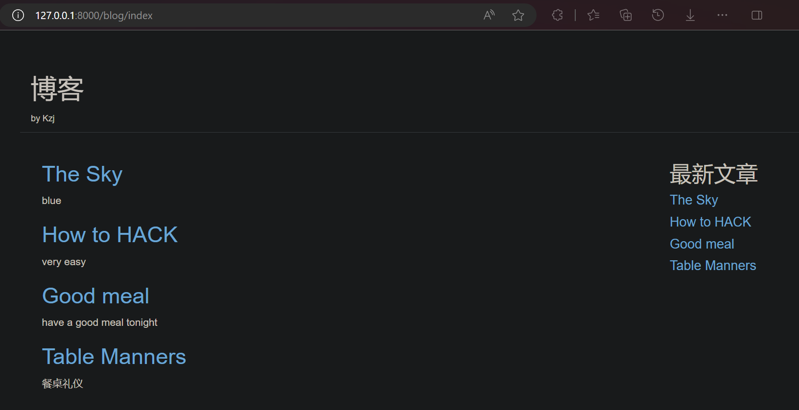
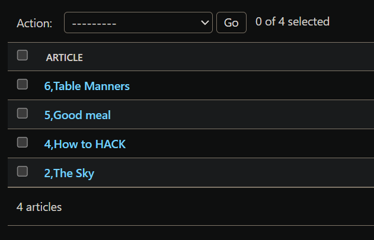

# Django 模板（Template）

## 使用 Bootstrap 实现静态博客页面

### 博客列表页面

新建 **blog/templates/** 文件夹
新建 **blog/templates/blog/** 文件夹，这里新建的 blog/ 子文件夹是**模板命名空间**

新建 **blog/templates/blog/index.html** 文件，内容为
```html
<!DOCTYPE html>
<html lang="en">
<head>
    <meta charset="UTF-8">
    <meta name="viewport" content="width=device-width, initial-scale=1.0">
    <title>blog</title>
    <!-- 最新版本的 Bootstrap 核心 CSS 文件 -->
    <link rel="stylesheet" href="https://cdn.bootcdn.net/ajax/libs/twitter-bootstrap/3.4.1/css/bootstrap.min.css" integrity="sha384-HSMxcRTRxnN+Bdg0JdbxYKrThecOKuH5zCYotlSAcp1+c8xmyTe9GYg1l9a69psu" crossorigin="anonymous">
    <!-- 可选的 Bootstrap 主题文件（一般不用引入） -->
    <link rel="stylesheet" href="https://cdn.bootcdn.net/ajax/libs/twitter-bootstrap/3.4.1/css/bootstrap-theme.min.css" integrity="sha384-6pzBo3FDv/PJ8r2KRkGHifhEocL+1X2rVCTTkUfGk7/0pbek5mMa1upzvWbrUbOZ" crossorigin="anonymous">
    <!-- 最新的 Bootstrap 核心 JavaScript 文件 -->
    <script src="https://cdn.bootcdn.net/ajax/libs/twitter-bootstrap/3.4.1/js/bootstrap.min.js" integrity="sha384-aJ21OjlMXNL5UyIl/XNwTMqvzeRMZH2w8c5cRVpzpU8Y5bApTppSuUkhZXN0VxHd" crossorigin="anonymous"></script>
</head>
<body>
    <div class="container page-header">
        <h1>博客</h1>
        <small>by Kzj</small>
    </div>
    <div class="container page-body">
        <div class="col-md-9" role="main">
            <div class="body-main">
                <div>
                    <h2><a href="#">文章标题1</a></h2>
                    <p>
                        开放源代码的著名 Python Web 框架
                    </p>
                </div>
                <div>
                    <h2><a href="#">文章标题2</a></h2>
                    <p>
                        MVC 模式（Model：模型，View：视图，Controller：控制器）
                    </p>
                </div>
                <div>
                    <h2><a href="#">文章标题3</a></h2>
                    <p>
                        真好吃
                    </p>
                </div>
            </div>
        </div>
        <div class="col-md-3" role="complementary">
            <h2>最新文章</h2>
            <h4><a href="#">最新文章1</a></h4>
            <h4><a href="#">最新文章2</a></h4>
            <h4><a href="#">最新文章3</a></h4>
            <h4><a href="#">最新文章4</a></h4>
            <h4><a href="#">最新文章5</a></h4>
            <h4><a href="#">最新文章6</a></h4>
        </div>
    </div>
</body>
</html>
```

想要用使用浏览器打开WSL中的这个文件，右键菜单中点击 **在文件资源管理器中显示**


然后打开这个文件


静态的博客列表页面的效果如下


### 文章详情页面

新建 **blog/templates/blog/detail.html** 文件，内容为
```html
<!DOCTYPE html>
<html lang="en">
<head>
    <meta charset="UTF-8">
    <meta name="viewport" content="width=device-width, initial-scale=1.0">
    <title>article</title>
    <!-- 最新版本的 Bootstrap 核心 CSS 文件 -->
    <link rel="stylesheet" href="https://cdn.bootcdn.net/ajax/libs/twitter-bootstrap/3.4.1/css/bootstrap.min.css" integrity="sha384-HSMxcRTRxnN+Bdg0JdbxYKrThecOKuH5zCYotlSAcp1+c8xmyTe9GYg1l9a69psu" crossorigin="anonymous">
    <!-- 可选的 Bootstrap 主题文件（一般不用引入） -->
    <link rel="stylesheet" href="https://cdn.bootcdn.net/ajax/libs/twitter-bootstrap/3.4.1/css/bootstrap-theme.min.css" integrity="sha384-6pzBo3FDv/PJ8r2KRkGHifhEocL+1X2rVCTTkUfGk7/0pbek5mMa1upzvWbrUbOZ" crossorigin="anonymous">
    <!-- 最新的 Bootstrap 核心 JavaScript 文件 -->
    <script src="https://cdn.bootcdn.net/ajax/libs/twitter-bootstrap/3.4.1/js/bootstrap.min.js" integrity="sha384-aJ21OjlMXNL5UyIl/XNwTMqvzeRMZH2w8c5cRVpzpU8Y5bApTppSuUkhZXN0VxHd" crossorigin="anonymous"></script>
</head>
<body>
    <div class="container page-header">
        <p>No.1</p>
        <h1>文章标题1</h1>
        <p>
            开放源代码的著名 Python Web 框架
        </p>
        <p>作者：kzj</p>
        <p>
            发布时间：2024-01-11 16:06:06.275426
        </p>
        <p>支持：123</p>
    </div>
    <div class="container body-main">
        <div>
            <p>
                我们都知道，Django是一种基于Python的Web开发框架。
            </p>
            <p>
                那么，什么是Web开发？Web开发指的是开发基于B/S架构，通过前后端的配合，将后台服务器的数据在浏览器上展现给前台用户的应用。比如将电子购物网站的商品数据在浏览器上展示给客户，在基于浏览器的学校系统管理平台上管理学生的数据，监控机房服务器的状态并将结果以图形化的形式展现出来等等。
            </p>
        </div>
    </div>
</body>
</html>
```

静态的文章详情页面的效果如下


现在，页面还是静态的，数据是写死在页面里的，后面我们要使用模板系统，实现动态的博客页面

## 模板系统 简介

为什么要使用模板系统？
1. `views.py` 视图文件不适合编码HTML
2. 使用了模板系统，页面设计的改变就不需要修改Python代码（**解耦**）
3. 网页**逻辑** 和 网页**视图** 应该分开设计

模板系统是什么？
1. 模板是可以**根据视图中传递的字典数据动态变化的html网页**
2. 用来分离页面的 表现**形式** 和 表现**内容**
3. 模板系统定义了特有的**标签占位符**

### 配置 模板系统


### 模板系统的 标签语法

- 变量标签：`{{ 变量 }}`
- for循环标签：`, `
- if-else分支标签：`, , `

### 模板过滤器

过滤器作用是在变量输出时，对输出的变量值做进一步的处理

语法格式：`{{ 变量 | 过滤器1:参数值1 | 过滤器2:参数值2 ... }}`


## 使用模板系统渲染博客页面

### 渲染 博客列表页面（Template、context）

修改 **blog/templates/blog/index.html** 文件的内容为：
```html
<!DOCTYPE html>
<html lang="en">
<head>
    <meta charset="UTF-8">
    <meta name="viewport" content="width=device-width, initial-scale=1.0">
    <title>blog</title>
    <!-- 最新版本的 Bootstrap 核心 CSS 文件 -->
    <link rel="stylesheet" href="https://cdn.bootcdn.net/ajax/libs/twitter-bootstrap/3.4.1/css/bootstrap.min.css" integrity="sha384-HSMxcRTRxnN+Bdg0JdbxYKrThecOKuH5zCYotlSAcp1+c8xmyTe9GYg1l9a69psu" crossorigin="anonymous">
    <!-- 可选的 Bootstrap 主题文件（一般不用引入） -->
    <link rel="stylesheet" href="https://cdn.bootcdn.net/ajax/libs/twitter-bootstrap/3.4.1/css/bootstrap-theme.min.css" integrity="sha384-6pzBo3FDv/PJ8r2KRkGHifhEocL+1X2rVCTTkUfGk7/0pbek5mMa1upzvWbrUbOZ" crossorigin="anonymous">
    <!-- 最新的 Bootstrap 核心 JavaScript 文件 -->
    <script src="https://cdn.bootcdn.net/ajax/libs/twitter-bootstrap/3.4.1/js/bootstrap.min.js" integrity="sha384-aJ21OjlMXNL5UyIl/XNwTMqvzeRMZH2w8c5cRVpzpU8Y5bApTppSuUkhZXN0VxHd" crossorigin="anonymous"></script>
</head>
<body>
    <div class="container page-header">
        <h1>博客</h1>
        <small>by Kzj</small>
    </div>
    <div class="container page-body">
        <div class="col-md-9" role="main">
            <div class="body-main">
                
                <div>
                    <h2><a href="#">{{ article.title }}</a></h2>
                    <p>
                        {{ article.brief_content }}
                    </p>
                </div>
                
            </div>
        </div>
        <div class="col-md-3" role="complementary">
            <h2>最新文章</h2>
            
            <h4><a href="#">{{ article.title }}</a></h4>
            
        </div>
    </div>
</body>
</html>
```

这里的 `article_list` 从哪里来？
来自 `blog/views.py`视图文件，接下来我们实现 `article_list`

修改 **blog/views.py** 文件的内容为：
```py
from django.http import HttpResponse
from django.template import loader
from .models import Article

# def hello_world(request):
#     return HttpResponse("HelloWorld")

def get_index_page(request):
    all_articles = Article.objects.all()
    # 使用提供指定模板文件路径的方式，创建Template对象
    template = loader.get_template("blog/index.html")
    # 一旦你创建 Template 对象，你可以用 context 来传递数据给它，context 是一个字典映射变量和它们的值
    # context 作为 view 与 template 之间的桥梁
    context = {"article_list": all_articles}
    # 调用 Template 对象的 render() 方法并传递 context 来填充模板
    return HttpResponse(template.render(context, request))
```
通过 `loader` 获取模板，通过 `HttpResponse` 进行响应

修改 **blog/urls.py** 文件的内容为：
```py
from django.urls import path
import blog.views as views

urlpatterns = [
    # path("hello_world", views.hello_world),
    path('index', views.get_index_page),
]
```

现在，运行开发服务器，访问 http://127.0.0.1:8000/blog/index 就可以看到如下


#### 一个快捷函数：render()

**载入模板，填充数据内容，再返回由它生成的 HttpResponse 对象**，是一个非常常用的操作流程。于是 Django 提供了一个快捷函数 `render()`

现在，用 `render()` 来重写 `get_index_page()`视图函数
修改 **blog/views.py** 文件的内容为：
```py
# from django.http import HttpResponse
# from django.template import loader
from django.shortcuts import render
from .models import Article

# def hello_world(request):
#     return HttpResponse("HelloWorld")

# def get_index_page(request):
#     all_articles = Article.objects.all()
#     template = loader.get_template("blog/index.html")
#     context = {"article_list": all_articles}
#     return HttpResponse(template.render(context, request))

def get_index_page(request):
    all_articles = Article.objects.all()
    context = {"article_list": all_articles}
    return render(request, "blog/index.html", context)
```

render() 函数将 **request对象** 作为其第一个参数，将 **模板名称** 作为其第二个参数，将 **context上下文字典** 作为其可选的第三个参数。它返回 **HttpResponse对象**

访问 http://127.0.0.1:8000/blog/index 效果不变

### 渲染 文章详情页面（Path转换器）

修改 **blog/templates/blog/detail.html** 文件的内容为：
```html
<!DOCTYPE html>
<html lang="en">
<head>
    <meta charset="UTF-8">
    <meta name="viewport" content="width=device-width, initial-scale=1.0">
    <title>article</title>
    <!-- 最新版本的 Bootstrap 核心 CSS 文件 -->
    <link rel="stylesheet" href="https://cdn.bootcdn.net/ajax/libs/twitter-bootstrap/3.4.1/css/bootstrap.min.css" integrity="sha384-HSMxcRTRxnN+Bdg0JdbxYKrThecOKuH5zCYotlSAcp1+c8xmyTe9GYg1l9a69psu" crossorigin="anonymous">
    <!-- 可选的 Bootstrap 主题文件（一般不用引入） -->
    <link rel="stylesheet" href="https://cdn.bootcdn.net/ajax/libs/twitter-bootstrap/3.4.1/css/bootstrap-theme.min.css" integrity="sha384-6pzBo3FDv/PJ8r2KRkGHifhEocL+1X2rVCTTkUfGk7/0pbek5mMa1upzvWbrUbOZ" crossorigin="anonymous">
    <!-- 最新的 Bootstrap 核心 JavaScript 文件 -->
    <script src="https://cdn.bootcdn.net/ajax/libs/twitter-bootstrap/3.4.1/js/bootstrap.min.js" integrity="sha384-aJ21OjlMXNL5UyIl/XNwTMqvzeRMZH2w8c5cRVpzpU8Y5bApTppSuUkhZXN0VxHd" crossorigin="anonymous"></script>
</head>
<body>
    <div class="container page-header">
        <p>No.{{ article.article_id }}</p>
        <h1>{{ article.title }}</h1>
        <p>{{ article.brief_content }}</p>
        <p>作者：{{ article.author.name }}</p>
        <p>发布时间：{{ article.publish_time }}</p>
        <p>支持：{{ article.support }}</p>
    </div>
    <div class="container body-main">
        <div>
            
            <p>{{ each_content }}</p>
            
        </div>
    </div>
</body>
</html>
```

同理，`article` 和 `content_list` 由 `blog/views.py`视图文件 实现

修改 **blog/views.py** 文件的内容为：
```py
from django.shortcuts import render
from .models import Article

def get_index_page(request):
    all_articles = Article.objects.all()
    context = {"article_list": all_articles}
    return render(request, "blog/index.html", context)

def get_detail_page(request, article_id):
    article = Article.objects.get(article_id=article_id)
    content_list = article.content.split('\n')
    context = {"article": article,
               "content_list": content_list,
               }
    return render(request, "blog/detail.html", context)
```

`get_detail_page()`视图函数 的 `article_id`参数 从哪里传递过来？
来自 `blog/urls.py`路由配置文件，接下来我们实现传递 `article_id`

修改 **blog/urls.py** 文件的内容为：
```py
from django.urls import path
import blog.views as views

urlpatterns = [
    path('index', views.get_index_page),
    path('detail/<int:article_id>', views.get_detail_page),
]
```

这里的 `/<int:article_id>` 是 **Path转换器**，表示接收一个整数类型的参数，并赋值给变量 `article_id`
然后这个 `article_id`变量，就会作为参数传递给 `get_detail_page()`视图函数

当前的 article文章 数据如下


现在，运行开发服务器，访问 http://127.0.0.1:8000/blog/detail/5 就可以看到如下

（article_id 为5的数据**存在**）

访问 http://127.0.0.1:8000/blog/detail/100 就可以看到如下

（article_id 为100的数据**不存在**）

### 实现 跳转到文章详情页面

已经实现了 博客列表页面 和 文章详情页面，现在，我们实现 博客列表页面 到 文章详情页面 的跳转

修改 **blog/templates/blog/index.html** 文件的内容为：
```html
<!DOCTYPE html>
<html lang="en">
<head>
    <meta charset="UTF-8">
    <meta name="viewport" content="width=device-width, initial-scale=1.0">
    <title>blog</title>
    <!-- 最新版本的 Bootstrap 核心 CSS 文件 -->
    <link rel="stylesheet" href="https://cdn.bootcdn.net/ajax/libs/twitter-bootstrap/3.4.1/css/bootstrap.min.css" integrity="sha384-HSMxcRTRxnN+Bdg0JdbxYKrThecOKuH5zCYotlSAcp1+c8xmyTe9GYg1l9a69psu" crossorigin="anonymous">
    <!-- 可选的 Bootstrap 主题文件（一般不用引入） -->
    <link rel="stylesheet" href="https://cdn.bootcdn.net/ajax/libs/twitter-bootstrap/3.4.1/css/bootstrap-theme.min.css" integrity="sha384-6pzBo3FDv/PJ8r2KRkGHifhEocL+1X2rVCTTkUfGk7/0pbek5mMa1upzvWbrUbOZ" crossorigin="anonymous">
    <!-- 最新的 Bootstrap 核心 JavaScript 文件 -->
    <script src="https://cdn.bootcdn.net/ajax/libs/twitter-bootstrap/3.4.1/js/bootstrap.min.js" integrity="sha384-aJ21OjlMXNL5UyIl/XNwTMqvzeRMZH2w8c5cRVpzpU8Y5bApTppSuUkhZXN0VxHd" crossorigin="anonymous"></script>
</head>
<body>
    <div class="container page-header">
        <h1>博客</h1>
        <small>by Kzj</small>
    </div>
    <div class="container page-body">
        <div class="col-md-9" role="main">
            <div class="body-main">
                
                <div>
                    <h2><a href="/blog/detail/{{ article.article_id }}">{{ article.title }}</a></h2>
                    <p>
                        {{ article.brief_content }}
                    </p>
                </div>
                
            </div>
        </div>
        <div class="col-md-3" role="complementary">
            <h2>最新文章</h2>
            
            <h4><a href="/blog/detail/{{ article.article_id }}">{{ article.title }}</a></h4>
            
        </div>
    </div>
</body>
</html>
```

只要修改 a标签 的 `href="/blog/detail/{{ article.article_id }}"` 即可实现跳转功能

### 实现 上下篇文章跳转

在页面底部增加两个按钮，分别可以跳转到上一篇文章和下一篇文章

修改 **blog/templates/blog/detail.html** 文件的内容为：
```html
<!DOCTYPE html>
<html lang="en">
<head>
    <meta charset="UTF-8">
    <meta name="viewport" content="width=device-width, initial-scale=1.0">
    <title>article</title>
    <!-- 最新版本的 Bootstrap 核心 CSS 文件 -->
    <link rel="stylesheet" href="https://cdn.bootcdn.net/ajax/libs/twitter-bootstrap/3.4.1/css/bootstrap.min.css" integrity="sha384-HSMxcRTRxnN+Bdg0JdbxYKrThecOKuH5zCYotlSAcp1+c8xmyTe9GYg1l9a69psu" crossorigin="anonymous">
    <!-- 可选的 Bootstrap 主题文件（一般不用引入） -->
    <link rel="stylesheet" href="https://cdn.bootcdn.net/ajax/libs/twitter-bootstrap/3.4.1/css/bootstrap-theme.min.css" integrity="sha384-6pzBo3FDv/PJ8r2KRkGHifhEocL+1X2rVCTTkUfGk7/0pbek5mMa1upzvWbrUbOZ" crossorigin="anonymous">
    <!-- 最新的 Bootstrap 核心 JavaScript 文件 -->
    <script src="https://cdn.bootcdn.net/ajax/libs/twitter-bootstrap/3.4.1/js/bootstrap.min.js" integrity="sha384-aJ21OjlMXNL5UyIl/XNwTMqvzeRMZH2w8c5cRVpzpU8Y5bApTppSuUkhZXN0VxHd" crossorigin="anonymous"></script>
</head>
<body>
    <div class="container page-header">
        <p>No.{{ article.article_id }}</p>
        <h1>{{ article.title }}</h1>
        <p>{{ article.brief_content }}</p>
        <p>作者：{{ article.author.name }}</p>
        <p>发布时间：{{ article.publish_time }}</p>
        <p>支持：{{ article.support }}</p>
    </div>
    <div class="container body-main">
        <div>
            
            <p>{{ each_content }}</p>
            
        </div>
    </div>
    <div>
        <nav>
            <ul class="pager">
                <li><a href="/blog/detail/{{ prev_article.article_id }}">上一篇：{{ prev_article.title }}</a></li>
                <li><a href="/blog/detail/{{ next_article.article_id }}">下一篇：{{ next_article.title }}</a></li>
            </ul>
        </nav>
    </div>
</body>
</html>
```

同理，`prev_article` 和 `next_article` 由 `blog/views.py`视图文件 实现

修改 **blog/views.py** 文件的内容为：
```py
from django.shortcuts import render
from .models import Article

def get_index_page(request):
    all_articles = Article.objects.all()
    context = {"article_list": all_articles}
    return render(request, "blog/index.html", context)

def get_detail_page(request, article_id):
    article = Article.objects.get(article_id=article_id)
    content_list = article.content.split('\n')
    prev_article = Article.objects.filter(article_id__lt=article_id).last()
    next_article = Article.objects.filter(article_id__gt=article_id).first()
    context = {"article": article,
               "content_list": content_list,
               "prev_article": prev_article,
               "next_article": next_article,
               }
    return render(request, "blog/detail.html", context)
```

访问 http://127.0.0.1:8000/blog/detail/4 就可以看到如下


### 实现 博客列表页面的分页（Paginator）（query_string查询字符串）

如果文章的数量太多，博客列表就会很长，现在，实现博客列表的分页功能

使用分页组件 `Paginator`

修改 **blog/views.py** 文件的内容为：
```py
from django.shortcuts import render
from django.core.paginator import Paginator
from .models import Article

def get_index_page(request):
    # 接收 127.0.0.1:8000/blog/index?page=1 中的page参数（通过 query_string查询字符串 传递）
    page = request.GET.get('page')
    if page:
        page = int(page)
    else:
        page = 1
    all_articles = Article.objects.all()
    # 创建分页组件
    paginator = Paginator(all_articles, 3)
    # 页总数
    num_pages = paginator.num_pages
    # 获取本页的文章
    page_articles = paginator.get_page(page)
    # 下一页
    next_page = (page+1) if (page_articles.has_next()) else (page)
    # 上一页
    prev_page = (page-1) if (page_articles.has_previous()) else (page) 
    context = {"article_list": all_articles,
               "page_range": range(1, num_pages + 1),
               "page_articles": page_articles,
               "curr_page": page,
               "next_page": next_page,
               "prev_page": prev_page,
               }
    return render(request, "blog/index.html", context)

def get_detail_page(request, article_id):
    article = Article.objects.get(article_id=article_id)
    content_list = article.content.split('\n')
    prev_article = Article.objects.filter(article_id__lt=article_id).last()
    next_article = Article.objects.filter(article_id__gt=article_id).first()
    context = {"article": article,
               "content_list": content_list,
               "prev_article": prev_article,
               "next_article": next_article,
               }
    return render(request, "blog/detail.html", context)
```

修改 **blog/templates/blog/index.html** 文件的内容为：
```html
<!DOCTYPE html>
<html lang="en">
<head>
    <meta charset="UTF-8">
    <meta name="viewport" content="width=device-width, initial-scale=1.0">
    <title>blog</title>
    <!-- 最新版本的 Bootstrap 核心 CSS 文件 -->
    <link rel="stylesheet" href="https://cdn.bootcdn.net/ajax/libs/twitter-bootstrap/3.4.1/css/bootstrap.min.css" integrity="sha384-HSMxcRTRxnN+Bdg0JdbxYKrThecOKuH5zCYotlSAcp1+c8xmyTe9GYg1l9a69psu" crossorigin="anonymous">
    <!-- 可选的 Bootstrap 主题文件（一般不用引入） -->
    <link rel="stylesheet" href="https://cdn.bootcdn.net/ajax/libs/twitter-bootstrap/3.4.1/css/bootstrap-theme.min.css" integrity="sha384-6pzBo3FDv/PJ8r2KRkGHifhEocL+1X2rVCTTkUfGk7/0pbek5mMa1upzvWbrUbOZ" crossorigin="anonymous">
    <!-- 最新的 Bootstrap 核心 JavaScript 文件 -->
    <script src="https://cdn.bootcdn.net/ajax/libs/twitter-bootstrap/3.4.1/js/bootstrap.min.js" integrity="sha384-aJ21OjlMXNL5UyIl/XNwTMqvzeRMZH2w8c5cRVpzpU8Y5bApTppSuUkhZXN0VxHd" crossorigin="anonymous"></script>
</head>
<body>
    <div class="container page-header">
        <h1>博客</h1>
        <small>by Kzj</small>
    </div>
    <div class="container page-body">
        <div class="col-md-9" role="main">
            <div class="body-main">
                
                <div>
                    <h2><a href="/blog/detail/{{ article.article_id }}">{{ article.title }}</a></h2>
                    <p>
                        {{ article.brief_content }}
                    </p>
                </div>
                
            </div>
            <div class="body-footer">
                <div class="col-md-4 col-md-offset-3">
                    <nav aria-label="Page navigation">
                        <ul class="pagination">
                            <li>
                                <a href="/blog/index?page={{ prev_page }}" aria-label="Previous">
                                    <span aria-hidden="true">&laquo;</span>
                                </a>
                            </li>
                            
                            <li><a href="/blog/index?page={{ num }}">{{ num }}</a></li>
                            
                            <li>
                                <a href="/blog/index?page={{ next_page }}" aria-label="Next">
                                    <span aria-hidden="true">&raquo;</span>
                                </a>
                            </li>
                        </ul>
                    </nav>
                </div>
            </div>
        </div>
        <div class="col-md-3" role="complementary">
            <h2>最新文章</h2>
            
            <h4><a href="/blog/detail/{{ article.article_id }}">{{ article.title }}</a></h4>
            
        </div>
    </div>
</body>
</html>
```

与 渲染文章详情页面 **向视图函数传递参数**的方式不同，所以 **blog/urls.py** 文件的内容无需修改

访问 http://127.0.0.1:8000/blog/index?page=1 就可以看到如下


### 实现 最近文章列表

把所有文章按照发布时间降序排序，取前5个

修改 **blog/views.py** 文件的内容为：
```py
from django.shortcuts import render
from django.core.paginator import Paginator
from .models import Article

def get_index_page(request):
    page = request.GET.get('page')
    if page:
        page = int(page)
    else:
        page = 1
    all_articles = Article.objects.all()
    # 取发布时间最新的前5个文章
    top5_articles = all_articles.order_by('-publish_time')[:5]
    paginator = Paginator(all_articles, 3)
    num_pages = paginator.num_pages
    page_articles = paginator.get_page(page)
    next_page = (page+1) if (page_articles.has_next()) else (page)
    prev_page = (page-1) if (page_articles.has_previous()) else (page)
    context = {"top5_articles": top5_articles,
               "page_range": range(1, num_pages + 1),
               "page_articles": page_articles,
               "curr_page": page,
               "next_page": next_page,
               "prev_page": prev_page,
               }
    return render(request, "blog/index.html", context)

def get_detail_page(request, article_id):
    article = Article.objects.get(article_id=article_id)
    content_list = article.content.split('\n')
    prev_article = Article.objects.filter(article_id__lt=article_id).last()
    next_article = Article.objects.filter(article_id__gt=article_id).first()
    context = {"article": article,
               "content_list": content_list,
               "prev_article": prev_article,
               "next_article": next_article,
               }
    return render(request, "blog/detail.html", context)
```

修改 **blog/templates/blog/index.html** 文件的内容为：
```html
<!DOCTYPE html>
<html lang="en">
<head>
    <meta charset="UTF-8">
    <meta name="viewport" content="width=device-width, initial-scale=1.0">
    <title>blog</title>
    <!-- 最新版本的 Bootstrap 核心 CSS 文件 -->
    <link rel="stylesheet" href="https://cdn.bootcdn.net/ajax/libs/twitter-bootstrap/3.4.1/css/bootstrap.min.css" integrity="sha384-HSMxcRTRxnN+Bdg0JdbxYKrThecOKuH5zCYotlSAcp1+c8xmyTe9GYg1l9a69psu" crossorigin="anonymous">
    <!-- 可选的 Bootstrap 主题文件（一般不用引入） -->
    <link rel="stylesheet" href="https://cdn.bootcdn.net/ajax/libs/twitter-bootstrap/3.4.1/css/bootstrap-theme.min.css" integrity="sha384-6pzBo3FDv/PJ8r2KRkGHifhEocL+1X2rVCTTkUfGk7/0pbek5mMa1upzvWbrUbOZ" crossorigin="anonymous">
    <!-- 最新的 Bootstrap 核心 JavaScript 文件 -->
    <script src="https://cdn.bootcdn.net/ajax/libs/twitter-bootstrap/3.4.1/js/bootstrap.min.js" integrity="sha384-aJ21OjlMXNL5UyIl/XNwTMqvzeRMZH2w8c5cRVpzpU8Y5bApTppSuUkhZXN0VxHd" crossorigin="anonymous"></script>
</head>
<body>
    <div class="container page-header">
        <h1>博客</h1>
        <small>by Kzj</small>
    </div>
    <div class="container page-body">
        <div class="col-md-9" role="main">
            <div class="body-main">
                
                <div>
                    <h2><a href="/blog/detail/{{ article.article_id }}">{{ article.title }}</a></h2>
                    <p>
                        {{ article.brief_content }}
                    </p>
                </div>
                
            </div>
            <div class="body-footer">
                <div class="col-md-4 col-md-offset-3">
                    <nav aria-label="Page navigation">
                        <ul class="pagination">
                            <li>
                                <a href="/blog/index?page={{ prev_page }}" aria-label="Previous">
                                    <span aria-hidden="true">&laquo;</span>
                                </a>
                            </li>
                            
                            <li><a href="/blog/index?page={{ num }}">{{ num }}</a></li>
                            
                            <li>
                                <a href="/blog/index?page={{ next_page }}" aria-label="Next">
                                    <span aria-hidden="true">&raquo;</span>
                                </a>
                            </li>
                        </ul>
                    </nav>
                </div>
            </div>
        </div>
        <div class="col-md-3" role="complementary">
            <h2>最新文章</h2>
            
            <h4><a href="/blog/detail/{{ article.article_id }}">{{ article.title }}</a></h4>
            
        </div>
    </div>
</body>
</html>
```

访问 http://127.0.0.1:8000/blog/index?page=1 就可以看到如下


## 模板的继承

模板继承可以使父模板的内容重用，子模板直接继承父模板的全部内容，并可以覆盖父模板中相应的块


### 博客全站添加顶部和底部内容

#### 定义父模板（block）

新建 **blog/templates/blog/base.html** 文件，内容为
```html
<!DOCTYPE html>
<html lang="en">
<head>
    <meta charset="UTF-8">
    <meta name="viewport" content="width=device-width, initial-scale=1.0">
    
    <title>base</title>
    
    <!-- 最新版本的 Bootstrap 核心 CSS 文件 -->
    <link rel="stylesheet" href="https://cdn.bootcdn.net/ajax/libs/twitter-bootstrap/3.4.1/css/bootstrap.min.css" integrity="sha384-HSMxcRTRxnN+Bdg0JdbxYKrThecOKuH5zCYotlSAcp1+c8xmyTe9GYg1l9a69psu" crossorigin="anonymous">
    <!-- 可选的 Bootstrap 主题文件（一般不用引入） -->
    <link rel="stylesheet" href="https://cdn.bootcdn.net/ajax/libs/twitter-bootstrap/3.4.1/css/bootstrap-theme.min.css" integrity="sha384-6pzBo3FDv/PJ8r2KRkGHifhEocL+1X2rVCTTkUfGk7/0pbek5mMa1upzvWbrUbOZ" crossorigin="anonymous">
    <!-- 最新的 Bootstrap 核心 JavaScript 文件 -->
    <script src="https://cdn.bootcdn.net/ajax/libs/twitter-bootstrap/3.4.1/js/bootstrap.min.js" integrity="sha384-aJ21OjlMXNL5UyIl/XNwTMqvzeRMZH2w8c5cRVpzpU8Y5bApTppSuUkhZXN0VxHd" crossorigin="anonymous"></script>
</head>
<body>
    <div class="col-md-4 col-md-offset-3">
        <nav>
            <a href="#"> 博客 </a>
            <a href="#"> 视频 </a>
            <a href="#"> 游戏 </a>
            <a href="#"> 音乐 </a>
        </nav>
    </div>

    
    <p>show blog or article</p>
    
    
    <div class="col-md-4 col-md-offset-3">
        <nav>
            <p>Copyright@Kzj</p>
        </nav>
    </div>
</body>
</html>
```

在父模板中创建2个 block（分别名为 mytitle 和 myblog）供子模版继承

#### 子模版继承父模板（extends）

修改 **blog/templates/blog/index.html** 文件的内容为：
```html



<title>blog</title>



<div class="container page-header">
    <h1>博客</h1>
    <small>by Kzj</small>
</div>
<div class="container page-body">
    <div class="col-md-9" role="main">
        <div class="body-main">
            
            <div>
                <h2><a href="/blog/detail/{{ article.article_id }}">{{ article.title }}</a></h2>
                <p>
                    {{ article.brief_content }}
                </p>
            </div>
            
        </div>
        <div class="body-footer">
            <div class="col-md-4 col-md-offset-3">
                <nav aria-label="Page navigation">
                    <ul class="pagination">
                        <li>
                            <a href="/blog/index?page={{ prev_page }}" aria-label="Previous">
                                <span aria-hidden="true">&laquo;</span>
                            </a>
                        </li>
                        
                        <li><a href="/blog/index?page={{ num }}">{{ num }}</a></li>
                        
                        <li>
                            <a href="/blog/index?page={{ next_page }}" aria-label="Next">
                                <span aria-hidden="true">&raquo;</span>
                            </a>
                        </li>
                    </ul>
                </nav>
            </div>
        </div>
    </div>
    <div class="col-md-3" role="complementary">
        <h2>最新文章</h2>
        
        <h4><a href="/blog/detail/{{ article.article_id }}">{{ article.title }}</a></h4>
        
    </div>
</div>

```

在子模板中继承 `'blog/base.html'`父模板，并重写 创建2个 block（分别名为 mytitle 和 myblog）

修改 **blog/templates/blog/detail.html** 文件的内容为：
```html



<title>article</title>



<div class="container page-header">
    <p>No.{{ article.article_id }}</p>
    <h1>{{ article.title }}</h1>
    <p>{{ article.brief_content }}</p>
    <p>作者：{{ article.author.name }}</p>
    <p>发布时间：{{ article.publish_time }}</p>
    <p>支持：{{ article.support }}</p>
</div>
<div class="container body-main">
    <div>
        
        <p>{{ each_content }}</p>
        
    </div>
</div>
<div>
    <nav>
        <ul class="pager">
            <li><a href="/blog/detail/{{ prev_article.article_id }}">上一篇：{{ prev_article.title }}</a></li>
            <li><a href="/blog/detail/{{ next_article.article_id }}">下一篇：{{ next_article.title }}</a></li>
        </ul>
    </nav>
</div>

```

同理，在子模板中继承 `'blog/base.html'`父模板，并重写 创建2个 block（分别名为 mytitle 和 myblog）

访问 http://127.0.0.1:8000/blog/index?page=1 就可以看到如下


访问 http://127.0.0.1:8000/blog/detail/4 就可以看到如下


可见，不管是 博客列表页面，还是 文章详情页面，都有 顶部的导航 和 底部的版权（子模版继承自父模板）


