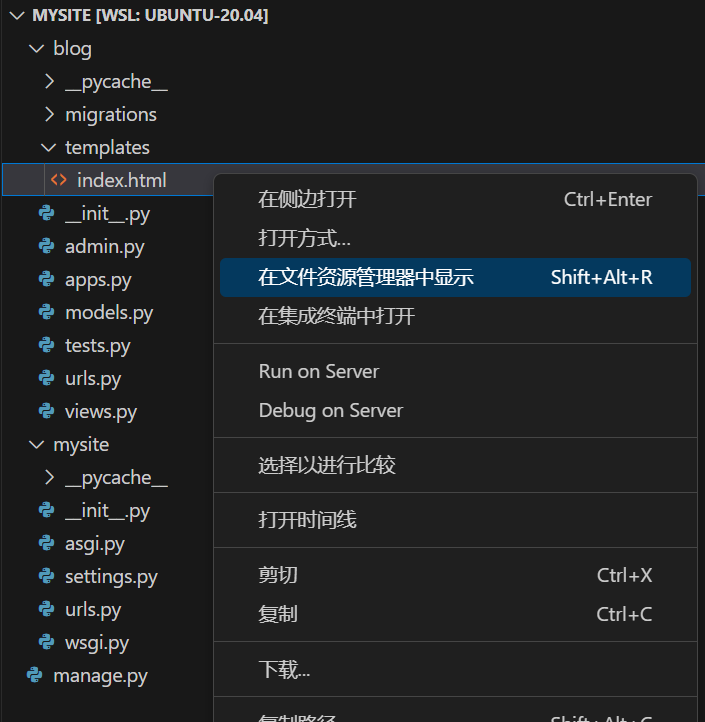
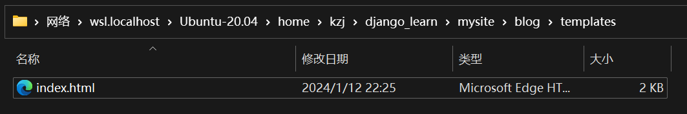
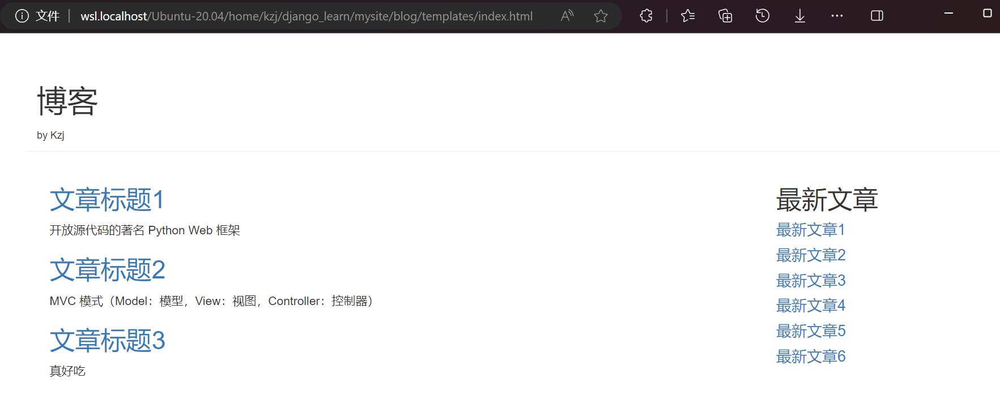
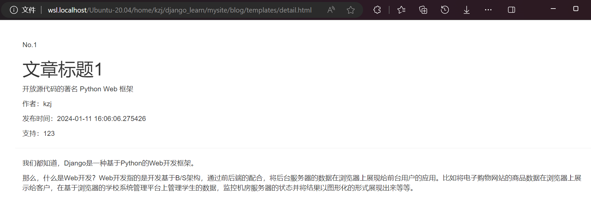

# Django 模板（Template）

## 使用 Bootstrap 实现静态博客页面

### 博客列表页面

新建 **blog/templates/** 文件夹

新建 **blog/templates/index.html** 文件，内容为
```html
<!DOCTYPE html>
<html lang="en">
<head>
    <meta charset="UTF-8">
    <meta name="viewport" content="width=device-width, initial-scale=1.0">
    <title>blog</title>
    <!-- 最新版本的 Bootstrap 核心 CSS 文件 -->
    <link rel="stylesheet" href="https://cdn.bootcdn.net/ajax/libs/twitter-bootstrap/3.4.1/css/bootstrap.min.css" integrity="sha384-HSMxcRTRxnN+Bdg0JdbxYKrThecOKuH5zCYotlSAcp1+c8xmyTe9GYg1l9a69psu" crossorigin="anonymous">
    <!-- 可选的 Bootstrap 主题文件（一般不用引入） -->
    <link rel="stylesheet" href="https://cdn.bootcdn.net/ajax/libs/twitter-bootstrap/3.4.1/css/bootstrap-theme.min.css" integrity="sha384-6pzBo3FDv/PJ8r2KRkGHifhEocL+1X2rVCTTkUfGk7/0pbek5mMa1upzvWbrUbOZ" crossorigin="anonymous">
    <!-- 最新的 Bootstrap 核心 JavaScript 文件 -->
    <script src="https://cdn.bootcdn.net/ajax/libs/twitter-bootstrap/3.4.1/js/bootstrap.min.js" integrity="sha384-aJ21OjlMXNL5UyIl/XNwTMqvzeRMZH2w8c5cRVpzpU8Y5bApTppSuUkhZXN0VxHd" crossorigin="anonymous"></script>
</head>
<body>
    <div class="container page-header">
        <h1>博客</h1>
        <small>by Kzj</small>
    </div>
    <div class="container page-body">
        <div class="col-md-9" role="main">
            <div class="body-main">
                <div>
                    <h2><a href="#">文章标题1</a></h2>
                    <p>
                        开放源代码的著名 Python Web 框架
                    </p>
                </div>
                <div>
                    <h2><a href="#">文章标题2</a></h2>
                    <p>
                        MVC 模式（Model：模型，View：视图，Controller：控制器）
                    </p>
                </div>
                <div>
                    <h2><a href="#">文章标题3</a></h2>
                    <p>
                        真好吃
                    </p>
                </div>
            </div>
        </div>
        <div class="col-md-3" role="complementary">
            <h2>最新文章</h2>
            <h4><a href="#">最新文章1</a></h4>
            <h4><a href="#">最新文章2</a></h4>
            <h4><a href="#">最新文章3</a></h4>
            <h4><a href="#">最新文章4</a></h4>
            <h4><a href="#">最新文章5</a></h4>
            <h4><a href="#">最新文章6</a></h4>
        </div>
    </div>
</body>
</html>
```

想要用使用浏览器打开WSL中的这个文件，右键菜单中点击 **在文件资源管理器中显示**


然后打开这个文件


静态的博客列表页面的效果如下


### 文章详情页面

新建 **blog/templates/detail.html** 文件，内容为
```html
<!DOCTYPE html>
<html lang="en">
<head>
    <meta charset="UTF-8">
    <meta name="viewport" content="width=device-width, initial-scale=1.0">
    <title>article</title>
    <!-- 最新版本的 Bootstrap 核心 CSS 文件 -->
    <link rel="stylesheet" href="https://cdn.bootcdn.net/ajax/libs/twitter-bootstrap/3.4.1/css/bootstrap.min.css" integrity="sha384-HSMxcRTRxnN+Bdg0JdbxYKrThecOKuH5zCYotlSAcp1+c8xmyTe9GYg1l9a69psu" crossorigin="anonymous">
    <!-- 可选的 Bootstrap 主题文件（一般不用引入） -->
    <link rel="stylesheet" href="https://cdn.bootcdn.net/ajax/libs/twitter-bootstrap/3.4.1/css/bootstrap-theme.min.css" integrity="sha384-6pzBo3FDv/PJ8r2KRkGHifhEocL+1X2rVCTTkUfGk7/0pbek5mMa1upzvWbrUbOZ" crossorigin="anonymous">
    <!-- 最新的 Bootstrap 核心 JavaScript 文件 -->
    <script src="https://cdn.bootcdn.net/ajax/libs/twitter-bootstrap/3.4.1/js/bootstrap.min.js" integrity="sha384-aJ21OjlMXNL5UyIl/XNwTMqvzeRMZH2w8c5cRVpzpU8Y5bApTppSuUkhZXN0VxHd" crossorigin="anonymous"></script>
</head>
<body>
    <div class="container page-header">
        <p>No.1</p>
        <h1>文章标题1</h1>
        <p>
            开放源代码的著名 Python Web 框架
        </p>
        <p>作者：kzj</p>
        <p>
            发布时间：2024-01-11 16:06:06.275426
        </p>
        <p>支持：123</p>
    </div>
    <div class="container body-main">
        <div>
            <p>
                我们都知道，Django是一种基于Python的Web开发框架。
            </p>
            <p>
                那么，什么是Web开发？Web开发指的是开发基于B/S架构，通过前后端的配合，将后台服务器的数据在浏览器上展现给前台用户的应用。比如将电子购物网站的商品数据在浏览器上展示给客户，在基于浏览器的学校系统管理平台上管理学生的数据，监控机房服务器的状态并将结果以图形化的形式展现出来等等。
            </p>
        </div>
    </div>
</body>
</html>
```

静态的文章详情页面的效果如下


现在，页面还是静态的，数据是写死在页面里的，后面我们要使用模板系统，实现动态的博客页面

## 模板系统 简介

为什么要使用模板系统？
1. `views.py` 视图文件不适合编码HTML
2. 使用了模板系统，页面设计的改变就不需要修改Python代码
3. 网页**逻辑** 和 网页**视图** 应该分开设计

模板系统是什么？
1. 模板系统的表现形式是**文本**
2. 用来分离页面的 表现**形式** 和 表现**内容**
3. 模板系统定义了特有的**标签占位符**

## 模板系统的基本语法

### 标签语法

- 变量标签：`{{ 变量 }}`
- for循环标签：`, `
- if-else分支标签：`, , `

## 使用模板系统渲染博客页面


---

this:
django
https://www.bilibili.com/video/BV1Sf4y1v77f/

djangoREST
https://www.bilibili.com/video/BV1Dm4y1c7QQ/


djangoREST2
https://www.bilibili.com/video/BV1k5411p7Kp


django全套
https://www.bilibili.com/video/BV1vK4y1o7jH


P16


2_ .md   融合网上文章内容 View URL

---


