# ORM CRUD操作（objects管理器对象）

前面完成了 MTV 模式（Model：模型，Template：模板，View：视图）的学习，接下来重点学习 Django 的 ORM（Object Relational Mapping，对象关系映射）

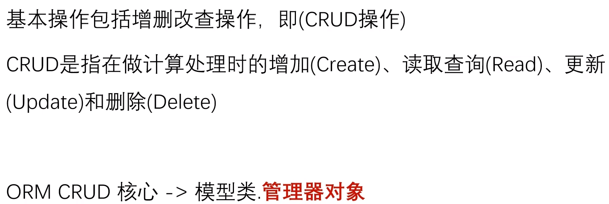

关键是 **objects管理器对象**
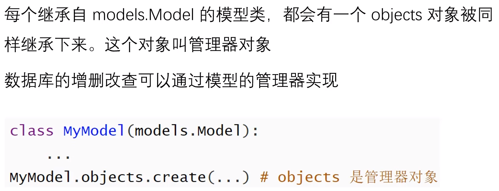

## 创建数据（Create）

### 方式1

执行 `objects.create()` 方法创建数据
```py
MyModel.objects.create(属性1=值1, 属性2=值2, ...)
```
成功：返回创建好的实体对象
失败：抛出异常

### 方式2

创建 MyModel 实体对象，然后调用 `save()` 方法进行保存
```py
obj=MyModel(属性1=值1, 属性2=值2, ...)
obj.属性3=值3
obj.save()
```

## 查询数据（Read）

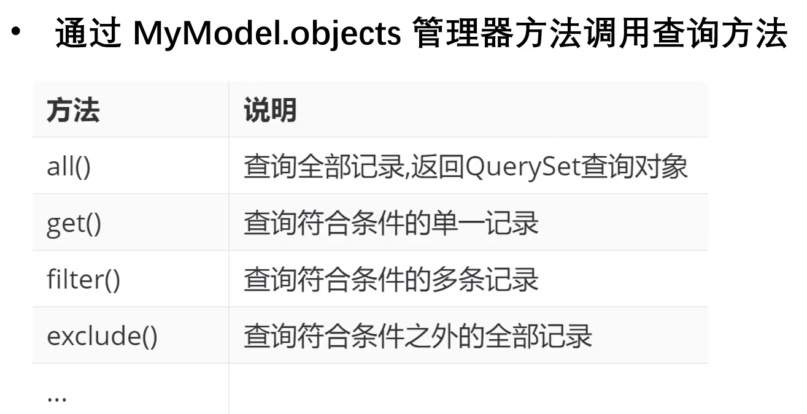

### all() 方法

用法：`MyModel.objects.all()`
作用：查询 MyModel 实体中的**所有的数据**
等同于：`select * from table`
返回值：**QuerySet容器对象**，内部存放 **MyModel实例**

### values('列1', '列2', ...) 方法

用法：`MyModel.objects.values('列1', '列2', ...)`
作用：查询**部分列的数据**
等同于：`select 列1, 列2 from table`
返回值：**ValuesQuerySet**（QuerySet 的子类），内部存放 **字典**，每个字典代表一条数据，格式为 `{'列1':值1, '列2':值2}`

### values_list('列1', '列2', ...) 方法

用法：`MyModel.objects.values_list('列1', '列2', ...)`
作用：返回**元组形式**的查询结果
等同于：`select 列1, 列2 from table`
返回值：**ValuesListQuerySet**（类似 List），内部存放 **元组**，每个元组代表一条数据，格式为 `(值1, 值2)`

### order_by('-列', '列', ...) 方法

用法：`MyModel.objects.order_by('-列', '列', ...)`
作用：与 all() 方法不同，它会用SQL语句的 **ORDER BY 子句** 对查询结果进行根据某个字段选择性地进行**排序**
说明：默认是按照**升序**排序，降序排序则需要在列前加`-`表示
返回值：**QuerySet容器对象**，内部存放 **MyModel实例**

### filter(条件) 方法（条件查询）

用法：`MyModel.objects.filter(条件)`
作用：返回**包含此条件**的全部的数据集
说明：当多个属性在一起时是 **与** 的关系
返回值：**QuerySet容器对象**，内部存放 **MyModel实例**

#### 条件

条件可以简单地写成 `(属性1=值1, 属性2=值2, ...)`
注意：
1. 上面参数里的作为 **列名** 时（用于**筛选列**），**需要用引号**
2. 而参数里的作为 **属性名** 时（用于**筛选行**），**不需要用引号**

但是，怎么做**非等值**的过滤查询？

做更**灵活**的条件查询时需要使用**查询谓词**

##### 查询谓词

每个查询谓词是一个独立的查询功能
查询谓词**拼接到属性名的后面**，再后面跟**等号**

常见的查询谓词有：
`__exact`：等值匹配
`__iexact`：等值匹配（忽略大小写）
`__contains`：包含指定的值
`__icontains`：包含指定的值（忽略大小写）
`__startswith`：以xxx开始
`__endswith`：以xxx结尾
`__gt`：大于指定值
`__gte`：大于等于
`__lt`：小于
`__lte`：小于等于
`__in`：查找数据是否在指定的集合内
`__range`：查找数据是否在指定的区间范围内

示例如下
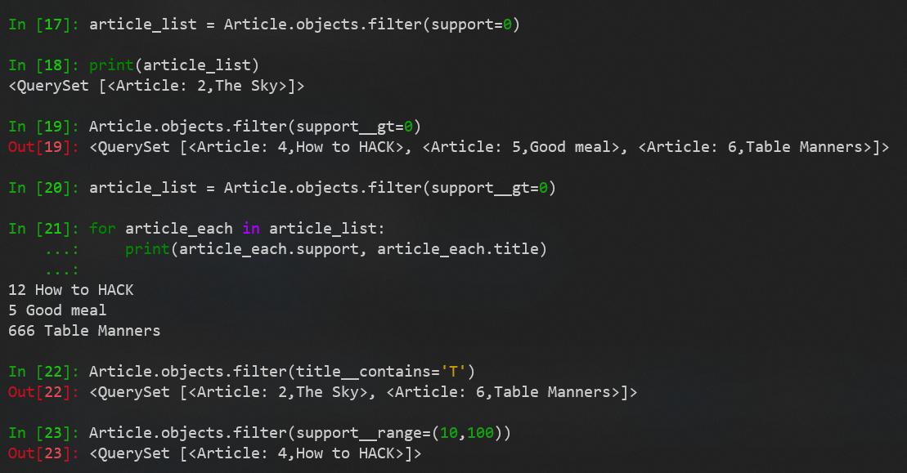

### exclude(条件) 方法（条件查询）

用法：`MyModel.objects.exclude(条件)`
作用：返回**不包含此条件**的全部的数据集
说明：当多个属性在一起时是 **与** 的关系
返回值：**QuerySet容器对象**，内部存放 **MyModel实例**

### get(条件) 方法（条件查询）

用法：`MyModel.objects.get(条件)`
作用：返回满足条件的**唯一一条数据**
说明：该方法只能返回一条数据，如果查询到多条数据或者没查询到数据则**抛出异常**，所以要用 **try-catch** 语句来**处理异常**
返回值：**MyModel实例**

### 链式查询

**只要返回结果是 QuerySet容器对象，其后可继续链式使用这些查询方法**

示例如下
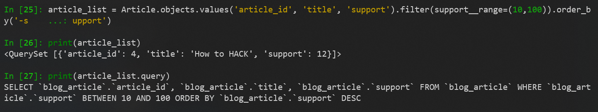

### 输出后台执行的SQL语句

通过打印 `QuerySet.query` 可以查看到后台执行的SQL语句

示例如下
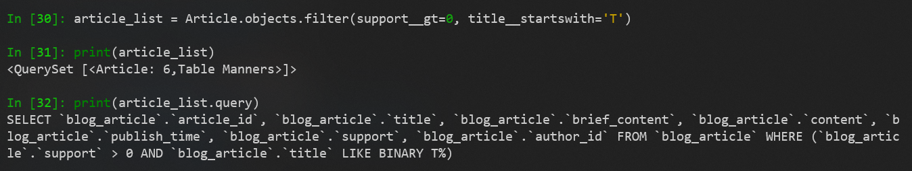

## 更新数据（Update）

### 先get()再save()（更新单个数据）

查：通过 `get()` 方法得到要修改的对象
改：通过 `对象.属性` 的方式修改数据
保存：通过对象的 `save()` 方法保存数据

### update(属性1=值1, 属性2=值2, ...)（批量更新数据）

查：通过查询方法得到要修改的 **QuerySet容器对象**
改：直接调用 **QuerySet容器对象** 的 `update(属性1=值1, 属性2=值2, ...)` 即可实现批量修改，返回值为 **影响行数**

示例如下
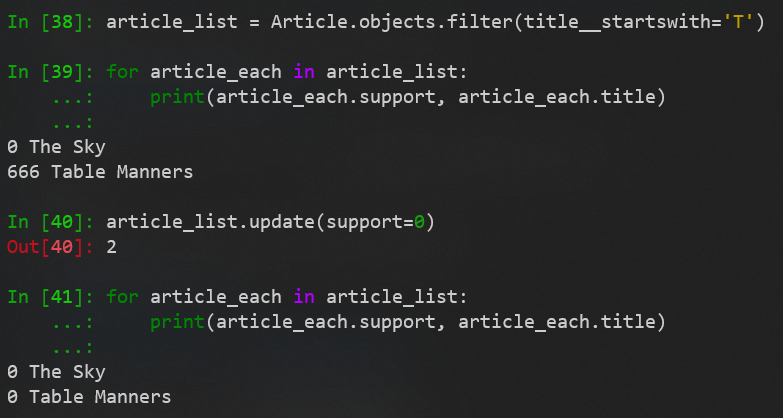

## 删除数据（Delete）

### 删除单个数据

查：通过 `get()` 方法得到要修改的对象
删：通过对象的 `delete()` 方法删除数据

### 批量删除数据

查：通过查询方法得到要删除的 **QuerySet容器对象**
删：调用 **QuerySet容器对象** 的 `delete()` 方法实现删除

### 伪删除

通常不会轻易在业务里把数据真的删除，取而代之的是做伪删除，即在表中增加一个布尔型字段`is_active`，默认是`True`，执行删除时，将欲删除数据的`is_active`字段设置为`False`即可
注意：使用伪删除时，确保显示数据的地方，均增加了`is_active=True`的过滤查询

# ORM 中的 F对象 和 Q对象

## F对象

### 简介

一个F对象代表数据库中 **某条记录的字段的信息**

### 作用

- 通常是对数据库中的字段值在**不获取**的情况下进行操作
- 用于类属性（字段）之间的比较

### 语法

```py
from django.db.models import F
F('列名')
```

注意：F对象出现在 `=` 的右边 

### 示例1：对数据库中的字段值在不获取的情况系进行操作

需求：所有 Article 的 support 值增加1

如果不使用F对象，需要先查询出所有 Article 的实例，然后遍历实例，逐个增加 support 值，最后保存实例，比较繁琐，示例如下
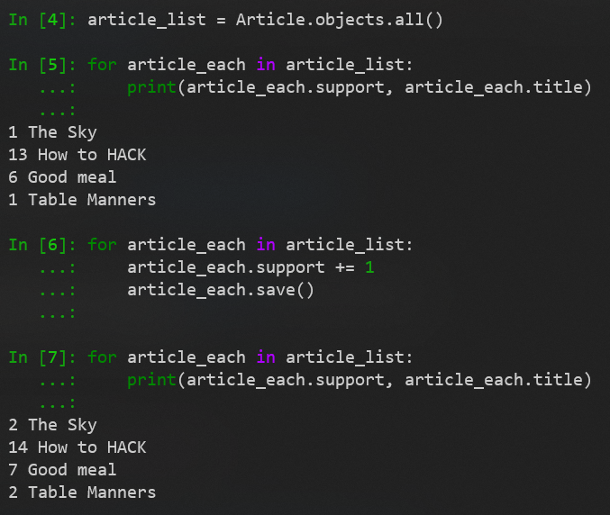

使用F对象则变得非常简单，不需要将所有数据都查询出来遍历处理，示例如下
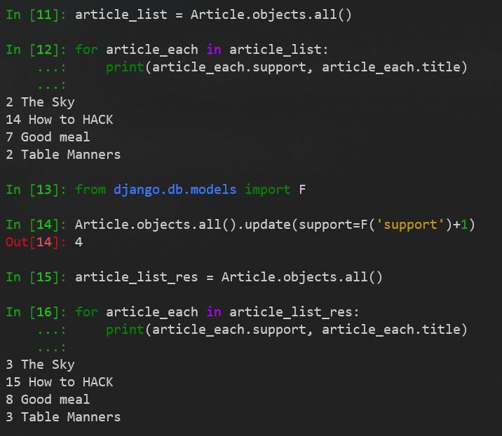

#### 重要使用场景（乐观锁、悲观锁）

如果请求很多且很快，比如文章点赞请求（**并发**）（资源竞争）
如果使用 **先取到本地，再加1，再更新到数据库** ，比如大家同时取到点赞值为0，然后加1，更新到数据库的点赞值为1，就出问题了，相当于SQL语句 `update blog_article set support=1`（这里的1是客户端计算得来的）
而使用 `update(support=F('support')+1)` 则只是标记了要修改的字段，**并没有把这个字段的值取到本地做处理**，相当于SQL语句 `update blog_article set support=support+1`（利用了数据库本身的并发控制）

### 示例2：用于字段之间的比较

需求：找出 content 内容里包含 title 内容的 Article

如果不使用F对象，需要先查询出所有 Article 的实例，然后遍历实例，逐个判断，比较繁琐，示例如下
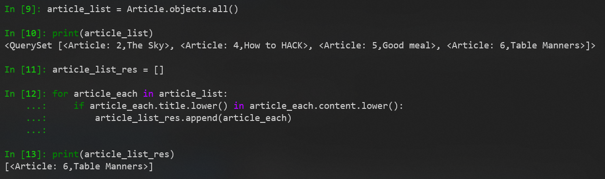

使用F对象则变得非常简单，不需要将所有数据都查询出来遍历处理，示例如下
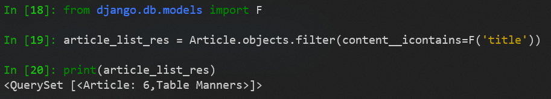
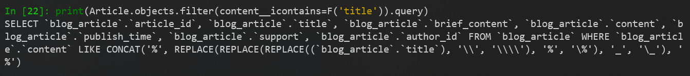

## Q对象

### 简介

`filter()` 等方法中的多个条件参数都是一起进行 **与**（AND）的，如果想要实现条件的 **或**（OR）、**非**（NOT）的逻辑，会很复杂，Q对象就是为了将这些条件用 逻辑或、逻辑与、逻辑非 组合起来

一个Q对象代表一个 **查询条件**

使用符号 `&` 、 `|` 、 `~` 将多个Q对象组合起来。当多个Q对象组合起来时，Django会自动生成一个新的Q对象

### 作用

在条件中用来实现 **and**（`&`）、**or**（`|`）、**not**（`~`）的逻辑关系

### 语法

```py
from django.db.models import Q
Q(条件)
Q(条件1) & Q(条件2)
Q(条件1) | Q(条件2)
~Q(条件1)
```

### 示例1：条件之间的或关系

需求：找出 content 内容里**包含** title 内容，**或者** brief_content 内容里**不包含** title 内容的 Article

如果不使用Q对象，需要将2个 QuerySet容器对象 用 `|` 连接起来，示例如下
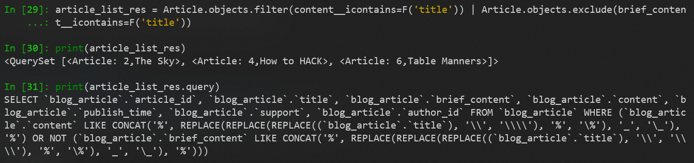

使用Q对象则变得非常简单，示例如下
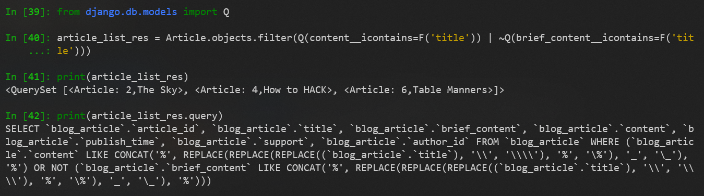

### 示例2：条件之间的与关系

需求：找出 content 内容里**包含** title 内容，**且** brief_content 内容里**不包含** title 内容的 Article

如果不使用Q对象，需要**链式调用**查询方法，示例如下
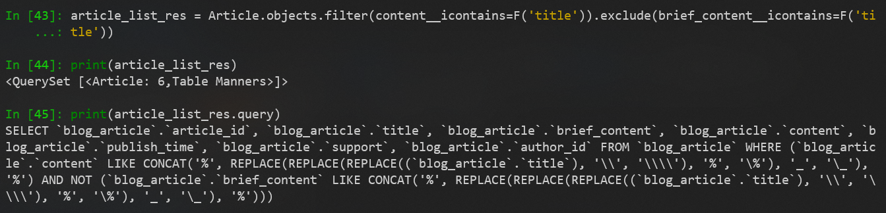

使用Q对象则变得非常简单，不需要查询方法的链式调用，示例如下
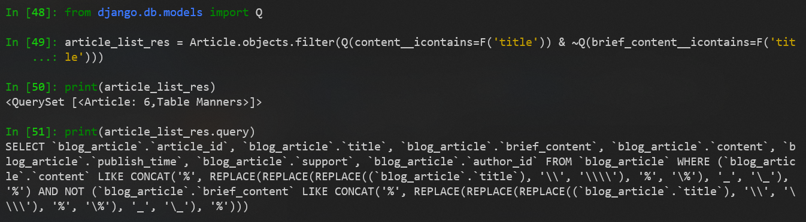

# ORM 中的 聚合查询

聚合查询函数是**对一组值执行计算，并返回单个值**
如查询文章的的平均点赞数，查询文章的个数等，都要使用到聚合查询

聚合查询分为：
- 整表聚合
- 分组聚合

## 整表聚合（aggregate）

### 简介

整表聚合就是**不带分组的聚合查询**，即将全部数据进行集中统计查询

### 语法

```py
# 导入聚合函数
from django.db.models import *
# 常见的聚合函数有 Sum、Avg、Count、Max、Min
MyModel.objects.aggregate(结果变量的别名=聚合函数('列名'))
```

聚合函数 `aggregate()` 是 QuerySet 的一个终止子句，生成的一个汇总值，相当于 `count()`
使用 `aggregate()` 后，数据类型就变为**字典**，不能再使用 QuerySet 数据类型的一些API了

返回值：**字典**，**键**的名称默认是 `列名__聚合函数名`（可以起别名），**值**是计算出来的聚合值， 格式为 `{'结果变量的别名': 值}`

### 示例

需求：统计文章的总数

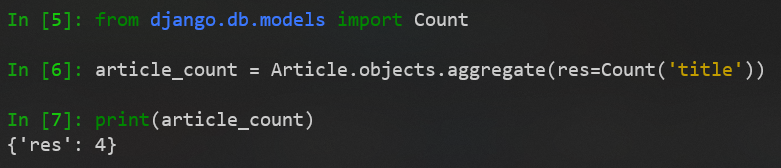

## 分组聚合（annotate）

为了演示，又增加了一些文章
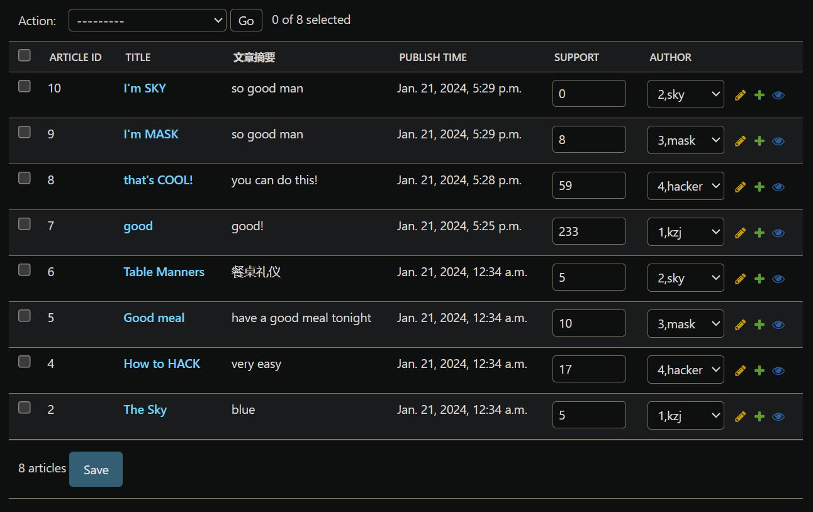

### 简介

分组聚合就是**先对数据进行分组**（对应数据库中的 `GROUP BY`），再对每个组内的数据进行统计查询

### 语法

```py
# 导入聚合函数
from django.db.models import *
# 常见的聚合函数有 Sum、Avg、Count、Max、Min
# 注意不是 MyModel.objects.annotate(结果变量的别名=聚合函数('列名'))
QuerySet = MyModel.objects.values('用于分组的列名')
QuerySet.annotate(结果变量的别名=聚合函数('列名'))
```

返回值：**QuerySet容器对象**（后面可以继续链式调用其他方法，比如 `HAVING`）

#### 分组（values）

这里使用 `values()` 而不是 `all()` 或 `values_list()` 进行分组
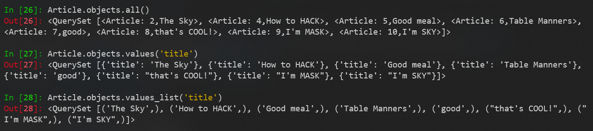

### 示例1

需求：对文章按作者进行分组，统计每组文章的最大 support 值

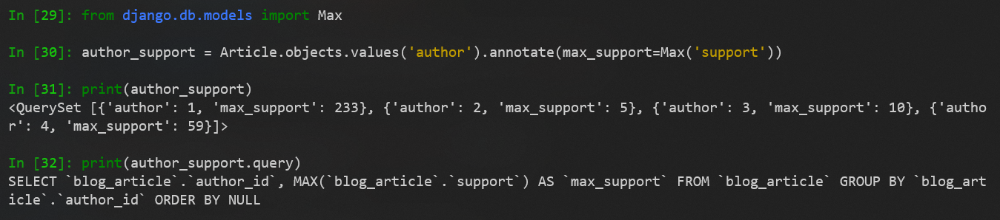

### 示例2：继续 HAVING 操作

需求：对文章按作者进行分组，统计每组文章的最大 support 值，要求最大 support 值大于 50

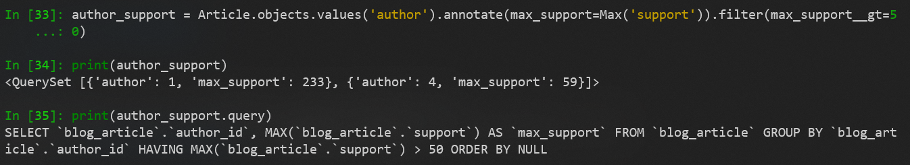

# ORM 中使用 原生数据库操作（不推荐）

## raw（只能用于查询，需要模型类）

### 语法1

```py
MyModel.objects.raw(sql语句)
```

不安全，存在**SQL注入**风险
返回值：**RawQuerySet集合对象**，只支持基础操作，比如循环

### 示例1

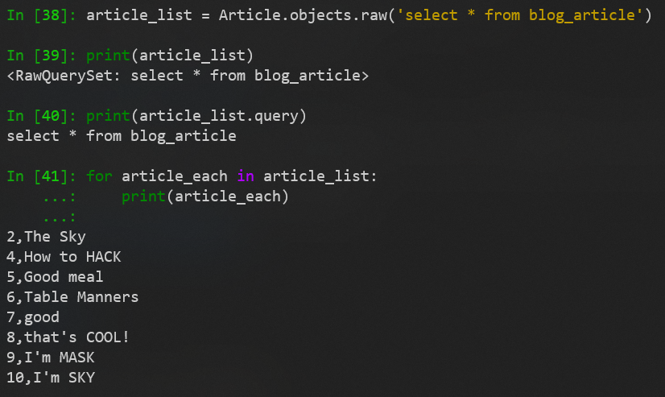

### 语法2

```py
MyModel.objects.raw(sql语句, 拼接参数)
```

安全，django默认处理掉SQL注入风险
返回值：**RawQuerySet集合对象**，只支持基础操作，比如循环

### 示例2

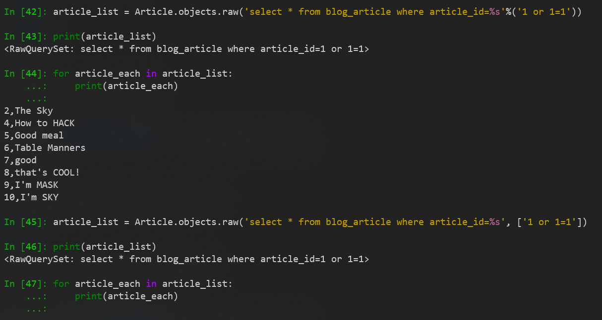

## cursor（增删改查都可以，完全跨过模型类操作数据库）

### 语法

```py
# 导入cursor所在的包
from django.db import connection
# 用创建cursor类的构造函数创建cursor对象，再使用cursor对象，为保证在出现异常时能释放cursor资源，通常使用with语句
with connection.cursor() as cursor:
	cursor.execute(sql语句，拼接参数)
```

### 示例

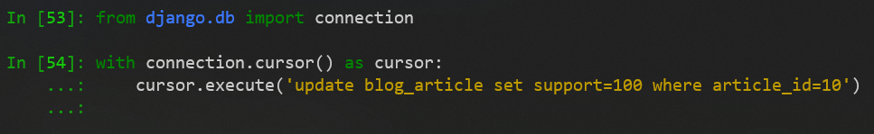

# ORM 中的 关系映射


