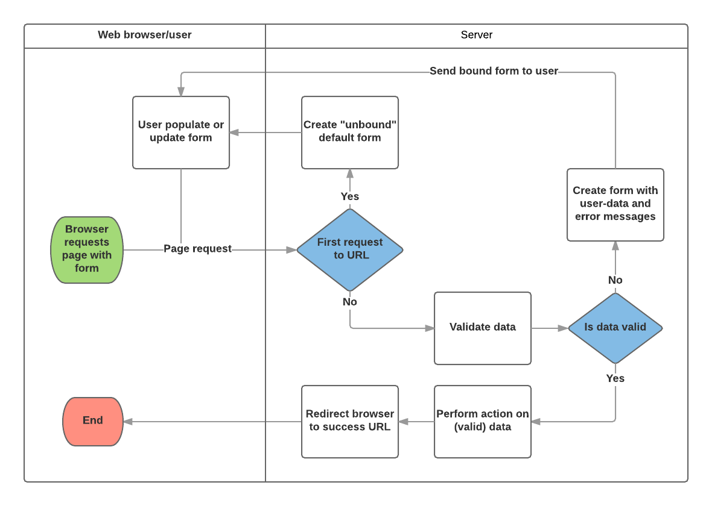
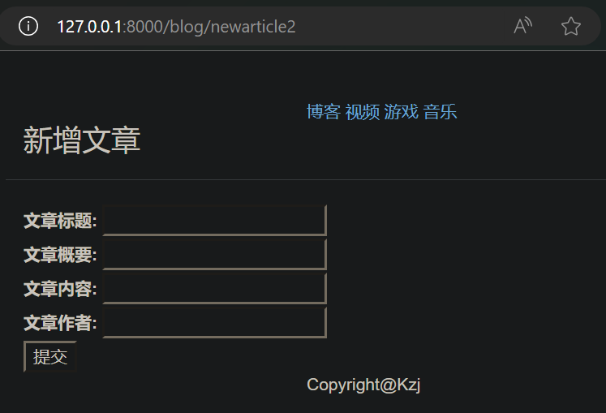
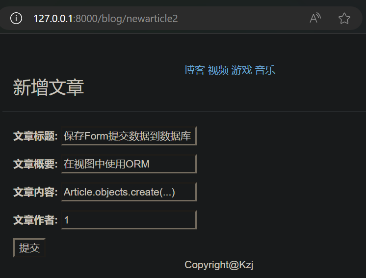
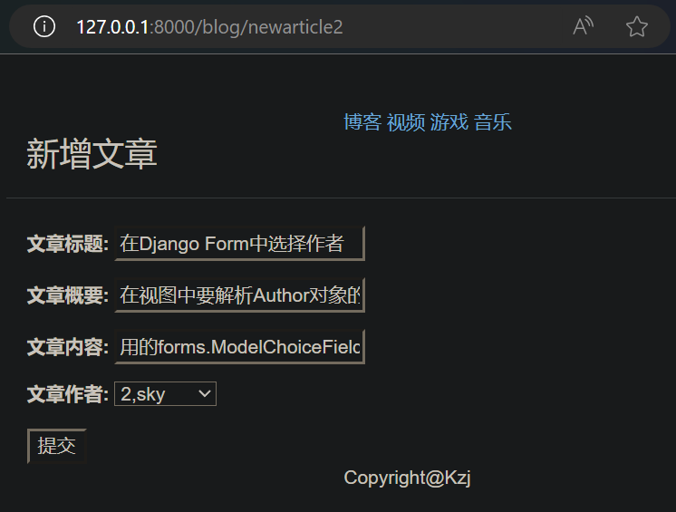

# Django Form表单

之前浏览器发送过来的请求都是 GET 请求，网站只发布内容且不接受客户的输入
接下来，我们需要需要客户输入内容来做交互，要让浏览器发送过来的请求是 POST 请求，接收、处理、响应客户在HTML页面的输入

## 使用 HTML 表单

HTML 表单用于收集用户的输入信息

表单在 HTML 中定义为 `<form>...</form>` 标记内的元素集合，包含至少一个含有 `type="submit"` 属性的 `<input />` 输入元素

其中：
- `<form>` 元素用于创建表单，`action` 属性定义了表单数据提交的目标 URL，`method` 属性定义了提交数据的 HTTP 方法（这里使用的是 **post**）
- `<label>` 元素用于为表单元素添加标签，提高可读性
- `<input>` 元素是最常用的表单元素，它可以创建文本输入框、密码框、单选按钮、复选框等。`type` 属性定义了输入框的类型，`id` 属性用于关联 `<label>` 元素，`name` 属性用于标识表单字段，`value` 属性用于定义表单元素的初始值
- `<select>` 元素用于创建下拉列表，而 `<option>` 元素用于定义下拉列表中的选项

### 添加新文章页面

新建 **blog/templates/blog/newarticle.html** 文件，内容为：
```html



<title>newarticle</title>



<div class="container page-header">
    <h3>新增文章</h3>
</div>
<div class="container body-main">
    <form action="/blog/newarticle" method="post">
        <label for="title">文章标题:</label>
        <input type="text" id="title" name="title" />
        <br>
        <label for="brief_content">文章概要:</label>
        <input type="text" id="brief_content" name="brief_content" />
        <br>
        <label for="content">文章内容:</label>
        <input type="text" id="content" name="content" />
        <br>
        <label for="author_id">文章作者ID:</label>
        <input type="number" id="author_id" name="author_id" />
        <br>
        <input type="submit" value="提交" />
    </form>
</div>

```

修改 **blog/views.py** 文件的内容为：
```py
from django.shortcuts import render
from django.core.paginator import Paginator
from .models import Article

def get_index_page(request):
    # 省略

def get_detail_page(request, article_id):
    # 省略

def new_article_page(request):
    return render(request, "blog/newarticle.html", {})
```

修改 **blog/urls.py** 文件的内容为：
```py
from django.urls import path
import blog.views as views

urlpatterns = [
    path('index', views.get_index_page),
    path('detail/<int:article_id>', views.get_detail_page),
    path('newarticle', views.new_article_page),
]
```

现在，运行开发服务器，访问 http://127.0.0.1:8000/blog/newarticle 就可以看到如下


### 403状态码（csrf 防范）

[Django的POST请求报403，及四种解决方法](https://cloud.tencent.com/developer/article/1352455)

点击提交按钮，会报403错误（csrf 防范）


这里我们简单地解决一下（实际项目中不推荐）
在 **mysite/mysite/settings.py** 文件中 **MIDDLEWARE** 变量中注释掉 `'django.middleware.csrf.CsrfViewMiddleware'`
```py
MIDDLEWARE = [
    'django.middleware.security.SecurityMiddleware',
    'django.contrib.sessions.middleware.SessionMiddleware',
    'django.middleware.common.CommonMiddleware',
    # 'django.middleware.csrf.CsrfViewMiddleware',
    'django.contrib.auth.middleware.AuthenticationMiddleware',
    'django.contrib.messages.middleware.MessageMiddleware',
    'django.middleware.clickjacking.XFrameOptionsMiddleware',
]
```

尝试再次提交，成功


### 接收表单提交的数据

修改 **blog/views.py** 文件的内容为：
```py
from django.shortcuts import render
from django.core.paginator import Paginator
from .models import Article

def get_index_page(request):
    # 省略

def get_detail_page(request, article_id):
    # 省略

def new_article_page(request):
    if request.method == 'POST':
        new_article_dict = request.POST
        print('POST请求传入的参数: ')
        for (key,value) in new_article_dict.items():
            print('key: ', key, ' ,value: ', value)
        
    return render(request, "blog/newarticle.html", {})
```

访问 http://127.0.0.1:8000/blog/newarticle 就可以看到如下

输入信息并点击提交按钮，效果如下

可见，可以拿到表单提交的数据

### 处理表单提交的数据

将表单提交的数据保存到数据库中

修改 **blog/views.py** 文件的内容为：
```py
from django.shortcuts import render
from django.core.paginator import Paginator
from .models import Article

def get_index_page(request):
    # 省略

def get_detail_page(request, article_id):
    # 省略

def new_article_page(request):
    if request.method == 'POST':
        # 拿到表单提交的数据（字典形式）
        new_article_dict = request.POST
        # 创建Article实体对象
        new_article = Article()
        new_article.title = new_article_dict.get('title')
        new_article.brief_content = new_article_dict.get('brief_content')
        new_article.content = new_article_dict.get('content')
        new_article.author_id = new_article_dict.get('author_id')
        # 保存到数据库
        new_article.save()
        
    return render(request, "blog/newarticle.html", {})
```

访问 http://127.0.0.1:8000/blog/newarticle 就可以看到如下

输入信息并点击提交按钮，效果如下

可见，成功将表单提交的数据保存到数据库中

### 响应表单提交的数据

表单提交后，跳转到博客列表页面

修改 **blog/views.py** 文件的内容为：
```py
from django.shortcuts import render, redirect
from django.core.paginator import Paginator
from .models import Article

def get_index_page(request):
    # 省略

def get_detail_page(request, article_id):
    # 省略

def new_article_page(request):
    if request.method == 'POST':
        new_article_dict = request.POST
        # 创建Article实体对象
        new_article = Article()
        new_article.title = new_article_dict.get('title')
        new_article.brief_content = new_article_dict.get('brief_content')
        new_article.content = new_article_dict.get('content')
        new_article.author_id = new_article_dict.get('author_id')
        # 保存到数据库
        new_article.save()
        # 路由重定向
        return redirect('/blog/index')
    else:
        return render(request, "blog/newarticle.html", {})
```

访问 http://127.0.0.1:8000/blog/newarticle 就可以看到如下

输入信息并点击提交按钮，效果如下

可见，表单提交后，成功跳转到博客列表页面

### 表单中展示数据，供用户选择


表单中的 文章作者ID 信息，需要用户手动输入，不直观。应该展示数据库中已有的作者信息，供用户选择

修改 **blog/views.py** 文件的内容为：
```py
from django.shortcuts import render, redirect
from django.core.paginator import Paginator
from .models import Article, Author

def get_index_page(request):
    # 省略

def get_detail_page(request, article_id):
    # 省略

def new_article_page(request):
    if request.method == 'POST':
        new_article_dict = request.POST
        new_article = Article()
        new_article.title = new_article_dict.get('title')
        new_article.brief_content = new_article_dict.get('brief_content')
        new_article.content = new_article_dict.get('content')
        new_article.author_id = new_article_dict.get('author_id')
        new_article.save()
        return redirect('/blog/index')
    else:
        # 获取所有作者
        all_authors = Author.objects.all()
        context = {"all_authors": all_authors,}
        return render(request, "blog/newarticle.html", context)
```

修改 **blog/templates/blog/newarticle.html** 文件的内容为：
```html



<title>newarticle</title>



<div class="container page-header">
    <h3>新增文章</h3>
</div>
<div class="container body-main">
    <form action="/blog/newarticle" method="post">
        <label for="title">文章标题:</label>
        <input type="text" id="title" name="title" />
        <br>
        <label for="brief_content">文章概要:</label>
        <input type="text" id="brief_content" name="brief_content" />
        <br>
        <label for="content">文章内容:</label>
        <input type="text" id="content" name="content" />
        <br>
        <label for="author_id">文章作者:</label>
        <select id="author_id" name="author_id">
            
            <option value="{{ author.author_id }}">{{ author.name }}</option>
            
        </select>    
        <br>
        <input type="submit" value="提交" />
    </form>
</div>

```

访问 http://127.0.0.1:8000/blog/newarticle 就可以看到如下

输入信息并点击提交按钮，效果如下


## Django Form表单 简介

在Web站点中与后端服务进行交互，通常使用表单提交的方式。表单提交数据到达后端，首先要对数据做校验，对于不合法的数据需要拒绝并提示给前端，通过校验之后才能执行服务返回响应。由于所有的表单创建与处理流程都是相似的，所以，Django将这一过程抽象出来，形成表单系统。从在浏览器中显示表单到数据验证，再到对错误的处理，都可以由表单系统来完成



基于上图，Django 表单处理的主要内容是：
1. 在用户第一次请求时，显示默认表单
    1. 表单可能包含空白字段（例如，如果你正在创建新记录），或者可能预先填充了初始值（例如，如果你要更改记录，或者具有有用的默认初始值）
    2. 此时表单被称为未绑定，因为它与用户输入的数据无关（尽管它可能具有初始值）
2. 从提交请求接收数据，并将其绑定到表单
    1. 将数据绑定到表单，意味着当我们需要重新显示表单时，用户输入的数据和任何错误都可取用
3. 清理并验证数据
    1. 清理数据会对输入执行清理（例如，删除可能用于向服务器发送恶意内容的无效字符）并将其转换为一致的 Python 类型
    2. 验证检查值是否适合该字段（例如，在正确的日期范围内，不是太短或太长等）
4. 如果任何数据无效，重新显示表单，这次使用任何用户填充的值，和问题字段的错误消息
5. 如果所有数据都有效，执行必要的操作（例如保存数据，发送表单，返回搜索结果，上传文件等）
6. 完成所有操作后，将用户重定向到另一个页面

## 使用 Django Form表单

### 定义表单类（Form类）

表单系统的核心是 **Form对象**，它将表单中的字段封装成一系列**Field**和**验证规则**，以此来自动地生成HTML表单标签

Form表单类 继承 `django.forms.Form`

**Form类** 的声明语法，与声明 **Model类** 非常相似，并且共享相同的**字段类型**（以及一些类似的**字段参数**）

新建 **blog/forms.py** 文件，内容为：
```py
from django import forms

class ArticleForm(forms.Form):
    title = forms.CharField(widget=forms.TextInput, max_length=100,label='文章标题',min_length=2,error_messages={"min_length":'标题字符段不符合要求！'})
    brief_content = forms.CharField(widget=forms.TextInput,label='文章概要')
    content = forms.CharField(widget=forms.TextInput,label='文章内容')
    author_id = forms.IntegerField(widget=forms.NumberInput,label='文章作者')
```

#### 字段类型（内置 Field 类）

##### CharField

- 字符串类型的表单字段，是最常见的表单字段类型，widget 默认使用 TextInput
- max_length 限制字段值的最大长度，min_length 限制字段值的最小长度
- strip 属性默认会执行Python字符串的 strip 方法，用于去除字符串开头和尾部的空格。如果不需要这样做，可以将strip 属性设置为 False
- empty_value 参数用来表示"空"的值。默认为空字符串

##### IntegerField

- 整数类型的表单字段，widget 默认使用 NumberInput
- 可选的 max_value 与 min_value 参数用于限定字段值的取值范围，且它们都是闭区间

##### BooleanField

- 布尔类型的表单字段，widget 默认使用 CheckboxInput
- 由于基类 Field 的 required 属性默认是 True，所以，在不做设置的情况下，BooleanField 实例的 required 属性也是 True。由于 required 为 True 要求这个字段值必须提供，所以，这种情况下，BooleanField 类型的实例必须是 True，否则将抛出异常，并提示 "This fieldis required"
- 如果要在表单中使用 BooleanField 字段，则需要指定 required 为 False

##### ChoiceField

[Django forms组件里的ChoiceField、ModelChoiceField、ModelMutipleChoiceField的区别](https://www.cnblogs.com/pungchur/p/11969844.html)

- 选择类型的表单字段，widget 默认使用 Select
- choices 参数需要一个可迭代的二元组或能够返回可迭代二元组的函数对象。每个二元组的第一个元素是实际用于存储的数据，而第二个元素是用户将看到的选项

##### ModelChoiceField

- 继承自 ChoiceField
- ModelChoiceField 字段是对 models 里 ForeignKey 的渲染（单选）
- queryset 参数用于指定该字段所使用的数据源（可以使用 ORM 查询数据库中的数据）

##### ModelMutipleChoiceField

- 继承自 ModelChoiceField
- ModelMutipleChoiceField 字段是对 models 里 ManyToManyField 的渲染（多选）
- queryset 参数用于指定该字段所使用的数据源（可以使用 ORM 查询数据库中的数据）

##### EmailField

- 继承自 CharField，但是提供了 Email验证器，用于校验传递的字段值是否是合法的电子邮件地址。widget 默认使用 EmailInput
- 除了 EmailField 之外，表单系统还提供了 UUIDField、GenericIPAddressField、URLField 等基于 CharField 的字段类型用于校验特定结构的字符串

##### UUIDField

- 与 EmailField 类似，不过它只会验证数据是否会空，并会自动将数据生成唯一列，并设置为主键

##### JSONField

- 接受 JSON 编码数据的字段，验证给定值是否为有效的 JSON

##### DateTimeField

- 日期时间类型的表单字段，widget 默认使用 DateTimeInput
- 接受一个可选的参数input_formats，这个参数是一个列表，列表元素规定允许输入的时间格式

#### 字段选项（字段参数）

- required：如果为True，则该字段不能留空或给出None值
- label：在 HTML 中呈现字段时使用的标签，如果未指定label，则 Django 将通过大写第一个字母、并用空格替换下划线的方式，从字段名称创建一个
- initial：显示表单时，字段的初始值
- help_text：可以在表单中显示的附加文本，用于说明如何使用该字段
- error_messages：字段的错误消息列表。如果需要，你可以使用自己的消息，覆盖这些消息
- validators：验证时将在字段上调用的函数列表
- localize：启用表单数据输入的本地化（例如使用本地化格式显示日期和时间）
- disabled：如果为True，则禁用该字段
- label_suffix：标签后缀，默认情况下，标签后面会显示冒号
- widget：要使用的显示小部件

#### 验证

##### 常用验证器（validators）

在验证某个字段的时候，可以传递一个 validators 参数用来指定验证器，进一步对数据进行过滤

- MaxValueValidator：验证最大值
- MinValueValidator：验证最小值
- MinLengthValidator：验证最小长度
- MaxLengthValidator：验证最大长度
- EmailValidator：验证是否是邮箱格式
- URLValidator：验证是否是URL格式
- RegexValidator：如果还需要更加复杂的验证正则表达式的验证器

比如要验证手机号码是否合格，那么我们可以通过以下代码实现：
```py
from django import forms
from django.core import validators

class MyForm(forms.Form):
    telephone = forms.CharField(validators=[validators.RegexValidator("1[345678]\d{9}",message='请输入正确格式的手机号码！')])
```

##### 自定义验证

有时候对一个字段验证，不是一个长度，一个正则表达式能够写清楚的，还需要一些其他复杂的逻辑，那么我们可以对某个字段，进行自定义的验证

###### 验证一个字段 clean_fieldname()

比如在注册的表单验证中，我们想要验证手机号码是否已经被注册过了，那么这时候就需要在数据库中进行判断才知道。对某个字段进行自定义的验证方式是，定义一个方法，这个方法的名字定义规则是：`clean_fieldname()`。如果验证失败，那么就抛出一个验证错误

比如要验证用户表中手机号码之前是否在数据库中存在，那么可以通过以下代码实现：
```py
class MyForm(forms.Form):
    telephone = forms.CharField(validators=[validators.RegexValidator("1[345678]\d{9}",message='请输入正确格式的手机号码！')])

    def clean_telephone(self):
        telephone = self.cleaned_data.get('telephone')
        exists = User.objects.filter(telephone=telephone).exists()
        if exists:
            raise forms.ValidationError("手机号码已经存在！")
        return telephone
```

###### 验证多个字段 clean()

以上是对某个字段进行验证，如果验证数据的时候，需要针对多个字段进行验证，那么可以重写 `clean()` 方法。

比如要在注册的时候，要判断提交的两个密码是否相等。那么可以使用以下代码来完成：
```py
class MyForm(forms.Form):
    telephone = forms.CharField(validators=[validators.RegexValidator("1[345678]\d{9}",message='请输入正确格式的手机号码！')])
    pwd1 = forms.CharField(max_length=12)
    pwd2 = forms.CharField(max_length=12)

    def clean(self):
        cleaned_data = super().clean()
        pwd1 = cleaned_data.get('pwd1')
        pwd2 = cleaned_data.get('pwd2')
        if pwd1 != pwd2:
            raise forms.ValidationError('两个密码不一致！')
```

### 渲染表单、绑定数据到表单

django网站的表单数据会交给后台的视图来处理，为了处理表单数据

在视图中，使用 `form = ArticleForm()` 创建一个表单对象

修改 **blog/views.py** 文件的内容为：
```py
from django.http import HttpResponseRedirect
from django.shortcuts import render, redirect
from django.core.paginator import Paginator
from .models import Article, Author
from .forms import ArticleForm

def get_index_page(request):
    # 省略

def get_detail_page(request, article_id):
    # 省略

def new_article_page(request):
    # 省略
    
def new_article_page2(request):
    if request.method == 'POST':
        # 拿到表单提交的数据，作为参数传递给 ArticleForm
        form = ArticleForm(request.POST)
        print(form.is_valid())
        # 检查界面是否传入表单数据
        if form.is_valid():
            # 表单数据存储在 form.cleaned_data 中
            print(form.cleaned_data)
            return HttpResponseRedirect('/blog/index')
        # 传入的表单数据不合要求
        else:
            context = {"form": form,}
            return render(request, "blog/newarticle2.html", context)
    else:
        form = ArticleForm()
        context = {"form": form,}
        return render(request, "blog/newarticle2.html", context)
```

如果我们访问这个视图用的是 **GET请求**，它会创建一个空的表单实例并将其放置在模板上下文中进行渲染：`form = ArticleForm()`（**非绑定表单**）

如果表单提交用的是 **POST请求**，那么该视图将再次创建一个表单实例并使用请求中的数据填充它：`form = ArticleForm(request.POST)` （**绑定数据到表单**）

>每个 **Form实例** 都有 `is_valid()` 方法，如果用户输入了符合要求的内容，则返回 True 且将表单数据存储在 `cleaned_data` 属性中。如果不用 `is_valid()`，就直接获取 `cleaned_data` 属性会报错

调用 `form.is_valid()` 方法
1. 如果为 `False`，我们绑定数据到表单，带着表单返回到模板。所以HTML表单将用之前提交的数据进行填充，放到可以根据需要进行编辑和修正的位置

2. 如果为 `True`，我们就能在 `form.cleaned_data` 属性中找到所有通过验证的表单数据。我们可以在发送一个HTTP重定向告诉浏览器下一步去向之前用这些数据更新数据库或者做其他处理（这里暂时只输出表单数据）

### 创建添加新文章页面模板文件

创建视图中要引用的模板

新建 **blog/templates/blog/newarticle2.html** 文件，内容为：
```html



<title>newarticle</title>



<div class="container page-header">
    <h3>新增文章</h3>
</div>
<div class="container body-main">
    <form action="/blog/newarticle2" method="post">
        {{ form }}
        <input type="submit" value="提交" />
    </form>
</div>

```

其中 `form` 是我们传入模板的**表单类实例对象**，使用 `{{ form }}` 渲染表单（渲染它相应的 `<label>` 和 `<input>` 元素）

> 不要忘记，一张表单的输出**不**包含外层 `<form>标签` 以及 `submit控件`，这些必须由你自己提供

### URL 配置

修改 **blog/urls.py** 文件的内容为：
```py
from django.urls import path
import blog.views as views

urlpatterns = [
    path('index', views.get_index_page),
    path('detail/<int:article_id>', views.get_detail_page),
    path('newarticle', views.new_article_page),
    path('newarticle2', views.new_article_page2),
]
```

访问 http://127.0.0.1:8000/blog/newarticle2 就可以看到如下

输入信息并点击提交按钮，效果如下

可见，可以拿到表单提交的数据

### 使用自定义表单模板

[django文档-使用表单](https://docs.djangoproject.com/zh-hans/4.2/topics/forms/)

但是，上面生成的HTML表单稍微有些格式上的问题：各个输入框之间不会自动换行
下面，我们来解决这个问题

> 在渲染表单时生成的 HTML 输出本身是通过模板生成的：
> 1. 你可以通过创建一个合适的模板文件，并设置自定义的 `FORM_RENDERER` 来控制这个过程，以在整个站点范围内使用 `form_template_name`
> 2. 你也可以通过覆盖表单的 `template_name` 属性来自定义每个表单，以使用自定义模板呈现表单
> 3. 或者直接将模板名称传递给 `form.render()`

这里只演示第2种方法

新建 **blog/templates/blog/form_snippet.html** 文件，内容为：
```html

    <div class="fieldWrapper">
        {{ field.errors }}
        {{ field.label_tag }} {{ field }}
    </div>

```

修改 **blog/forms.py** 文件的内容为：
```py
from django import forms

class ArticleForm(forms.Form):
    template_name = "blog/form_snippet.html"
    title = forms.CharField(widget=forms.TextInput, max_length=100,label='文章标题',min_length=2,error_messages={"min_length":'标题字符段不符合要求！'})
    brief_content = forms.CharField(widget=forms.TextInput,label='文章概要')
    content = forms.CharField(widget=forms.TextInput,label='文章内容')
    author_id = forms.IntegerField(widget=forms.NumberInput,label='文章作者')
```

访问 http://127.0.0.1:8000/blog/newarticle2 就可以看到如下


#### 使用表单模板变量的自带方法

要实现各个输入框之间自动换行，有更简单的办法，不用使用自定义表单模板

删除 **blog/templates/blog/form_snippet.html** 文件

复原 **blog/forms.py** 文件的内容为：
```py
from django import forms

class ArticleForm(forms.Form):
    title = forms.CharField(widget=forms.TextInput, max_length=100,label='文章标题',min_length=2,error_messages={"min_length":'标题字符段不符合要求！'})
    brief_content = forms.CharField(widget=forms.TextInput,label='文章概要')
    content = forms.CharField(widget=forms.TextInput,label='文章内容')
    author_id = forms.IntegerField(widget=forms.NumberInput,label='文章作者')
```

删除 `ArticleForm` 类中的 `template_name = "blog/form_snippet.html"`

修改 **blog/templates/blog/newarticle2.html** 文件的内容为：
```html



<title>newarticle</title>



<div class="container page-header">
    <h3>新增文章</h3>
</div>
<div class="container body-main">
    <form action="/blog/newarticle2" method="post">
        {{ form.as_p }}
        <input type="submit" value="提交" />
    </form>
</div>

```

把 `{{ form }}` 改成了 `{{ form.as_p }}`

在模板文件中我们可以通过一下方式渲染表单：
- `{{ form.as_table }}` 将每个字段包裹在 `<tr>` 标签中
- `{{ form.as_p }}` 将每个字段包裹在 `<p>` 标签中
- `{{ form.as_ul }}` 将每个字段包裹在 `<li>` 标签中

访问 http://127.0.0.1:8000/blog/newarticle2 就可以看到显示效果和上面相比不变

### 保存表单提交数据到数据库

修改 **blog/views.py** 文件的内容为：
```py
from django.http import HttpResponseRedirect
from django.shortcuts import render, redirect
from django.core.paginator import Paginator
from .models import Article, Author
from .forms import ArticleForm

def get_index_page(request):
    # 省略

def get_detail_page(request, article_id):
    # 省略

def new_article_page(request):
    # 省略
   
def new_article_page2(request):
    if request.method == 'POST':
        form = ArticleForm(request.POST)
        print(form.is_valid())
        if form.is_valid():
            print(form.cleaned_data)
            # 保存表单数据到数据库
            title = form.cleaned_data['title']
            brief_content = form.cleaned_data['brief_content']
            content = form.cleaned_data['content']
            author_id = form.cleaned_data['author_id']
            Article.objects.create(title=title, brief_content=brief_content, content=content, author_id=author_id)
            return HttpResponseRedirect('/blog/index')
        else:
            context = {"form": form,}
            return render(request, "blog/newarticle2.html", context)
    else:
        form = ArticleForm()
        context = {"form": form,}
        return render(request, "blog/newarticle2.html", context)
```

访问 http://127.0.0.1:8000/blog/newarticle2 就可以看到如下

输入信息并点击提交按钮，效果如下

可见，可以将表单提交的数据保存到数据库

### 表单中展示数据，供用户选择

表单中的 文章作者ID 信息，需要用户手动输入，不直观。应该展示数据库中已有的作者信息，供用户选择

修改 **blog/forms.py** 文件的内容为：
```py
from django import forms
from .models import Author

class ArticleForm(forms.Form):
    title = forms.CharField(widget=forms.TextInput, max_length=100,label='文章标题',min_length=2,error_messages={"min_length":'标题字符段不符合要求！'})
    brief_content = forms.CharField(widget=forms.TextInput,label='文章概要')
    content = forms.CharField(widget=forms.TextInput,label='文章内容')
    # author_id = forms.IntegerField(widget=forms.NumberInput,label='文章作者')
    author = forms.ModelChoiceField(empty_label='请选择', label='文章作者', queryset=Author.objects.all())
```

修改 **blog/views.py** 文件的内容为：
```py
from django.http import HttpResponseRedirect
from django.shortcuts import render, redirect
from django.core.paginator import Paginator
from .models import Article, Author
from .forms import ArticleForm

def get_index_page(request):
    # 省略

def get_detail_page(request, article_id):
    # 省略

def new_article_page(request):
    # 省略
    
def new_article_page2(request):
    if request.method == 'POST':
        form = ArticleForm(request.POST)
        print(form.is_valid())
        if form.is_valid():
            print(form.cleaned_data)
            # 保存表单数据到数据库
            title = form.cleaned_data['title']
            brief_content = form.cleaned_data['brief_content']
            content = form.cleaned_data['content']
            author = form.cleaned_data['author']
            # 解析Author对象
            author_id = author.author_id
            Article.objects.create(title=title, brief_content=brief_content, content=content, author_id=author_id)
            return HttpResponseRedirect('/blog/index')
        else:
            context = {"form": form,}
            return render(request, "blog/newarticle2.html", context)
    else:
        form = ArticleForm()
        context = {"form": form,}
        return render(request, "blog/newarticle2.html", context)
```

访问 http://127.0.0.1:8000/blog/newarticle2 就可以看到如下

输入信息并点击提交按钮，效果如下


可见，可以将表单提交的数据保存到数据库

# Django ModelForm模型表单

## Django ModelForm模型表单 简介

在写 Form表单 的时候，会发现 Form表单 中的 Field 和 Model模型 中的 Field 基本上是一模一样的，而且 Form表单 中需要验证的数据，也就是我们 Model模型 中需要保存的。那么这时候我们就可以将 **Model模型** 中的字段和 **Form表单** 中的字段进行绑定

ModelForm模型表单 是基于Model定制的 Form表单

将Model翻译成表单是很常见的业务场景，利用Form对象并不难实现，只需要将Model中定义的字段翻译成Form对象中的表单字段即可。但是，如果这种需求很多，且Model中定义的字段也较多，那么重复实现这种表单的过程会很烦琐的。Django表单系统考虑到了这个问题，提供了ModelForm，可以基于Model的定义自动生成表单，很大程度上简化了Model翻译成表单的过程。译成表单字段类型，但是，并不会翻译所有的字段，editable=False的模型字段都不会出现在ModelForm中，如自增主键、自动添加的时间字段等

## 使用 Django ModelForm模型表单

### 定义模型表单类（ModelForm类）

ModelForm模型表单 继承 `django.forms.ModelForm`

所有表单类都作为 `django.forms.Form` 或者 `django.forms.ModelForm` 的子类来创建。可以把 ModelForm 想象成 Form 的子类。实际上 Form 和 ModelForm 从 BaseForm 类继承了通用功能

创建表单所需要做的，就是添加带有相关模型的class Meta、和要包含在表单中的模型字段列表（你可以使用 fields = '__all__'，以包含所有字段，或者你可以使用 exclude （而不是字段），指定不包含在模型中的字段

修改 **blog/forms.py** 文件的内容为：


#### 常用的 Meta 选项

##### fields

- 列表或元组类型
- 指定当前的表单应该包含哪些字段，如果要所有的Model字段都包含在表单中，可以设定 `fields = '__all__'`
- ModelForm 的定义中必须要包含 fields 或 exclude 选项，否则将会抛出异常

##### exclude

- 与 fields 类似，不过是指向当前的表单不应该包含哪些字段（与 fields 相反）

##### labels

- 字典类型
- 用于指定表单中字段的标签（输入框左边显示的名称），表单字段的名称首先会使用 Model 字段定义设置的verbose_name，如果没有设置，则直接使用字段名。因此当没有定义 verbose_name 时，就可以使用 labels 选项来指定字段名

##### help_texts

- 字典类型
- 用于给表单字段添加帮助信息（输入框下方显示的内容）

##### widgets

- 字典类型
- 用于定义表单字段选用的控件。默认情况下，ModelForm会根据Model字段的类型映射表单Field类，因此会应用Field类中默认定义的widgets。这个选项用于自定义控件类型

##### field_classes

- 字典类型
- 用于指定表单字段使用的Field类型

#### 表单的常用方法

##### is_valid()

- 验证表单数据，如果验证通过返回True，否则返回False

##### clean_<field_name>()

- 用于自定义字段的验证

##### clean()

- 用于自定义表单的验证

##### cleaned_data

##### save()

##### instance

##### errors


##### label

##### add_error


### 渲染表单、绑定数据到表单


### 自定义表单验证validators

对于表单验证除了通过clean方法自定义验证外，你还可以选择自定义validators。


---
---


django全套
https://www.bilibili.com/video/BV1vK4y1o7jH
P29


用来查漏补缺
https://www.bilibili.com/video/BV1fh4y1Z7jp?p=11&vd_source=fbc0e3c28b30361c540f78c17d710823


P13 静态文件


P29-30 session cookies

P31 项目


P41 跳过


csrf 防范


2_ .md   融合网上文章内容 View URL

redirect 路由重定向
https://zhuanlan.zhihu.com/p/139292534


ORM 的三种映射


继续 表单 学习

