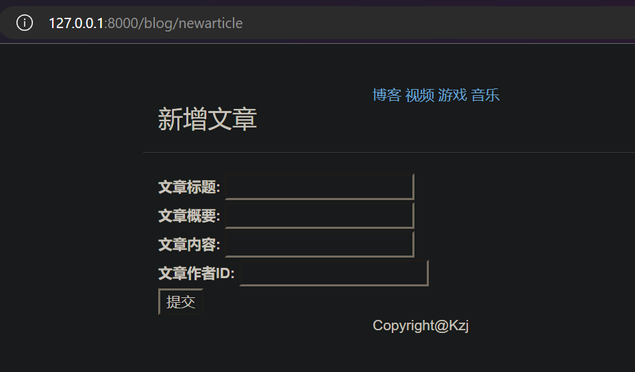
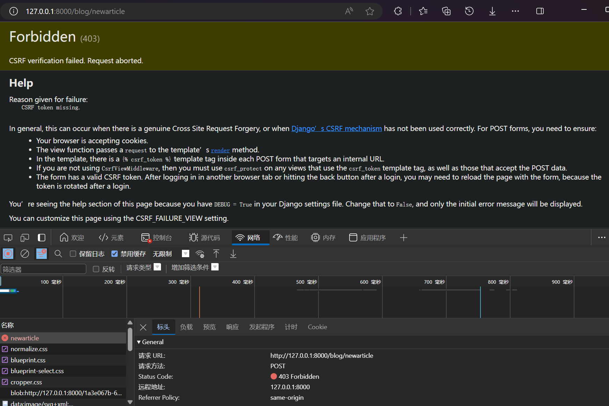

# Django 表单（Form）

之前浏览器发送过来的请求都是 GET 请求，网站只发布内容且不接受客户的输入
接下来，我们需要需要客户输入内容来做交互，要让浏览器发送过来的请求是 POST 请求，接收、处理、响应客户在HTML页面的输入

## 使用 HTML 表单

HTML 表单用于收集用户的输入信息

表单在 HTML 中定义为 `<form>...</form>` 标记内的元素集合，包含至少一个含有 `type="submit"` 属性的 `<input />` 输入元素

其中：
- `<form>` 元素用于创建表单，`action` 属性定义了表单数据提交的目标 URL，`method` 属性定义了提交数据的 HTTP 方法（这里使用的是 post）
- `<label>` 元素用于为表单元素添加标签，提高可读性
- `<input>` 元素是最常用的表单元素，它可以创建文本输入框、密码框、单选按钮、复选框等。`type` 属性定义了输入框的类型，`id` 属性用于关联 `<label>` 元素，`name` 属性用于标识表单字段，`value` 属性用于定义表单元素的初始值
- `<select>` 元素用于创建下拉列表，而 `<option>` 元素用于定义下拉列表中的选项

### 添加新文章页面

新建 **blog/templates/blog/newarticle.html** 文件，内容为
```html



<title>newarticle</title>



<div class="container page-header">
    <h3>新增文章</h3>
</div>
<div class="container body-main">
    <form action="/blog/newarticle" method="post">
        <label for="title">文章标题:</label>
        <input type="text" id="title" name="title" />
        <br>
        <label for="brief_content">文章概要:</label>
        <input type="text" id="brief_content" name="brief_content" />
        <br>
        <label for="content">文章内容:</label>
        <input type="text" id="content" name="content" />
        <br>
        <label for="author_id">文章作者ID:</label>
        <input type="number" id="author_id" name="author_id" />
        <br>
        <input type="submit" value="提交" />
    </form>
</div>

```

修改 **blog/views.py** 文件的内容为：
```py
from django.shortcuts import render
from django.core.paginator import Paginator
from .models import Article

def get_index_page(request):
    # 省略

def get_detail_page(request, article_id):
    # 省略

def new_article_page(request):
    return render(request, "blog/newarticle.html", {})
```

修改 **blog/urls.py** 文件的内容为：
```py
from django.urls import path
import blog.views as views

urlpatterns = [
    path('index', views.get_index_page),
    path('detail/<int:article_id>', views.get_detail_page),
    path('newarticle', views.new_article_page),
]
```

现在，运行开发服务器，访问 http://127.0.0.1:8000/blog/newarticle 就可以看到如下


### 403状态码（csrf 防范）

[Django的POST请求报403，及四种解决方法](https://cloud.tencent.com/developer/article/1352455)

点击提交按钮，会报403错误（csrf 防范）


这里我们简单地解决一下
在 **mysite/mysite/settings.py** 文件中 **MIDDLEWARE** 变量中注释掉 `'django.middleware.csrf.CsrfViewMiddleware'`
```py
MIDDLEWARE = [
    'django.middleware.security.SecurityMiddleware',
    'django.contrib.sessions.middleware.SessionMiddleware',
    'django.middleware.common.CommonMiddleware',
    # 'django.middleware.csrf.CsrfViewMiddleware',
    'django.contrib.auth.middleware.AuthenticationMiddleware',
    'django.contrib.messages.middleware.MessageMiddleware',
    'django.middleware.clickjacking.XFrameOptionsMiddleware',
]
```

尝试再次提交，成功


### 接收表单提交的数据

修改 **blog/views.py** 文件的内容为：
```py
from django.shortcuts import render
from django.core.paginator import Paginator
from .models import Article

def get_index_page(request):
    # 省略

def get_detail_page(request, article_id):
    # 省略

def new_article_page(request):
    if request.method == 'POST':
        new_article_dict = request.POST
        print('POST请求传入的参数: ')
        for (key,value) in new_article_dict.items():
            print('key: ', key, ' ,value: ', value)
        
    return render(request, "blog/newarticle.html", {})
```

点击提交按钮，效果如下


可见，可以拿到表单提交的数据

### 处理表单提交的数据

将表单提交的数据保存到数据库中

修改 **blog/views.py** 文件的内容为：
```py
from django.shortcuts import render
from django.core.paginator import Paginator
from .models import Article

def get_index_page(request):
    # 省略

def get_detail_page(request, article_id):
    # 省略

def new_article_page(request):

```

点击提交按钮，效果如下


---
---


django全套
https://www.bilibili.com/video/BV1vK4y1o7jH
P29


剩P10  post form
P13 静态文件


P29-30 session cookies

P31 项目


P41 跳过


2_ .md   融合网上文章内容 View URL


完善 字段类型


继续 表单 学习

