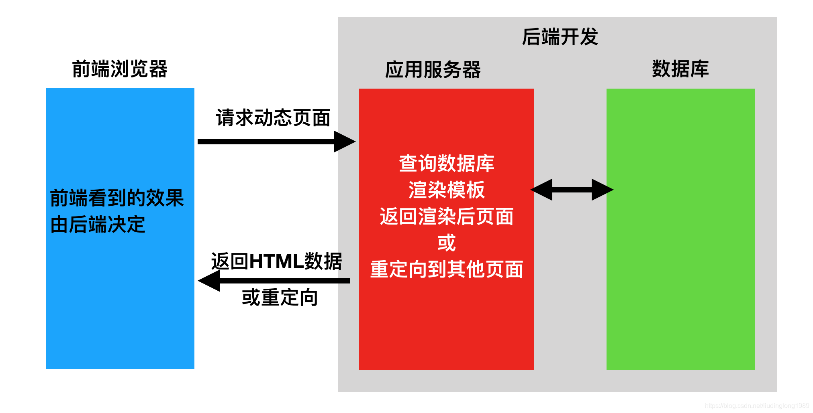
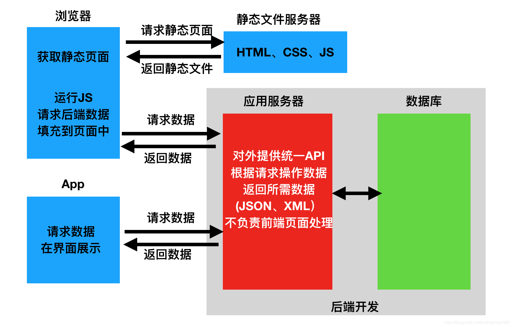
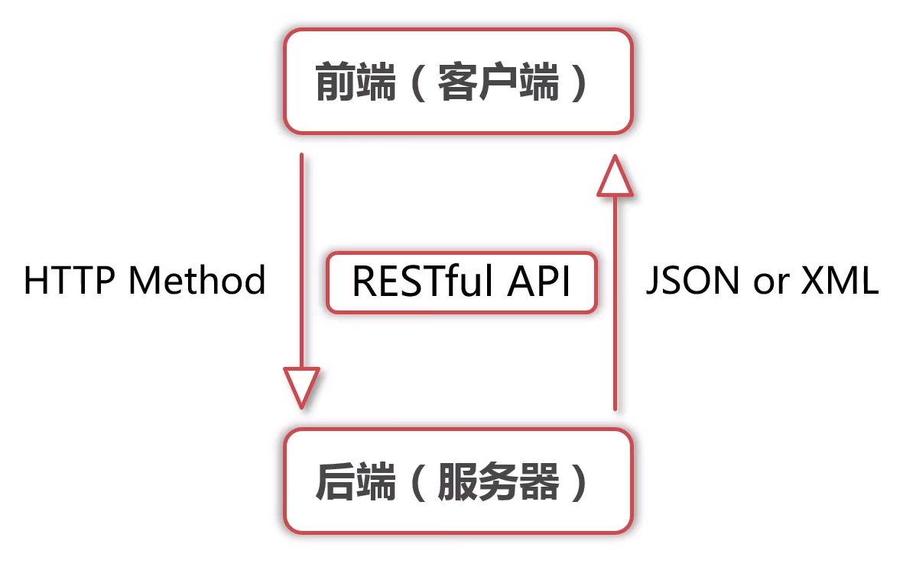
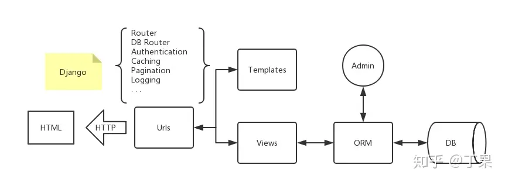
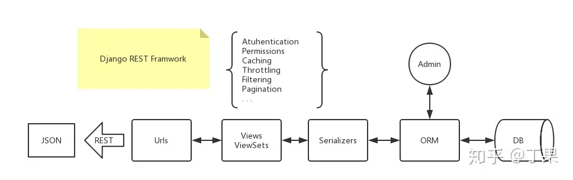
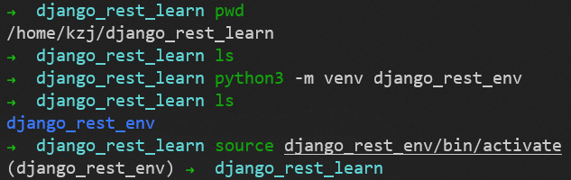
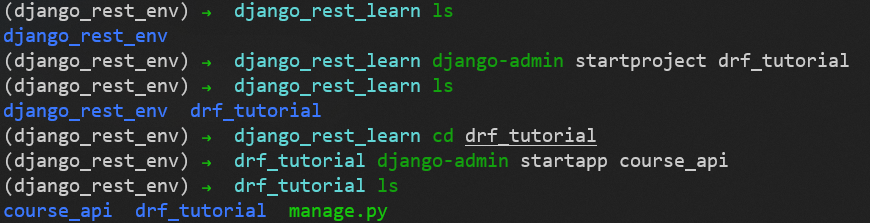
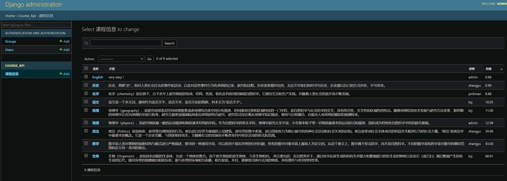
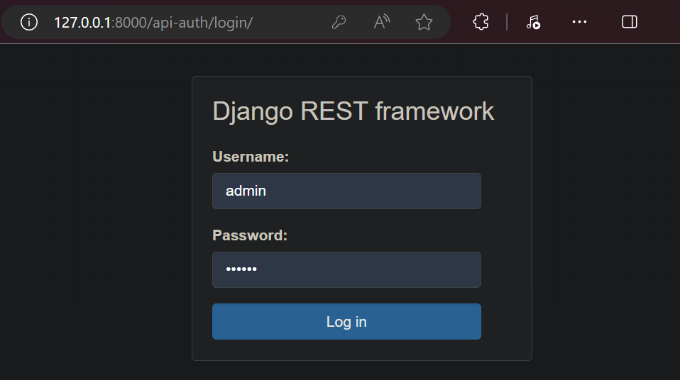

# 前后端分离与不分离

## 前后端不分离

在前后端不分离的应用模式中，前端页面看到的效果都是由后端控制，由后端渲染页面或重定向，也就是后端需要控制前端的展示，前端与后端的耦合度很高
这种应用模式比较适合纯网页应用，但是当后端对接App时，App可能并不需要后端返回一个HTML网页，而仅仅是数据本身，所以后端原本返回网页的接口不再适用于前端App应用，为了对接App后端还需再开发一套接口

请求的数据交互如下：


简单来说：前后端分不离的系统，没有前端，浏览器所看到的页面，是后端提供的，并且服务只有后台，没有前端服务

## 前后端分离

在前后端分离的应用模式中，后端仅返回前端所需的数据，不再渲染HTML页面，不再控制前端的效果。至于前端用户看到什么效果，从后端请求的数据如何加载到前端中，都由前端自己决定，网页有网页的处理方式，App有App的处理方式，但无论哪种前端，所需的数据基本相同，后端仅需开发一套逻辑对外提供数据即可
在前后端分离的应用模式中 ，前端与后端的耦合度相对较低。在前后端分离的应用模式中，我们通常将后端开发的每个视图都称为一个接口，或者API，前端通过访问接口来对数据进行增删改查

请求的数据交互如下：


简单来说：前后端分离的系统，有前端，浏览器所看到的页面，是前端服务提供，后台开发web接口提供数据给前端，前端需要处理之后再展示到浏览器上

# RESTful API



[RESTful 架构详解](https://www.runoob.com/w3cnote/restful-architecture.html)

## API 简介

API 即 应用程序接口（英文：Application Programming Interface，简称API）。那么它是一个怎样的接口呢，现在我们常将它看成一个HTTP接口即 HTTP API。也就是说这个接口得通过HTTP的方式来调用，做过前后端开发的小伙伴可能知道，后端开发又叫做面向接口开发，我们往往会提供一个接口供前端调用，或者供其他服务调用。举个例子，我们程序中往往会涉及到调用第三方接口，比如调用支付宝或者微信的支付接口来实现我们程序中的支付功能、调用带三方的短信接口来向用户发送验证码短信等等

### HTTP API 举例

比如说我们有一个可以允许我们查看（view），创建（create），编辑（edit），删除（delete）图书的应用程序。我们可以创建一个可以让我们执行这些功能的 HTTP API：
`http://demo.com/view_books`
`http://demo.com/create_new_book?name=shuxue`
`http://demo.com/update_book?id=1&name=shuxue`
`http://demo.com/delete_book?id=1`

这是4个 HTTP API，分别实现了图书的查看、新增、编辑、删除的操作，当我们把接口发布出去的时候，别人就可以通过这四个接口来调用相关的服务了。但是这样做有什么不方便的地方呢？你可能发现了，这种API的写法有一个缺点，那就是没有一个统一的风格，比如说第一个接口表示查询全部图书的信息，我们也可以写成这样：
`http://demo.com/books/list`

那这样就会造成使用我们接口的其他人，必须得参考API才能知道它是怎么运作的
不用担心，REST会帮我们解决这个问题

## REST 简介

REST 即 表述性状态传递（英文：Representational State Transfer，简称REST），是一种软件架构风格。它是一种针对网络应用的设计和开发方式，可以降低开发的复杂性，提高系统的可伸缩性

### HTTP 动词

REST 规定，对于资源的具体操作类型，由 HTTP 动词表示

HTTP 总共包含以下动词：
- **GET**：从服务器取出资源（一项或多项）
- **POST**：在服务器新建一个资源
- **PUT**：在服务器更新资源（客户端提供改变后的完整资源）
- PATCH：在服务器更新(更新)资源（客户端只提供需要改变的属性）
- **DELETE**：从服务器删除资源
- OPTIONS：获取信息，关于资源的哪些属性是客户端可以改变的
- HEAD：获取资源的元数据（描述数据的数据）
- TRACE：回显服务器收到的请求，主要用于测试或诊断
- CONNECT：HTTP/1.1 协议中预留给能够将连接改为管道方式的代理服务器

### RESTful API 举例

REST 的作用是将我们上面提到的查看（view），创建（create），编辑（edit），删除（delete）直接映射到 HTTP 中已实现的 GET，POST，PUT，DELETE 方法

我们重新将上面的四个接口改写成REST风格

查看所有图书：
- GET http://demo.com/books

新增一本书：
- POST http://demo.com/books
- Data: name=shuxue

修改一本书：
- PUT http://demo.com/books
- Data: id=1,name=shuxue

删除一本书：
- DELETE http://demo.com/books
- Data: id=1

这样改动之后API变得统一了，我们只需要改变请求方式就可以完成相关的操作，这样大大简化了我们接口的理解难度，变得易于调用，这就是REST风格的意义

### HTTP 状态码

REST 的另一重要部分就是为既定好请求的类型来响应正确的状态码。当你请求 HTTP 时，服务器会响应一个状态码来显示你的请求是否成功，然后客户端应如何继续。以下是四种不同层次的状态码：
- 2xx = Success（成功）
- 3xx = Redirect（重定向）
- 4xx = User error（客户端错误）
- 5xx = Server error（服务器端错误）

我们常见的是 200（请求成功）、404（未找到）、401（未授权）、500（服务器错误）

### API 格式响应

上面介绍了REST API的写法，响应状态码，剩下就是请求的数据格式以及响应的数据格式。说的通俗点就是，我们用什么格式的参数去请求接口并且我们能得到什么格式的响应结果

我这里只介绍一种用的最多的格式：JSON格式
目前json已经发展成了一种最常用的数据格式，由于其轻量、易读的优点

所以我们经常会看到一个请求的header信息中有这样的参数：
```json
Accept:application/json
```
这个参数的意思就是接收来自后端的json格式的信息

#### json 响应例子

```json
{
	"code": 200,
	"books": [{
		"id": 1,
		"name": "yuwen"
	}, {
		"id": 2,
		"name": "shuxue"
	}]
}
```

# Django 和 DRF 的区别和联系

[一图看懂Django和DRF](https://zhuanlan.zhihu.com/p/53957464)

## Django 框图



## DRF 框图



## 最少语言描述 Django

将数据库的东西通过 ORM 的映射取出来，通过 view 文件，按照 template 文件排出的模板渲染成 HTML。当用户请求相应的 url 时，返回相应的结果

## 最少语言描述 DRF

将数据库的东西通过 ORM 的映射取出来，通过 view 和 serializers 文件绑定 REST 接口，当前端请求时，返回序列化好的 json

## 最少语言描述 DRF 在 Django 的基础上做了什么

DRF 是 Django 的超集，去掉了模板的部分，提供了一个 REST 的接口，同时也提供了满足该接口的代码工作流。同时，在 REST 的规范下，升级了权限和分页等功能，增加了限流和过滤搜索等功能

## 总结

Django + DRF 将后端变成一种声明式的工作流，只要按照 models -> serializers -> views -> urls 的模式去一个个py文件去配置，即可生成一个很全面的通用的后端。当然，如果需求不那么通用，这种设计就变成了一个累赘

事实上，过重的设计降低了灵活性，报错基本得去翻源码实现，然后再吐槽一遍源码实现，这也是有得必有失。当然，现在 Django 和 DRF 一直在优化 middeware（中间件）的设计，也有 api_view 这种类似 flask 的装饰器的实现方式，也是在灵活性方面的一种权衡，不过对于初学者来说，仍然是个不大不小的坎

# Django REST framework 准备工作

[官方快速入手教程（DRF 的 tutorial）](https://www.django-rest-framework.org/tutorial/quickstart/)
> DRF 的 tutorial 讲的是 serializers 怎么写，view 怎么写，在 DRF 中 view 这一层既可以一个个 get、post、从头开始写起，也可以采用抽象程度比较高的 viewset 去按配置生成。另外还讲了一些 DRF 相较于 Django 升级和新增的功能

目标：使用 DRF 开发 RESTful API 接口（4种实现方式）
效果：用DRF的多种视图，实现课程信息的增删改查

## 项目前置配置（Django部分）

### 使用虚拟环境（venv）

在新创建的目录 /home/kzj/django_rest_learn 中
用如下命令创建一个名为 django_rest_env 的python虚拟环境
```sh
python3 -m venv django_rest_env
```
并用如下命令激活这个虚拟环境
```sh
source django_rest_env/bin/activate
```



#### 如何停止使用虚拟环境

如果当前虚拟环境已经处于激活状态，可以使用如下命令退出虚拟环境
```sh
deactivate
```

#### 如何删除虚拟环境

删除虚拟环境，只需要**将这个虚拟环境目录删除**即可

### 安装 django

在激活的虚拟环境中，用如下命令安装 django
```sh
pip install django
```

### 创建与配置 项目和应用

用如下命令创建 drf_tutorial 项目和 course_api 应用
```sh
django-admin startproject drf_tutorial
django-admin startapp course_api
```



因为添加了一个新的app，我们需要告诉Django
因此，确保将 course_api 添加到 setting.py 文件中的 INSTALLED_APPS 列表中

**drf_tutorial/drf_tutorial/settings.py** 文件的部分对应内容修改为：
```py
ALLOWED_HOSTS = ["*"]
INSTALLED_APPS = [
    'django.contrib.admin',
    'django.contrib.auth',
    'django.contrib.contenttypes',
    'django.contrib.sessions',
    'django.contrib.messages',
    'django.contrib.staticfiles',
    'course_api',   # 新增
]
DATABASES = {
    'default': {
        'ENGINE': 'django.db.backends.mysql',
        'NAME': 'djangoRESTdb',
        'HOST': '127.0.0.1',
        'PORT': 3306,
        'USER': 'root',
        'PASSWORD': '1',
    }
}
TIME_ZONE = 'Asia/Shanghai'
```

### 配置数据库

这里使用MySQL
创建名为djangoRESTdb的数据库
```sql
create database djangoRESTdb default charset=utf8;   
```

安装pymysql
```sh
pip install pymysql
```

在 **\_\_init\_\_.py** 文件（与settings.py同一个目录）中引入模块和进行配置
```py
import pymysql
pymysql.install_as_MySQLdb()
```

### 定义数据模型（Model）

在 models.py 文件的 Course 类中，我们创建2个字段: id、name
修改 **drf_tutorial/course_api/models.py** 文件的内容为：
```py
from django.db import models
from django.conf import settings

class Course(models.Model):
    name = models.CharField(max_length=255, unique=True, help_text='课程名称', verbose_name='名称')
    introduction = models.TextField(help_text='课程介绍', verbose_name='介绍')
    # teacher 用外键关联到 Django 默认的用户表
    teacher = models.ForeignKey(settings.AUTH_USER_MODEL, on_delete=models.CASCADE, help_text='课程讲师', verbose_name='讲师')
    price = models.DecimalField(max_digits=6, decimal_places=2, help_text='课程价格', verbose_name='价格')
    created_at = models.DateTimeField(auto_now_add=True, help_text='课程创建时间', verbose_name='创建时间')
    updated_at = models.DateTimeField(auto_now=True, help_text='课程更新时间', verbose_name='更新时间')
    
    class Meta:
        verbose_name = '课程信息'
        verbose_name_plural = verbose_name
        ordering = ('price',)

    def __str__(self):
        return self.name
```

### 执行数据同步

创建新的迁移文件并更新同步到数据库
```sh
python3 manage.py makemigrations
python3 manage.py migrate
```

### 配置管理后台 admin

我们希望在Django的后台中管理我们的数据，因此，我们在 admin.py 文件中注册 Course 类
修改 **drf_tutorial/course_api/admin.py** 文件的内容为：
```py
from django.contrib import admin
from .models import Course

@admin.register(Course)
class CourseAdmin(admin.ModelAdmin):
    list_display = ('name', 'introduction', 'teacher', 'price')
    search_fields = list_display
    list_filter = list_display
```

创建一个超级管理员帐户（用户名：admin，密码：123456）
```sh
python3 manage.py createsuperuser
```

### 运行项目

启动 django web 服务
```sh
python3 manage.py runserver
```

进入 http://127.0.0.1:8000/admin/
手动添加一些 Course 数据，如下图


到此，我们已经完成了Django部分，由于本示例是为了创建一个API服务，所以我们不需要创建模板和视图。相反，我们还需要继续添加 **Django Rest** 库来处理将模型数据转换为 **RESTful API**

# 使用 Django REST framework

[Django REST framework 官网](https://www.django-rest-framework.org/)

## 安装 djangorestframework 及其依赖包

在激活的虚拟环境中，用如下命令安装 djangorestframework 及其依赖包
```sh
pip install djangorestframework
pip install markdown
pip install Pygments
pip install django-filter
pip install PyYAML
pip install uritemplate
```

## Django Rest Framework 的模块介绍

20个：
序列化
视图
路由
认证
权限
限流
过滤
解析器
渲染器
分页
版本
测试
概要
异常处理
配置
验证
状态码
内容协商
缓存
元数据

## Django Rest Framework 配置

### INSTALLED_APPS 中加入 `'rest_framework'`

**drf_tutorial/drf_tutorial/settings.py** 文件的部分对应内容修改为：
```py
INSTALLED_APPS = [
    'django.contrib.admin',
    'django.contrib.auth',
    'django.contrib.contenttypes',
    'django.contrib.sessions',
    'django.contrib.messages',
    'django.contrib.staticfiles',
    'rest_framework',   # RESTful API
    'rest_framework.authtoken', # DRF 自带的Token认证
    'course_api',
]
```

### urlpatterns 中加入 `path('api-auth/', include('rest_framework.urls'))`

修改 **drf_tutorial/course_api/urls.py** 文件的内容为：
```py
from django.contrib import admin
from django.urls import path, include

urlpatterns = [
    path('admin/', admin.site.urls),
    path('api-auth/', include('rest_framework.urls')),  # DRF 的登录和退出
]
```

### 添加 DRF 全局配置

在 **drf_tutorial/drf_tutorial/settings.py** 文件中添加：
```py
REST_FRAMEWORK = {
    # 分页
    'DEFAULT_PAGINATION_CLASS': 'rest_framework.pagination.PageNumberPagination',
    # 每页的数据条数
    'PAGE_SIZE': 10,
    # 时间显示格式
    'DATETIME_FORMAT': '%Y-%m-%d %H:%M:%S',
    # 当 DRF 返回 Response 对象时，使用哪个 render 类
    'DEFAULT_RENDERER_CLASSES': [
        'rest_framework.renderers.JSONRenderer',
        'rest_framework.renderers.BrowsableAPIRenderer',
    ],
    # 如何解析 Request 请求中的 data
    'DEFAULT_PARSER_CLASSES': [
        'rest_framework.parsers.JSONParser',
        'rest_framework.parsers.FormParser',
        'rest_framework.parsers.MultiPartParser',
    ],
    # 权限控制
    'DEFAULT_PERMISSION_CLASSES': [
        'rest_framework.permissions.IsAuthenticated',
    ],
    # 认证
    'DEFAULT_AUTHENTICATION_CLASSES': [
        'rest_framework.authentication.BasicAuthentication',
        'rest_framework.authentication.SessionAuthentication',
        'rest_framework.authentication.TokenAuthentication',
    ]
}
```

### 执行数据同步

创建新的迁移文件并更新同步到数据库
```sh
python3 manage.py makemigrations
python3 manage.py migrate
```

### 运行项目

启动 django web 服务
```sh
python3 manage.py runserver
```

进入 http://127.0.0.1:8000/api-auth/login/
用之前创建的 admin 用户登录


## 序列化（serializers）

### 简介

序列化，也叫 序列化器，用于将 **查询集QuerySet** 或 **模型类实例Instance** 这种 Django数据类型，转化为 **JSON** 或 **XML** 格式（方便前端渲染）的数据
**序列化**：`Course.objects.all()   # queryset, instance  ->  json/xml/yaml`（处理从数据库中查询到的数据，传给前端）
**反序列化**：`Course.objects.all()   # queryset, instance  <-  json/xml/yaml`（处理前端传来的数据，保存到数据库）

序列化 与 反序列化 存在的原因：方便前后端分离架构下的数据交互

### 使用 Django 默认的序列化器


### 使用 DRF 默认的序列化器

新建 **drf_tutorial/course_api/serializers.py** 文件，其内容如下：
```py

```


## 视图集（viewsets）


## 路由（routers）


## 认证（authentication）


## 权限（permission）


---
---


this:
djangoREST
https://www.bilibili.com/video/BV1Dm4y1c7QQ/


djangoREST2
https://www.bilibili.com/video/BV1k5411p7Kp


P7


剩 P1 演示postman
P3 postman github API
P4 配置文件 static


教学资源
https://github.com/liaogx/drf-tutorial
