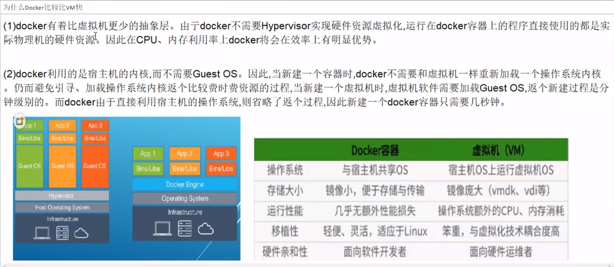
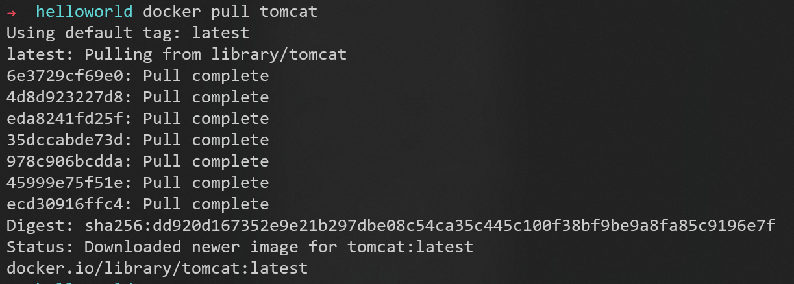

# 开始

## run


找镜像的流程图：


如果找的镜像在远程仓库上不存在：


### 底层原理




## 帮助命令

### docker version

### docker info

### docker --help

# 镜像命令


## images

列出本地主机上的镜像


### docker images -a


因为镜像是分层的，所以会看到```<none>```
如果不加参数```-a```，只显示最外面暴露的一层

### docker images -q


只输出ID（唯一主键），可以用于批处理操作

### docker images --digests


### docker images --no-trunc


## search

在远程仓库Docker Hub上搜索镜像


### docker search -f stars=30 tomcat

过滤镜像，只要stars超过30的


### docker search -f stars=30 --no-trunc tomcat

参数```--no-trunc```表示不要省略说明


## pull

拉取镜像

上图中有很多ID，说明镜像是分层的，最上层暴露的是tomcat，还有其他镜像一层层地叠加

## rmi

删除镜像


删除全部的方法：


### docker rmi -f hello-world

强制删除


