# 容器命令

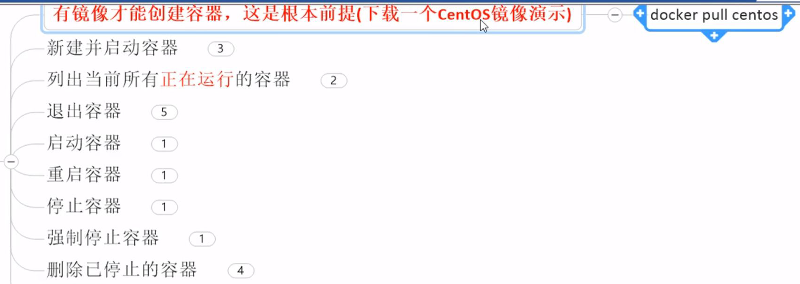

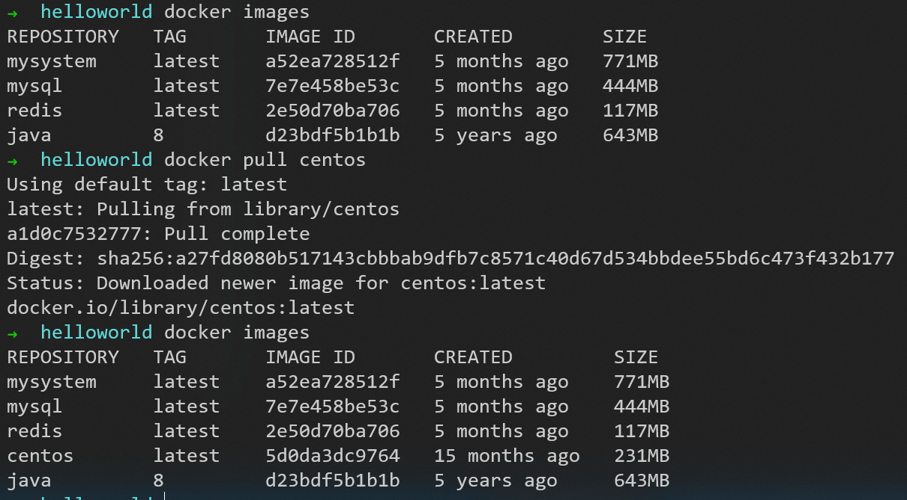

## run

新建并启动容器

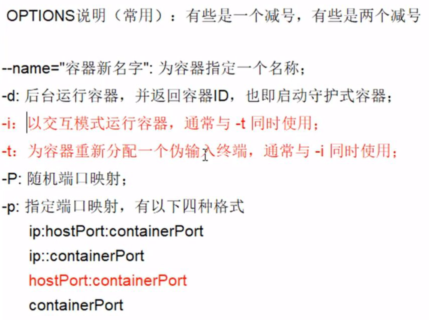

### docker run -it 5d0da3dc9764

启动交互模式并进入终端
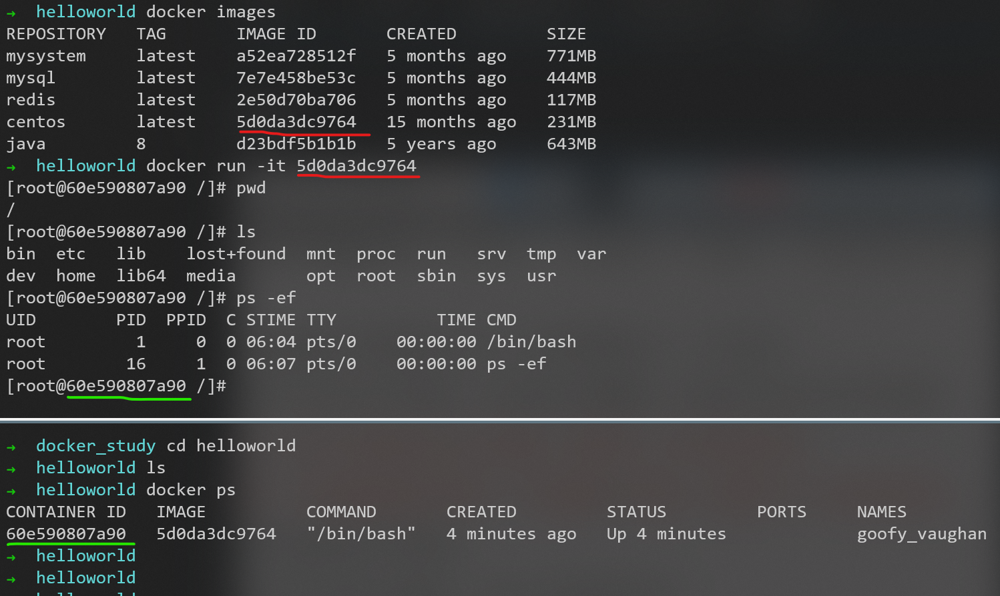

### docker run -d centos

后台运行容器
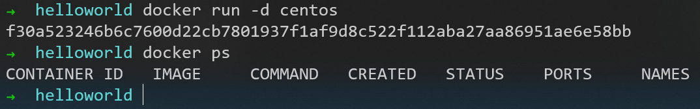
上图可见，用```docker ps```命令找不到它
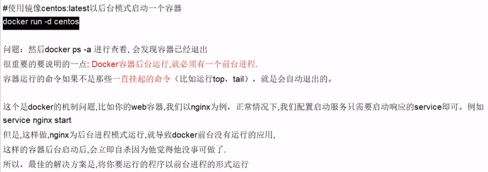
类似于一个饭店，长时间没有客人，就把灶火停了

让它有事情可做，实例见下方的logs里

## ps

类似于linux中的命令```ps -ef```

列出所有正在运行的容器
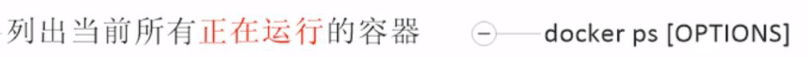

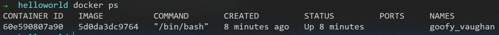

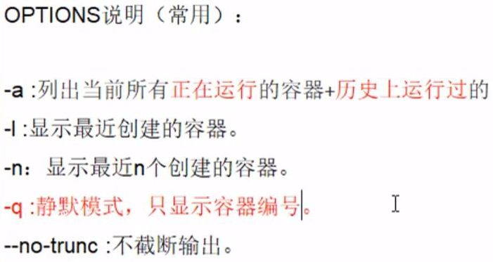
实例见下方退出容器的exit里

## 退出容器

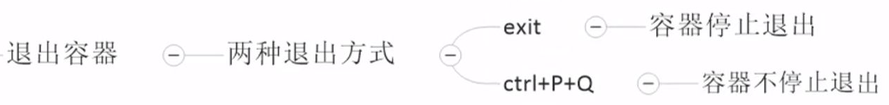

### exit

容器**停止**退出
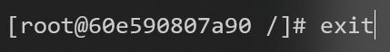
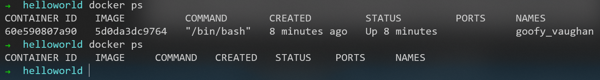

用```docker ps```命令的效果：
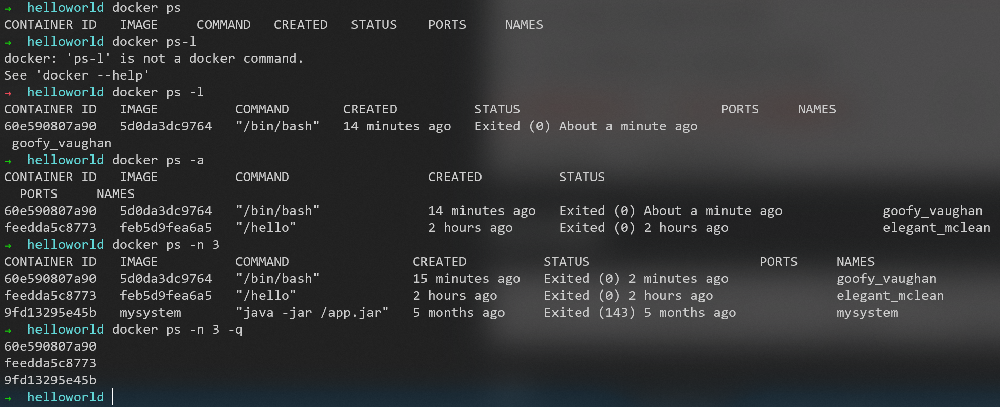

### Ctrl + P + Q

先把之前停止退出的centos启动：
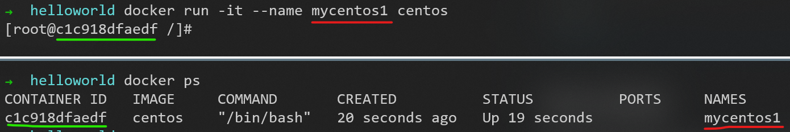

容器**不停止**退出
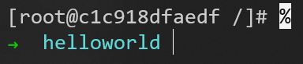
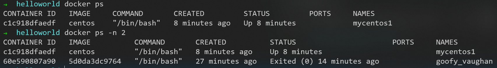

如果之后想再进入这个容器，就用```docker attach```命令

## start

启动容器
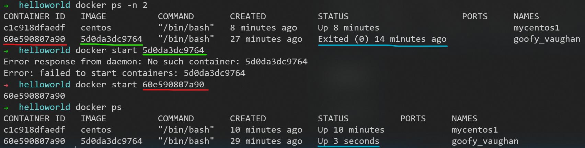
容器可以停止，也可以启动

## restart

重启容器
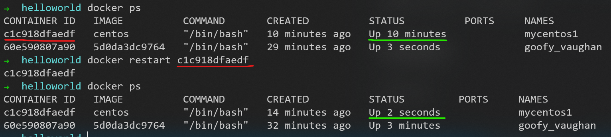

## stop

温柔停止容器

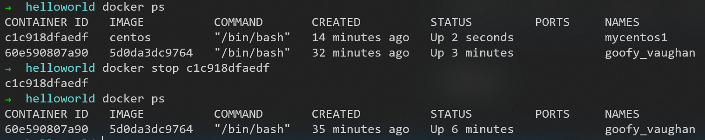

## kill

强制停止容器

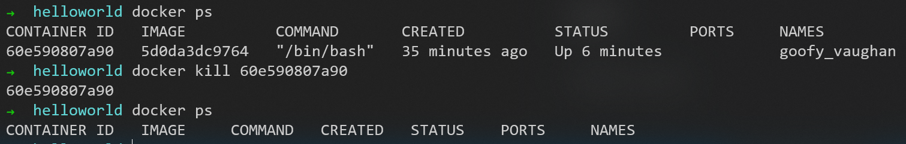

## rm

注意：
1. ```rmi```是删除镜像（image）
2. ```rm```是删除容器（container）

删除已停止的容器

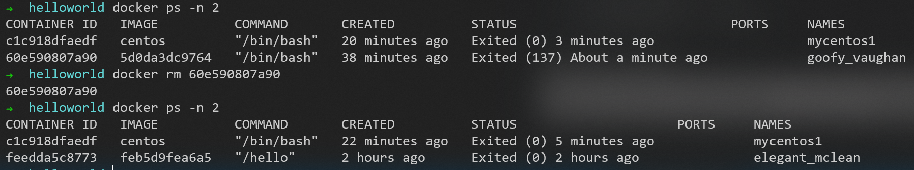

对于没有停止的容器，用参数```-f```可以强制删除

删除全部的方法：
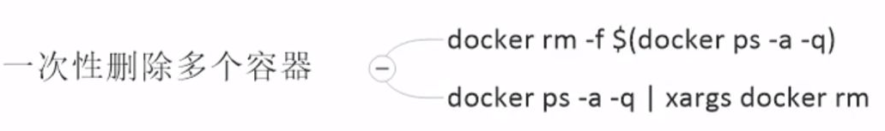
上图中的命令结构类似sql查询，管道前查出的结果作为参数交给管道后的

## logs

查看日志


让后台运行的容器有事情可做
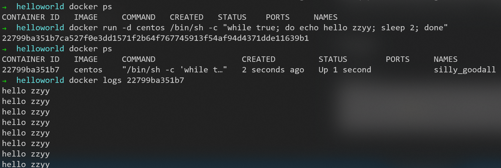
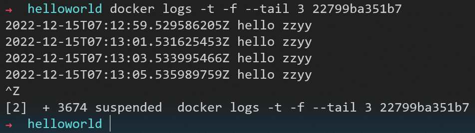

## top

类似于linux中的命令```top```

查看容器内运行的进程
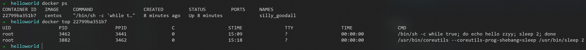

大部分的linux命令在docker中都可以使用

## inspect

因为docker镜像像同心圆一样，一层套一层

查看容器内部的细节
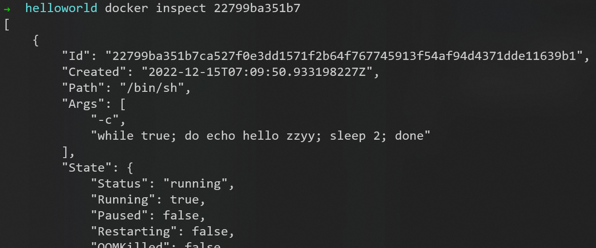
返回JSON串

## attach


进入正在运行的容器
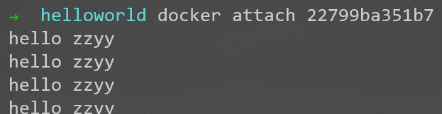

## exec

功能比attach强大


隔山打牛，在外面对容器进行远程操作，并把结果返回到外面
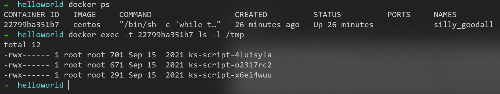

进去再干活
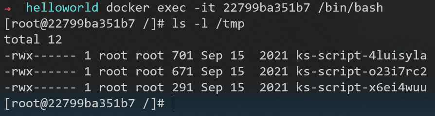

## cp

容器内外之间的拷贝


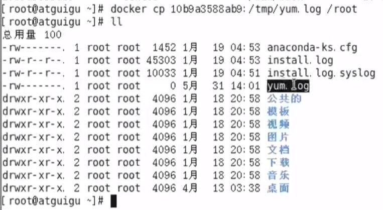


