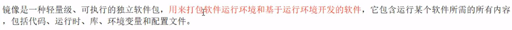
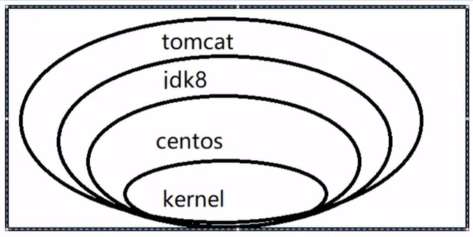

# 镜像原理

## 镜像是什么



## UnionFS 联合文件系统（花卷）


## Docker镜像加载原理


## 分层的镜像


举例：Tomcat镜像


## 为什么Docker镜像采用这样的分层结构

共享资源

公用组件，解耦合

## 特点


# 提交容器命令

镜像是只读的，我们修改的是容器


类似Git中的```commit```命令

## commit

通过下面的例子学习commit的使用

### 成功运行tomcat镜像

命令```docker run -it -p 8888:8080 tomcat```中的```-p 8888:8080```表示把容器内部的8080端口映射到外部的8888端口

如果把```-p 8888:8080```改成```-P```就是随机分配端口

新版的tomcat访问网页得到404是正常的，因为webapps文件夹下没有东西

### 修改tomcat容器

进入容器


在webapps文件夹下新建ROOT文件夹，在其中新建index.html文件并写入

这时，已经能在浏览器中访问

### 以当前的容器为模板commit一个新镜像

命令```docker commit -a "作者名" -m "提交日志" [容器ID] [起的镜像名]:[版本号]```


### 关掉所有正在运行的容器

命令```docker rm -f $(docker ps -q)```


### 启动自己的镜像


