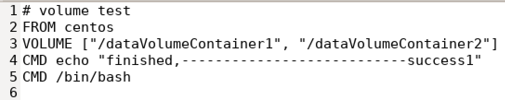

# Docker容器数据卷

## 作用

把docker容器运行产生的数据持久化


容器之间或者容器和宿主机之间的数据共享


## 容器内添加容器数据卷

### 直接命令添加容器数据卷（具名挂载）


不用提前当前目录下创建test文件夹（执行添加容器数据卷的命令后，test文件夹会自动生成）

```docker run -it -p 8082:8080 -v $PWD/test:/usr/local/tomcat/webapps/test tomcat```


命令说明：
```-v $PWD/test:/usr/local/tomcat/webapps/test```：将主机中当前目录下的```test```目录挂载到容器的 ```/usr/local/tomcat/webapps/test```目录。

现在，执行命令的目录下多了**test文件夹**


并且，新建的容器内，```/usr/local/tomcat/webapps/```目录下也多了**test文件夹**


用```docker inspect [容器ID]```命令，查看容器内部细节


#### 数据共享

由docker容器共享到外部：


由外部共享到docker容器：


#### 停止容器，修改容器数据卷，然后启动容器，数据会同步

用```docker stop [容器ID]```命令


在容器外的test文件夹中新增文件testVolume3.txt


用```docker start [容器ID]```命令，启动已停止的容器


#### 命令带权限（容器内只读）


和前面的命令相比，多了```:ro```


现在，容器内外的容器数据卷都是空的


- 在容器内不能修改容器数据卷：


- 在容器内只能读取容器数据卷：


用```docker inspect [容器ID]```命令，查看容器内部细节

注意这里的```Mode```和```RW```的值和上面命令不带权限的不同

### DockerFile添加容器数据卷（匿名挂载）

#### 新建DockerFile文件


#### 使用VOLUME指令给镜像添加一个或多个容器数据卷

- DockerFile文件的内容为

其中：
1. 第2行表示来自哪个父类的镜像
2. 第3行表示在根目录下新建两个容器数据卷
3. 第4行表示打出一句话
4. 第5行的/bin/bash的作用是表示载入容器后运行bash，docker中必须要保持一个进程的运行，要不然整个容器启动后就会马上kill itself，这个/bin/bash就表示启动容器后启动bash

- 上面的DockerFile文件的内容可翻译成直接命令为```docker run -it -v /host1:/dataVolumeContainer1 -v /host2:/dataVolumeContainer2 centos /bin/bash```

注意：
DockerFile文件中设置容器数据卷时，不能设置容器数据卷的宿主机目录，这是因为宿主机目录是依赖于特定宿主机的，并不能保证在所有宿主机上都存在这样的特定目录

#### 使用build命令构建镜像

使用命令```docker build -f ./DockerFile -t zzyy/centos .```构建镜像


#### 运行这个镜像

使用命令```docker run -it zzyy/centos```运行镜像

并在dataVolumeContainer1文件夹中新建contain01.txt文件，以备之后的测试

看到了**容器内的数据卷的目录地址**，对应的**主机内的数据卷的目录地址**在哪？
上面的DockerFile文件中并没有指定宿主机的容器数据卷的目录，但是Docker会有**默认的位置**

#### 查找宿主机的数据卷的目录地址

用```docker inspect [容器ID]```命令，查看容器内部细节


可以看到宿主机的数据卷的默认目录地址


```
"/var/lib/docker/volumes/dd6895dbc2d0656f0148fd6c5dae6d03b2c7cd0f0ac5d2facf646f75196b2a6a/_data"对应"/dataVolumeContainer1",
              
"/var/lib/docker/volumes/5008d836611ea8bd5ac82fcb9987cb434b896e8f51a5561192f22630a138df2f/_data"对应"/dataVolumeContainer2",
```       


看到了之前新建的contain01.txt文件

##### 可以使用grep显示符合条件的附近的行

使用命令```docker inspect f51afed2400d | grep -A20 Mounts```查找关键字Mounts，并显示关键字所在行和其之后的20行

其中的参数：
1. A ->After（后）
2. B ->Before（前）
3. C ->Context（前后）

##### volume命令

通过```docker volume ls```查看所有数据卷的情况


# Docker数据卷容器

## 作用

命名的容器挂载数据卷，其他容器通过挂载这个父容器实现数据共享，挂载数据卷的容器称为数据卷容器

> 容器中数据管理主要有两种方式：数据卷和数据卷容器
> 1. 数据卷（Data Volumes） 容器内数据直接映射到本地宿主机
> 2. 数据卷容器（Data Volume Containers） 使用特定容器维护数据卷

## 使用

### 前期准备


### 容器间传递共享（```--volumes-from```）


#### 启动父容器dc01

使用命令```docker run -it --name dc01 zzyy/centos```启动父容器dc01

在dataVolumeContainer2文件夹下**新增dc01_add.txt文件**

#### 启动子容器dc02（继承dc01）

使用命令```docker run -it --name dc02 --volumes-from dc01 zzyy/centos```启动子容器dc02

在dataVolumeContainer2文件夹下**可见dc01_add.txt文件**
在dataVolumeContainer2文件夹下**新增dc02_add.txt文件**

#### 启动子容器dc03（继承dc01）

使用命令```docker run -it --name dc03 --volumes-from dc01 zzyy/centos```启动子容器dc03

在dataVolumeContainer2文件夹下**可见dc01_add.txt文件、dc02_add.txt文件**
在dataVolumeContainer2文件夹下**新增dc03_add.txt文件**

现在启动了三个容器


#### 进入父容器dc01

使用命令```docker attach [容器ID]```进入父容器dc01

在dataVolumeContainer2文件夹下**可见dc01_add.txt文件、dc02_add.txt文件、dc03_add.txt文件**

同理子容器dc02现在里面也**可见dc01_add.txt文件、dc02_add.txt文件、dc03_add.txt文件**

#### 删除父容器dc01


#### 进入子容器dc02


在dataVolumeContainer2文件夹下**可见dc01_add.txt文件、dc02_add.txt文件、dc03_add.txt文件**
在dataVolumeContainer2文件夹下**新增dc02_update.txt文件**

#### 删除子容器dc02


#### 进入子容器dc03


在dataVolumeContainer2文件夹下**可见dc01_add.txt文件、dc02_add.txt文件、dc03_add.txt文件、dc02_update.txt文件**

#### 启动子容器dc04（继承dc03）

使用命令```docker run -it --name dc04 --volumes-from dc03 zzyy/centos```启动子容器dc04


#### 删除子容器dc03


#### 总结

- 这里数据卷都挂载到宿主机了
- --volumes-from 可以理解为继承的数据卷配置，也就是说dc01怎么配的我就怎么配
- 所以就算删除了dc01，但是配置没动，所以数据之间的同步不受影响
- 这个继承的是dc01的卷配置，并不是创建与dc01的链接
- 确实不能说是继承，会误解，应该说是放在一个共享区间

