# Docker容器数据卷

## 作用

把docker容器运行产生的数据持久化

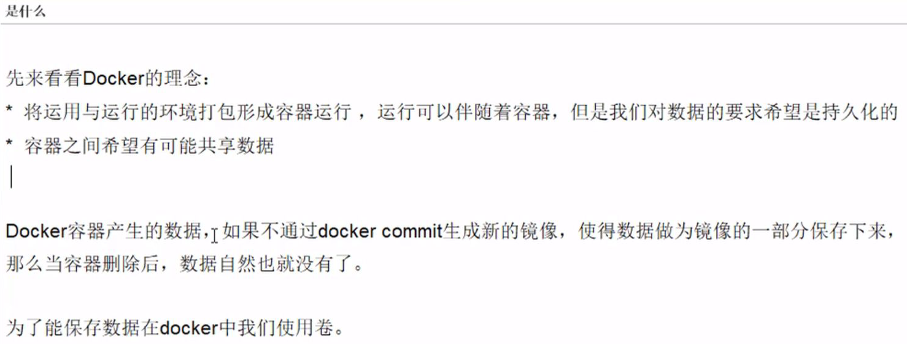

容器之间或者容器和宿主机之间的数据共享

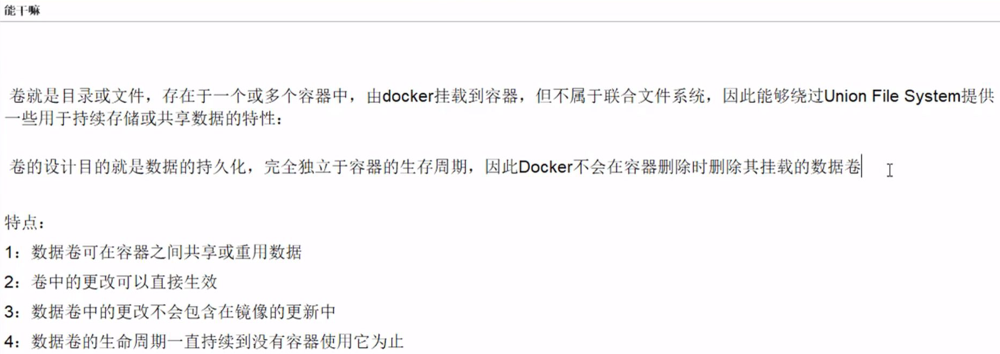

## 容器内添加容器数据卷

### 直接命令添加

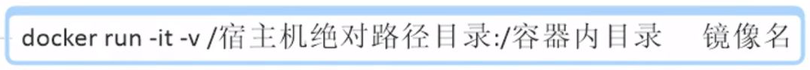

不用提前当前目录下创建test文件夹（执行添加容器数据卷的命令后，test文件夹会自动生成）

```docker run -it -p 8082:8080 -v $PWD/test:/usr/local/tomcat/webapps/test tomcat```
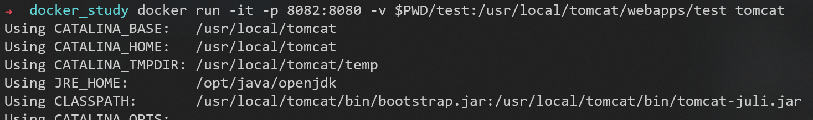

命令说明：
```-v $PWD/test:/usr/local/tomcat/webapps/test```：将主机中当前目录下的```test```目录挂载到容器的 ```/usr/local/tomcat/webapps/test```目录。

现在，执行命令的目录下多了**test文件夹**


并且，新建的容器内，```/usr/local/tomcat/webapps/```目录下也多了**test文件夹**
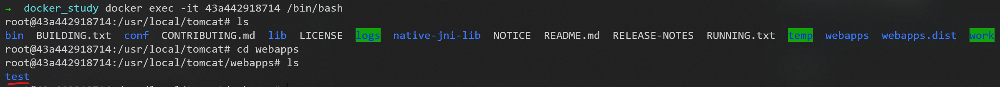

用```docker inspect [容器ID]```命令，查看容器内部细节
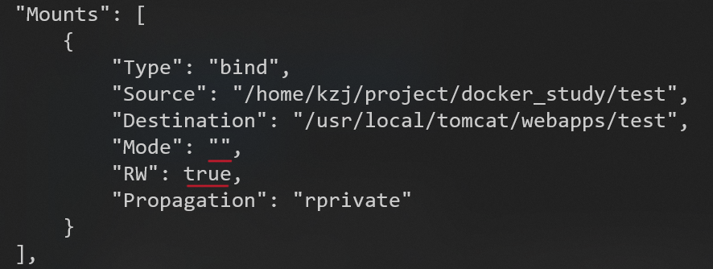

#### 数据共享

由docker容器共享到外部：
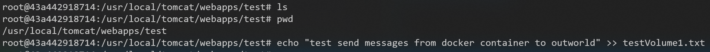

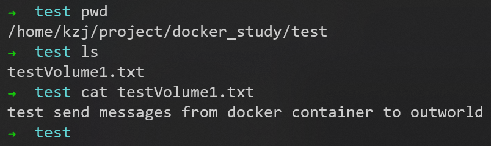

由外部共享到docker容器：
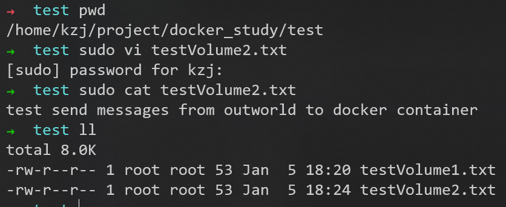

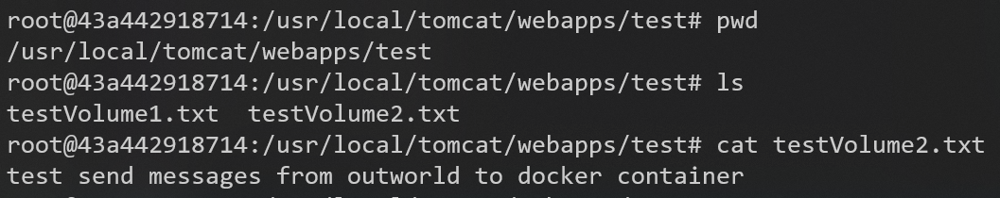

#### 停止容器，修改容器数据卷，然后启动容器，数据会同步

用```docker stop [容器ID]```命令
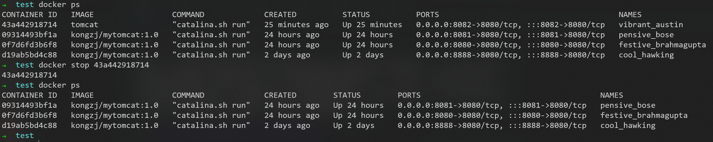

在容器外的test文件夹中新增文件testVolume3.txt
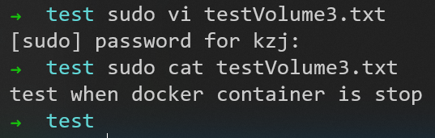

用```docker start [容器ID]```命令，启动已停止的容器
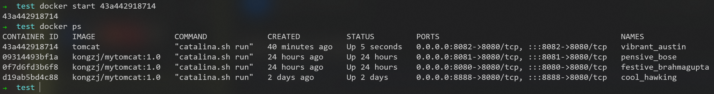

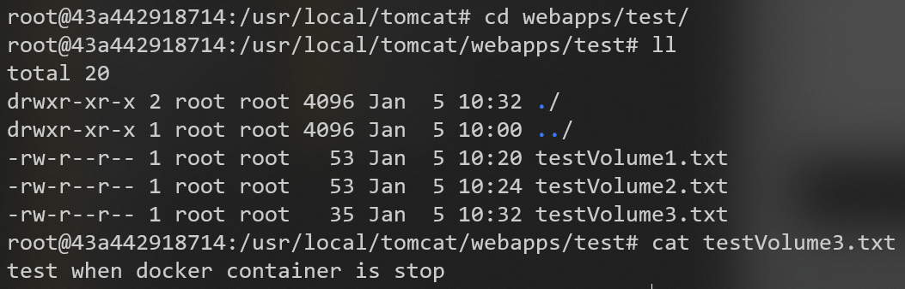

#### 命令带权限（容器内只读）


和前面的命令相比，多了```:ro```
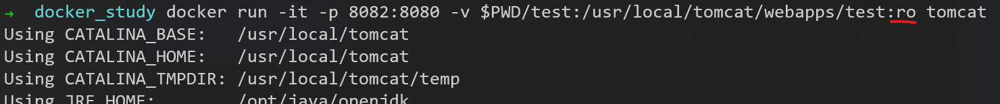

现在，容器内外的容器数据卷都是空的
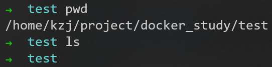
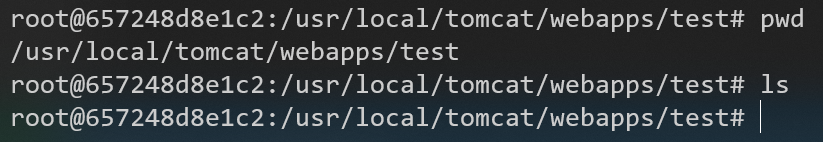

- 在容器内不能修改容器数据卷：


- 在容器内只能读取容器数据卷：
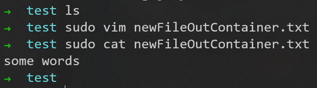
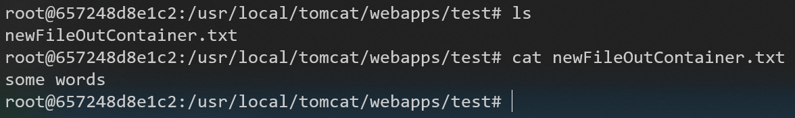

用```docker inspect [容器ID]```命令，查看容器内部细节
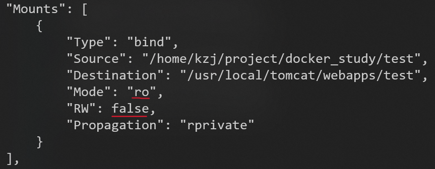
注意这里的```Mode```和```RW```的值和上面命令不带权限的不同

### DockerFile添加


---

到P20

