# Dockerfile

Dockerfile 是一个用来构建镜像的文本文件，文本内容包含了一条条构建镜像所需的指令和说明。

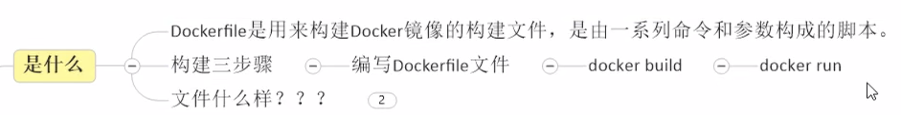

## Dockerfile的指令摘要

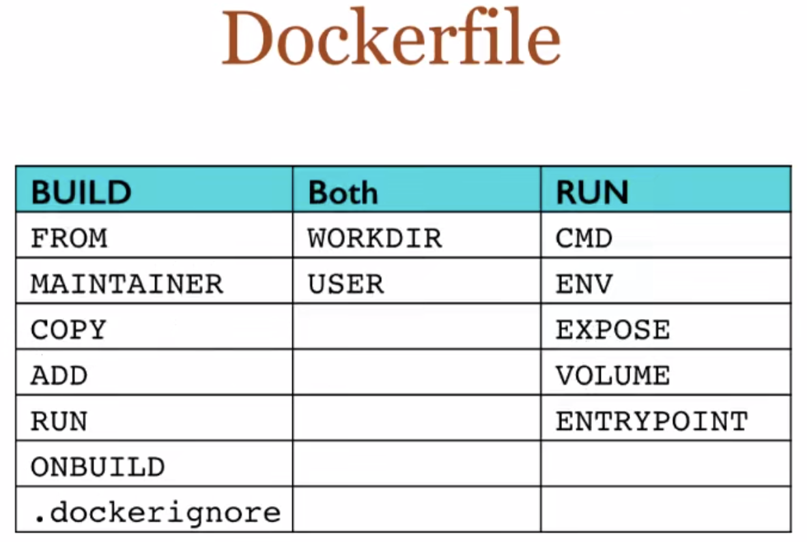

FROM- 镜像从那里来
MAINTAINER- 镜像维护者信息
RUN- 构建镜像执行的命令，每一次RUN都会构建一层
CMD- 容器启动的命令，如果有多个则以最后一个为准，也可以为ENTRYPOINT提供参数
VOLUME- 定义数据卷，如果没有定义则使用默认
USER- 指定后续执行的用户组和用户
WORKDIR- 切换当前执行的工作目录
HEALTHCHECH- 健康检测指令
ARG- 变量属性值，但不在容器内部起作用
EXPOSE- 暴露端口
ENV- 变量属性值，容器内部也会起作用
ADD- 添加文件，如果是压缩文件也解压
COPY- 添加文件，以复制的形式
ENTRYPOINT- 容器进入时执行的命令

[Dockerfile菜鸟教程](https://www.runoob.com/docker/docker-dockerfile.html)

## 举例：centos的Dockerfile

[docker仓库中的centos](https://hub.docker.com/_/centos)


对应的Dockerfile的内容为
```dockerfile
FROM scratch
ADD centos-7-x86_64-docker.tar.xz /

LABEL \
    org.label-schema.schema-version="1.0" \
    org.label-schema.name="CentOS Base Image" \
    org.label-schema.vendor="CentOS" \
    org.label-schema.license="GPLv2" \
    org.label-schema.build-date="20201113" \
    org.opencontainers.image.title="CentOS Base Image" \
    org.opencontainers.image.vendor="CentOS" \
    org.opencontainers.image.licenses="GPL-2.0-only" \
    org.opencontainers.image.created="2020-11-13 00:00:00+00:00"

CMD ["/bin/bash"]
```
其中：
- ```scratch```是所有镜像文件的祖先类
- ```ADD <src> <dest>```该命令将复制指定的```<src>```路径下内容到镜像中的```<dest>```路径下（添加内容到镜像）
- ```LABEL```指令用来给镜像添加一些元数据（metadata），以键值对的形式
- ```/bin/bash```的作用是表示载入容器后运行bash，docker中必须要保持一个进程的运行，要不然整个容器启动后就会马上kill itself，这个```/bin/bash```就表示启动容器后启动bash

## Dockerfile构建过程解析

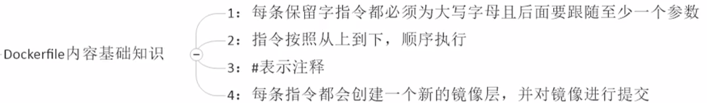

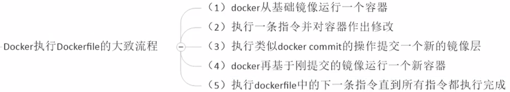


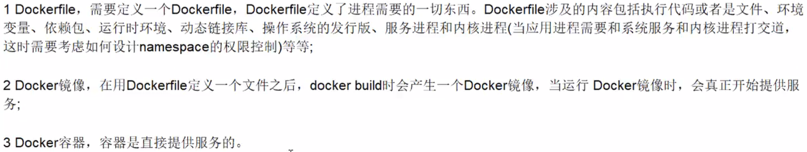

## 案例1：自定义镜像mycentos

Dockerfile1的内容为
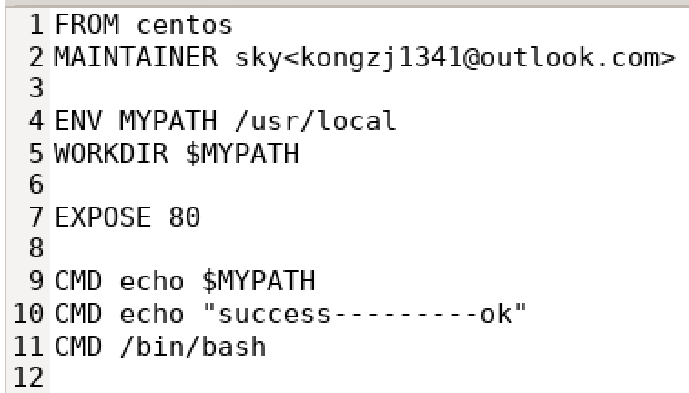

使用命令```docker build -f ./DockerFile1 -t mycentos:1.3 .```构建镜像
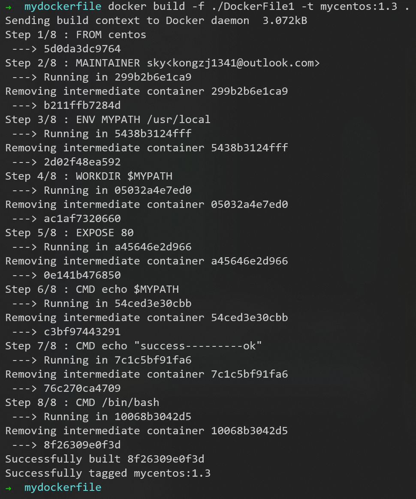

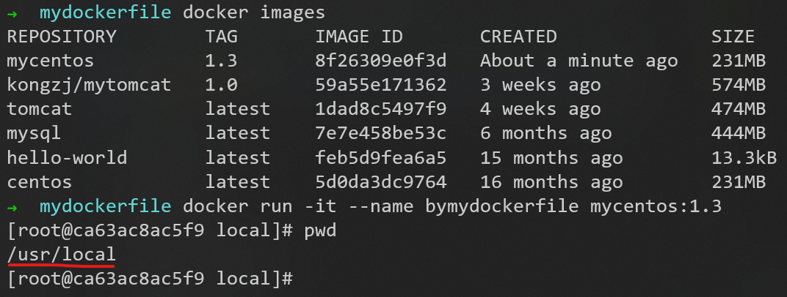

使用命令```docker history [镜像ID]```查看镜像的生成历史

每经过Dockerfile文件中的一步，就产生一个新的镜像，像千层饼

## 案例2：CMD-ENTRYPOINT指令

### Dockerfile中可以有多个CMD指令，但只有最后一个生效，CMD会被```docker run```之后的参数替换

tomcat官方的Dockerfile中的最后一行是```CMD ["catalina.sh", "run"]```

- 使用命令```docker run -it -p 7777:8080 tomcat```运行tomcat，**可以成功启动**，因为执行了Dockerfile中的最后一行```CMD ["catalina.sh", "run"]```
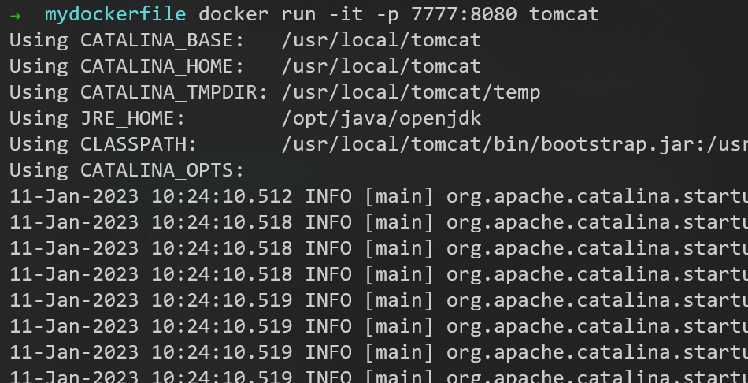

- 现在想干坏事，使用命令```docker run -it -p 7777:8080 tomcat ls -l```运行tomcat，**没有启动成功**
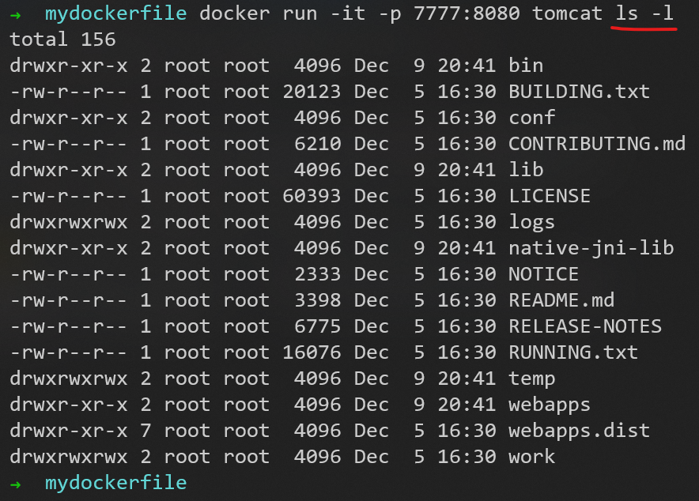
因为命令中在tomcat后面增加了```ls -l```，相当于在Dockerfile中最后增加```CMD ls -l```
这时相当于Dockerfile文件的最后两行为
```dockerfile
CMD ["catalina.sh", "run"]
CMD ls -l
```

```CMD ls -l```命令把```CMD ["catalina.sh", "run"]```命令覆盖了

### ```docker run```之后的参数会被当做参数传递给ENTRYPOINT，之后形成新的命令组合

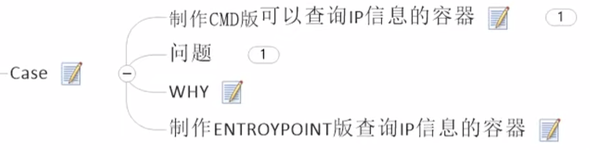

```curl```是一个下载命令
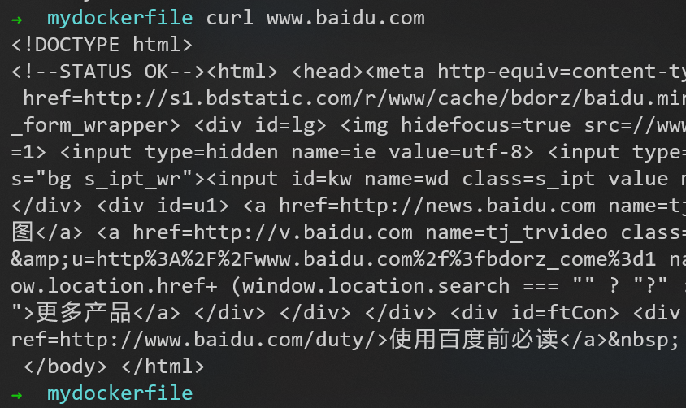


[IP地址查询网站](https://ip.cn/)

Dockerfile2的内容为


这个网址现在不能和视频里返回一样的东西


---

到 P26 尚硅谷