# Dockerfile

Dockerfile 是一个用来构建镜像的文本文件，文本内容包含了一条条构建镜像所需的指令和说明。


## Dockerfile的指令摘要


FROM- 镜像从那里来
MAINTAINER- 镜像维护者信息
RUN- 构建镜像执行的命令，每一次RUN都会构建一层
CMD- 容器启动的命令，如果有多个则以最后一个为准，也可以为ENTRYPOINT提供参数
VOLUME- 定义数据卷，如果没有定义则使用默认
USER- 指定后续执行的用户组和用户
WORKDIR- 切换当前执行的工作目录
HEALTHCHECH- 健康检测指令
ARG- 变量属性值，但不在容器内部起作用
EXPOSE- 暴露端口
ENV- 变量属性值，容器内部也会起作用
ADD- 添加文件，如果是压缩文件也解压
COPY- 添加文件，以复制的形式
ENTRYPOINT- 容器进入时执行的命令
ONBUILD- 为镜像添加触发器

[Dockerfile菜鸟教程](https://www.runoob.com/docker/docker-dockerfile.html)

## 举例：centos的Dockerfile

[docker仓库中的centos](https://hub.docker.com/_/centos)


对应的Dockerfile的内容为
```dockerfile
FROM scratch
ADD centos-7-x86_64-docker.tar.xz /

LABEL \
    org.label-schema.schema-version="1.0" \
    org.label-schema.name="CentOS Base Image" \
    org.label-schema.vendor="CentOS" \
    org.label-schema.license="GPLv2" \
    org.label-schema.build-date="20201113" \
    org.opencontainers.image.title="CentOS Base Image" \
    org.opencontainers.image.vendor="CentOS" \
    org.opencontainers.image.licenses="GPL-2.0-only" \
    org.opencontainers.image.created="2020-11-13 00:00:00+00:00"

CMD ["/bin/bash"]
```
其中：
- ```scratch```是所有镜像文件的祖先类
- ```ADD <src> <dest>```该命令将复制指定的```<src>```路径下内容到镜像中的```<dest>```路径下（添加内容到镜像）
- ```LABEL```指令用来给镜像添加一些元数据（metadata），以键值对的形式
- ```/bin/bash```的作用是表示载入容器后运行bash，docker中必须要保持一个进程的运行，要不然整个容器启动后就会马上kill itself，这个```/bin/bash```就表示启动容器后启动bash

## Dockerfile构建过程解析


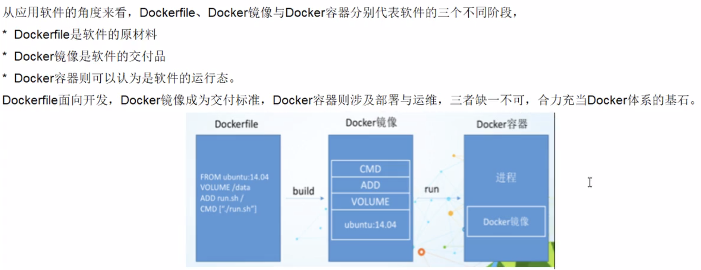


## 案例1：自定义镜像mycentos

Dockerfile1的内容为


使用命令```docker build -f ./DockerFile1 -t mycentos:1.3 .```构建镜像


使用命令```docker history [镜像ID]```查看镜像的生成历史
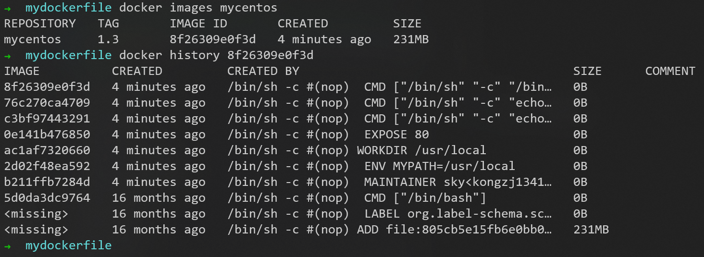
每经过Dockerfile文件中的一步，就产生一个新的镜像，像千层饼

## 案例2：CMD-ENTRYPOINT指令（追加和覆盖的区别）

### Dockerfile中可以有多个CMD指令，但只有最后一个生效，CMD会被```docker run```之后的参数替换

tomcat官方的Dockerfile中的最后一行是```CMD ["catalina.sh", "run"]```

- 使用命令```docker run -it -p 7777:8080 tomcat```运行tomcat，**可以成功启动**，因为执行了Dockerfile中的最后一行```CMD ["catalina.sh", "run"]```


- 现在想干坏事，使用命令```docker run -it -p 7777:8080 tomcat ls -l```运行tomcat，**没有启动成功**

因为命令中在tomcat后面增加了```ls -l```，相当于在Dockerfile中最后增加```CMD ls -l```
这时相当于Dockerfile文件的最后两行为
```dockerfile
CMD ["catalina.sh", "run"]
CMD ls -l
```

```CMD ls -l```命令把```CMD ["catalina.sh", "run"]```命令覆盖了

### ```docker run```之后的参数会被当做参数传递给ENTRYPOINT，之后形成新的命令组合

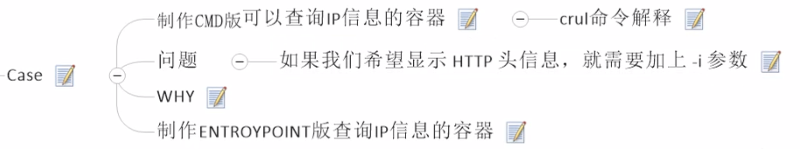

```ipinfo.io```可以查询IP信息的网站

```curl```是一个下载命令

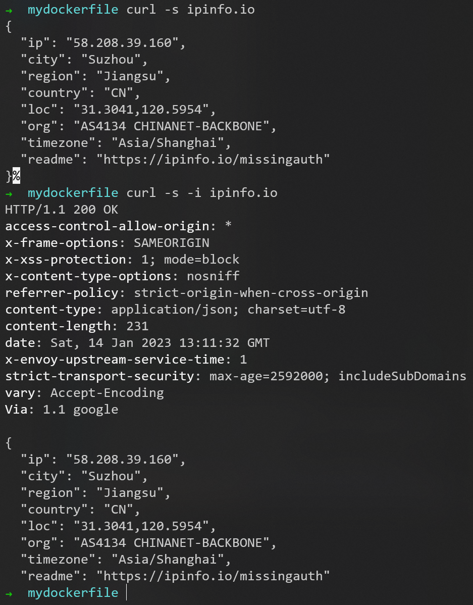

#### CMD版本的Dockerfile

Dockerfile2的内容为
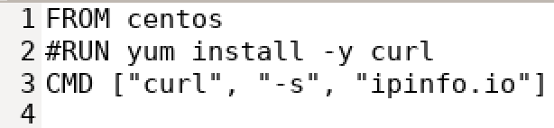

使用命令```docker build -f ./DockerFile2 -t myip:1.0 .```构建镜像
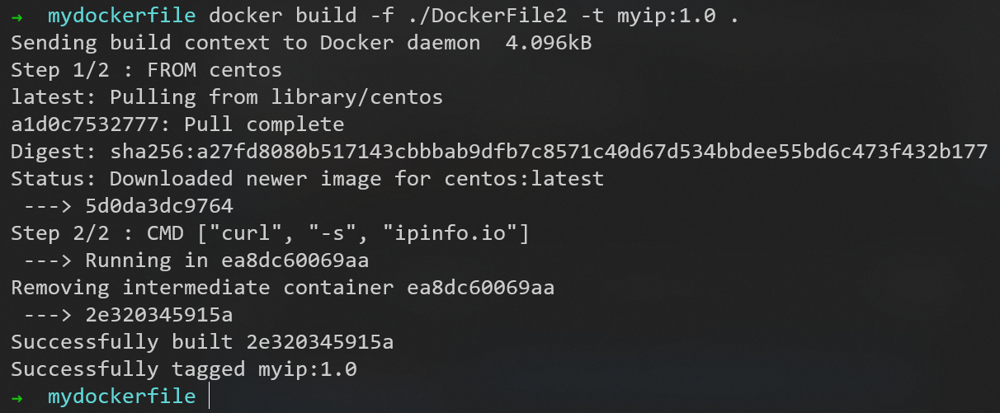

在```docker run```命令后面加参数```-i```，报错，因为新增加的```-i```变成```CMD -i```**覆盖**Dockerfile文件的最后一行```CMD ["curl", "-s", "ipinfo.io"]```
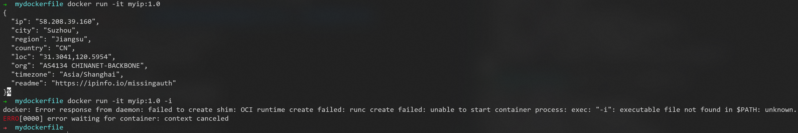

#### ENTRYPOINT版本的Dockerfile

Dockerfile3的内容为
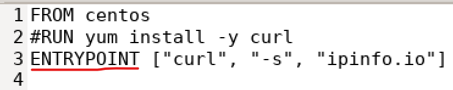

使用命令```docker build -f ./DockerFile3 -t myip:2.0 .```构建镜像
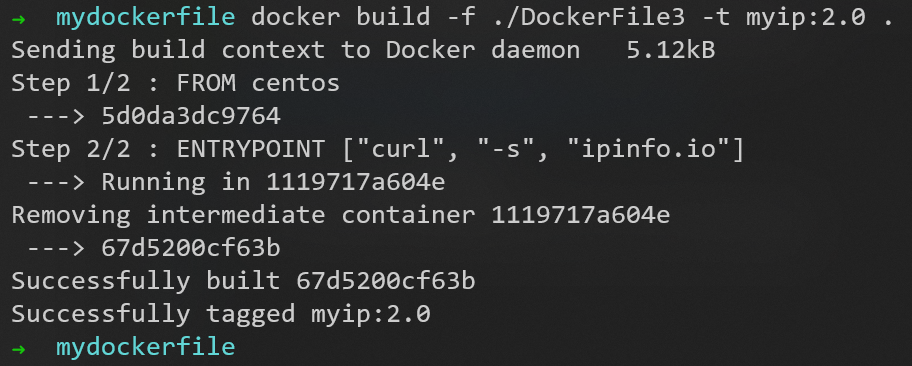

在```docker run```命令后面加参数```-i```，正确执行，因为新增加的```-i```作为参数**追加**在```ENTRYPOINT ["curl", "-s", "ipinfo.io"]```中，变成```ENTRYPOINT ["curl", "-s", "ipinfo.io", "-i"]```
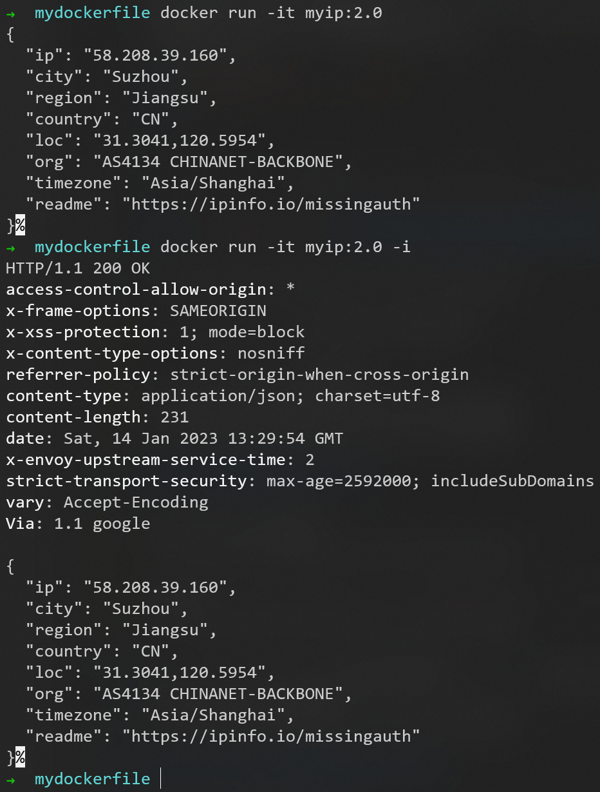

## 案例3：ONBUILD指令

ONBUILD指令可以为镜像添加触发器。其参数是任意一个Dockerfile指令。

当我们在一个Dockerfile文件中加上ONBUILD指令，该指令对利用该Dockerfile构建镜像（比如为A镜像）不会产生实质性影响。

但是当我们编写一个新的Dockerfile文件来基于A镜像构建一个镜像（比如为B镜像）时，这时构造A镜像的Dockerfile文件中的ONBUILD指令就生效了，在构建B镜像的过程中，首先会执行ONBUILD指令指定的指令，然后才会执行其它指令。

需要注意的是，如果是再利用B镜像构造新的镜像时，那个ONBUILD指令就无效了，也就是说只能再构建子镜像中执行，对孙子镜像构建无效。其实想想是合理的，因为在构建子镜像中已经执行了，如果孙子镜像构建还要执行，相当于重复执行，这就有问题了。

利用ONBUILD指令,实际上就是相当于创建一个模板镜像，后续可以根据该模板镜像创建特定的子镜像，需要在子镜像构建过程中执行的一些通用操作就可以在模板镜像对应的dockerfile文件中用ONBUILD指令指定。 从而减少dockerfile文件的重复内容编写。

给Dockerfile3增加最后一行，内容为
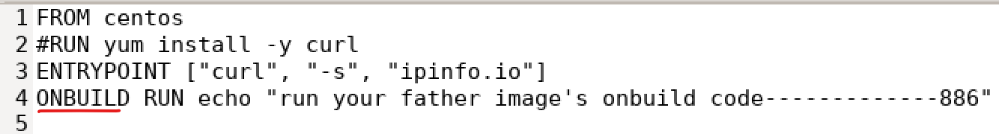

使用命令```docker build -f ./DockerFile3 -t myip_father .```构建子镜像```myip_father```
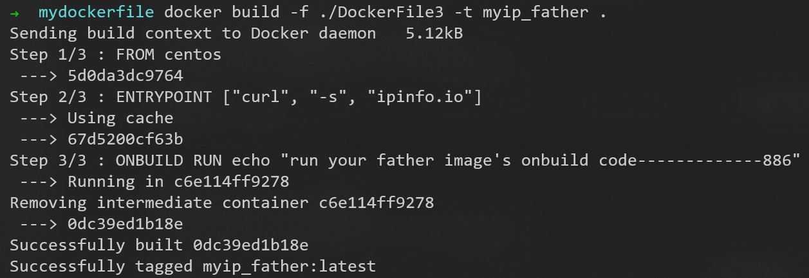

新增Dockerfile4，内容为
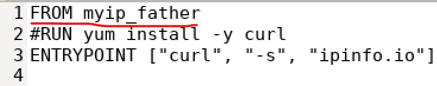

使用命令```docker build -f ./DockerFile4 -t myip_son .```构建子镜像```myip_son```，**父镜像的Dockerfile文件中的ONBUILD中的Dockerfile指令被执行**
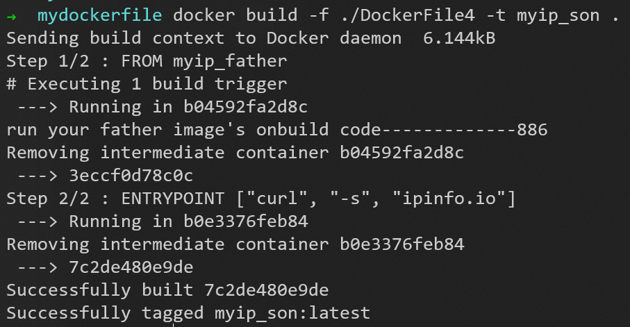

## 案例4：部署jar包运行

提前运行好mysql容器
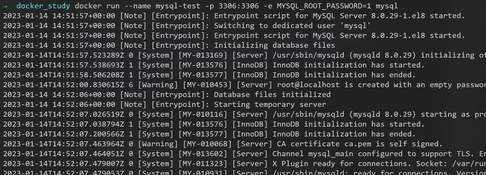

可以通过以下方式访问容器中的mysql
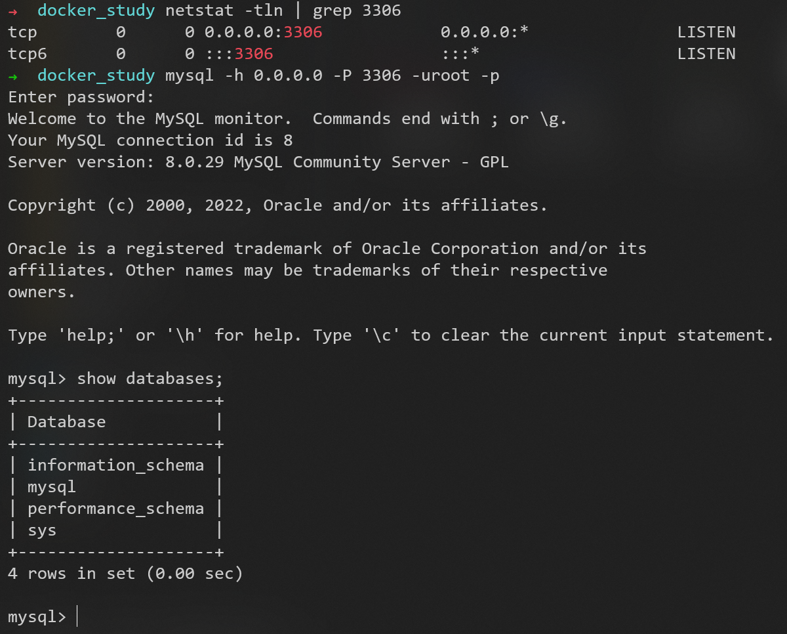

Dockerfile的内容为


使用命令```docker build -t mysystem .```构建镜像，这里可以不用```-f```参数，是因为执行命令时默认使用当前目录中名为Dockerfile的文件


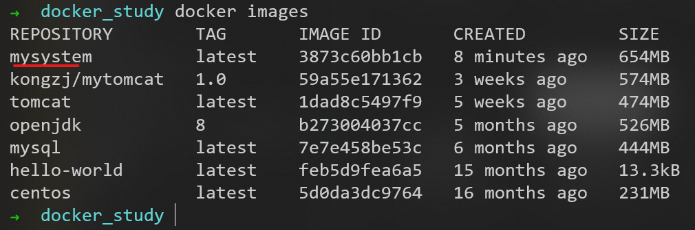

使用命令```docker run -p 8080:8080 -p 465:465 --name mysystem --link mysql-test:mysql-test -d mysystem```运行mysystem镜像
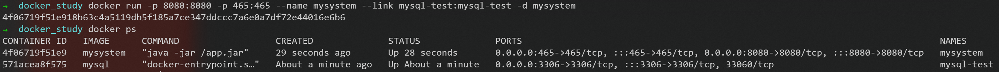


详见Docker部署Springboot项目
