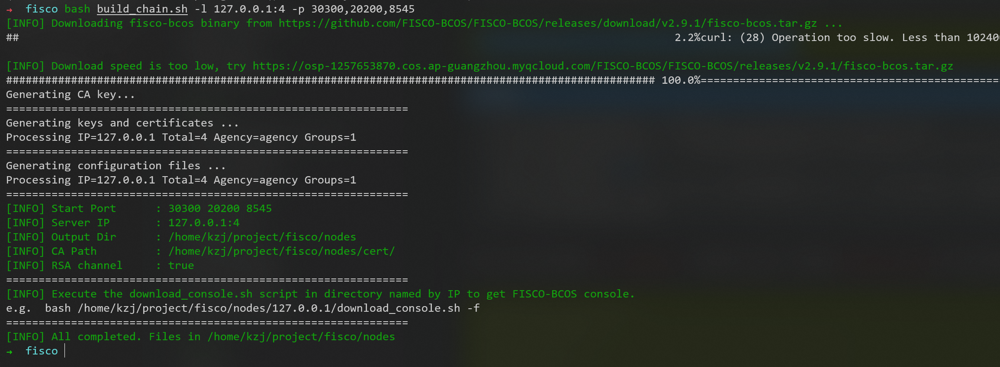
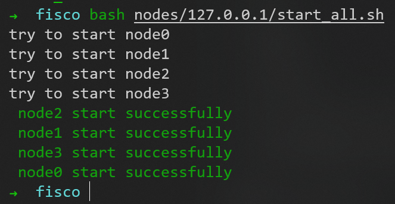
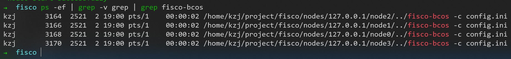
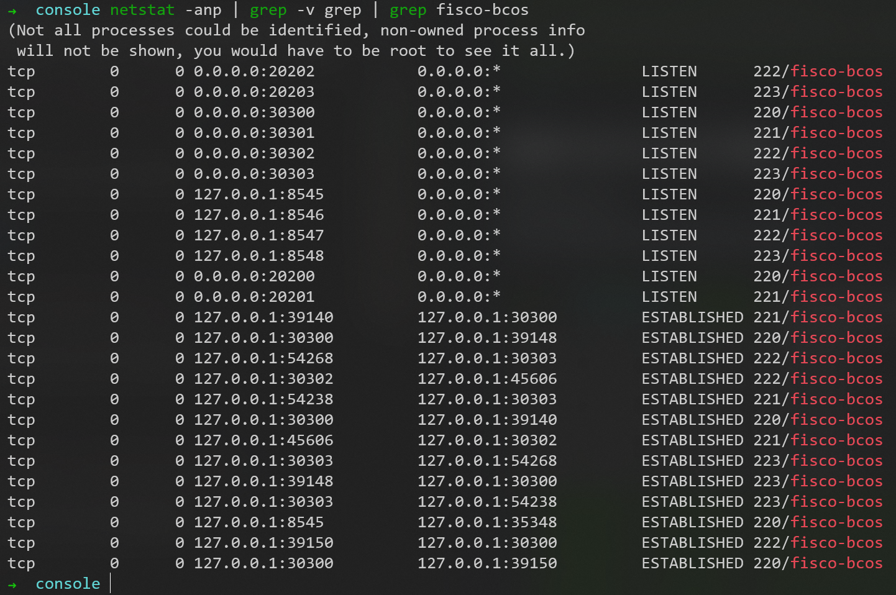
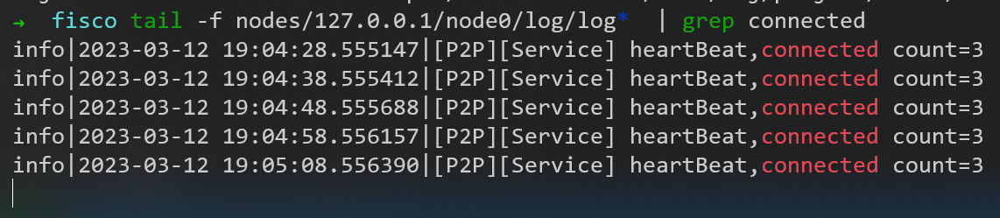
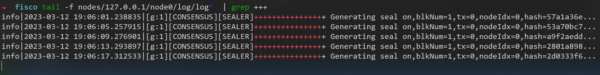
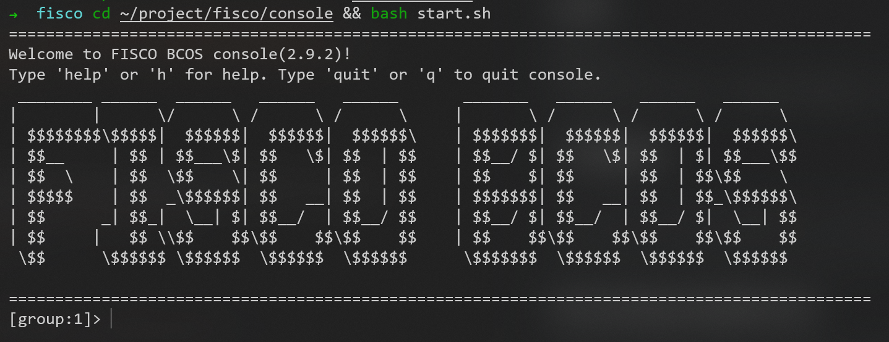
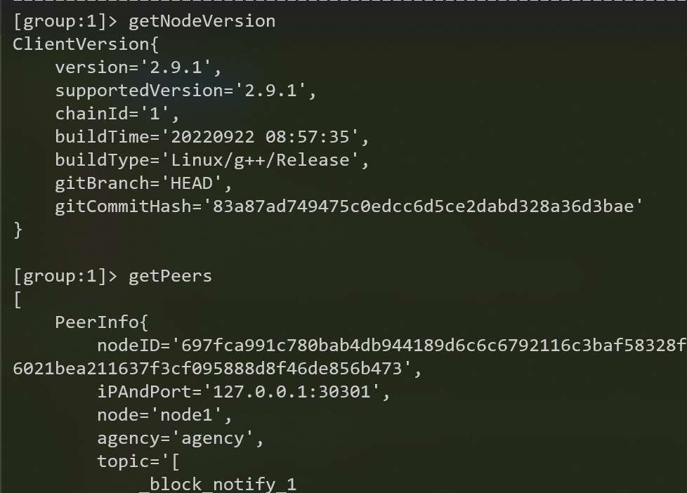
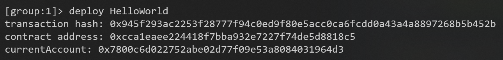
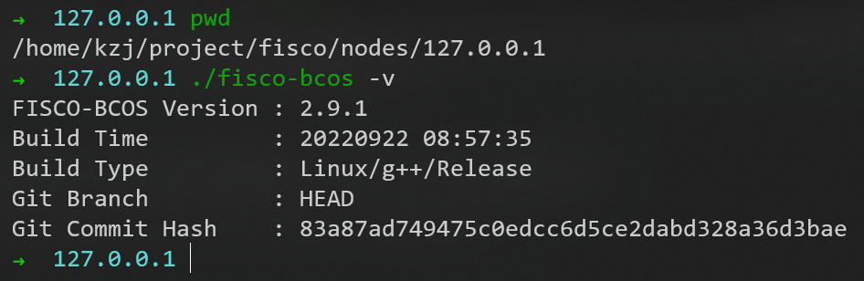

# 搭建第一个区块链网络

## 搭建单群组FISCO BCOS联盟链

### 依赖

```sudo apt install -y openssl curl```

### 创建操作目录, 下载安装脚本

```shell
 # 创建操作目录
cd ~/project && mkdir -p fisco && cd fisco
 # 下载脚本
curl -#LO https://github.com/FISCO-BCOS/FISCO-BCOS/releases/download/v2.9.1/build_chain.sh && chmod u+x build_chain.sh
 ```

### 搭建单群组4节点联盟链

在fisco目录下执行下面的指令，生成一条单群组4节点的FISCO链
请确保机器的30300 ~ 30303，20200 ~ 20203，8545 ~ 8548端口没有被占用
```bash build_chain.sh -l 127.0.0.1:4 -p 30300,20200,8545```



### 启动FISCO BCOS链

启动所有节点
```bash nodes/127.0.0.1/start_all.sh```



### 检查进程

```ps -ef | grep -v grep | grep fisco-bcos```



### 检查端口

```netstat -anp | grep -v grep | grep fisco-bcos```



### 检查日志输出

查看节点node0链接的节点数
```tail -f nodes/127.0.0.1/node0/log/log*  | grep connected```

正常情况会不停地输出连接信息，从输出可以看出node0与另外3个节点有连接


执行下面指令，检查是否在共识
```tail -f nodes/127.0.0.1/node0/log/log*  | grep +++```

正常情况会不停输出```++++Generating seal```，表示共识正常


## 配置及使用控制台

### 依赖

推荐java14
这里我先用11版本，后面出问题的话，再回来改

### 下载脚本

```shell
cd ~/project/fisco && curl -LO https://github.com/FISCO-BCOS/console/releases/download/v2.9.2/download_console.sh && bash download_console.sh
 ```

### 拷贝控制台配置文件

若节点未采用默认端口，请将文件中的20200替换成节点对应的channel端口
```cp -n console/conf/config-example.toml console/conf/config.toml```

### 配置控制台证书

```cp -r nodes/127.0.0.1/sdk/* console/conf/```

### 启动控制台

```cd ~/project/fisco/console && bash start.sh```



### 用控制台获取信息



## 部署及调用HelloWorld合约

### 编写HelloWorld合约

HelloWorld合约提供两个接口，分别是get()和set()，用于获取/设置合约变量name
合约内容如下:
```sol
pragma solidity ^0.4.24;

contract HelloWorld {
    string name;

    function HelloWorld() {
        name = "Hello, World!";
    }

    function get()constant returns(string) {
        return name;
    }

    function set(string n) {
        name = n;
    }
}
 ```

### 部署HelloWorld合约

为了方便用户快速体验，HelloWorld合约已经内置于控制台中，位于控制台目录下```contracts/solidity/HelloWorld.sol```，在控制台输入以下指令，部署成功则返回合约地址
```shell
deploy HelloWorld
```



### 调用HelloWorld合约

```shell
 # 部署合约，部署成功则返回合约地址
[group:1]> deploy HelloWorld
transaction hash: 0x945f293ac2253f28777f94c0ed9f80e5acc0ca6fcdd0a43a4a8897268b5b452b
contract address: 0xcca1eaee224418f7bba932e7227f74de5d8818c5
currentAccount: 0x7800c6d022752abe02d77f09e53a8084031964d3

 # 查看当前块高
[group:1]> getBlockNumber
1

 # 调用get接口获取name变量 此处的合约地址是deploy指令返回的地址
[group:1]> call HelloWorld 0xcca1eaee224418f7bba932e7227f74de5d8818c5 get
---------------------------------------------------------------------------------------------
Return code: 0
description: transaction executed successfully
Return message: Success
---------------------------------------------------------------------------------------------
Return value size:1
Return types: (STRING)
Return values:(Hello, World!)
---------------------------------------------------------------------------------------------

 # 查看当前块高，块高不变，因为get接口不更改账本状态
[group:1]> getBlockNumber
1

 # 调用set设置name
[group:1]> call HelloWorld 0xcca1eaee224418f7bba932e7227f74de5d8818c5 set "Hello, FISCO BCOS"
transaction hash: 0x2d5ab14f89671597db120605ae65f04261fe6d44773bd353529a717bafc3c8d0
---------------------------------------------------------------------------------------------
transaction status: 0x0
description: transaction executed successfully
---------------------------------------------------------------------------------------------
Transaction inputs:
Input value size:1
Input types: (STRING)
Input values:(Hello, FISCO BCOS)
---------------------------------------------------------------------------------------------
Receipt message: Success
Return message: Success
Return values:[]
---------------------------------------------------------------------------------------------
Event logs
Event: {}

 # 再次查看当前块高，块高增加表示已出块，账本状态已更改
[group:1]> getBlockNumber
2

 # 调用get接口获取name变量，检查设置是否生效
[group:1]> call HelloWorld 0xcca1eaee224418f7bba932e7227f74de5d8818c5 get
---------------------------------------------------------------------------------------------
Return code: 0
description: transaction executed successfully
Return message: Success
---------------------------------------------------------------------------------------------
Return value size:1
Return types: (STRING)
Return values:(Hello, FISCO BCOS)
---------------------------------------------------------------------------------------------

 # 退出控制台
[group:1]> quit
```

## 查看版本




