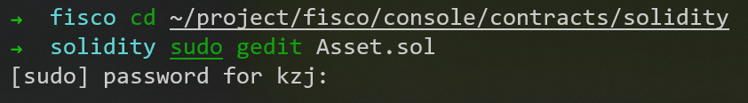

# 开发第一个区块链应用

## 需求

一个简易的资产管理的开发示例，并最终实现以下功能：
1. 能够在区块链上进行资产注册
2. 能够实现不同账户的转账
3. 可以查询账户的资产金额

## 设计智能合约

### 存储设计

一个存储资产管理的表```t_asset```，该表字段如下：
1. ```account```: 主键，资产账户(string类型)
2. ```asset_value```: 资产金额(uint256类型)

```t_asset```表示例如下：

| account | asset_value |
| ------- | ----------- |
| Alice   | 10000       |
| Bob     | 20000       |

### 接口设计

需要实现资产注册，转账，查询功能，对应功能的接口如下：
```sol
// 查询资产金额
function select(string account) public constant returns(int256, uint256)
// 资产注册
function register(string account, uint256 amount) public returns(int256)
// 资产转移
function transfer(string from_asset_account, string to_asset_account, uint256 amount) public returns(int256)
 ```

## 开发源码

```Asset.sol```的内容如下：
```sol
pragma solidity ^0.4.24;

import "./Table.sol";

contract Asset {
    // event
    event RegisterEvent(int256 ret, string account, uint256 asset_value);
    event TransferEvent(int256 ret, string from_account, string to_account, uint256 amount);

    constructor() public {
        // 构造函数中创建t_asset表
        createTable();
    }

    function createTable() private {
        TableFactory tf = TableFactory(0x1001);
        // 资产管理表, key : account, field : asset_value
        // |  资产账户(主键)      |     资产金额       |
        // |-------------------- |-------------------|
        // |        account      |    asset_value    |
        // |---------------------|-------------------|
        //
        // 创建表
        tf.createTable("t_asset", "account", "asset_value");
    }

    function openTable() private returns(Table) {
        TableFactory tf = TableFactory(0x1001);
        Table table = tf.openTable("t_asset");
        return table;
    }

    /*
    描述 : 根据资产账户查询资产金额
    参数 ：
            account : 资产账户

    返回值：
            参数一： 成功返回0, 账户不存在返回-1
            参数二： 第一个参数为0时有效，资产金额
    */
    function select(string account) public constant returns(int256, uint256) {
        // 打开表
        Table table = openTable();
        // 查询
        Entries entries = table.select(account, table.newCondition());
        uint256 asset_value = 0;
        if (0 == uint256(entries.size())) {
            return (-1, asset_value);
        } else {
            Entry entry = entries.get(0);
            return (0, uint256(entry.getInt("asset_value")));
        }
    }

    /*
    描述 : 资产注册
    参数 ：
            account : 资产账户
            amount  : 资产金额
    返回值：
            0  资产注册成功
            -1 资产账户已存在
            -2 其他错误
    */
    function register(string account, uint256 asset_value) public returns(int256){
        int256 ret_code = 0;
        int256 ret= 0;
        uint256 temp_asset_value = 0;
        // 查询账户是否存在
        (ret, temp_asset_value) = select(account);
        if(ret != 0) {
            Table table = openTable();

            Entry entry = table.newEntry();
            entry.set("account", account);
            entry.set("asset_value", int256(asset_value));
            // 插入
            int count = table.insert(account, entry);
            if (count == 1) {
                // 成功
                ret_code = 0;
            } else {
                // 失败? 无权限或者其他错误
                ret_code = -2;
            }
        } else {
            // 账户已存在
            ret_code = -1;
        }

        emit RegisterEvent(ret_code, account, asset_value);

        return ret_code;
    }

    /*
    描述 : 资产转移
    参数 ：
            from_account : 转移资产账户
            to_account ： 接收资产账户
            amount ： 转移金额
    返回值：
            0  资产转移成功
            -1 转移资产账户不存在
            -2 接收资产账户不存在
            -3 金额不足
            -4 金额溢出
            -5 其他错误
    */
    function transfer(string from_account, string to_account, uint256 amount) public returns(int256) {
        // 查询转移资产账户信息
        int ret_code = 0;
        int256 ret = 0;
        uint256 from_asset_value = 0;
        uint256 to_asset_value = 0;

        // 转移账户是否存在?
        (ret, from_asset_value) = select(from_account);
        if(ret != 0) {
            ret_code = -1;
            // 转移账户不存在
            emit TransferEvent(ret_code, from_account, to_account, amount);
            return ret_code;

        }

        // 接受账户是否存在?
        (ret, to_asset_value) = select(to_account);
        if(ret != 0) {
            ret_code = -2;
            // 接收资产的账户不存在
            emit TransferEvent(ret_code, from_account, to_account, amount);
            return ret_code;
        }

        if(from_asset_value < amount) {
            ret_code = -3;
            // 转移资产的账户金额不足
            emit TransferEvent(ret_code, from_account, to_account, amount);
            return ret_code;
        }

        if (to_asset_value + amount < to_asset_value) {
            ret_code = -4;
            // 接收账户金额溢出
            emit TransferEvent(ret_code, from_account, to_account, amount);
            return ret_code;
        }

        Table table = openTable();

        Entry entry0 = table.newEntry();
        entry0.set("account", from_account);
        entry0.set("asset_value", int256(from_asset_value - amount));
        // 更新转账账户
        int count = table.update(from_account, entry0, table.newCondition());
        if(count != 1) {
            ret_code = -5;
            // 失败? 无权限或者其他错误?
            emit TransferEvent(ret_code, from_account, to_account, amount);
            return ret_code;
        }

        Entry entry1 = table.newEntry();
        entry1.set("account", to_account);
        entry1.set("asset_value", int256(to_asset_value + amount));
        // 更新接收账户
        table.update(to_account, entry1, table.newCondition());

        emit TransferEvent(ret_code, from_account, to_account, amount);

        return ret_code;
    }
}
 ```

```Asset.sol```所引用的```Table.sol```已在```~/project/fisco/console/contracts/solidity```目录下。该系统合约文件中的接口由FISCO BCOS底层实现。当业务合约需要操作CRUD接口时，均需要引入该接口合约文件。

文件保存位置如下


## 编译智能合约

```.sol```的智能合约需要编译成ABI和BIN文件才能部署至区块链网络上。有了这两个文件即可凭借Java SDK进行合约部署和调用。但这种调用方式相对繁琐，需要用户根据合约ABI来传参和解析结果。为此，控制台提供的编译工具不仅可以编译出ABI和BIN文件，还可以**自动生成一个与编译的智能合约同名的合约Java类**。这个Java类是根据ABI生成的，帮助用户解析好了参数，提供同名的方法。当应用需要部署和调用合约时，可以调用该合约类的对应方法，传入指定参数即可。使用这个合约Java类来开发应用，可以极大简化用户的代码。

```cd ~/project/fisco/console/```
```bash sol2java.sh -p org.fisco.bcos.asset.contract```

运行成功之后，将会在```console/contracts/sdk```目录生成java、abi和bin目录，如下所示：
```shell
# 其它无关文件省略
|-- abi # 生成的abi目录，存放solidity合约编译生成的abi文件
|   |-- Asset.abi
|   |-- Table.abi
|-- bin # 生成的bin目录，存放solidity合约编译生成的bin文件
|   |-- Asset.bin
|   |-- Table.bin
|-- contracts # 存放solidity合约源码文件，将需要编译的合约拷贝到该目录下
|   |-- Asset.sol # 拷贝进来的Asset.sol合约，依赖Table.sol
|   |-- Table.sol # 实现系统CRUD操作的合约接口文件
|-- java  # 存放编译的包路径及Java合约文件
|   |-- org
|        |--fisco
|             |--bcos
|                  |--asset
|                       |--contract
|                             |--Asset.java  # Asset.sol合约生成的Java文件
|                             |--Table.java  # Table.sol合约生成的Java文件
|-- sol2java.sh
```

其中```Asset.java```是Java应用调用```Asset.sol```合约需要的文件
Asset.java的主要接口：
```java
package org.fisco.bcos.asset.contract;

public class Asset extends Contract {
    // Asset.sol合约 transfer接口生成
    public TransactionReceipt transfer(String from_account, String to_account, BigInteger amount);
    // Asset.sol合约 register接口生成
    public TransactionReceipt register(String account, BigInteger asset_value);
    // Asset.sol合约 select接口生成
    public Tuple2<BigInteger, BigInteger> select(String account) throws ContractException;
    // 加载Asset合约地址，生成Asset对象
    public static Asset load(String contractAddress, Client client, CryptoKeyPair credential);
    // 部署Assert.sol合约，生成Asset对象
    public static Asset deploy(Client client, CryptoKeyPair credential) throws ContractException;
}
```
其中load与deploy函数用于构造Asset对象，其他接口分别用来调用对应的solidity合约的接口

## 创建区块链应用项目

### 环境


---
待完成


