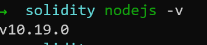
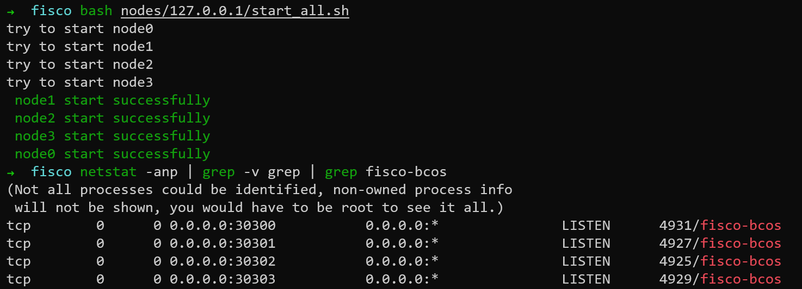
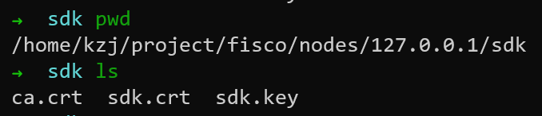
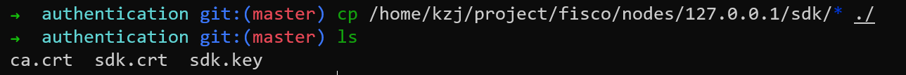
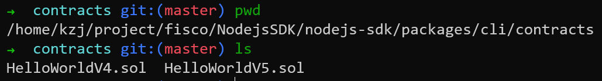
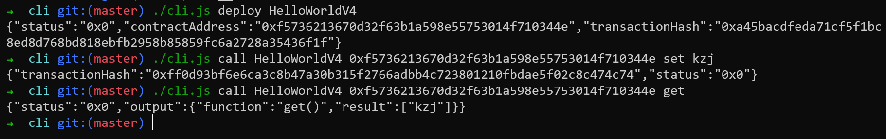

# Node.js SDK

[Node.js 教程](https://www.runoob.com/nodejs/nodejs-tutorial.html)

## 环境



## 部署Node.js SDK

```git clone https://github.com/FISCO-BCOS/nodejs-sdk.git```
```
cd nodejs-sdk
npm install
npm run repoclean
npm run bootstrap
 ```

## Node.js CLI

Node.js SDK内嵌CLI工具，供用户在命令行中方便地与区块链进行交互。CLI工具在Node.js SDK提供的API的基础上开发而成，使用方式与结果输出对脚本友好，同时也是一个展示如何调用Node.js API进行二次开发的范例。

### 启动FISCO BCOS链

建链过程在```1_start.md```，这里省略

在```fisco/```目录下执行
```bash nodes/127.0.0.1/start_all.sh```



### 配置证书

修改配置文件，证书配置位于```packages/cli/conf/config.json```文件的```authentication```配置项中。你需要根据您实际使用的证书文件的路径修改该配置项的key、cert及ca配置，其中key为SDK私钥文件的路径，cert为SDK证书文件的路径，ca为链根证书文件的路径。

```json
    "authentication": {
        "key": "./authentication/sdk.key",
        "cert": "./authentication/sdk.crt",
        "ca": "./authentication/ca.crt"
    },
 ```

证书的位置：

证书是在用```build_chain.sh```脚本搭建链的时候生成的

把证书复制到指定位置


### 配置Channel端口

修改配置文件，节点IP及端口配置位于```packages/cli/conf/config.json```文件的```nodes```配置项中。您需要根据您要连接FISCO BCOS节点的实际配置修改该配置项的ip及port配置，其中ip为所连节点的IP地址，port为节点目录下的 config.ini 文件中的channel_listen_port配置项的值。

```json
    "nodes": [
        {
            "ip": "127.0.0.1",
            "port": "20200"
        }
    ],
```

### 使用CLI

CLI工具位于```packages/cli/cli.js```

```cd packages/cli```

#### 查看帮助

```./cli.js --help```

#### 查看CLI工具能够调用的命令及对应的功能

```./cli.js list```

#### 查看所连FISCO BCOS节点的版本

```./cli.js getClientVersion```

#### 显示外部账户

```./cli.js showAccount alice```

在配置文件```/home/kzj/project/fisco/NodejsSDK/nodejs-sdk/packages/cli/conf/config.json```中配置账户

#### 获取当前的块高

```./cli.js getBlockNumber```

#### 部署和调用合约

把要部署的合约拷贝至```packages/cli/contracts/```目录下


部署合约：
```./cli.js deploy HelloWorldV4```

调用合约的set()方法：
```./cli.js call HelloWorldV4 {这里写contractAddress} set kzj```

调用合约的get()方法：
``` ./cli.js call HelloWorldV4 {这里写contractAddress} get```



#### CRUD操作

CLI工具的sql子命令允许用户使用类SQL语法在链上进行CRUD操作

创建表：
```./cli.js sql 'create table cli_demo(name varchar, item_id varchar, item_name varchar, primary key(name))'```

插入记录：
```./cli.js sql 'insert into cli_demo values ("fruit", "1", "apple2")'```

查询记录：
```./cli.js sql 'select * from cli_demo where name = "fruit" and item_id = "1" limit 1'```

更新记录：
```./cli.js sql 'update cli_demo set item_name = "orange"  where name = "fruit"'```

删除记录：
```./cli.js sql 'delete from cli_demo where name = "fruit" and item_id = "1"'```


