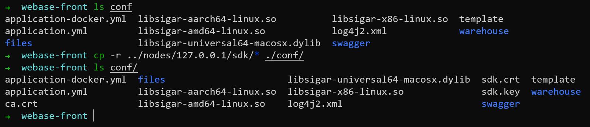
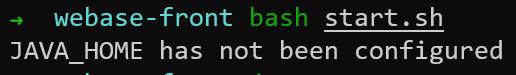
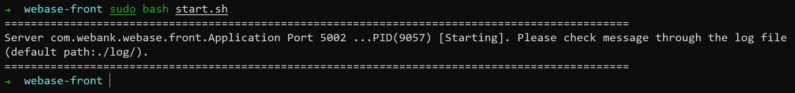

# WeBASE管理平台

微众银行开源的自研区块链中间件平台——WeBASE(WeBank Blockchain Application Software Extension) 是区块链应用和FISCO BCOS节点之间搭建的中间件平台。WeBASE屏蔽了区块链底层的复杂度，降低区块链使用的门槛，大幅提高区块链应用的开发效率，包含节点前置、节点管理、交易链路，数据导出，Web管理平台等子系统。用户可以根据业务所需，选择子系统进行部署，可以进一步体验丰富交互的体验、可视化智能合约开发环境IDE。

WeBASE（WeBank Blockchain Application Software Extension） 是在区块链应用和FISCO-BCOS节点之间搭建的一套通用组件。围绕交易、合约、密钥管理，数据，可视化管理来设计各个模块，开发者可以根据业务所需，选择子系统进行部署。WeBASE屏蔽了区块链底层的复杂度，降低开发者的门槛，大幅提高区块链应用的开发效率，包含节点前置、节点管理、交易链路，数据导出，Web管理平台等子系统。

## 快速入门搭建

在区块链应用开发阶段建议用户使用快速入门搭建。在快速入门搭建模式，开发者只需要搭建节点和节点前置服务(WeBASE-Front)，就可通过WeBASE-Front的合约编辑器进行合约的编辑，编译，部署，调试。

### 下载安装包并解压
```bash
wget https://osp-1257653870.cos.ap-guangzhou.myqcloud.com/WeBASE/releases/download/v1.5.4/webase-front.zip
```

```bash
unzip webase-front.zip
cd webase-front
 ```

### 拷贝sdk证书文件（build_chain的时候生成的）

将节点所在目录```nodes/${ip}/sdk```下的所有文件拷贝到当前```conf```目录，供SDK与节点建立连接时使用

```bash
-r ../nodes/127.0.0.1/sdk/* ./conf/
 ```



### 服务启停

```bash
启动： bash start.sh
停止： bash stop.sh
检查： bash status.sh 
```


那就设置一下```JAVA_HOME```

[设置JAVA_HOME的教程](https://zhuanlan.zhihu.com/p/137114682)

使用```sudo update-alternatives --config java```命令查看java的路径

在文件```/etc/environment```末尾追加
```bash
JAVA_HOME="/usr/lib/jvm/java-11-openjdk-amd64"
```

使修改生效```source /etc/environment```

验证```echo $JAVA_HOME```

启动webase-front```sudo bash start.sh```


### 状态检查

####  检查各子系统进程

检查节点进程
检查节点前置webase-front的进程
```bash
ps -ef | grep node
ps -ef | grep webase.front
```

#### 检查进程端口

检查节点channel端口(默认为20200)是否已监听
检查webase-front端口(默认为5002)是否已监听
```bash
netstat -anlp | grep 20200
netstat -anlp | grep 5002
```

#### 检查服务日志

```webase-front/log```目录下
webase-front运行成功后会打印日志```main run success```，可以通过搜索此关键字来确认服务正常运行
```bash
grep -B 3 "main run success" log/WeBASE-Front.log
 ```

### 访问

访问```http://{deployIP}:{frontPort}/WeBASE-Front```
这里为```http://localhost:5002/WeBASE-Front```


