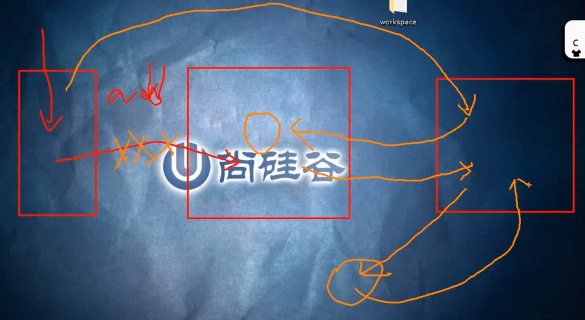

# 高层命令（用底层原理解释）

### ```git init```

这是**工作区**


这是**暂存区**
如果暂存区为空，```index```文件会不存在


这是**本地库**


### ```git add```


注意：
第2个md文档中关于```git add```的数据流是“错误”的
并不是**工作区**直接到**暂存区**，而是**工作区**先到**本地库**，再到**暂存区**


每次```git add -A```时，会检查工作区有几个文件发生改变（通过Hash值判断），有几个就生成几个blob对象

注意：
生成blob对象这件事是**增量**的，**不是覆盖**的
所以，Git是绝对安全的，因为哪怕你对文件的修改，只有```add```而没有```commit```，Git也会帮你管理，通过对应的Hash值就能找到blob对象

```git add```多次，都是修改**暂存区**，直到```git commit```,才是真正的项目版本，生成tree对象，放入**本地库**

然后还需要写一些提交信息，会把tree对象拿出来，包裹成commit对象，再放入**本地库**

### ```git commit```


注意：
1. ```commit```之前，**本地库**中只有一个blob对象
2. ```commit```之后，**本地库**中有一个blob对象，一个tree对象，一个commit对象，并且**暂存区**没有被清空



总结：

和底层命令对应：


### ```git status```


问题：


当次修改所对应的blob对象还没有生成，需要```git add```才能生成


这是，用```git add```命令，**暂存区**的同名文件会覆盖


总结：
```git status```命令之后显示：
1. 什么都没有→已提交状态
2. 红色→已修改状态
3. 绿色→已暂存状态

### ```git diff```


注意上图中的叙述：其实**没有跳过使用暂存区**，只是相当于**链式命令**

总结：


### ```git rm```

操作更简单


### ```git mv```


操作更简单


### ```git log```


总结：


