# 分支（用底层原理解释）

分支就是活动的指针，指向最新提交的commit对象

## ```.git```隐藏文件夹


### ```git branch```

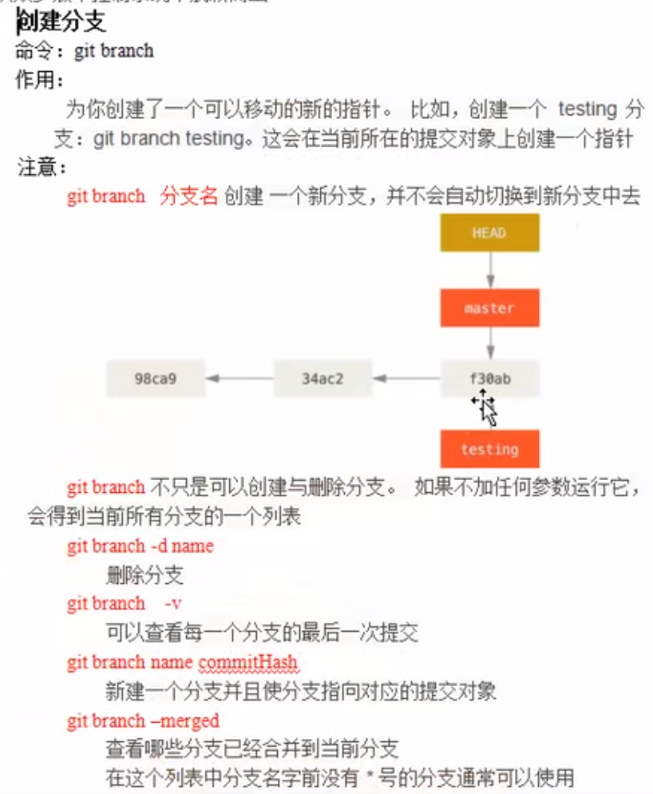

HEAD文件：
HEAD中默认保存的是```master```分支
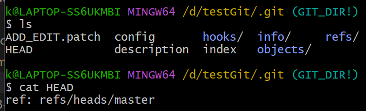


refs文件夹：
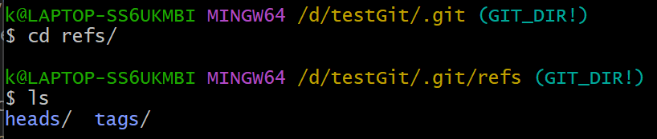

下面的heads文件夹中有内容：
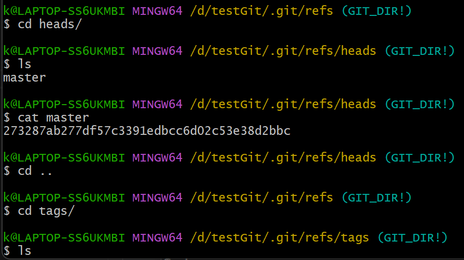

是最后一次提交生成的commit对象的Hash值：
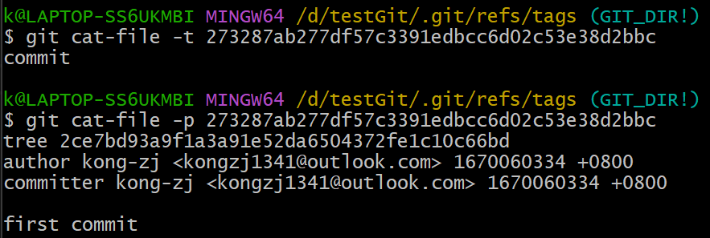

### ```git checkout```

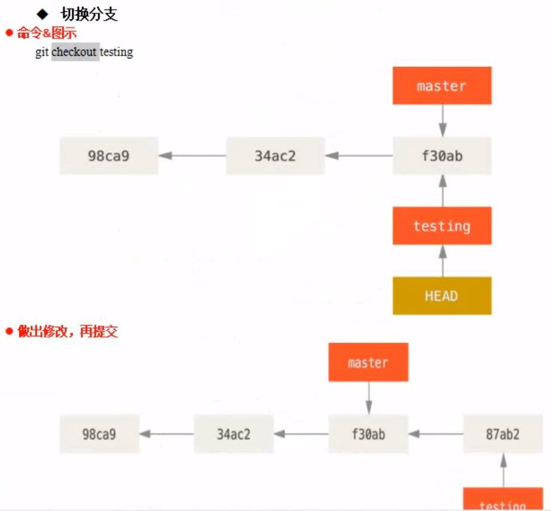

创建新的分支，这时还没有切换分支
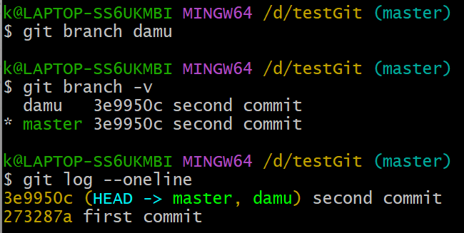

切换分支
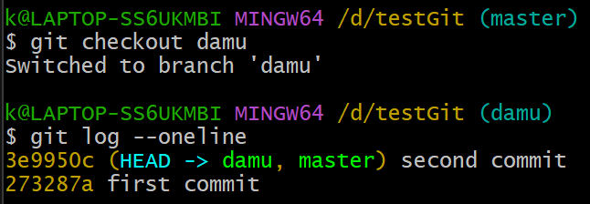

切换分支就是让HEAD指向不同的分支
此时，HEAD中保存的是```damu```分支
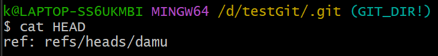

这时有新的提交，HEAD指针带着```damu```分支向前走，```master```分支还在原地
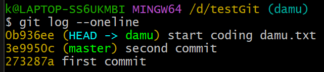

总结：
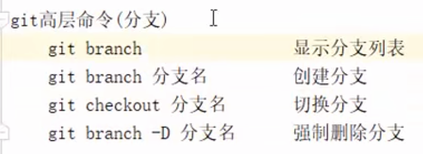

### ```git log```

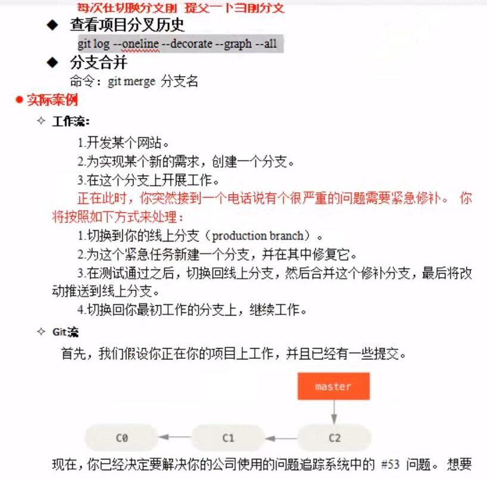

总结：
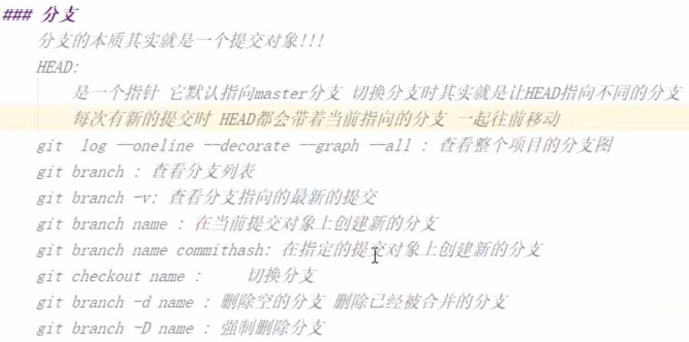

