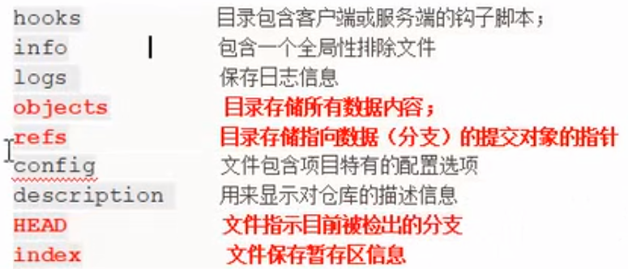

# 分支（用底层原理解释）

分支就是活动的指针，指向最新提交的commit对象

## ```.git```隐藏文件夹



### ```git branch```


HEAD文件：
HEAD中默认保存的是```master```分支


refs文件夹：


下面的heads文件夹中有内容：


保存的内容是最后一次提交生成的commit对象的Hash值：


### ```git checkout```

#### 分支名其实就是commit对象的Hash值


创建新的分支，这时还没有切换分支


切换分支


切换分支就是让HEAD指向不同的分支
此时，HEAD中保存的是```damu```分支


这时有新的提交，HEAD指针带着```damu```分支向前走，```master```分支还在原地


#### 切换分支会动三个地方
1. HEAD
见上

2. 暂存区


3. 工作区


#### 切换分支时的不同情况


情况1：

文件```c.txt```在```master```分支上没有接收管理，如果这时切换到```test```分支，文件```c.txt```在工作区不会被删除，防止弄丢，但是暂存区里没有这个文件

情况2： 

文件```c.txt```在```master```分支上已暂存未提交，如果这时切换到```test```分支，文件```c.txt```也会暂存

以上两种情况不要做，会导致分支污染，因为Git不能明确地把操作分给某个分支，所以切换分支前，用```git status```来确保没有已修改未暂存、已暂存未提交的信息

#### 分支原理


#### 实际案例


注意这里的```git lol```是```git log --oneline --decorate --graph --all```的自己设置的缩写


配别名的方法


如果原命令比较复杂，中间有空格，别忘了用双引号


下面用```git merge```来合并分支

##### 快进合并不会产生冲突


回到```iss53```分支继续工作，直到完成


##### 典型合并可能会产生冲突


修改冲突的文件


提交合并


删除不要的分支


总结：


