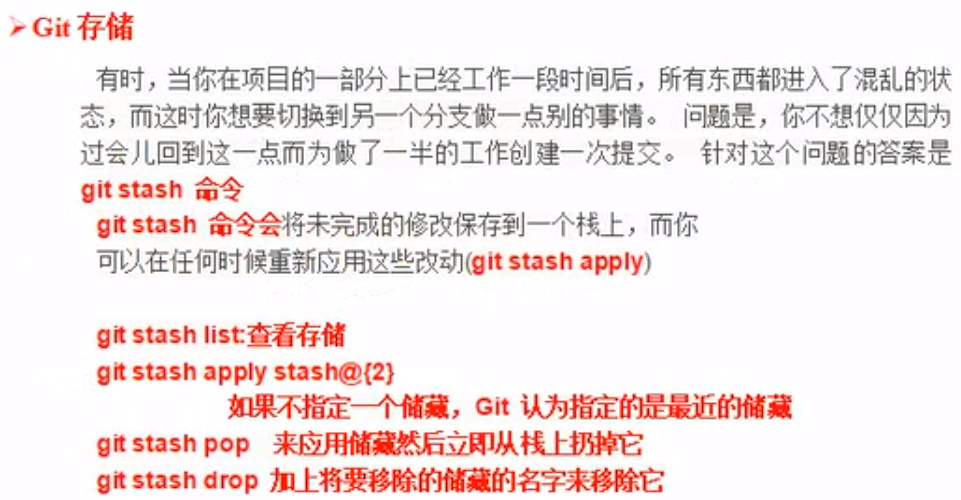
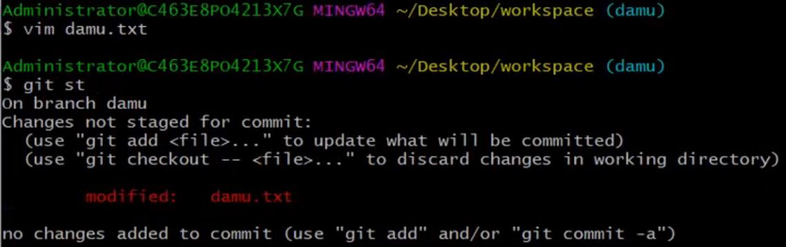
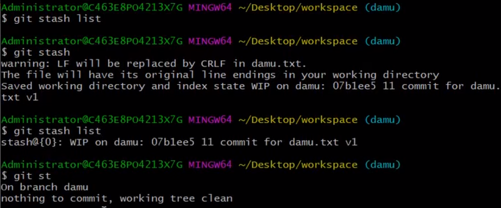
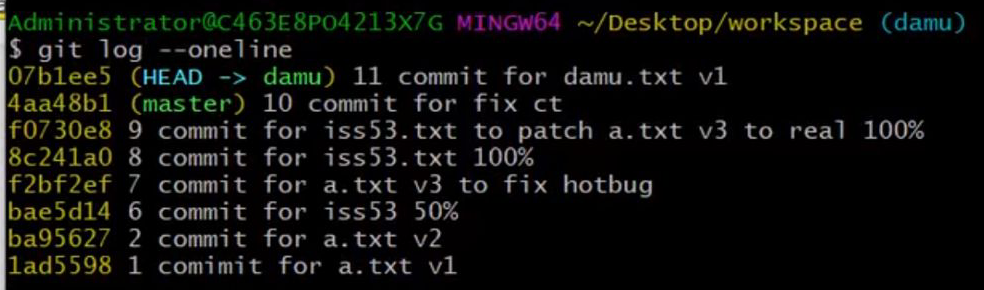
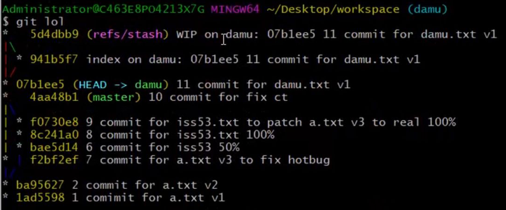
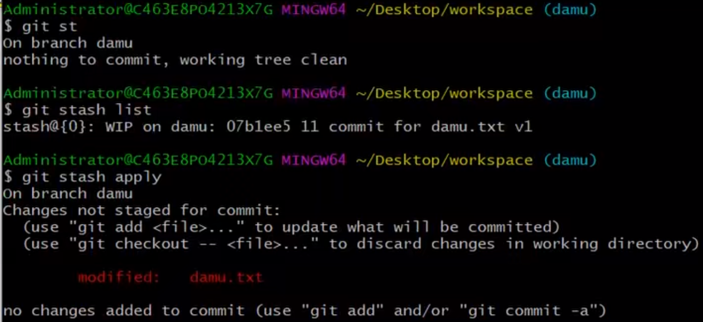
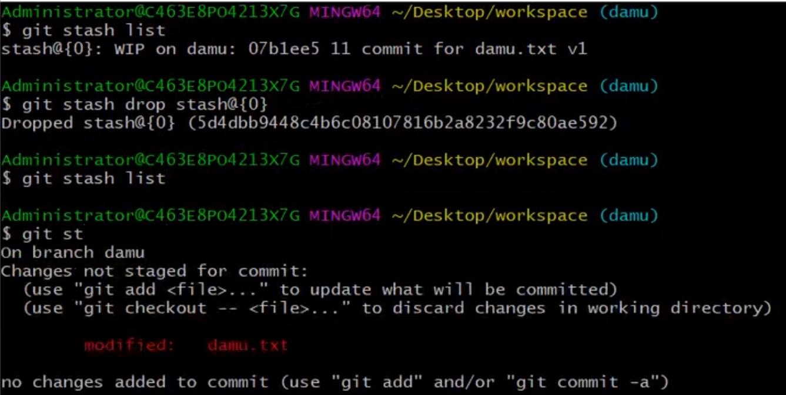

# Git存储

### ```git stash```



修改文件```damu.txt```，当前的```damu```分支中的内容处于**已修改未暂存未提交**状态


这时，不想提交修改，但是想切到其他分支，如果不提交修改就切换分支，会导致分支污染

解决方法：使用Git存储当前的修改，再切换分支


这时，```damu```分支中的内容处于**已提交**状态

说明使用```git stash```命令时，它帮你提交了，但是这次提交不会记录在本分支的日志里面


但是查看项目的分叉历史时，能看到这次提交


从别的分支切换到```damu```分支后，可以应用存储


应用完后，可以删除存储


总结：
